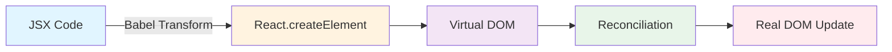
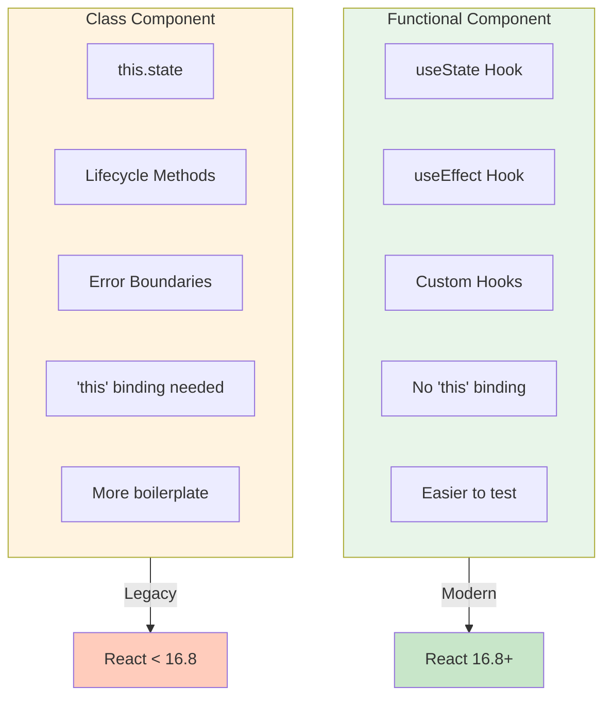
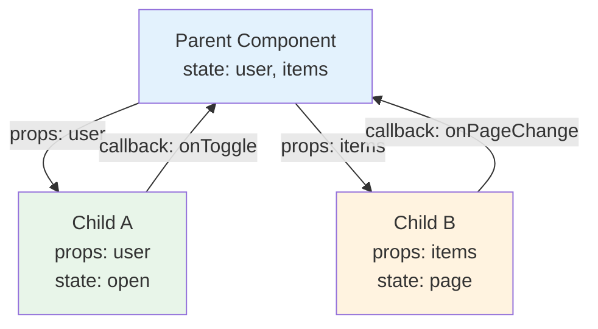

# React Fundamentals - Interview Questions

## Mục lục
- [Phần 1: Cơ bản (Câu 1-10)](#phần-1-cơ-bản-câu-1-10)
- [Phần 2: Trung cấp (Câu 11-20)](#phần-2-trung-cấp-câu-11-20)
- [Phần 3: Nâng cao (Câu 21-30)](#phần-3-nâng-cao-câu-21-30)

---

# Phần 1: Cơ bản (Câu 1-10)

## Câu 1: JSX là gì? Nó hoạt động như thế nào trong React?

### Trả lời:

**JSX (JavaScript XML)** là một syntax extension cho JavaScript, cho phép viết code giống HTML trong JavaScript. JSX không phải là HTML hay string template - nó là syntactic sugar cho `React.createElement()`.

### Cách JSX hoạt động:

#### Flow Diagram - JSX Transformation:



#### Chi tiết Transformation:

```
┌─────────────────────────────────────────────────────────────────┐
│                      JSX Transformation                          │
├─────────────────────────────────────────────────────────────────┤
│                                                                  │
│   JSX Code                    Babel Transform                    │
│   ─────────                   ───────────────                    │
│                                                                  │
│   <div className="app">       React.createElement(               │
│     <h1>Hello</h1>      ──►     'div',                          │
│     <Button />                  { className: 'app' },           │
│   </div>                        React.createElement('h1',...),  │
│                                 React.createElement(Button,...) │
│                               )                                  │
│                                                                  │
└─────────────────────────────────────────────────────────────────┘
```

### Ví dụ chi tiết:

```jsx
// JSX
const element = (
  <div className="container">
    <h1 style={{ color: 'blue' }}>Hello, {user.name}!</h1>
    <p>Count: {count}</p>
    {isLoggedIn && <LogoutButton />}
    {items.map(item => (
      <Item key={item.id} data={item} />
    ))}
  </div>
);

// Sau khi Babel transform thành JavaScript thuần:
const element = React.createElement(
  'div',
  { className: 'container' },
  React.createElement(
    'h1',
    { style: { color: 'blue' } },
    'Hello, ',
    user.name,
    '!'
  ),
  React.createElement('p', null, 'Count: ', count),
  isLoggedIn && React.createElement(LogoutButton, null),
  items.map(item =>
    React.createElement(Item, { key: item.id, data: item })
  )
);
```

### Các quy tắc quan trọng của JSX:

```jsx
// 1. Phải có một root element duy nhất
// ❌ Sai
return (
  <h1>Title</h1>
  <p>Content</p>
);

// ✅ Đúng - dùng Fragment
return (
  <>
    <h1>Title</h1>
    <p>Content</p>
  </>
);

// 2. className thay vì class
<div className="container">...</div>

// 3. htmlFor thay vì for
<label htmlFor="email">Email</label>

// 4. camelCase cho attributes
<div onClick={handleClick} tabIndex={0}>...</div>

// 5. Style là object
<div style={{ backgroundColor: 'red', fontSize: '16px' }}>...</div>

// 6. Self-closing tags phải có /

<input type="text" />
<CustomComponent />

// 7. JavaScript expressions trong {}
<p>{2 + 2}</p>
<p>{user.name.toUpperCase()}</p>
<p>{formatDate(new Date())}</p>

// 8. Conditional rendering
{condition && <Component />}
{condition ? <A /> : <B />}

// 9. Comments trong JSX
{/* This is a comment */}
```

### JSX Prevents Injection Attacks:

```jsx
// React tự động escape values để prevent XSS
const userInput = '<script>alert("hacked")</script>';

// Safe - React escapes this automatically
<div>{userInput}</div>
// Renders as text: <script>alert("hacked")</script>

// Dangerous - bypasses escaping (avoid unless necessary)
<div dangerouslySetInnerHTML={{ __html: userInput }} />
```

### Custom JSX Pragma:

```jsx
// Với React 17+, không cần import React
// Babel tự động inject jsx runtime

// babel.config.js
module.exports = {
  presets: [
    ['@babel/preset-react', {
      runtime: 'automatic' // Không cần import React
    }]
  ]
};

// Trước React 17
import React from 'react'; // Bắt buộc

// Sau React 17
// Không cần import React cho JSX
function App() {
  return <div>Hello</div>;
}
```

---

## Câu 2: Component là gì? So sánh Functional Component và Class Component

### Trả lời:

**Component** là building block cơ bản của React application. Nó là một đơn vị độc lập, có thể tái sử dụng, chứa logic và UI riêng.

### So sánh chi tiết:

#### Component Comparison Diagram:



#### Comparison Table:

```
┌────────────────────────────────────────────────────────────────────┐
│              Functional vs Class Components                        │
├──────────────────────┬─────────────────────────────────────────────┤
│   Functional         │   Class                                     │
├──────────────────────┼─────────────────────────────────────────────┤
│ function App() {     │ class App extends React.Component {         │
│   return <div/>;     │   render() {                                │
│ }                    │     return <div/>;                          │
│                      │   }                                         │
│                      │ }                                           │
├──────────────────────┼─────────────────────────────────────────────┤
│ useState, useEffect  │ this.state, lifecycle methods               │
├──────────────────────┼─────────────────────────────────────────────┤
│ Simpler, less code   │ More boilerplate                            │
├──────────────────────┼─────────────────────────────────────────────┤
│ Easier to test       │ Need to handle 'this' binding               │
├──────────────────────┼─────────────────────────────────────────────┤
│ Better performance   │ Slightly more overhead                      │
│ (no class instance)  │ (class instance created)                    │
└──────────────────────┴─────────────────────────────────────────────┘
```

### Functional Component:

```jsx
import { useState, useEffect, useCallback, useMemo } from 'react';

// Basic functional component
function Greeting({ name }) {
  return <h1>Hello, {name}!</h1>;
}

// Arrow function syntax
const Greeting = ({ name }) => <h1>Hello, {name}!</h1>;

// With hooks
function Counter({ initialCount = 0 }) {
  // State
  const [count, setCount] = useState(initialCount);
  const [isActive, setIsActive] = useState(false);

  // Derived state với useMemo
  const doubledCount = useMemo(() => count * 2, [count]);

  // Side effects
  useEffect(() => {
    document.title = `Count: ${count}`;

    // Cleanup function
    return () => {
      document.title = 'React App';
    };
  }, [count]);

  // Event handlers với useCallback
  const increment = useCallback(() => {
    setCount(prev => prev + 1);
  }, []);

  const decrement = useCallback(() => {
    setCount(prev => prev - 1);
  }, []);

  const reset = useCallback(() => {
    setCount(initialCount);
  }, [initialCount]);

  return (
    <div className="counter">
      <p>Count: {count}</p>
      <p>Doubled: {doubledCount}</p>
      <button onClick={decrement}>-</button>
      <button onClick={increment}>+</button>
      <button onClick={reset}>Reset</button>
    </div>
  );
}

// Component với nhiều features
function UserProfile({ userId }) {
  const [user, setUser] = useState(null);
  const [loading, setLoading] = useState(true);
  const [error, setError] = useState(null);

  useEffect(() => {
    let isMounted = true;

    async function fetchUser() {
      try {
        setLoading(true);
        const response = await fetch(`/api/users/${userId}`);

        if (!response.ok) {
          throw new Error('Failed to fetch user');
        }

        const data = await response.json();

        if (isMounted) {
          setUser(data);
          setError(null);
        }
      } catch (err) {
        if (isMounted) {
          setError(err.message);
        }
      } finally {
        if (isMounted) {
          setLoading(false);
        }
      }
    }

    fetchUser();

    return () => {
      isMounted = false;
    };
  }, [userId]);

  if (loading) return <Spinner />;
  if (error) return <ErrorMessage message={error} />;
  if (!user) return <NotFound />;

  return (
    <div className="user-profile">
      <Avatar src={user.avatar} alt={user.name} />
      <h2>{user.name}</h2>
      <p>{user.email}</p>
    </div>
  );
}
```

### Class Component:

```jsx
import React, { Component, PureComponent } from 'react';

// Basic class component
class Greeting extends Component {
  render() {
    return <h1>Hello, {this.props.name}!</h1>;
  }
}

// Class component với đầy đủ features
class Counter extends Component {
  // Constructor - khởi tạo state và bind methods
  constructor(props) {
    super(props);
    this.state = {
      count: props.initialCount || 0,
      isActive: false,
    };

    // Bind methods
    this.increment = this.increment.bind(this);
    this.decrement = this.decrement.bind(this);
  }

  // Lifecycle methods
  componentDidMount() {
    console.log('Component mounted');
    document.title = `Count: ${this.state.count}`;
  }

  componentDidUpdate(prevProps, prevState) {
    if (prevState.count !== this.state.count) {
      document.title = `Count: ${this.state.count}`;
    }
  }

  componentWillUnmount() {
    console.log('Component will unmount');
    document.title = 'React App';
  }

  // Event handlers
  increment() {
    this.setState(prevState => ({
      count: prevState.count + 1
    }));
  }

  decrement() {
    this.setState(prevState => ({
      count: prevState.count - 1
    }));
  }

  // Arrow function syntax - auto-bound
  reset = () => {
    this.setState({ count: this.props.initialCount || 0 });
  };

  // Getter cho derived state
  get doubledCount() {
    return this.state.count * 2;
  }

  render() {
    const { count } = this.state;

    return (
      <div className="counter">
        <p>Count: {count}</p>
        <p>Doubled: {this.doubledCount}</p>
        <button onClick={this.decrement}>-</button>
        <button onClick={this.increment}>+</button>
        <button onClick={this.reset}>Reset</button>
      </div>
    );
  }
}

// PureComponent - tự động shallow comparison cho shouldComponentUpdate
class OptimizedList extends PureComponent {
  render() {
    return (
      <ul>
        {this.props.items.map(item => (
          <li key={item.id}>{item.name}</li>
        ))}
      </ul>
    );
  }
}

// Component với Error Boundary (chỉ class component có thể làm)
class ErrorBoundary extends Component {
  constructor(props) {
    super(props);
    this.state = { hasError: false, error: null };
  }

  static getDerivedStateFromError(error) {
    return { hasError: true, error };
  }

  componentDidCatch(error, errorInfo) {
    console.error('Error caught:', error, errorInfo);
    // Log to error reporting service
  }

  render() {
    if (this.state.hasError) {
      return this.props.fallback || <h1>Something went wrong.</h1>;
    }

    return this.props.children;
  }
}
```

### Khi nào dùng Class Component:

```jsx
// 1. Error Boundaries - BẮT BUỘC phải dùng class
class ErrorBoundary extends Component {
  static getDerivedStateFromError(error) {
    return { hasError: true };
  }

  componentDidCatch(error, info) {
    logError(error, info);
  }

  render() {
    if (this.state.hasError) {
      return <FallbackUI />;
    }
    return this.props.children;
  }
}

// 2. Legacy codebase cần maintain
// 3. Khi cần getSnapshotBeforeUpdate
class ScrollingList extends Component {
  listRef = React.createRef();

  getSnapshotBeforeUpdate(prevProps, prevState) {
    if (prevProps.list.length < this.props.list.length) {
      return this.listRef.current.scrollHeight;
    }
    return null;
  }

  componentDidUpdate(prevProps, prevState, snapshot) {
    if (snapshot !== null) {
      const list = this.listRef.current;
      list.scrollTop = list.scrollHeight - snapshot;
    }
  }

  render() {
    return <div ref={this.listRef}>{/* items */}</div>;
  }
}
```

### Best Practice - Dùng Functional Component:

```jsx
// ✅ Modern approach - Functional với Hooks
function App() {
  const [state, setState] = useState(initialState);

  useEffect(() => {
    // Side effects
  }, []);

  return <div>{/* UI */}</div>;
}

// ✅ Error Boundary wrapper cho functional components
function withErrorBoundary(Component, fallback) {
  return function WrappedComponent(props) {
    return (
      <ErrorBoundary fallback={fallback}>
        <Component {...props} />
      </ErrorBoundary>
    );
  };
}

// Usage
const SafeUserProfile = withErrorBoundary(UserProfile, <ErrorFallback />);
```

---

## Câu 3: Props và State khác nhau như thế nào? Khi nào dùng cái nào?

### Trả lời:

### So sánh Props vs State:

```
┌─────────────────────────────────────────────────────────────────────┐
│                    Props vs State                                    │
├─────────────────────────┬───────────────────────────────────────────┤
│        Props            │           State                           │
├─────────────────────────┼───────────────────────────────────────────┤
│ Passed from parent      │ Managed within component                  │
│ Read-only (immutable)   │ Can be changed (mutable)                  │
│ Owned by parent         │ Owned by component                        │
│ Used for configuration  │ Used for dynamic data                     │
│ Changes cause re-render │ Changes cause re-render                   │
│ Can have default values │ Has initial value                         │
└─────────────────────────┴───────────────────────────────────────────┘
```

### Data Flow Diagram:

#### React Data Flow Visualization:



#### Detailed Flow:

```
┌─────────────────────────────────────────────────────────────────────┐
│                     React Data Flow                                  │
├─────────────────────────────────────────────────────────────────────┤
│                                                                      │
│  ┌─────────────────────────────────────┐                            │
│  │           Parent Component          │                            │
│  │  ┌─────────────────────────────┐   │                            │
│  │  │  state = { user, items }    │   │                            │
│  │  └─────────────────────────────┘   │                            │
│  │              │                      │                            │
│  │              │ passes as props      │                            │
│  │              ▼                      │                            │
│  └─────────────────────────────────────┘                            │
│                 │                                                    │
│     ┌───────────┴───────────┐                                       │
│     │                       │                                       │
│     ▼                       ▼                                       │
│  ┌──────────────┐    ┌──────────────┐                               │
│  │ Child A      │    │ Child B      │                               │
│  │ props: user  │    │ props: items │                               │
│  │ state: open  │    │ state: page  │                               │
│  └──────────────┘    └──────────────┘                               │
│                                                                      │
│  One-way data flow: Parent → Children                               │
│  State lifting: Child → Parent (via callbacks)                      │
│                                                                      │
└─────────────────────────────────────────────────────────────────────┘
```

### Props - Chi tiết:

```jsx
// Defining props với TypeScript
interface UserCardProps {
  // Required props
  user: {
    id: string;
    name: string;
    email: string;
    avatar?: string;
  };

  // Optional props với default values
  size?: 'small' | 'medium' | 'large';
  showEmail?: boolean;

  // Callback props
  onClick?: (userId: string) => void;
  onEdit?: (user: User) => void;

  // Children props
  children?: React.ReactNode;

  // Render props
  renderActions?: (user: User) => React.ReactNode;
}

// Component với props
function UserCard({
  user,
  size = 'medium',
  showEmail = true,
  onClick,
  onEdit,
  children,
  renderActions,
}: UserCardProps) {
  const handleClick = () => {
    onClick?.(user.id);
  };

  return (
    <div
      className={`user-card user-card--${size}`}
      onClick={handleClick}
    >
      
      <h3>{user.name}</h3>
      {showEmail && <p>{user.email}</p>}

      {/* Children pattern */}
      {children}

      {/* Render props pattern */}
      {renderActions && (
        <div className="actions">
          {renderActions(user)}
        </div>
      )}
    </div>
  );
}

// Usage
<UserCard
  user={userData}
  size="large"
  showEmail={false}
  onClick={(id) => console.log('Clicked:', id)}
  renderActions={(user) => (
    <>
      <button onClick={() => editUser(user)}>Edit</button>
      <button onClick={() => deleteUser(user.id)}>Delete</button>
    </>
  )}
>
  <Badge>Premium User</Badge>
</UserCard>
```

### State - Chi tiết:

```jsx
import { useState, useReducer } from 'react';

// 1. Simple state với useState
function Counter() {
  const [count, setCount] = useState(0);

  // Update state
  setCount(5);           // Set directly
  setCount(prev => prev + 1); // Functional update (recommended)

  return <div>{count}</div>;
}

// 2. Object state
function UserForm() {
  const [user, setUser] = useState({
    name: '',
    email: '',
    age: 0,
  });

  // ❌ Wrong - mutating state directly
  const handleNameWrong = (name) => {
    user.name = name; // NEVER do this
    setUser(user);
  };

  // ✅ Correct - creating new object
  const handleName = (name) => {
    setUser(prev => ({
      ...prev,
      name,
    }));
  };

  // ✅ Update nested state
  const [state, setState] = useState({
    user: {
      profile: {
        name: '',
        address: {
          city: '',
          country: '',
        },
      },
    },
  });

  const updateCity = (city) => {
    setState(prev => ({
      ...prev,
      user: {
        ...prev.user,
        profile: {
          ...prev.user.profile,
          address: {
            ...prev.user.profile.address,
            city,
          },
        },
      },
    }));
  };

  return (/* form */);
}

// 3. Array state
function TodoList() {
  const [todos, setTodos] = useState([]);

  // Add item
  const addTodo = (text) => {
    setTodos(prev => [
      ...prev,
      { id: Date.now(), text, completed: false }
    ]);
  };

  // Remove item
  const removeTodo = (id) => {
    setTodos(prev => prev.filter(todo => todo.id !== id));
  };

  // Update item
  const toggleTodo = (id) => {
    setTodos(prev => prev.map(todo =>
      todo.id === id
        ? { ...todo, completed: !todo.completed }
        : todo
    ));
  };

  // Reorder items
  const moveTodo = (fromIndex, toIndex) => {
    setTodos(prev => {
      const newTodos = [...prev];
      const [removed] = newTodos.splice(fromIndex, 1);
      newTodos.splice(toIndex, 0, removed);
      return newTodos;
    });
  };

  return (/* todo list */);
}

// 4. Complex state với useReducer
interface State {
  items: Item[];
  loading: boolean;
  error: string | null;
  page: number;
  hasMore: boolean;
}

type Action =
  | { type: 'FETCH_START' }
  | { type: 'FETCH_SUCCESS'; payload: Item[] }
  | { type: 'FETCH_ERROR'; payload: string }
  | { type: 'LOAD_MORE' }
  | { type: 'RESET' };

function reducer(state: State, action: Action): State {
  switch (action.type) {
    case 'FETCH_START':
      return { ...state, loading: true, error: null };

    case 'FETCH_SUCCESS':
      return {
        ...state,
        loading: false,
        items: [...state.items, ...action.payload],
        hasMore: action.payload.length > 0,
      };

    case 'FETCH_ERROR':
      return { ...state, loading: false, error: action.payload };

    case 'LOAD_MORE':
      return { ...state, page: state.page + 1 };

    case 'RESET':
      return initialState;

    default:
      return state;
  }
}

function ItemList() {
  const [state, dispatch] = useReducer(reducer, initialState);

  const fetchItems = async () => {
    dispatch({ type: 'FETCH_START' });
    try {
      const items = await api.getItems(state.page);
      dispatch({ type: 'FETCH_SUCCESS', payload: items });
    } catch (error) {
      dispatch({ type: 'FETCH_ERROR', payload: error.message });
    }
  };

  return (/* list */);
}
```

### Lifting State Up:

```jsx
// State shared giữa siblings phải được lift lên parent

// ❌ Sai - mỗi component có state riêng
function TemperatureInput({ scale }) {
  const [temperature, setTemperature] = useState('');
  return (
    <input
      value={temperature}
      onChange={e => setTemperature(e.target.value)}
    />
  );
}

// ✅ Đúng - state được lift lên parent
function Calculator() {
  const [temperature, setTemperature] = useState('');
  const [scale, setScale] = useState('c');

  const handleCelsiusChange = (temp) => {
    setScale('c');
    setTemperature(temp);
  };

  const handleFahrenheitChange = (temp) => {
    setScale('f');
    setTemperature(temp);
  };

  const celsius = scale === 'f'
    ? tryConvert(temperature, toCelsius)
    : temperature;
  const fahrenheit = scale === 'c'
    ? tryConvert(temperature, toFahrenheit)
    : temperature;

  return (
    <div>
      <TemperatureInput
        scale="c"
        temperature={celsius}
        onTemperatureChange={handleCelsiusChange}
      />
      <TemperatureInput
        scale="f"
        temperature={fahrenheit}
        onTemperatureChange={handleFahrenheitChange}
      />
    </div>
  );
}

function TemperatureInput({ scale, temperature, onTemperatureChange }) {
  return (
    <fieldset>
      <legend>Enter temperature in {scaleNames[scale]}:</legend>
      <input
        value={temperature}
        onChange={e => onTemperatureChange(e.target.value)}
      />
    </fieldset>
  );
}
```

### Decision Tree - Props hay State?

```
┌─────────────────────────────────────────────────────────────────────┐
│                 Props or State Decision Tree                        │
├─────────────────────────────────────────────────────────────────────┤
│                                                                      │
│  Does the data come from a parent?                                  │
│           │                                                         │
│      ┌────┴────┐                                                    │
│      │         │                                                    │
│     YES        NO                                                   │
│      │         │                                                    │
│   Props    Does it change over time?                                │
│                │                                                    │
│           ┌────┴────┐                                               │
│           │         │                                               │
│          YES        NO                                              │
│           │         │                                               │
│        State    Constant                                            │
│           │     (define outside                                     │
│           │      component)                                         │
│           │                                                         │
│    Can it be computed from                                          │
│    existing props/state?                                            │
│           │                                                         │
│      ┌────┴────┐                                                    │
│      │         │                                                    │
│     YES        NO                                                   │
│      │         │                                                    │
│  Derived     State                                                  │
│  (useMemo)                                                          │
│                                                                      │
└─────────────────────────────────────────────────────────────────────┘
```

---

## Câu 4: Giải thích Lifecycle Methods trong React và tương đương với Hooks

### Trả lời:

### Lifecycle Phases:

#### Component Lifecycle Flow:

```mermaid
stateDiagram-v2
    [*] --> Mounting: Component Created
    Mounting --> constructor: 1. Constructor
    constructor --> getDerivedStateFromProps: 2. getDerivedStateFromProps
    getDerivedStateFromProps --> render: 3. Render
    render --> componentDidMount: 4. componentDidMount
    componentDidMount --> Updating: Props/State Change
    
    Updating --> getDerivedStateFromProps2: 1. getDerivedStateFromProps
    getDerivedStateFromProps2 --> shouldComponentUpdate: 2. shouldComponentUpdate
    shouldComponentUpdate --> render2: 3. Render
    render2 --> getSnapshotBeforeUpdate: 4. getSnapshotBeforeUpdate
    getSnapshotBeforeUpdate --> componentDidUpdate: 5. componentDidUpdate
    componentDidUpdate --> Updating: More Updates
    componentDidUpdate --> Unmounting: Component Removed
    
    Unmounting --> componentWillUnmount: componentWillUnmount
    componentWillUnmount --> [*]
```

#### Lifecycle Phases Text:

```
┌─────────────────────────────────────────────────────────────────────┐
│                 React Component Lifecycle                            │
├─────────────────────────────────────────────────────────────────────┤
│                                                                      │
│  ┌─────────────────────────────────────────────────────────────┐   │
│  │                    MOUNTING                                  │   │
│  │  (Component được tạo và insert vào DOM)                     │   │
│  │                                                              │   │
│  │  constructor() → getDerivedStateFromProps() → render()      │   │
│  │       → componentDidMount()                                  │   │
│  └─────────────────────────────────────────────────────────────┘   │
│                           │                                         │
│                           ▼                                         │
│  ┌─────────────────────────────────────────────────────────────┐   │
│  │                    UPDATING                                  │   │
│  │  (Props hoặc State thay đổi)                                │   │
│  │                                                              │   │
│  │  getDerivedStateFromProps() → shouldComponentUpdate()       │   │
│  │       → render() → getSnapshotBeforeUpdate()                │   │
│  │       → componentDidUpdate()                                 │   │
│  └─────────────────────────────────────────────────────────────┘   │
│                           │                                         │
│                           ▼                                         │
│  ┌─────────────────────────────────────────────────────────────┐   │
│  │                    UNMOUNTING                                │   │
│  │  (Component bị remove khỏi DOM)                             │   │
│  │                                                              │   │
│  │  componentWillUnmount()                                      │   │
│  └─────────────────────────────────────────────────────────────┘   │
│                                                                      │
└─────────────────────────────────────────────────────────────────────┘
```

### Class Lifecycle Methods:

```jsx
class LifecycleDemo extends React.Component {
  // ============ MOUNTING PHASE ============

  // 1. Constructor - khởi tạo state và bind methods
  constructor(props) {
    super(props);
    this.state = {
      count: 0,
      data: null,
    };
    console.log('1. Constructor');
  }

  // 2. getDerivedStateFromProps - sync state với props
  // Static method - không access this
  static getDerivedStateFromProps(props, state) {
    console.log('2. getDerivedStateFromProps');
    // Return object để update state, hoặc null
    if (props.resetCount && state.count !== 0) {
      return { count: 0 };
    }
    return null;
  }

  // 3. render - return JSX
  render() {
    console.log('3. Render');
    return (
      <div>
        <p>Count: {this.state.count}</p>
        <button onClick={() => this.setState(s => ({ count: s.count + 1 }))}>
          Increment
        </button>
      </div>
    );
  }

  // 4. componentDidMount - sau khi component mount vào DOM
  componentDidMount() {
    console.log('4. componentDidMount');
    // Perfect place for:
    // - API calls
    // - Subscriptions
    // - DOM manipulation
    // - Third-party library initialization

    this.fetchData();
    this.subscription = eventEmitter.subscribe(this.handleEvent);
  }

  // ============ UPDATING PHASE ============

  // 5. shouldComponentUpdate - optimize render
  shouldComponentUpdate(nextProps, nextState) {
    console.log('5. shouldComponentUpdate');
    // Return false để skip render
    // Default: return true
    return nextState.count !== this.state.count;
  }

  // 6. getSnapshotBeforeUpdate - capture DOM info trước update
  getSnapshotBeforeUpdate(prevProps, prevState) {
    console.log('6. getSnapshotBeforeUpdate');
    // Return value sẽ được pass vào componentDidUpdate
    // Useful for: scroll position, element dimensions
    if (prevProps.list.length < this.props.list.length) {
      const list = this.listRef.current;
      return list.scrollHeight - list.scrollTop;
    }
    return null;
  }

  // 7. componentDidUpdate - sau khi update hoàn thành
  componentDidUpdate(prevProps, prevState, snapshot) {
    console.log('7. componentDidUpdate');

    // So sánh props/state để tránh infinite loop
    if (prevProps.userId !== this.props.userId) {
      this.fetchData();
    }

    // Sử dụng snapshot từ getSnapshotBeforeUpdate
    if (snapshot !== null) {
      const list = this.listRef.current;
      list.scrollTop = list.scrollHeight - snapshot;
    }
  }

  // ============ UNMOUNTING PHASE ============

  // 8. componentWillUnmount - cleanup trước khi unmount
  componentWillUnmount() {
    console.log('8. componentWillUnmount');
    // Cleanup:
    // - Cancel API requests
    // - Remove subscriptions
    // - Clear timers
    // - Cleanup third-party libraries

    this.subscription?.unsubscribe();
    clearInterval(this.timer);
    this.abortController?.abort();
  }

  // ============ ERROR HANDLING ============

  // 9. getDerivedStateFromError - update state khi có error
  static getDerivedStateFromError(error) {
    return { hasError: true };
  }

  // 10. componentDidCatch - log error info
  componentDidCatch(error, errorInfo) {
    console.error('Error:', error);
    console.error('Error Info:', errorInfo.componentStack);
    logErrorToService(error, errorInfo);
  }
}
```

### Hooks Equivalent:

```jsx
import {
  useState,
  useEffect,
  useLayoutEffect,
  useMemo,
  useCallback,
  useRef
} from 'react';

function LifecycleWithHooks({ userId, resetCount }) {
  // ============ constructor equivalent ============
  // useState với initial value
  const [count, setCount] = useState(0);
  const [data, setData] = useState(null);

  // useRef để store mutable values
  const isMounted = useRef(true);
  const abortController = useRef(null);

  // ============ getDerivedStateFromProps equivalent ============
  // Tính toán trong render
  const derivedValue = useMemo(() => {
    if (resetCount && count !== 0) {
      // Side effect trong useMemo không recommended
      // Tốt hơn là dùng useEffect
    }
    return computeExpensiveValue(count);
  }, [count, resetCount]);

  // Hoặc dùng pattern này
  const [prevUserId, setPrevUserId] = useState(userId);
  if (userId !== prevUserId) {
    setPrevUserId(userId);
    setData(null); // Reset data khi userId thay đổi
  }

  // ============ componentDidMount equivalent ============
  useEffect(() => {
    console.log('componentDidMount');

    // Fetch data
    fetchData();

    // Setup subscription
    const subscription = eventEmitter.subscribe(handleEvent);

    // Cleanup = componentWillUnmount
    return () => {
      console.log('componentWillUnmount');
      isMounted.current = false;
      subscription.unsubscribe();
      abortController.current?.abort();
    };
  }, []); // Empty deps = chỉ run lần đầu

  // ============ componentDidUpdate equivalent ============
  useEffect(() => {
    console.log('componentDidUpdate - userId changed');
    fetchUserData(userId);
  }, [userId]); // Chỉ run khi userId thay đổi

  // Multiple effects cho different concerns
  useEffect(() => {
    document.title = `Count: ${count}`;
  }, [count]);

  // ============ shouldComponentUpdate equivalent ============
  // Dùng React.memo cho component
  // Dùng useMemo cho expensive calculations
  const expensiveResult = useMemo(() => {
    return computeExpensiveValue(data);
  }, [data]);

  // ============ getSnapshotBeforeUpdate equivalent ============
  // useLayoutEffect runs synchronously sau DOM update
  const listRef = useRef(null);
  const prevListLength = useRef(0);

  useLayoutEffect(() => {
    // Chạy sau DOM update nhưng trước browser paint
    // Có thể đọc DOM và cập nhật synchronously
    if (prevListLength.current < data?.length) {
      const list = listRef.current;
      // Adjust scroll position
    }
    prevListLength.current = data?.length || 0;
  }, [data]);

  // ============ Fetch data function ============
  const fetchData = useCallback(async () => {
    abortController.current = new AbortController();

    try {
      const response = await fetch(`/api/users/${userId}`, {
        signal: abortController.current.signal,
      });
      const result = await response.json();

      if (isMounted.current) {
        setData(result);
      }
    } catch (error) {
      if (error.name !== 'AbortError' && isMounted.current) {
        console.error('Fetch error:', error);
      }
    }
  }, [userId]);

  return (
    <div ref={listRef}>
      <p>Count: {count}</p>
      <button onClick={() => setCount(c => c + 1)}>Increment</button>
      {data && <pre>{JSON.stringify(data, null, 2)}</pre>}
    </div>
  );
}

// ============ React.memo = shouldComponentUpdate ============
const MemoizedComponent = React.memo(
  function MyComponent({ value, onClick }) {
    return <div onClick={onClick}>{value}</div>;
  },
  // Custom comparison function
  (prevProps, nextProps) => {
    return prevProps.value === nextProps.value;
  }
);
```

### Comparison Table:

```
┌────────────────────────────┬─────────────────────────────────────────┐
│     Class Lifecycle        │         Hooks Equivalent                │
├────────────────────────────┼─────────────────────────────────────────┤
│ constructor                │ useState(initialValue)                  │
├────────────────────────────┼─────────────────────────────────────────┤
│ componentDidMount          │ useEffect(() => {}, [])                 │
├────────────────────────────┼─────────────────────────────────────────┤
│ componentDidUpdate         │ useEffect(() => {}, [deps])             │
├────────────────────────────┼─────────────────────────────────────────┤
│ componentWillUnmount       │ useEffect(() => { return cleanup }, []) │
├────────────────────────────┼─────────────────────────────────────────┤
│ shouldComponentUpdate      │ React.memo(Component, compareFunc)      │
├────────────────────────────┼─────────────────────────────────────────┤
│ getDerivedStateFromProps   │ Update state during render              │
├────────────────────────────┼─────────────────────────────────────────┤
│ getSnapshotBeforeUpdate    │ useLayoutEffect                         │
├────────────────────────────┼─────────────────────────────────────────┤
│ componentDidCatch          │ No hook equivalent (use ErrorBoundary)  │
├────────────────────────────┼─────────────────────────────────────────┤
│ getDerivedStateFromError   │ No hook equivalent (use ErrorBoundary)  │
└────────────────────────────┴─────────────────────────────────────────┘
```

---

## Câu 5: Virtual DOM là gì? Tại sao React sử dụng nó?

### Trả lời:

**Virtual DOM (VDOM)** là một lightweight JavaScript representation của Real DOM. Nó là một programming concept nơi một bản sao "ảo" của UI được giữ trong memory và được sync với Real DOM thông qua quá trình gọi là **Reconciliation**.

### Cách Virtual DOM hoạt động:

```
┌─────────────────────────────────────────────────────────────────────┐
│                 Virtual DOM Process                                  │
├─────────────────────────────────────────────────────────────────────┤
│                                                                      │
│  1. Initial Render                                                   │
│  ┌──────────────┐      ┌──────────────┐      ┌──────────────┐      │
│  │    JSX       │  →   │  Virtual DOM │  →   │   Real DOM   │      │
│  │   <App />    │      │    (VDOM)    │      │   (Browser)  │      │
│  └──────────────┘      └──────────────┘      └──────────────┘      │
│                                                                      │
│  2. State/Props Update                                               │
│  ┌──────────────┐                                                   │
│  │ setState()   │                                                   │
│  └──────┬───────┘                                                   │
│         │                                                            │
│         ▼                                                            │
│  ┌──────────────┐      ┌──────────────┐                             │
│  │  New VDOM    │      │   Old VDOM   │                             │
│  │   (tree)     │      │    (tree)    │                             │
│  └──────┬───────┘      └──────┬───────┘                             │
│         │                     │                                      │
│         └─────────┬───────────┘                                      │
│                   │                                                  │
│                   ▼                                                  │
│  ┌────────────────────────────┐                                     │
│  │         DIFFING            │                                     │
│  │  (Compare old vs new)      │                                     │
│  └────────────┬───────────────┘                                     │
│               │                                                      │
│               ▼                                                      │
│  ┌────────────────────────────┐                                     │
│  │     RECONCILIATION         │                                     │
│  │  (Calculate minimal        │                                     │
│  │   changes needed)          │                                     │
│  └────────────┬───────────────┘                                     │
│               │                                                      │
│               ▼                                                      │
│  ┌────────────────────────────┐                                     │
│  │      COMMIT PHASE          │                                     │
│  │  (Apply changes to         │                                     │
│  │   Real DOM - batched)      │                                     │
│  └────────────────────────────┘                                     │
│                                                                      │
└─────────────────────────────────────────────────────────────────────┘
```

### Virtual DOM Structure:

```javascript
// JSX
<div className="container">
  <h1>Hello</h1>
  <p>World</p>
</div>

// Virtual DOM representation (simplified)
const vdom = {
  type: 'div',
  props: {
    className: 'container',
    children: [
      {
        type: 'h1',
        props: {
          children: 'Hello'
        }
      },
      {
        type: 'p',
        props: {
          children: 'World'
        }
      }
    ]
  }
};

// React Element (actual structure)
const element = {
  $$typeof: Symbol.for('react.element'),
  type: 'div',
  key: null,
  ref: null,
  props: {
    className: 'container',
    children: [
      { $$typeof: Symbol.for('react.element'), type: 'h1', ... },
      { $$typeof: Symbol.for('react.element'), type: 'p', ... }
    ]
  },
  _owner: null,
};
```

### Tại sao cần Virtual DOM?

```
┌─────────────────────────────────────────────────────────────────────┐
│              Real DOM Problems                                       │
├─────────────────────────────────────────────────────────────────────┤
│                                                                      │
│  1. DOM operations are expensive                                     │
│     ┌────────────────────────────────────────────────────────┐     │
│     │ Each DOM change triggers:                               │     │
│     │ • Recalculate CSS styles                               │     │
│     │ • Layout (reflow) - calculate positions                │     │
│     │ • Paint - draw pixels                                  │     │
│     │ • Composite - combine layers                           │     │
│     └────────────────────────────────────────────────────────┘     │
│                                                                      │
│  2. Multiple updates = Multiple reflows                              │
│     ┌────────────────────────────────────────────────────────┐     │
│     │ // Bad: 1000 reflows!                                  │     │
│     │ for (let i = 0; i < 1000; i++) {                       │     │
│     │   element.style.left = i + 'px';                       │     │
│     │ }                                                      │     │
│     └────────────────────────────────────────────────────────┘     │
│                                                                      │
│  3. Browser rendering is blocking                                    │
│     - JavaScript execution blocks rendering                          │
│     - Long operations cause UI freeze                                │
│                                                                      │
└─────────────────────────────────────────────────────────────────────┘

┌─────────────────────────────────────────────────────────────────────┐
│              Virtual DOM Solutions                                   │
├─────────────────────────────────────────────────────────────────────┤
│                                                                      │
│  1. Batch updates                                                    │
│     ┌────────────────────────────────────────────────────────┐     │
│     │ Multiple setState() calls are batched into one update  │     │
│     │ setState({ a: 1 });                                    │     │
│     │ setState({ b: 2 });  → Single DOM update               │     │
│     │ setState({ c: 3 });                                    │     │
│     └────────────────────────────────────────────────────────┘     │
│                                                                      │
│  2. Minimal DOM operations                                           │
│     ┌────────────────────────────────────────────────────────┐     │
│     │ Diffing algorithm finds smallest set of changes        │     │
│     │ Only changed elements are updated                      │     │
│     └────────────────────────────────────────────────────────┘     │
│                                                                      │
│  3. Predictable updates                                              │
│     ┌────────────────────────────────────────────────────────┐     │
│     │ UI = f(state)                                          │     │
│     │ Declarative approach: describe what, not how           │     │
│     └────────────────────────────────────────────────────────┘     │
│                                                                      │
└─────────────────────────────────────────────────────────────────────┘
```

### Diffing Algorithm:

```javascript
// React's Diffing Algorithm - O(n) complexity

// Rule 1: Elements of Different Types
// Old: <div><Counter /></div>
// New: <span><Counter /></span>
// Result: Destroy old tree, build new tree from scratch

// Rule 2: DOM Elements of Same Type
// Old: <div className="before" title="stuff" />
// New: <div className="after" title="stuff" />
// Result: Only update className attribute

// Rule 3: Component Elements of Same Type
// Old: <Counter count={1} />
// New: <Counter count={2} />
// Result: Update props, component stays mounted

// Rule 4: Recursing on Children with Keys
// Old:
<ul>
  <li key="a">A</li>
  <li key="b">B</li>
</ul>

// New:
<ul>
  <li key="c">C</li>  // Insert new
  <li key="a">A</li>  // Move (was at index 0)
  <li key="b">B</li>  // Move (was at index 1)
</ul>

// Without keys - inefficient:
// React thinks all items changed
// Destroys and recreates all <li> elements

// With keys - efficient:
// React identifies each item
// Only inserts new <li key="c">
// Moves existing items (no destroy/create)
```

### Simple Virtual DOM Implementation:

```javascript
// Simplified Virtual DOM implementation for understanding

// 1. Create Virtual DOM element
function createElement(type, props, ...children) {
  return {
    type,
    props: {
      ...props,
      children: children.map(child =>
        typeof child === 'object' ? child : createTextElement(child)
      ),
    },
  };
}

function createTextElement(text) {
  return {
    type: 'TEXT_ELEMENT',
    props: {
      nodeValue: text,
      children: [],
    },
  };
}

// 2. Render to Real DOM
function render(element, container) {
  // Create DOM node
  const dom =
    element.type === 'TEXT_ELEMENT'
      ? document.createTextNode('')
      : document.createElement(element.type);

  // Set properties
  const isProperty = key => key !== 'children';
  Object.keys(element.props)
    .filter(isProperty)
    .forEach(name => {
      dom[name] = element.props[name];
    });

  // Render children recursively
  element.props.children.forEach(child => render(child, dom));

  // Append to container
  container.appendChild(dom);
}

// 3. Diffing (simplified)
function diff(oldVDOM, newVDOM) {
  // No old node - create new
  if (!oldVDOM) {
    return { type: 'CREATE', newVDOM };
  }

  // No new node - remove old
  if (!newVDOM) {
    return { type: 'REMOVE' };
  }

  // Different types - replace
  if (oldVDOM.type !== newVDOM.type) {
    return { type: 'REPLACE', newVDOM };
  }

  // Same type - update props
  if (oldVDOM.type) {
    return {
      type: 'UPDATE',
      props: diffProps(oldVDOM.props, newVDOM.props),
      children: diffChildren(oldVDOM.props.children, newVDOM.props.children),
    };
  }
}

function diffProps(oldProps, newProps) {
  const patches = [];

  // Check for changed/new props
  for (const key in newProps) {
    if (oldProps[key] !== newProps[key]) {
      patches.push({ key, value: newProps[key] });
    }
  }

  // Check for removed props
  for (const key in oldProps) {
    if (!(key in newProps)) {
      patches.push({ key, value: undefined });
    }
  }

  return patches;
}

// 4. Apply patches to Real DOM
function patch(parent, patches, index = 0) {
  if (!patches) return;

  const element = parent.childNodes[index];

  switch (patches.type) {
    case 'CREATE':
      parent.appendChild(render(patches.newVDOM));
      break;
    case 'REMOVE':
      parent.removeChild(element);
      break;
    case 'REPLACE':
      parent.replaceChild(render(patches.newVDOM), element);
      break;
    case 'UPDATE':
      // Update props
      patches.props.forEach(({ key, value }) => {
        if (value === undefined) {
          element.removeAttribute(key);
        } else {
          element[key] = value;
        }
      });
      // Patch children
      patches.children.forEach((childPatch, i) => {
        patch(element, childPatch, i);
      });
      break;
  }
}
```

### Performance Comparison:

```javascript
// Direct DOM manipulation (bad)
function updateListDirect(items) {
  const list = document.getElementById('list');
  list.innerHTML = ''; // Destroys all children!

  items.forEach(item => {
    const li = document.createElement('li');
    li.textContent = item.name;
    list.appendChild(li); // Multiple reflows
  });
}

// Virtual DOM approach (good)
function updateListVirtual(items) {
  // React compares old vs new VDOM
  // Only updates changed items
  // Batches all DOM operations
  setItems(items);
}

// Benchmark results (1000 items):
// Direct DOM: ~150ms (destroys/recreates all)
// Virtual DOM: ~20ms (updates only changes)
```

---

## Câu 6: Key trong React hoạt động như thế nào? Tại sao không nên dùng index làm key?

### Trả lời:

**Key** là một special attribute giúp React identify items trong list để efficiently update, add, hoặc remove items.

### Tại sao cần Key:

```
┌─────────────────────────────────────────────────────────────────────┐
│                 Without Keys (using index)                          │
├─────────────────────────────────────────────────────────────────────┤
│                                                                      │
│  Original List:              After prepending "Cherry":             │
│  ┌──────────────────┐       ┌──────────────────┐                   │
│  │ index=0: Apple   │       │ index=0: Cherry ← NEW (thinks Apple) │
│  │ index=1: Banana  │  ──►  │ index=1: Apple  ← (thinks Banana)    │
│  │                  │       │ index=2: Banana ← NEW (thinks NEW)   │
│  └──────────────────┘       └──────────────────┘                   │
│                                                                      │
│  Problem: React sees index changed, updates ALL items               │
│  - Destroys Apple's state                                           │
│  - Destroys Banana's state                                          │
│  - Creates new "Banana" (actually was at index 1)                   │
│                                                                      │
└─────────────────────────────────────────────────────────────────────┘

┌─────────────────────────────────────────────────────────────────────┐
│                 With Unique Keys                                     │
├─────────────────────────────────────────────────────────────────────┤
│                                                                      │
│  Original List:              After prepending "Cherry":             │
│  ┌──────────────────┐       ┌──────────────────┐                   │
│  │ key="a": Apple   │       │ key="c": Cherry ← NEW (insert)       │
│  │ key="b": Banana  │  ──►  │ key="a": Apple  ← SAME (keep state)  │
│  │                  │       │ key="b": Banana ← SAME (keep state)  │
│  └──────────────────┘       └──────────────────┘                   │
│                                                                      │
│  Result: React correctly identifies each item                       │
│  - Keeps Apple's state                                              │
│  - Keeps Banana's state                                             │
│  - Only inserts new Cherry                                          │
│                                                                      │
└─────────────────────────────────────────────────────────────────────┘
```

### Vấn đề khi dùng Index làm Key:

```jsx
// ❌ BAD: Using index as key
function TodoList() {
  const [todos, setTodos] = useState([
    { text: 'Learn React' },
    { text: 'Build App' },
  ]);

  const addTodo = () => {
    // Thêm vào đầu list
    setTodos([{ text: 'New Todo' }, ...todos]);
  };

  return (
    <ul>
      {todos.map((todo, index) => (
        // index thay đổi khi thêm item vào đầu
        <TodoItem key={index} todo={todo} />
      ))}
    </ul>
  );
}

function TodoItem({ todo }) {
  // State này sẽ bị mất khi index thay đổi!
  const [isEditing, setIsEditing] = useState(false);
  const [inputValue, setInputValue] = useState(todo.text);

  return (
    <li>
      {isEditing ? (
        <input value={inputValue} onChange={e => setInputValue(e.target.value)} />
      ) : (
        <span>{todo.text}</span>
      )}
      <button onClick={() => setIsEditing(!isEditing)}>Edit</button>
    </li>
  );
}

// Scenario:
// 1. User edits "Learn React" - inputValue = "Learning React Now"
// 2. User adds new todo at beginning
// 3. Index shifts:
//    - "New Todo" gets key=0 but inherits "Learn React"'s state!
//    - "Learn React" gets key=1 but inherits "Build App"'s state!
//    - User's edit is lost!
```

### Đúng cách sử dụng Key:

```jsx
// ✅ GOOD: Using unique, stable IDs
function TodoList() {
  const [todos, setTodos] = useState([
    { id: 'todo-1', text: 'Learn React' },
    { id: 'todo-2', text: 'Build App' },
  ]);

  const addTodo = () => {
    setTodos([
      { id: `todo-${Date.now()}`, text: 'New Todo' },
      ...todos,
    ]);
  };

  return (
    <ul>
      {todos.map(todo => (
        // Unique ID remains constant regardless of position
        <TodoItem key={todo.id} todo={todo} />
      ))}
    </ul>
  );
}

// Different strategies for generating keys:

// 1. Database ID (best)
users.map(user => <UserCard key={user.id} user={user} />)

// 2. UUID
import { v4 as uuid } from 'uuid';
const newItem = { id: uuid(), name: 'Item' };

// 3. Composite key
items.map(item => (
  <Item key={`${item.category}-${item.id}`} item={item} />
))

// 4. Content-based (if content is unique and stable)
tags.map(tag => <Tag key={tag.name} tag={tag} />)
```

### Khi nào CÓ THỂ dùng Index làm Key:

```jsx
// ✅ OK to use index when ALL conditions are met:
// 1. List is static (never reordered, filtered, or items added/removed)
// 2. Items have no state (pure display)
// 3. Items have no unique IDs

// Example: Static navigation menu
const navItems = ['Home', 'About', 'Contact'];

function Nav() {
  return (
    <nav>
      {navItems.map((item, index) => (
        // OK: list never changes, items are just strings
        <a key={index} href={`/${item.toLowerCase()}`}>
          {item}
        </a>
      ))}
    </nav>
  );
}

// Example: Pagination numbers
function Pagination({ totalPages }) {
  return (
    <div>
      {Array.from({ length: totalPages }, (_, i) => (
        // OK: numbers are inherently unique based on position
        <button key={i}>{i + 1}</button>
      ))}
    </div>
  );
}
```

### Key Best Practices:

```jsx
// 1. Keys must be unique among siblings (not globally)
<ul>
  <li key="item-1">Item 1</li>  {/* OK */}
</ul>
<ul>
  <li key="item-1">Item 1</li>  {/* OK - different parent */}
</ul>

// 2. Keys must be stable
// ❌ BAD: Random key changes every render
<Item key={Math.random()} />

// ❌ BAD: Key based on unstable data
<Item key={new Date().getTime()} />

// ✅ GOOD: Stable key
<Item key={item.id} />

// 3. Don't generate keys during render
// ❌ BAD: Generates new ID every render
function List({ items }) {
  return items.map(item => (
    <Item key={uuid()} item={item} />  // New key every render!
  ));
}

// ✅ GOOD: Generate ID when item is created
function addItem(text) {
  setItems([...items, { id: uuid(), text }]);
}

// 4. Key is not passed as prop
function Item({ key, item }) {  // key is undefined!
  console.log(key);  // undefined
}

// If you need the key value, pass it separately:
<Item key={item.id} id={item.id} item={item} />

// 5. Keys help with animation
// React Transition Group uses keys to animate items
<TransitionGroup>
  {items.map(item => (
    <CSSTransition key={item.id} timeout={500} classNames="fade">
      <Item item={item} />
    </CSSTransition>
  ))}
</TransitionGroup>
```

### Key và Reconciliation:

```jsx
// Keys control component identity

// Force remount với key change
function App() {
  const [userId, setUserId] = useState(1);

  return (
    // Changing key forces complete remount
    // Useful for resetting component state
    <UserProfile key={userId} userId={userId} />
  );
}

// Reset form state
function EditForm({ item }) {
  return (
    // When item.id changes, form completely resets
    <Form key={item.id} initialData={item} />
  );
}

// Animation on key change
function Notification({ message }) {
  return (
    // New key = new animation
    <div key={message} className="notification animate-in">
      {message}
    </div>
  );
}
```

---

## Câu 7: Controlled vs Uncontrolled Components - Khi nào dùng cái nào?

### Trả lời:

### So sánh:

```
┌─────────────────────────────────────────────────────────────────────┐
│           Controlled vs Uncontrolled Components                      │
├─────────────────────────────┬───────────────────────────────────────┤
│       Controlled            │         Uncontrolled                  │
├─────────────────────────────┼───────────────────────────────────────┤
│ React controls the value    │ DOM controls the value                │
│ value + onChange            │ ref + defaultValue                    │
│ Single source of truth      │ DOM is source of truth                │
│ Instant validation          │ Validation on submit                  │
│ More code, more control     │ Less code, less control               │
│ Easier to test              │ Need DOM for testing                  │
└─────────────────────────────┴───────────────────────────────────────┘
```

### Data Flow Diagram:

```
┌─────────────────────────────────────────────────────────────────────┐
│                  Controlled Component Flow                           │
├─────────────────────────────────────────────────────────────────────┤
│                                                                      │
│   ┌─────────────┐         ┌─────────────┐         ┌─────────────┐  │
│   │   React     │ ──────► │   Input     │ ──────► │    User     │  │
│   │   State     │  value  │   Element   │ display │   Sees      │  │
│   └─────────────┘         └─────────────┘         └─────────────┘  │
│         ▲                        │                                  │
│         │                        │ onChange                         │
│         │                        ▼                                  │
│   ┌─────────────┐         ┌─────────────┐                          │
│   │  setState   │ ◄────── │   Handler   │                          │
│   └─────────────┘         └─────────────┘                          │
│                                                                      │
└─────────────────────────────────────────────────────────────────────┘

┌─────────────────────────────────────────────────────────────────────┐
│                 Uncontrolled Component Flow                          │
├─────────────────────────────────────────────────────────────────────┤
│                                                                      │
│   ┌─────────────┐                             ┌─────────────┐       │
│   │    ref      │ ◄──── read on submit ────── │   Submit    │       │
│   └─────────────┘                             └─────────────┘       │
│         │                                           ▲               │
│         ▼                                           │               │
│   ┌─────────────┐         ┌─────────────┐          │               │
│   │   Input     │ ──────► │    User     │ ─────────┘               │
│   │   Element   │         │   Types     │  on submit               │
│   └─────────────┘         └─────────────┘                          │
│                                                                      │
│   (DOM manages its own state internally)                            │
│                                                                      │
└─────────────────────────────────────────────────────────────────────┘
```

### Controlled Component:

```jsx
import { useState, useCallback } from 'react';

// Basic controlled input
function ControlledInput() {
  const [value, setValue] = useState('');

  const handleChange = (e) => {
    setValue(e.target.value);
  };

  return (
    <input
      type="text"
      value={value}  // React controls the value
      onChange={handleChange}  // Every change updates state
    />
  );
}

// Controlled form với validation
function ControlledForm() {
  const [formData, setFormData] = useState({
    email: '',
    password: '',
    confirmPassword: '',
  });

  const [errors, setErrors] = useState({});
  const [touched, setTouched] = useState({});

  // Validation functions
  const validators = {
    email: (value) => {
      if (!value) return 'Email is required';
      if (!/^[^\s@]+@[^\s@]+\.[^\s@]+$/.test(value)) {
        return 'Invalid email format';
      }
      return null;
    },
    password: (value) => {
      if (!value) return 'Password is required';
      if (value.length < 8) return 'Password must be at least 8 characters';
      if (!/(?=.*[0-9])/.test(value)) return 'Password must contain a number';
      return null;
    },
    confirmPassword: (value, formData) => {
      if (value !== formData.password) return 'Passwords do not match';
      return null;
    },
  };

  // Validate single field
  const validateField = useCallback((name, value) => {
    const validator = validators[name];
    if (validator) {
      return validator(value, formData);
    }
    return null;
  }, [formData]);

  // Handle input change
  const handleChange = (e) => {
    const { name, value } = e.target;

    setFormData(prev => ({
      ...prev,
      [name]: value,
    }));

    // Real-time validation
    if (touched[name]) {
      setErrors(prev => ({
        ...prev,
        [name]: validateField(name, value),
      }));
    }
  };

  // Handle blur - mark as touched
  const handleBlur = (e) => {
    const { name, value } = e.target;

    setTouched(prev => ({
      ...prev,
      [name]: true,
    }));

    setErrors(prev => ({
      ...prev,
      [name]: validateField(name, value),
    }));
  };

  // Handle submit
  const handleSubmit = (e) => {
    e.preventDefault();

    // Validate all fields
    const newErrors = {};
    Object.keys(formData).forEach(key => {
      const error = validateField(key, formData[key]);
      if (error) newErrors[key] = error;
    });

    setErrors(newErrors);
    setTouched({
      email: true,
      password: true,
      confirmPassword: true,
    });

    if (Object.keys(newErrors).length === 0) {
      // Form is valid, submit
      console.log('Submit:', formData);
    }
  };

  return (
    <form onSubmit={handleSubmit}>
      <div>
        <input
          type="email"
          name="email"
          value={formData.email}
          onChange={handleChange}
          onBlur={handleBlur}
          placeholder="Email"
        />
        {touched.email && errors.email && (
          <span className="error">{errors.email}</span>
        )}
      </div>

      <div>
        <input
          type="password"
          name="password"
          value={formData.password}
          onChange={handleChange}
          onBlur={handleBlur}
          placeholder="Password"
        />
        {touched.password && errors.password && (
          <span className="error">{errors.password}</span>
        )}
      </div>

      <div>
        <input
          type="password"
          name="confirmPassword"
          value={formData.confirmPassword}
          onChange={handleChange}
          onBlur={handleBlur}
          placeholder="Confirm Password"
        />
        {touched.confirmPassword && errors.confirmPassword && (
          <span className="error">{errors.confirmPassword}</span>
        )}
      </div>

      <button type="submit">Register</button>
    </form>
  );
}

// Controlled select, checkbox, radio
function ControlledFormElements() {
  const [formData, setFormData] = useState({
    country: '',
    newsletter: false,
    gender: '',
    interests: [],
  });

  const handleChange = (e) => {
    const { name, value, type, checked } = e.target;

    if (type === 'checkbox' && name === 'interests') {
      // Multiple checkboxes
      setFormData(prev => ({
        ...prev,
        interests: checked
          ? [...prev.interests, value]
          : prev.interests.filter(i => i !== value),
      }));
    } else if (type === 'checkbox') {
      // Single checkbox
      setFormData(prev => ({
        ...prev,
        [name]: checked,
      }));
    } else {
      setFormData(prev => ({
        ...prev,
        [name]: value,
      }));
    }
  };

  return (
    <form>
      {/* Select */}
      <select
        name="country"
        value={formData.country}
        onChange={handleChange}
      >
        <option value="">Select Country</option>
        <option value="us">United States</option>
        <option value="uk">United Kingdom</option>
        <option value="vn">Vietnam</option>
      </select>

      {/* Single Checkbox */}
      <label>
        <input
          type="checkbox"
          name="newsletter"
          checked={formData.newsletter}
          onChange={handleChange}
        />
        Subscribe to newsletter
      </label>

      {/* Radio buttons */}
      <fieldset>
        <legend>Gender</legend>
        <label>
          <input
            type="radio"
            name="gender"
            value="male"
            checked={formData.gender === 'male'}
            onChange={handleChange}
          />
          Male
        </label>
        <label>
          <input
            type="radio"
            name="gender"
            value="female"
            checked={formData.gender === 'female'}
            onChange={handleChange}
          />
          Female
        </label>
      </fieldset>

      {/* Multiple Checkboxes */}
      <fieldset>
        <legend>Interests</legend>
        {['Sports', 'Music', 'Movies', 'Gaming'].map(interest => (
          <label key={interest}>
            <input
              type="checkbox"
              name="interests"
              value={interest.toLowerCase()}
              checked={formData.interests.includes(interest.toLowerCase())}
              onChange={handleChange}
            />
            {interest}
          </label>
        ))}
      </fieldset>
    </form>
  );
}
```

### Uncontrolled Component:

```jsx
import { useRef } from 'react';

// Basic uncontrolled input
function UncontrolledInput() {
  const inputRef = useRef(null);

  const handleSubmit = (e) => {
    e.preventDefault();
    console.log('Value:', inputRef.current.value);
  };

  return (
    <form onSubmit={handleSubmit}>
      <input
        type="text"
        ref={inputRef}  // Access via ref
        defaultValue="Initial value"  // Use defaultValue, not value
      />
      <button type="submit">Submit</button>
    </form>
  );
}

// Uncontrolled form
function UncontrolledForm() {
  const formRef = useRef(null);

  const handleSubmit = (e) => {
    e.preventDefault();

    // Get all form data at once
    const formData = new FormData(formRef.current);
    const data = Object.fromEntries(formData.entries());

    // Handle multiple values (checkboxes)
    const interests = formData.getAll('interests');

    console.log('Form data:', { ...data, interests });
  };

  const handleReset = () => {
    formRef.current.reset();
  };

  return (
    <form ref={formRef} onSubmit={handleSubmit}>
      <input type="text" name="name" defaultValue="" />
      <input type="email" name="email" defaultValue="" />

      <select name="country" defaultValue="">
        <option value="">Select</option>
        <option value="us">US</option>
        <option value="vn">VN</option>
      </select>

      <input
        type="checkbox"
        name="newsletter"
        defaultChecked={false}
      />

      <input type="checkbox" name="interests" value="sports" />
      <input type="checkbox" name="interests" value="music" />

      <button type="submit">Submit</button>
      <button type="button" onClick={handleReset}>Reset</button>
    </form>
  );
}

// File input - always uncontrolled
function FileUpload() {
  const fileInputRef = useRef(null);
  const [preview, setPreview] = useState(null);

  const handleFileChange = (e) => {
    const file = e.target.files[0];
    if (file) {
      const reader = new FileReader();
      reader.onloadend = () => {
        setPreview(reader.result);
      };
      reader.readAsDataURL(file);
    }
  };

  const handleSubmit = async (e) => {
    e.preventDefault();

    const file = fileInputRef.current.files[0];
    if (!file) return;

    const formData = new FormData();
    formData.append('file', file);

    await fetch('/api/upload', {
      method: 'POST',
      body: formData,
    });
  };

  return (
    <form onSubmit={handleSubmit}>
      <input
        type="file"
        ref={fileInputRef}
        onChange={handleFileChange}
        accept="image/*"
      />
      {preview && }
      <button type="submit">Upload</button>
    </form>
  );
}
```

### Khi nào dùng cái nào:

```jsx
// ✅ USE CONTROLLED when you need:
// 1. Instant validation
// 2. Conditional disable submit button
// 3. Enforcing input format
// 4. Multiple inputs for same data
// 5. Dynamic inputs

// Example: Credit card input with formatting
function CreditCardInput() {
  const [cardNumber, setCardNumber] = useState('');

  const handleChange = (e) => {
    // Format as user types: 1234 5678 9012 3456
    const value = e.target.value
      .replace(/\D/g, '')  // Remove non-digits
      .replace(/(\d{4})/g, '$1 ')  // Add space every 4 digits
      .trim()
      .slice(0, 19);  // Limit to 16 digits + 3 spaces

    setCardNumber(value);
  };

  return (
    <input
      value={cardNumber}
      onChange={handleChange}
      placeholder="1234 5678 9012 3456"
    />
  );
}

// ✅ USE UNCONTROLLED when:
// 1. Simple form with submit
// 2. File inputs
// 3. Integration with non-React code
// 4. Performance-critical large forms
// 5. One-time value retrieval

// Example: Simple search form
function SearchForm({ onSearch }) {
  const inputRef = useRef(null);

  const handleSubmit = (e) => {
    e.preventDefault();
    onSearch(inputRef.current.value);
  };

  return (
    <form onSubmit={handleSubmit}>
      <input ref={inputRef} type="search" />
      <button type="submit">Search</button>
    </form>
  );
}

// Hybrid approach - mostly uncontrolled with some control
function HybridForm() {
  const formRef = useRef(null);
  const [isSubmitting, setIsSubmitting] = useState(false);
  const [submitError, setSubmitError] = useState(null);

  const handleSubmit = async (e) => {
    e.preventDefault();
    setIsSubmitting(true);
    setSubmitError(null);

    try {
      const formData = new FormData(formRef.current);
      await submitForm(formData);
    } catch (error) {
      setSubmitError(error.message);
    } finally {
      setIsSubmitting(false);
    }
  };

  return (
    <form ref={formRef} onSubmit={handleSubmit}>
      <input name="name" defaultValue="" />
      <input name="email" defaultValue="" />
      {submitError && <p className="error">{submitError}</p>}
      <button type="submit" disabled={isSubmitting}>
        {isSubmitting ? 'Submitting...' : 'Submit'}
      </button>
    </form>
  );
}
```

---

## Câu 8: Event Handling trong React khác gì so với vanilla JavaScript?

### Trả lời:

### So sánh:

```
┌─────────────────────────────────────────────────────────────────────┐
│           React Events vs DOM Events                                 │
├─────────────────────────────┬───────────────────────────────────────┤
│       React                 │         Vanilla JS                    │
├─────────────────────────────┼───────────────────────────────────────┤
│ onClick={handler}           │ onclick="handler()"                   │
│ camelCase naming            │ lowercase naming                      │
│ Pass function reference     │ Pass string (inline)                  │
│ SyntheticEvent              │ Native Event                          │
│ Event delegation (root)     │ Event on each element                 │
│ Cross-browser consistent    │ Browser differences                   │
│ Automatic cleanup           │ Manual removeEventListener            │
└─────────────────────────────┴───────────────────────────────────────┘
```

### SyntheticEvent:

```
┌─────────────────────────────────────────────────────────────────────┐
│                    React SyntheticEvent                              │
├─────────────────────────────────────────────────────────────────────┤
│                                                                      │
│  ┌─────────────────────────────────────────────────────────────┐   │
│  │                   SyntheticEvent                             │   │
│  │  ┌───────────────────────────────────────────────────────┐  │   │
│  │  │  nativeEvent ──────► Native Browser Event             │  │   │
│  │  │  target                                               │  │   │
│  │  │  currentTarget                                        │  │   │
│  │  │  type                                                 │  │   │
│  │  │  preventDefault()                                     │  │   │
│  │  │  stopPropagation()                                    │  │   │
│  │  │  isDefaultPrevented()                                 │  │   │
│  │  │  isPropagationStopped()                               │  │   │
│  │  │  persist() (React 16 and earlier)                     │  │   │
│  │  └───────────────────────────────────────────────────────┘  │   │
│  └─────────────────────────────────────────────────────────────┘   │
│                                                                      │
│  Benefits:                                                           │
│  • Cross-browser compatibility                                       │
│  • Same API across all browsers                                      │
│  • Performance optimizations (event pooling in React < 17)          │
│                                                                      │
└─────────────────────────────────────────────────────────────────────┘
```

### Event Handling Examples:

```jsx
// Basic event handling
function EventExamples() {
  // 1. Click event
  const handleClick = (e) => {
    console.log('Clicked!', e.target);
  };

  // 2. With parameters
  const handleItemClick = (id, e) => {
    console.log('Item clicked:', id);
    console.log('Event:', e);
  };

  // 3. Prevent default
  const handleSubmit = (e) => {
    e.preventDefault();  // Prevent form submission
    console.log('Form submitted');
  };

  // 4. Stop propagation
  const handleInnerClick = (e) => {
    e.stopPropagation();  // Don't bubble to parent
    console.log('Inner clicked');
  };

  return (
    <div>
      {/* Basic click */}
      <button onClick={handleClick}>Click Me</button>

      {/* With parameter - use arrow function or bind */}
      <button onClick={(e) => handleItemClick(123, e)}>
        Item 123
      </button>

      {/* Form submit */}
      <form onSubmit={handleSubmit}>
        <button type="submit">Submit</button>
      </form>

      {/* Stop propagation */}
      <div onClick={() => console.log('Outer')}>
        <button onClick={handleInnerClick}>
          Inner (won't trigger outer)
        </button>
      </div>
    </div>
  );
}

// ❌ Common mistakes
function EventMistakes() {
  const handleClick = () => console.log('clicked');

  return (
    <>
      {/* ❌ Wrong: Calls function immediately during render */}
      <button onClick={handleClick()}>Wrong</button>

      {/* ✅ Correct: Pass function reference */}
      <button onClick={handleClick}>Correct</button>

      {/* ❌ Wrong: Creates new function every render */}
      <button onClick={() => handleClick()}>
        Creates new function
      </button>

      {/* ✅ Better: useCallback for optimization */}
      <button onClick={handleClick}>Stable reference</button>
    </>
  );
}
```

### Event Types in React:

```jsx
function AllEventTypes() {
  return (
    <div>
      {/* Mouse Events */}
      <div
        onClick={(e) => {}}          // Click
        onDoubleClick={(e) => {}}    // Double click
        onMouseDown={(e) => {}}      // Mouse button pressed
        onMouseUp={(e) => {}}        // Mouse button released
        onMouseEnter={(e) => {}}     // Mouse enters (no bubbling)
        onMouseLeave={(e) => {}}     // Mouse leaves (no bubbling)
        onMouseOver={(e) => {}}      // Mouse over (bubbles)
        onMouseOut={(e) => {}}       // Mouse out (bubbles)
        onMouseMove={(e) => {}}      // Mouse moves
        onContextMenu={(e) => {}}    // Right click
      />

      {/* Keyboard Events */}
      <input
        onKeyDown={(e) => {}}        // Key pressed
        onKeyUp={(e) => {}}          // Key released
        onKeyPress={(e) => {}}       // Deprecated, use onKeyDown
      />

      {/* Form Events */}
      <form
        onSubmit={(e) => {}}         // Form submitted
        onReset={(e) => {}}          // Form reset
      >
        <input
          onChange={(e) => {}}       // Input value changed
          onInput={(e) => {}}        // Input event
          onFocus={(e) => {}}        // Input focused
          onBlur={(e) => {}}         // Input lost focus
          onSelect={(e) => {}}       // Text selected
        />
        <select onChange={(e) => {}} />
        <textarea onChange={(e) => {}} />
      </form>

      {/* Focus Events */}
      <div
        onFocus={(e) => {}}          // Element focused
        onBlur={(e) => {}}           // Element blurred
        onFocusCapture={(e) => {}}   // Focus (capture phase)
        onBlurCapture={(e) => {}}    // Blur (capture phase)
      />

      {/* Touch Events (mobile) */}
      <div
        onTouchStart={(e) => {}}     // Touch started
        onTouchMove={(e) => {}}      // Touch moving
        onTouchEnd={(e) => {}}       // Touch ended
        onTouchCancel={(e) => {}}    // Touch cancelled
      />

      {/* Drag Events */}
      <div
        draggable
        onDrag={(e) => {}}           // Being dragged
        onDragStart={(e) => {}}      // Drag started
        onDragEnd={(e) => {}}        // Drag ended
        onDragEnter={(e) => {}}      // Enters drop target
        onDragLeave={(e) => {}}      // Leaves drop target
        onDragOver={(e) => {}}       // Over drop target
        onDrop={(e) => {}}           // Dropped on target
      />

      {/* Clipboard Events */}
      <input
        onCopy={(e) => {}}           // Copy
        onCut={(e) => {}}            // Cut
        onPaste={(e) => {}}          // Paste
      />

      {/* Scroll Event */}
      <div onScroll={(e) => {}} />

      {/* Wheel Event */}
      <div onWheel={(e) => {}} />

      {/* Animation Events */}
      <div
        onAnimationStart={(e) => {}}
        onAnimationEnd={(e) => {}}
        onAnimationIteration={(e) => {}}
      />

      {/* Transition Events */}
      <div
        onTransitionStart={(e) => {}}
        onTransitionEnd={(e) => {}}
      />

      {/* Media Events */}
      <video
        onPlay={(e) => {}}
        onPause={(e) => {}}
        onEnded={(e) => {}}
        onLoadedData={(e) => {}}
        onProgress={(e) => {}}
        onTimeUpdate={(e) => {}}
        onVolumeChange={(e) => {}}
      />

      {/* Image Events */}
       {}}           // Image loaded
        onError={(e) => {}}          // Image failed to load
      />
    </div>
  );
}
```

### Event Delegation trong React:

```jsx
// React uses event delegation automatically
// All events are attached to root container (React 17+)

// Before React 17: Events attached to document
// React 17+: Events attached to root container

function EventDelegation() {
  // React attaches ONE listener to root
  // Not individual listeners on each button
  return (
    <div>
      {Array.from({ length: 1000 }, (_, i) => (
        <button key={i} onClick={() => console.log(i)}>
          Button {i}
        </button>
      ))}
    </div>
  );
}

// Manual event delegation (for comparison)
function ManualDelegation() {
  const handleClick = (e) => {
    // Check which element was clicked
    if (e.target.matches('button[data-id]')) {
      const id = e.target.dataset.id;
      console.log('Clicked item:', id);
    }
  };

  return (
    <div onClick={handleClick}>
      {items.map(item => (
        <button key={item.id} data-id={item.id}>
          {item.name}
        </button>
      ))}
    </div>
  );
}
```

### Event với TypeScript:

```tsx
import {
  MouseEvent,
  ChangeEvent,
  FormEvent,
  KeyboardEvent,
  FocusEvent,
  DragEvent
} from 'react';

function TypedEvents() {
  // Mouse event
  const handleClick = (e: MouseEvent<HTMLButtonElement>) => {
    console.log('Clicked at:', e.clientX, e.clientY);
  };

  // Input change event
  const handleInputChange = (e: ChangeEvent<HTMLInputElement>) => {
    console.log('Value:', e.target.value);
  };

  // Select change event
  const handleSelectChange = (e: ChangeEvent<HTMLSelectElement>) => {
    console.log('Selected:', e.target.value);
  };

  // Form submit event
  const handleSubmit = (e: FormEvent<HTMLFormElement>) => {
    e.preventDefault();
    const formData = new FormData(e.currentTarget);
  };

  // Keyboard event
  const handleKeyDown = (e: KeyboardEvent<HTMLInputElement>) => {
    if (e.key === 'Enter') {
      console.log('Enter pressed');
    }
  };

  // Focus event
  const handleFocus = (e: FocusEvent<HTMLInputElement>) => {
    e.target.select();
  };

  // Drag event
  const handleDragStart = (e: DragEvent<HTMLDivElement>) => {
    e.dataTransfer.setData('text/plain', 'Dragged item');
  };

  // Generic handler for multiple element types
  const handleChange = <T extends HTMLInputElement | HTMLSelectElement>(
    e: ChangeEvent<T>
  ) => {
    console.log(e.target.name, e.target.value);
  };

  return (
    <form onSubmit={handleSubmit}>
      <button onClick={handleClick}>Click</button>
      <input
        onChange={handleInputChange}
        onKeyDown={handleKeyDown}
        onFocus={handleFocus}
      />
      <select onChange={handleSelectChange}>
        <option>Option 1</option>
      </select>
      <div draggable onDragStart={handleDragStart}>
        Drag me
      </div>
    </form>
  );
}
```

---

## Câu 9: Conditional Rendering trong React có những cách nào?

### Trả lời:

### Các phương pháp Conditional Rendering:

```jsx
function ConditionalRenderingExamples({
  isLoggedIn,
  user,
  items,
  status,
  role
}) {

  // 1. If/Else statement (outside JSX)
  // Best for: Complex conditions with multiple branches
  let content;
  if (isLoggedIn) {
    content = <Dashboard user={user} />;
  } else {
    content = <Login />;
  }

  // 2. Ternary operator
  // Best for: Simple true/false conditions
  return (
    <div>
      {isLoggedIn ? <LogoutButton /> : <LoginButton />}
    </div>
  );

  // 3. Logical AND (&&)
  // Best for: Render something or nothing
  return (
    <div>
      {isLoggedIn && <WelcomeMessage user={user} />}
      {items.length > 0 && <ItemList items={items} />}
    </div>
  );

  // ⚠️ Gotcha with && operator
  return (
    <div>
      {/* ❌ Bad: Renders "0" when items.length is 0 */}
      {items.length && <ItemList items={items} />}

      {/* ✅ Good: Convert to boolean */}
      {items.length > 0 && <ItemList items={items} />}
      {Boolean(items.length) && <ItemList items={items} />}
      {!!items.length && <ItemList items={items} />}
    </div>
  );

  // 4. Logical OR (||) with Nullish Coalescing (??)
  // Best for: Fallback values
  return (
    <div>
      {/* Show user name or "Guest" */}
      <span>{user?.name || 'Guest'}</span>

      {/* Nullish coalescing - only for null/undefined */}
      <span>{user?.name ?? 'Guest'}</span>

      {/* Difference: */}
      {/* || treats "", 0, false as falsy */}
      {/* ?? only treats null/undefined as nullish */}
    </div>
  );

  // 5. Switch statement
  // Best for: Multiple specific conditions
  const renderByStatus = () => {
    switch (status) {
      case 'loading':
        return <Spinner />;
      case 'error':
        return <ErrorMessage />;
      case 'success':
        return <SuccessMessage />;
      case 'empty':
        return <EmptyState />;
      default:
        return null;
    }
  };

  // 6. Object lookup
  // Best for: Mapping values to components
  const statusComponents = {
    loading: <Spinner />,
    error: <ErrorMessage />,
    success: <SuccessMessage />,
    empty: <EmptyState />,
  };

  return statusComponents[status] || null;

  // 7. IIFE (Immediately Invoked Function Expression)
  // Best for: Complex inline logic
  return (
    <div>
      {(() => {
        if (status === 'loading') return <Spinner />;
        if (status === 'error') return <ErrorMessage />;
        if (items.length === 0) return <EmptyState />;
        return <ItemList items={items} />;
      })()}
    </div>
  );

  // 8. Early return
  // Best for: Guard clauses
  if (!user) return <Login />;
  if (user.isBanned) return <BannedMessage />;
  if (!user.isVerified) return <VerificationRequired />;

  return <Dashboard user={user} />;

  // 9. Component composition
  // Best for: Reusable conditional logic
  return (
    <ConditionalRender condition={isLoggedIn}>
      <TrueComponent>
        <Dashboard />
      </TrueComponent>
      <FalseComponent>
        <Login />
      </FalseComponent>
    </ConditionalRender>
  );
}
```

### Conditional Rendering Components:

```jsx
// Reusable If component
function If({ condition, children, fallback = null }) {
  return condition ? children : fallback;
}

// Usage
<If condition={isLoggedIn} fallback={<Login />}>
  <Dashboard />
</If>

// Show/Hide component
function Show({ when, fallback = null, children }) {
  return when ? children : fallback;
}

// Usage
<Show when={items.length > 0} fallback={<EmptyState />}>
  <ItemList items={items} />
</Show>

// Switch/Case component
function Switch({ children }) {
  let matchedChild = null;
  let defaultChild = null;

  React.Children.forEach(children, child => {
    if (!matchedChild && child.type === Case) {
      if (child.props.when) {
        matchedChild = child;
      }
    } else if (child.type === Default) {
      defaultChild = child;
    }
  });

  return matchedChild ?? defaultChild ?? null;
}

function Case({ when, children }) {
  return when ? children : null;
}

function Default({ children }) {
  return children;
}

// Usage
<Switch>
  <Case when={status === 'loading'}>
    <Spinner />
  </Case>
  <Case when={status === 'error'}>
    <ErrorMessage />
  </Case>
  <Case when={status === 'success'}>
    <SuccessMessage />
  </Case>
  <Default>
    <DefaultState />
  </Default>
</Switch>

// Role-based rendering
function RequireRole({ role, children, fallback = null }) {
  const { user } = useAuth();

  if (!user || !user.roles.includes(role)) {
    return fallback;
  }

  return children;
}

// Usage
<RequireRole role="admin" fallback={<AccessDenied />}>
  <AdminPanel />
</RequireRole>

// Feature flag component
function Feature({ name, children, fallback = null }) {
  const features = useFeatureFlags();

  if (!features[name]) {
    return fallback;
  }

  return children;
}

// Usage
<Feature name="newDashboard" fallback={<OldDashboard />}>
  <NewDashboard />
</Feature>
```

### Conditional Rendering với Loading States:

```jsx
// Pattern: Loading/Error/Data states
function DataComponent({ data, loading, error }) {
  // Guard clauses
  if (loading) return <Spinner />;
  if (error) return <ErrorMessage error={error} />;
  if (!data) return <EmptyState />;

  return <DataDisplay data={data} />;
}

// Using status enum
const STATUS = {
  IDLE: 'idle',
  LOADING: 'loading',
  SUCCESS: 'success',
  ERROR: 'error',
};

function DataComponentWithStatus() {
  const [status, setStatus] = useState(STATUS.IDLE);
  const [data, setData] = useState(null);
  const [error, setError] = useState(null);

  const statusUI = {
    [STATUS.IDLE]: <IdleState />,
    [STATUS.LOADING]: <Spinner />,
    [STATUS.SUCCESS]: <DataDisplay data={data} />,
    [STATUS.ERROR]: <ErrorMessage error={error} />,
  };

  return statusUI[status];
}

// Skeleton loading
function SkeletonLoader({ loading, children }) {
  if (loading) {
    return (
      <div className="skeleton-wrapper">
        {React.Children.map(children, child => (
          <div className="skeleton" style={{
            width: child.props.width,
            height: child.props.height
          }} />
        ))}
      </div>
    );
  }

  return children;
}

// Suspense (React 18+)
function SuspenseExample() {
  return (
    <Suspense fallback={<Spinner />}>
      <AsyncComponent />
    </Suspense>
  );
}
```

### Conditional CSS Classes:

```jsx
import clsx from 'clsx'; // or classnames library

function ConditionalClasses({ isActive, isDisabled, variant }) {
  // Manual approach
  const className = `button ${isActive ? 'active' : ''} ${isDisabled ? 'disabled' : ''}`;

  // Using template literals
  const className2 = `
    button
    ${isActive ? 'button--active' : ''}
    ${isDisabled ? 'button--disabled' : ''}
    button--${variant}
  `.trim().replace(/\s+/g, ' ');

  // Using clsx (recommended)
  const className3 = clsx(
    'button',
    {
      'button--active': isActive,
      'button--disabled': isDisabled,
    },
    `button--${variant}`
  );

  // Using array with filter
  const className4 = [
    'button',
    isActive && 'button--active',
    isDisabled && 'button--disabled',
    `button--${variant}`,
  ].filter(Boolean).join(' ');

  return <button className={className3}>Click me</button>;
}
```

---

## Câu 10: React Fragment là gì? Tại sao và khi nào sử dụng?

### Trả lời:

**Fragment** cho phép group nhiều elements mà không thêm extra DOM node. Nó giải quyết vấn đề React component phải return một single root element.

### Vấn đề Fragment giải quyết:

```jsx
// ❌ Problem: Must have single root element
function Columns() {
  return (
    // Error: Adjacent JSX elements must be wrapped
    <td>Column 1</td>
    <td>Column 2</td>
  );
}

// ❌ Workaround: Extra div (breaks table layout!)
function Columns() {
  return (
    <div>  {/* This breaks <table> structure */}
      <td>Column 1</td>
      <td>Column 2</td>
    </div>
  );
}

// Rendered HTML:
// <tr>
//   <div>  ← Invalid! div can't be child of tr
//     <td>Column 1</td>
//     <td>Column 2</td>
//   </div>
// </tr>

// ✅ Solution: Fragment
function Columns() {
  return (
    <React.Fragment>
      <td>Column 1</td>
      <td>Column 2</td>
    </React.Fragment>
  );
}

// Or short syntax
function Columns() {
  return (
    <>
      <td>Column 1</td>
      <td>Column 2</td>
    </>
  );
}

// Rendered HTML:
// <tr>
//   <td>Column 1</td>  ← Clean!
//   <td>Column 2</td>
// </tr>
```

### Fragment Syntax:

```jsx
import { Fragment } from 'react';

// 1. Full syntax - needed for key prop
function ItemList({ items }) {
  return (
    <dl>
      {items.map(item => (
        <Fragment key={item.id}>
          <dt>{item.term}</dt>
          <dd>{item.definition}</dd>
        </Fragment>
      ))}
    </dl>
  );
}

// 2. Short syntax <></> - no props allowed
function ShortSyntax() {
  return (
    <>
      <Header />
      <Main />
      <Footer />
    </>
  );
}

// 3. React.Fragment
function LongSyntax() {
  return (
    <React.Fragment>
      <Header />
      <Main />
      <Footer />
    </React.Fragment>
  );
}
```

### Use Cases:

```jsx
// 1. Table rows
function TableRow({ data }) {
  return (
    <tr>
      <Columns data={data} />  {/* Returns multiple <td> */}
    </tr>
  );
}

function Columns({ data }) {
  return (
    <>
      <td>{data.name}</td>
      <td>{data.email}</td>
      <td>{data.phone}</td>
    </>
  );
}

// 2. Definition lists
function Glossary({ terms }) {
  return (
    <dl>
      {terms.map(term => (
        <Fragment key={term.id}>
          <dt>{term.word}</dt>
          <dd>{term.definition}</dd>
          {term.example && <dd className="example">{term.example}</dd>}
        </Fragment>
      ))}
    </dl>
  );
}

// 3. Conditional sibling elements
function UserInfo({ user }) {
  return (
    <>
      <span>{user.name}</span>
      {user.isAdmin && (
        <>
          <span className="badge">Admin</span>
          <button>Manage</button>
        </>
      )}
    </>
  );
}

// 4. Return multiple elements from component
function HeadElements() {
  return (
    <>
      <title>My Page</title>
      <meta name="description" content="..." />
      <link rel="stylesheet" href="..." />
    </>
  );
}

// 5. Avoid unnecessary wrapper divs
// ❌ Creates extra div
function Card({ title, children }) {
  return (
    <div className="card">
      <div>  {/* Unnecessary wrapper */}
        <h2>{title}</h2>
        {children}
      </div>
    </div>
  );
}

// ✅ Clean with Fragment
function Card({ title, children }) {
  return (
    <div className="card">
      <>
        <h2>{title}</h2>
        {children}
      </>
    </div>
  );
}

// Actually even cleaner - no Fragment needed here
function Card({ title, children }) {
  return (
    <div className="card">
      <h2>{title}</h2>
      {children}
    </div>
  );
}

// 6. Wrapping text and elements
function Greeting({ name }) {
  return (
    <>
      Hello, <strong>{name}</strong>! Welcome back.
    </>
  );
}

// 7. Portals with multiple elements
function Modal({ children }) {
  return createPortal(
    <>
      <div className="modal-backdrop" />
      <div className="modal-content">{children}</div>
    </>,
    document.getElementById('modal-root')
  );
}
```

### Fragment vs div:

```jsx
// When to use Fragment vs div

// ✅ Use Fragment when:
// - You just need to group elements
// - Extra div would break layout (tables, flex, grid)
// - You want cleaner DOM structure
// - No styling or event handling needed on wrapper

// ✅ Use div when:
// - You need to apply styles
// - You need event handlers on wrapper
// - You need ref to container
// - You need semantic meaning

// Example: Fragment appropriate
function ListItems() {
  return (
    <>
      <li>Item 1</li>
      <li>Item 2</li>
    </>
  );
}

// Example: div appropriate
function ClickableGroup({ onClick, children }) {
  return (
    <div className="group" onClick={onClick}>
      {children}
    </div>
  );
}
```

### Performance Note:

```jsx
// Fragments don't create actual DOM nodes
// Slightly better performance than wrapper divs

// This creates 1 DOM node
<div>
  <Child1 />
  <Child2 />
</div>

// This creates 0 wrapper DOM nodes
<>
  <Child1 />
  <Child2 />
</>

// In large lists, this difference can matter
function LargeList({ items }) {
  return (
    <ul>
      {items.map(item => (
        // Fragment = 0 extra nodes per item
        <Fragment key={item.id}>
          <li>{item.name}</li>
          <li>{item.value}</li>
        </Fragment>
      ))}
    </ul>
  );
}
// With 1000 items:
// - Using div wrapper: 1000 extra DOM nodes
// - Using Fragment: 0 extra DOM nodes
```

---

# Phần 2: Trung cấp (Câu 11-20)

## Câu 11: useState Hook hoạt động như thế nào? Các pattern nâng cao?

### Trả lời:

**useState** là React Hook cơ bản nhất, cho phép functional component có state. Nó trả về một array gồm current state value và function để update state.

### Cách useState hoạt động:

```
┌─────────────────────────────────────────────────────────────────────┐
│                    useState Internal Flow                            │
├─────────────────────────────────────────────────────────────────────┤
│                                                                      │
│  const [count, setCount] = useState(0);                             │
│                                                                      │
│  ┌─────────────────────────────────────────────────────────────┐   │
│  │                    React Fiber Node                          │   │
│  │  ┌───────────────────────────────────────────────────────┐  │   │
│  │  │  memoizedState: {                                     │  │   │
│  │  │    state: 0,              ← Current value             │  │   │
│  │  │    queue: UpdateQueue,    ← Pending updates           │  │   │
│  │  │    next: → (next hook)    ← Linked list               │  │   │
│  │  │  }                                                    │  │   │
│  │  └───────────────────────────────────────────────────────┘  │   │
│  └─────────────────────────────────────────────────────────────┘   │
│                                                                      │
│  setCount(1) → Enqueue update → Schedule re-render → Apply update   │
│                                                                      │
└─────────────────────────────────────────────────────────────────────┘
```

### Basic Usage:

```jsx
import { useState } from 'react';

// 1. Primitive state
function Counter() {
  const [count, setCount] = useState(0);

  return (
    <div>
      <p>Count: {count}</p>
      <button onClick={() => setCount(count + 1)}>+</button>
      <button onClick={() => setCount(prev => prev - 1)}>-</button>
    </div>
  );
}

// 2. Object state
function UserForm() {
  const [user, setUser] = useState({
    name: '',
    email: '',
    age: 0,
  });

  // ✅ Correct: Spread và update
  const updateName = (name) => {
    setUser(prev => ({ ...prev, name }));
  };

  // ❌ Wrong: Mutate directly
  const updateNameWrong = (name) => {
    user.name = name;  // NEVER do this!
    setUser(user);     // Won't trigger re-render
  };

  return (/* form */);
}

// 3. Array state
function TodoList() {
  const [todos, setTodos] = useState([]);

  const addTodo = (text) => {
    setTodos(prev => [...prev, { id: Date.now(), text, done: false }]);
  };

  const removeTodo = (id) => {
    setTodos(prev => prev.filter(todo => todo.id !== id));
  };

  const toggleTodo = (id) => {
    setTodos(prev => prev.map(todo =>
      todo.id === id ? { ...todo, done: !todo.done } : todo
    ));
  };

  return (/* list */);
}
```

### Lazy Initialization:

```jsx
// ❌ Bad: Expensive computation on every render
function ExpensiveComponent() {
  const [data, setData] = useState(computeExpensiveValue());
  // computeExpensiveValue() runs on EVERY render!
}

// ✅ Good: Lazy initialization - only runs once
function ExpensiveComponent() {
  const [data, setData] = useState(() => computeExpensiveValue());
  // Arrow function only called on initial render
}

// Use cases for lazy initialization:
// - Reading from localStorage
// - Parsing large JSON
// - Complex calculations

function PersistentCounter() {
  const [count, setCount] = useState(() => {
    const saved = localStorage.getItem('count');
    return saved ? parseInt(saved, 10) : 0;
  });

  useEffect(() => {
    localStorage.setItem('count', count.toString());
  }, [count]);

  return (/* counter UI */);
}
```

### Functional Updates:

```jsx
function BatchingExample() {
  const [count, setCount] = useState(0);

  // ❌ Problem: All updates use same stale value
  const incrementThreeTimesWrong = () => {
    setCount(count + 1);  // count = 0, sets to 1
    setCount(count + 1);  // count = 0, sets to 1
    setCount(count + 1);  // count = 0, sets to 1
    // Result: 1 (not 3!)
  };

  // ✅ Solution: Functional updates
  const incrementThreeTimes = () => {
    setCount(prev => prev + 1);  // 0 → 1
    setCount(prev => prev + 1);  // 1 → 2
    setCount(prev => prev + 1);  // 2 → 3
    // Result: 3
  };

  // React 18: Automatic batching
  const fetchAndUpdate = async () => {
    const data = await fetchData();
    setCount(data.count);      // Batched
    setUser(data.user);        // Batched
    setLoading(false);         // Batched
    // Only ONE re-render
  };
}
```

### Patterns nâng cao:

```jsx
// 1. State reducer pattern
function useStateWithMiddleware(initialState, middleware) {
  const [state, setState] = useState(initialState);

  const setStateWithMiddleware = useCallback((update) => {
    setState(prev => {
      const nextState = typeof update === 'function'
        ? update(prev)
        : update;
      return middleware(prev, nextState);
    });
  }, [middleware]);

  return [state, setStateWithMiddleware];
}

// Usage: Logging middleware
const loggingMiddleware = (prevState, nextState) => {
  console.log('State change:', prevState, '→', nextState);
  return nextState;
};

const [state, setState] = useStateWithMiddleware({}, loggingMiddleware);

// 2. Undo/Redo pattern
function useStateWithHistory(initialState) {
  const [history, setHistory] = useState([initialState]);
  const [index, setIndex] = useState(0);

  const state = history[index];

  const setState = useCallback((newState) => {
    const newValue = typeof newState === 'function'
      ? newState(history[index])
      : newState;

    // Remove future history and add new state
    setHistory(prev => [...prev.slice(0, index + 1), newValue]);
    setIndex(prev => prev + 1);
  }, [history, index]);

  const undo = useCallback(() => {
    setIndex(prev => Math.max(0, prev - 1));
  }, []);

  const redo = useCallback(() => {
    setIndex(prev => Math.min(history.length - 1, prev + 1));
  }, [history.length]);

  const canUndo = index > 0;
  const canRedo = index < history.length - 1;

  return { state, setState, undo, redo, canUndo, canRedo };
}

// 3. Debounced state
function useDebouncedState(initialValue, delay = 500) {
  const [value, setValue] = useState(initialValue);
  const [debouncedValue, setDebouncedValue] = useState(initialValue);

  useEffect(() => {
    const timer = setTimeout(() => {
      setDebouncedValue(value);
    }, delay);

    return () => clearTimeout(timer);
  }, [value, delay]);

  return [debouncedValue, setValue, value];
}

// 4. Toggle state
function useToggle(initialValue = false) {
  const [value, setValue] = useState(initialValue);

  const toggle = useCallback(() => setValue(v => !v), []);
  const setTrue = useCallback(() => setValue(true), []);
  const setFalse = useCallback(() => setValue(false), []);

  return [value, toggle, { setTrue, setFalse, setValue }];
}

// 5. Previous value
function usePrevious(value) {
  const ref = useRef();

  useEffect(() => {
    ref.current = value;
  }, [value]);

  return ref.current;
}
```

---

## Câu 12: useEffect Hook - Lifecycle và Cleanup patterns

### Trả lời:

**useEffect** cho phép thực hiện side effects trong functional components. Nó kết hợp componentDidMount, componentDidUpdate, và componentWillUnmount.

### useEffect Flow:

```
┌─────────────────────────────────────────────────────────────────────┐
│                    useEffect Execution Flow                          │
├─────────────────────────────────────────────────────────────────────┤
│                                                                      │
│  Component Render                                                    │
│       │                                                              │
│       ▼                                                              │
│  ┌─────────────┐     ┌─────────────┐     ┌─────────────┐           │
│  │   Render    │ ──► │   Commit    │ ──► │  Browser    │           │
│  │   Phase     │     │   Phase     │     │   Paint     │           │
│  └─────────────┘     └─────────────┘     └─────────────┘           │
│                                                 │                    │
│                                                 ▼                    │
│                                          ┌─────────────┐            │
│                                          │  useEffect  │            │
│                                          │   Runs      │            │
│                                          └─────────────┘            │
│                                                                      │
│  Timeline:                                                           │
│  ────────────────────────────────────────────────────►              │
│  │         │              │              │                          │
│  render    commit         paint          effect                     │
│                                                                      │
│  useLayoutEffect runs here ──┘                                      │
│  useEffect runs here ────────────────────┘                          │
│                                                                      │
└─────────────────────────────────────────────────────────────────────┘
```

### Dependency Array Patterns:

```jsx
import { useEffect, useState } from 'react';

function EffectExamples({ userId, query }) {
  const [data, setData] = useState(null);

  // 1. Run once on mount (componentDidMount)
  useEffect(() => {
    console.log('Component mounted');

    return () => {
      console.log('Component will unmount');
    };
  }, []); // Empty array = run once

  // 2. Run on every render (rarely needed)
  useEffect(() => {
    console.log('Component rendered');
  }); // No dependency array

  // 3. Run when specific values change
  useEffect(() => {
    console.log('userId changed:', userId);
    fetchUser(userId);
  }, [userId]); // Run when userId changes

  // 4. Multiple dependencies
  useEffect(() => {
    console.log('userId or query changed');
    searchUsers(userId, query);
  }, [userId, query]);

  // 5. Cleanup function
  useEffect(() => {
    const subscription = api.subscribe(userId, handleUpdate);

    // Cleanup runs before next effect AND on unmount
    return () => {
      subscription.unsubscribe();
    };
  }, [userId]);
}
```

### Common Use Cases:

```jsx
// 1. Data fetching
function UserProfile({ userId }) {
  const [user, setUser] = useState(null);
  const [loading, setLoading] = useState(true);
  const [error, setError] = useState(null);

  useEffect(() => {
    let isMounted = true;
    const controller = new AbortController();

    async function fetchUser() {
      try {
        setLoading(true);
        setError(null);

        const response = await fetch(`/api/users/${userId}`, {
          signal: controller.signal,
        });

        if (!response.ok) throw new Error('Failed to fetch');

        const data = await response.json();

        if (isMounted) {
          setUser(data);
        }
      } catch (err) {
        if (err.name !== 'AbortError' && isMounted) {
          setError(err.message);
        }
      } finally {
        if (isMounted) {
          setLoading(false);
        }
      }
    }

    fetchUser();

    return () => {
      isMounted = false;
      controller.abort();
    };
  }, [userId]);

  return (/* UI */);
}

// 2. Event listeners
function WindowSize() {
  const [size, setSize] = useState({
    width: window.innerWidth,
    height: window.innerHeight,
  });

  useEffect(() => {
    const handleResize = () => {
      setSize({
        width: window.innerWidth,
        height: window.innerHeight,
      });
    };

    window.addEventListener('resize', handleResize);

    return () => {
      window.removeEventListener('resize', handleResize);
    };
  }, []);

  return <p>Window: {size.width} x {size.height}</p>;
}

// 3. Timers
function Timer() {
  const [seconds, setSeconds] = useState(0);
  const [isRunning, setIsRunning] = useState(false);

  useEffect(() => {
    if (!isRunning) return;

    const intervalId = setInterval(() => {
      setSeconds(s => s + 1);
    }, 1000);

    return () => clearInterval(intervalId);
  }, [isRunning]);

  return (
    <div>
      <p>Seconds: {seconds}</p>
      <button onClick={() => setIsRunning(!isRunning)}>
        {isRunning ? 'Stop' : 'Start'}
      </button>
    </div>
  );
}

// 4. DOM manipulation
function AutoFocusInput() {
  const inputRef = useRef(null);

  useEffect(() => {
    inputRef.current?.focus();
  }, []);

  return <input ref={inputRef} />;
}

// 5. Syncing with external systems
function ChatRoom({ roomId }) {
  useEffect(() => {
    const connection = createConnection(roomId);
    connection.connect();

    return () => {
      connection.disconnect();
    };
  }, [roomId]);

  return <Chat />;
}

// 6. Document title
function PageTitle({ title }) {
  useEffect(() => {
    const previousTitle = document.title;
    document.title = title;

    return () => {
      document.title = previousTitle;
    };
  }, [title]);

  return null;
}
```

### Cleanup Patterns:

```jsx
// 1. Subscription cleanup
useEffect(() => {
  const unsubscribe = store.subscribe(handleChange);
  return () => unsubscribe();
}, []);

// 2. WebSocket cleanup
useEffect(() => {
  const ws = new WebSocket('wss://example.com');

  ws.onopen = () => console.log('Connected');
  ws.onmessage = (event) => setMessages(m => [...m, event.data]);
  ws.onerror = (error) => setError(error);

  return () => {
    if (ws.readyState === WebSocket.OPEN) {
      ws.close();
    }
  };
}, []);

// 3. Animation cleanup
useEffect(() => {
  const animation = element.animate(keyframes, options);

  return () => {
    animation.cancel();
  };
}, []);

// 4. Observer cleanup
useEffect(() => {
  const observer = new IntersectionObserver(callback, options);
  observer.observe(elementRef.current);

  return () => {
    observer.disconnect();
  };
}, []);

// 5. Race condition prevention
useEffect(() => {
  let cancelled = false;

  async function fetchData() {
    const result = await api.getData();
    if (!cancelled) {
      setData(result);
    }
  }

  fetchData();

  return () => {
    cancelled = true;
  };
}, []);
```

### useEffect vs useLayoutEffect:

```jsx
// useEffect - runs asynchronously after paint
// Use for: data fetching, subscriptions, logging
useEffect(() => {
  // Runs after browser paints
  // Non-blocking, better for performance
}, []);

// useLayoutEffect - runs synchronously after DOM mutation
// Use for: DOM measurements, scroll position, preventing flicker
useLayoutEffect(() => {
  // Runs before browser paints
  // Blocking, can cause performance issues
  const rect = elementRef.current.getBoundingClientRect();
  setDimensions(rect);
}, []);

// Example: Tooltip positioning
function Tooltip({ targetRef, children }) {
  const tooltipRef = useRef(null);
  const [position, setPosition] = useState({ top: 0, left: 0 });

  // useLayoutEffect prevents flicker
  useLayoutEffect(() => {
    const targetRect = targetRef.current.getBoundingClientRect();
    const tooltipRect = tooltipRef.current.getBoundingClientRect();

    setPosition({
      top: targetRect.bottom + 8,
      left: targetRect.left + (targetRect.width - tooltipRect.width) / 2,
    });
  }, [targetRef]);

  return (
    <div ref={tooltipRef} style={{ position: 'fixed', ...position }}>
      {children}
    </div>
  );
}
```

---

## Câu 13: useRef và forwardRef - Khi nào và cách sử dụng?

### Trả lời:

**useRef** trả về một mutable object có `.current` property, persist qua các re-renders. Không trigger re-render khi thay đổi.

### useRef Use Cases:

```
┌─────────────────────────────────────────────────────────────────────┐
│                    useRef Use Cases                                  │
├─────────────────────────────────────────────────────────────────────┤
│                                                                      │
│  1. DOM References          2. Mutable Values                       │
│  ┌─────────────────┐        ┌─────────────────┐                    │
│  │ Access DOM      │        │ Store values    │                    │
│  │ elements        │        │ without         │                    │
│  │ directly        │        │ re-render       │                    │
│  └─────────────────┘        └─────────────────┘                    │
│                                                                      │
│  3. Previous Values         4. Instance Variables                   │
│  ┌─────────────────┐        ┌─────────────────┐                    │
│  │ Track previous  │        │ Timer IDs,      │                    │
│  │ state/props     │        │ Subscriptions,  │                    │
│  │ values          │        │ External libs   │                    │
│  └─────────────────┘        └─────────────────┘                    │
│                                                                      │
└─────────────────────────────────────────────────────────────────────┘
```

### Basic Usage:

```jsx
import { useRef, useEffect, useState } from 'react';

// 1. DOM element reference
function TextInputWithFocusButton() {
  const inputRef = useRef(null);

  const handleClick = () => {
    inputRef.current.focus();
    inputRef.current.select();
  };

  return (
    <>
      <input ref={inputRef} type="text" />
      <button onClick={handleClick}>Focus Input</button>
    </>
  );
}

// 2. Storing mutable values (no re-render)
function Timer() {
  const [count, setCount] = useState(0);
  const intervalRef = useRef(null);

  const startTimer = () => {
    if (intervalRef.current) return; // Already running

    intervalRef.current = setInterval(() => {
      setCount(c => c + 1);
    }, 1000);
  };

  const stopTimer = () => {
    clearInterval(intervalRef.current);
    intervalRef.current = null;
  };

  useEffect(() => {
    return () => clearInterval(intervalRef.current);
  }, []);

  return (
    <div>
      <p>Count: {count}</p>
      <button onClick={startTimer}>Start</button>
      <button onClick={stopTimer}>Stop</button>
    </div>
  );
}

// 3. Previous value tracking
function usePrevious(value) {
  const ref = useRef();

  useEffect(() => {
    ref.current = value;
  }, [value]);

  return ref.current;
}

function Counter() {
  const [count, setCount] = useState(0);
  const prevCount = usePrevious(count);

  return (
    <div>
      <p>Current: {count}, Previous: {prevCount}</p>
      <button onClick={() => setCount(c => c + 1)}>+</button>
    </div>
  );
}

// 4. Callback ref
function MeasureExample() {
  const [height, setHeight] = useState(0);

  const measureRef = useCallback((node) => {
    if (node !== null) {
      setHeight(node.getBoundingClientRect().height);
    }
  }, []);

  return (
    <div ref={measureRef}>
      <p>This element's height is: {height}px</p>
    </div>
  );
}

// 5. Prevent effect on initial render
function useUpdateEffect(effect, deps) {
  const isFirstMount = useRef(true);

  useEffect(() => {
    if (isFirstMount.current) {
      isFirstMount.current = false;
      return;
    }
    return effect();
  }, deps);
}
```

### forwardRef:

```jsx
import { forwardRef, useRef, useImperativeHandle } from 'react';

// Basic forwardRef
const FancyInput = forwardRef((props, ref) => {
  return <input ref={ref} className="fancy" {...props} />;
});

// Usage
function Parent() {
  const inputRef = useRef(null);

  return (
    <>
      <FancyInput ref={inputRef} />
      <button onClick={() => inputRef.current.focus()}>
        Focus
      </button>
    </>
  );
}

// forwardRef with TypeScript
interface InputProps extends React.InputHTMLAttributes<HTMLInputElement> {
  label?: string;
}

const Input = forwardRef<HTMLInputElement, InputProps>(
  ({ label, ...props }, ref) => {
    return (
      <div>
        {label && <label>{label}</label>}
        <input ref={ref} {...props} />
      </div>
    );
  }
);

// useImperativeHandle - customize exposed ref
const FancyInput = forwardRef((props, ref) => {
  const inputRef = useRef(null);

  // Expose limited API to parent
  useImperativeHandle(ref, () => ({
    focus: () => {
      inputRef.current.focus();
    },
    clear: () => {
      inputRef.current.value = '';
    },
    getValue: () => {
      return inputRef.current.value;
    },
    // Parent cannot access inputRef.current directly
  }), []);

  return <input ref={inputRef} {...props} />;
});

// Usage
function Parent() {
  const inputRef = useRef(null);

  const handleSubmit = () => {
    console.log(inputRef.current.getValue());
    inputRef.current.clear();
  };

  return (
    <>
      <FancyInput ref={inputRef} />
      <button onClick={() => inputRef.current.focus()}>Focus</button>
      <button onClick={handleSubmit}>Submit</button>
    </>
  );
}

// Complex component with forwardRef
const Modal = forwardRef(({ children, onClose }, ref) => {
  const dialogRef = useRef(null);

  useImperativeHandle(ref, () => ({
    open: () => dialogRef.current.showModal(),
    close: () => dialogRef.current.close(),
    isOpen: () => dialogRef.current.open,
  }));

  return (
    <dialog ref={dialogRef} onClose={onClose}>
      {children}
      <button onClick={() => dialogRef.current.close()}>
        Close
      </button>
    </dialog>
  );
});

// Usage
function App() {
  const modalRef = useRef(null);

  return (
    <>
      <button onClick={() => modalRef.current.open()}>
        Open Modal
      </button>
      <Modal ref={modalRef} onClose={() => console.log('Closed')}>
        <h2>Modal Content</h2>
      </Modal>
    </>
  );
}
```

### useRef vs useState:

```jsx
// useRef: No re-render when value changes
function RefExample() {
  const countRef = useRef(0);

  const handleClick = () => {
    countRef.current += 1;
    console.log(countRef.current); // Updated immediately
    // But UI won't update!
  };

  return (
    <div>
      <p>Count: {countRef.current}</p> {/* Won't update */}
      <button onClick={handleClick}>+</button>
    </div>
  );
}

// useState: Re-renders when value changes
function StateExample() {
  const [count, setCount] = useState(0);

  const handleClick = () => {
    setCount(c => c + 1);
    console.log(count); // Still old value (async)
    // UI will update after re-render
  };

  return (
    <div>
      <p>Count: {count}</p> {/* Will update */}
      <button onClick={handleClick}>+</button>
    </div>
  );
}

// Combined: Track both value and render
function CombinedExample() {
  const [count, setCount] = useState(0);
  const renderCount = useRef(0);

  renderCount.current += 1;

  return (
    <div>
      <p>Count: {count}</p>
      <p>Render count: {renderCount.current}</p>
      <button onClick={() => setCount(c => c + 1)}>+</button>
    </div>
  );
}
```

---

## Câu 14: useContext và Context API - Patterns và Optimization

### Trả lời:

**Context** provides a way to pass data through the component tree without manually passing props at every level.

### Context Architecture:

```
┌─────────────────────────────────────────────────────────────────────┐
│                    Context Data Flow                                 │
├─────────────────────────────────────────────────────────────────────┤
│                                                                      │
│  ┌─────────────────────────────────────────────────────────────┐   │
│  │                   Context.Provider                           │   │
│  │                   value={data}                               │   │
│  │  ┌───────────────────────────────────────────────────────┐  │   │
│  │  │                    Component A                         │  │   │
│  │  │  ┌─────────────────────────────────────────────────┐  │  │   │
│  │  │  │                 Component B                      │  │  │   │
│  │  │  │  ┌───────────────────────────────────────────┐  │  │  │   │
│  │  │  │  │              Component C                   │  │  │  │   │
│  │  │  │  │         useContext(Context) ──► data      │  │  │  │   │
│  │  │  │  └───────────────────────────────────────────┘  │  │  │   │
│  │  │  └─────────────────────────────────────────────────┘  │  │   │
│  │  └───────────────────────────────────────────────────────┘  │   │
│  └─────────────────────────────────────────────────────────────┘   │
│                                                                      │
│  No prop drilling through A → B → C                                 │
│                                                                      │
└─────────────────────────────────────────────────────────────────────┘
```

### Basic Context Usage:

```jsx
import { createContext, useContext, useState, useMemo } from 'react';

// 1. Create Context
const ThemeContext = createContext(null);

// 2. Provider Component
function ThemeProvider({ children }) {
  const [theme, setTheme] = useState('light');

  const toggleTheme = () => {
    setTheme(prev => prev === 'light' ? 'dark' : 'light');
  };

  // Memoize value to prevent unnecessary re-renders
  const value = useMemo(() => ({
    theme,
    toggleTheme,
  }), [theme]);

  return (
    <ThemeContext.Provider value={value}>
      {children}
    </ThemeContext.Provider>
  );
}

// 3. Custom hook for consuming context
function useTheme() {
  const context = useContext(ThemeContext);
  if (context === null) {
    throw new Error('useTheme must be used within a ThemeProvider');
  }
  return context;
}

// 4. Usage
function ThemedButton() {
  const { theme, toggleTheme } = useTheme();

  return (
    <button
      onClick={toggleTheme}
      style={{
        background: theme === 'light' ? '#fff' : '#333',
        color: theme === 'light' ? '#333' : '#fff',
      }}
    >
      Toggle Theme ({theme})
    </button>
  );
}

function App() {
  return (
    <ThemeProvider>
      <ThemedButton />
    </ThemeProvider>
  );
}
```

### Advanced Context Patterns:

```jsx
// 1. Multiple Contexts
const UserContext = createContext(null);
const SettingsContext = createContext(null);
const NotificationContext = createContext(null);

// Compose providers
function AppProviders({ children }) {
  return (
    <UserProvider>
      <SettingsProvider>
        <NotificationProvider>
          {children}
        </NotificationProvider>
      </SettingsProvider>
    </UserProvider>
  );
}

// 2. Separate state and dispatch contexts (optimization)
const StateContext = createContext(null);
const DispatchContext = createContext(null);

function TodoProvider({ children }) {
  const [todos, dispatch] = useReducer(todoReducer, []);

  return (
    <StateContext.Provider value={todos}>
      <DispatchContext.Provider value={dispatch}>
        {children}
      </DispatchContext.Provider>
    </StateContext.Provider>
  );
}

// Components that only dispatch don't re-render on state change
function AddTodo() {
  const dispatch = useContext(DispatchContext);
  // Only re-renders if dispatch changes (never)
  return <button onClick={() => dispatch({ type: 'ADD' })}>Add</button>;
}

// Components that read state re-render on change
function TodoList() {
  const todos = useContext(StateContext);
  // Re-renders when todos change
  return todos.map(todo => <Todo key={todo.id} {...todo} />);
}

// 3. Context with reducer
const CounterContext = createContext(null);

function counterReducer(state, action) {
  switch (action.type) {
    case 'INCREMENT':
      return { ...state, count: state.count + 1 };
    case 'DECREMENT':
      return { ...state, count: state.count - 1 };
    case 'RESET':
      return { ...state, count: 0 };
    default:
      throw new Error(`Unknown action: ${action.type}`);
  }
}

function CounterProvider({ children }) {
  const [state, dispatch] = useReducer(counterReducer, { count: 0 });

  const actions = useMemo(() => ({
    increment: () => dispatch({ type: 'INCREMENT' }),
    decrement: () => dispatch({ type: 'DECREMENT' }),
    reset: () => dispatch({ type: 'RESET' }),
  }), []);

  const value = useMemo(() => ({
    ...state,
    ...actions,
  }), [state, actions]);

  return (
    <CounterContext.Provider value={value}>
      {children}
    </CounterContext.Provider>
  );
}

// 4. Context selector pattern (optimization)
function createContextSelector(Context) {
  return function useContextSelector(selector) {
    const context = useContext(Context);
    return useMemo(() => selector(context), [context, selector]);
  };
}

// Usage
const useUserSelector = createContextSelector(UserContext);

function UserName() {
  // Only re-renders when name changes
  const name = useUserSelector(state => state.name);
  return <span>{name}</span>;
}
```

### Context Optimization:

```jsx
// Problem: All consumers re-render when any value changes
const AppContext = createContext(null);

function AppProvider({ children }) {
  const [user, setUser] = useState(null);
  const [theme, setTheme] = useState('light');
  const [notifications, setNotifications] = useState([]);

  // ❌ Bad: New object every render
  return (
    <AppContext.Provider value={{
      user, setUser,
      theme, setTheme,
      notifications, setNotifications,
    }}>
      {children}
    </AppContext.Provider>
  );
}

// Solution 1: useMemo for value
function AppProvider({ children }) {
  const [user, setUser] = useState(null);
  const [theme, setTheme] = useState('light');

  const value = useMemo(() => ({
    user, setUser,
    theme, setTheme,
  }), [user, theme]);

  return (
    <AppContext.Provider value={value}>
      {children}
    </AppContext.Provider>
  );
}

// Solution 2: Split into multiple contexts
function ThemeButton() {
  const { theme } = useTheme();
  // Only re-renders when theme changes
  return <button className={theme}>Click</button>;
}

function UserProfile() {
  const { user } = useUser();
  // Only re-renders when user changes
  return <span>{user.name}</span>;
}

// Solution 3: Memoize consumers
const UserName = React.memo(function UserName() {
  const { user } = useUser();
  return <span>{user.name}</span>;
});

// Solution 4: Extract expensive renders
function TodoList() {
  const { todos } = useTodos();

  return (
    <ul>
      {todos.map(todo => (
        // Memoized child won't re-render unless todo changes
        <MemoizedTodoItem key={todo.id} todo={todo} />
      ))}
    </ul>
  );
}

const MemoizedTodoItem = React.memo(function TodoItem({ todo }) {
  return <li>{todo.text}</li>;
});
```

### TypeScript với Context:

```tsx
interface User {
  id: string;
  name: string;
  email: string;
}

interface AuthContextType {
  user: User | null;
  isLoading: boolean;
  login: (email: string, password: string) => Promise<void>;
  logout: () => void;
}

const AuthContext = createContext<AuthContextType | null>(null);

function useAuth(): AuthContextType {
  const context = useContext(AuthContext);
  if (context === null) {
    throw new Error('useAuth must be used within AuthProvider');
  }
  return context;
}

function AuthProvider({ children }: { children: React.ReactNode }) {
  const [user, setUser] = useState<User | null>(null);
  const [isLoading, setIsLoading] = useState(true);

  const login = async (email: string, password: string) => {
    setIsLoading(true);
    try {
      const user = await authService.login(email, password);
      setUser(user);
    } finally {
      setIsLoading(false);
    }
  };

  const logout = () => {
    authService.logout();
    setUser(null);
  };

  const value = useMemo<AuthContextType>(() => ({
    user,
    isLoading,
    login,
    logout,
  }), [user, isLoading]);

  return (
    <AuthContext.Provider value={value}>
      {children}
    </AuthContext.Provider>
  );
}
```

---

## Câu 15: Custom Hooks - Best Practices và Patterns

### Trả lời:

**Custom Hooks** cho phép extract và reuse stateful logic giữa các components. Chúng bắt đầu với prefix "use" và có thể gọi các hooks khác.

### Custom Hook Architecture:

```
┌─────────────────────────────────────────────────────────────────────┐
│                    Custom Hook Pattern                               │
├─────────────────────────────────────────────────────────────────────┤
│                                                                      │
│  ┌─────────────────────────────────────────────────────────────┐   │
│  │                    Custom Hook                               │   │
│  │  ┌───────────────────────────────────────────────────────┐  │   │
│  │  │  • useState, useEffect, useRef...                     │  │   │
│  │  │  • Business logic                                     │  │   │
│  │  │  • Data transformation                                │  │   │
│  │  │  • Side effects                                       │  │   │
│  │  └───────────────────────────────────────────────────────┘  │   │
│  │                          │                                   │   │
│  │                          ▼                                   │   │
│  │  ┌───────────────────────────────────────────────────────┐  │   │
│  │  │  Returns: { state, actions, computed values }         │  │   │
│  │  └───────────────────────────────────────────────────────┘  │   │
│  └─────────────────────────────────────────────────────────────┘   │
│                          │                                          │
│         ┌────────────────┼────────────────┐                        │
│         ▼                ▼                ▼                        │
│  ┌────────────┐   ┌────────────┐   ┌────────────┐                 │
│  │ Component1 │   │ Component2 │   │ Component3 │                 │
│  │ uses hook  │   │ uses hook  │   │ uses hook  │                 │
│  └────────────┘   └────────────┘   └────────────┘                 │
│                                                                      │
│  Each component gets its OWN copy of state                          │
│                                                                      │
└─────────────────────────────────────────────────────────────────────┘
```

### Common Custom Hooks:

```jsx
// 1. useLocalStorage
function useLocalStorage(key, initialValue) {
  const [storedValue, setStoredValue] = useState(() => {
    try {
      const item = localStorage.getItem(key);
      return item ? JSON.parse(item) : initialValue;
    } catch (error) {
      console.error(error);
      return initialValue;
    }
  });

  const setValue = useCallback((value) => {
    try {
      const valueToStore = value instanceof Function
        ? value(storedValue)
        : value;
      setStoredValue(valueToStore);
      localStorage.setItem(key, JSON.stringify(valueToStore));
    } catch (error) {
      console.error(error);
    }
  }, [key, storedValue]);

  return [storedValue, setValue];
}

// Usage
function App() {
  const [name, setName] = useLocalStorage('name', 'Guest');
  return <input value={name} onChange={e => setName(e.target.value)} />;
}

// 2. useFetch
function useFetch(url, options = {}) {
  const [data, setData] = useState(null);
  const [error, setError] = useState(null);
  const [loading, setLoading] = useState(true);

  const optionsRef = useRef(options);
  optionsRef.current = options;

  useEffect(() => {
    const controller = new AbortController();

    async function fetchData() {
      try {
        setLoading(true);
        setError(null);

        const response = await fetch(url, {
          ...optionsRef.current,
          signal: controller.signal,
        });

        if (!response.ok) {
          throw new Error(`HTTP error! status: ${response.status}`);
        }

        const json = await response.json();
        setData(json);
      } catch (err) {
        if (err.name !== 'AbortError') {
          setError(err.message);
        }
      } finally {
        setLoading(false);
      }
    }

    fetchData();

    return () => controller.abort();
  }, [url]);

  return { data, error, loading };
}

// 3. useDebounce
function useDebounce(value, delay) {
  const [debouncedValue, setDebouncedValue] = useState(value);

  useEffect(() => {
    const timer = setTimeout(() => {
      setDebouncedValue(value);
    }, delay);

    return () => clearTimeout(timer);
  }, [value, delay]);

  return debouncedValue;
}

// Usage
function SearchInput() {
  const [search, setSearch] = useState('');
  const debouncedSearch = useDebounce(search, 500);

  useEffect(() => {
    if (debouncedSearch) {
      performSearch(debouncedSearch);
    }
  }, [debouncedSearch]);

  return <input value={search} onChange={e => setSearch(e.target.value)} />;
}

// 4. useClickOutside
function useClickOutside(ref, handler) {
  useEffect(() => {
    const listener = (event) => {
      if (!ref.current || ref.current.contains(event.target)) {
        return;
      }
      handler(event);
    };

    document.addEventListener('mousedown', listener);
    document.addEventListener('touchstart', listener);

    return () => {
      document.removeEventListener('mousedown', listener);
      document.removeEventListener('touchstart', listener);
    };
  }, [ref, handler]);
}

// Usage
function Dropdown() {
  const [isOpen, setIsOpen] = useState(false);
  const ref = useRef(null);

  useClickOutside(ref, () => setIsOpen(false));

  return (
    <div ref={ref}>
      <button onClick={() => setIsOpen(!isOpen)}>Toggle</button>
      {isOpen && <div className="dropdown-menu">...</div>}
    </div>
  );
}

// 5. useMediaQuery
function useMediaQuery(query) {
  const [matches, setMatches] = useState(() => {
    if (typeof window !== 'undefined') {
      return window.matchMedia(query).matches;
    }
    return false;
  });

  useEffect(() => {
    const mediaQuery = window.matchMedia(query);
    const handler = (event) => setMatches(event.matches);

    mediaQuery.addEventListener('change', handler);
    return () => mediaQuery.removeEventListener('change', handler);
  }, [query]);

  return matches;
}

// Usage
function ResponsiveComponent() {
  const isMobile = useMediaQuery('(max-width: 768px)');
  const isDark = useMediaQuery('(prefers-color-scheme: dark)');

  return isMobile ? <MobileView /> : <DesktopView />;
}

// 6. useAsync
function useAsync(asyncFunction, immediate = true) {
  const [status, setStatus] = useState('idle');
  const [value, setValue] = useState(null);
  const [error, setError] = useState(null);

  const execute = useCallback(async (...args) => {
    setStatus('pending');
    setValue(null);
    setError(null);

    try {
      const response = await asyncFunction(...args);
      setValue(response);
      setStatus('success');
      return response;
    } catch (err) {
      setError(err);
      setStatus('error');
      throw err;
    }
  }, [asyncFunction]);

  useEffect(() => {
    if (immediate) {
      execute();
    }
  }, [execute, immediate]);

  return { execute, status, value, error, isLoading: status === 'pending' };
}

// Usage
function UserProfile({ userId }) {
  const { value: user, isLoading, error } = useAsync(
    () => fetchUser(userId),
    true
  );

  if (isLoading) return <Spinner />;
  if (error) return <Error message={error.message} />;
  return <Profile user={user} />;
}
```

### Advanced Custom Hook Patterns:

```jsx
// 1. Hook with options object
function useForm(initialValues, options = {}) {
  const {
    validate,
    onSubmit,
    validateOnChange = true,
    validateOnBlur = true,
  } = options;

  const [values, setValues] = useState(initialValues);
  const [errors, setErrors] = useState({});
  const [touched, setTouched] = useState({});
  const [isSubmitting, setIsSubmitting] = useState(false);

  const handleChange = useCallback((e) => {
    const { name, value, type, checked } = e.target;
    const newValue = type === 'checkbox' ? checked : value;

    setValues(prev => ({ ...prev, [name]: newValue }));

    if (validateOnChange && validate) {
      const fieldError = validate({ ...values, [name]: newValue })[name];
      setErrors(prev => ({ ...prev, [name]: fieldError }));
    }
  }, [values, validate, validateOnChange]);

  const handleBlur = useCallback((e) => {
    const { name } = e.target;
    setTouched(prev => ({ ...prev, [name]: true }));

    if (validateOnBlur && validate) {
      const fieldError = validate(values)[name];
      setErrors(prev => ({ ...prev, [name]: fieldError }));
    }
  }, [values, validate, validateOnBlur]);

  const handleSubmit = useCallback(async (e) => {
    e.preventDefault();

    if (validate) {
      const validationErrors = validate(values);
      setErrors(validationErrors);

      if (Object.keys(validationErrors).length > 0) {
        return;
      }
    }

    setIsSubmitting(true);
    try {
      await onSubmit?.(values);
    } finally {
      setIsSubmitting(false);
    }
  }, [values, validate, onSubmit]);

  const reset = useCallback(() => {
    setValues(initialValues);
    setErrors({});
    setTouched({});
  }, [initialValues]);

  return {
    values,
    errors,
    touched,
    isSubmitting,
    handleChange,
    handleBlur,
    handleSubmit,
    reset,
    setValues,
    setErrors,
  };
}

// 2. Composable hooks
function useToggle(initialValue = false) {
  const [value, setValue] = useState(initialValue);
  const toggle = useCallback(() => setValue(v => !v), []);
  const setTrue = useCallback(() => setValue(true), []);
  const setFalse = useCallback(() => setValue(false), []);
  return [value, { toggle, setTrue, setFalse }];
}

function useDisclosure(initialOpen = false) {
  const [isOpen, { toggle, setTrue: open, setFalse: close }] = useToggle(initialOpen);
  return { isOpen, open, close, toggle };
}

function useModal() {
  const disclosure = useDisclosure();
  const modalRef = useRef(null);

  useClickOutside(modalRef, disclosure.close);

  useEffect(() => {
    const handleEscape = (e) => {
      if (e.key === 'Escape') disclosure.close();
    };

    if (disclosure.isOpen) {
      document.addEventListener('keydown', handleEscape);
      document.body.style.overflow = 'hidden';
    }

    return () => {
      document.removeEventListener('keydown', handleEscape);
      document.body.style.overflow = '';
    };
  }, [disclosure.isOpen, disclosure.close]);

  return { ...disclosure, modalRef };
}

// 3. Hook factory pattern
function createResourceHook(resourceName, api) {
  return function useResource(id) {
    const [data, setData] = useState(null);
    const [loading, setLoading] = useState(true);
    const [error, setError] = useState(null);

    const fetch = useCallback(async () => {
      setLoading(true);
      try {
        const result = await api.get(id);
        setData(result);
      } catch (err) {
        setError(err);
      } finally {
        setLoading(false);
      }
    }, [id]);

    const update = useCallback(async (updates) => {
      const result = await api.update(id, updates);
      setData(result);
      return result;
    }, [id]);

    const remove = useCallback(async () => {
      await api.delete(id);
      setData(null);
    }, [id]);

    useEffect(() => {
      fetch();
    }, [fetch]);

    return { data, loading, error, fetch, update, remove };
  };
}

// Usage
const useUser = createResourceHook('user', userApi);
const usePost = createResourceHook('post', postApi);

function UserProfile({ userId }) {
  const { data: user, loading, update } = useUser(userId);
  // ...
}
```

### Custom Hook Testing:

```jsx
import { renderHook, act } from '@testing-library/react';

// Testing useCounter
function useCounter(initialValue = 0) {
  const [count, setCount] = useState(initialValue);
  const increment = () => setCount(c => c + 1);
  const decrement = () => setCount(c => c - 1);
  const reset = () => setCount(initialValue);
  return { count, increment, decrement, reset };
}

describe('useCounter', () => {
  it('should initialize with default value', () => {
    const { result } = renderHook(() => useCounter());
    expect(result.current.count).toBe(0);
  });

  it('should initialize with provided value', () => {
    const { result } = renderHook(() => useCounter(10));
    expect(result.current.count).toBe(10);
  });

  it('should increment', () => {
    const { result } = renderHook(() => useCounter());

    act(() => {
      result.current.increment();
    });

    expect(result.current.count).toBe(1);
  });

  it('should reset to initial value', () => {
    const { result } = renderHook(() => useCounter(5));

    act(() => {
      result.current.increment();
      result.current.increment();
      result.current.reset();
    });

    expect(result.current.count).toBe(5);
  });
});
```

---

## Câu 16: useCallback và useMemo - Khi nào sử dụng?

### Trả lời:

**useMemo** memoizes computed values, **useCallback** memoizes functions. Cả hai giúp tránh unnecessary re-computations và re-renders.

### Visualization:

```
┌─────────────────────────────────────────────────────────────────────┐
│              useMemo vs useCallback                                  │
├─────────────────────────────────────────────────────────────────────┤
│                                                                      │
│  useMemo                           useCallback                       │
│  ────────                          ────────────                      │
│  const value = useMemo(            const fn = useCallback(           │
│    () => compute(a, b),              () => doSomething(a, b),        │
│    [a, b]                            [a, b]                          │
│  );                                );                                │
│                                                                      │
│  Returns: computed VALUE           Returns: memoized FUNCTION        │
│                                                                      │
│  Equivalent:                                                         │
│  useCallback(fn, deps) === useMemo(() => fn, deps)                  │
│                                                                      │
└─────────────────────────────────────────────────────────────────────┘

┌─────────────────────────────────────────────────────────────────────┐
│                    When They Help                                    │
├─────────────────────────────────────────────────────────────────────┤
│                                                                      │
│  Without memoization:                                                │
│  ┌──────────┐    re-render    ┌──────────┐                         │
│  │ Parent   │ ──────────────► │ Child    │                         │
│  │          │   new function  │ (memo)   │  ← Re-renders anyway!   │
│  └──────────┘   reference     └──────────┘                         │
│                                                                      │
│  With useCallback:                                                   │
│  ┌──────────┐    re-render    ┌──────────┐                         │
│  │ Parent   │ ──────────────► │ Child    │                         │
│  │          │   same function │ (memo)   │  ← Skips render!        │
│  └──────────┘   reference     └──────────┘                         │
│                                                                      │
└─────────────────────────────────────────────────────────────────────┘
```

### useMemo - Memoize Values:

```jsx
import { useMemo, useState } from 'react';

// 1. Expensive computation
function ExpensiveList({ items, filter }) {
  // ❌ Without useMemo: Runs on every render
  const filteredItems = items.filter(item =>
    item.name.toLowerCase().includes(filter.toLowerCase())
  );

  // ✅ With useMemo: Only runs when items or filter change
  const filteredItems = useMemo(() => {
    console.log('Filtering items...');
    return items.filter(item =>
      item.name.toLowerCase().includes(filter.toLowerCase())
    );
  }, [items, filter]);

  return (
    <ul>
      {filteredItems.map(item => (
        <li key={item.id}>{item.name}</li>
      ))}
    </ul>
  );
}

// 2. Derived/computed values
function PriceCalculator({ items, taxRate, discount }) {
  const subtotal = useMemo(() => {
    return items.reduce((sum, item) => sum + item.price * item.quantity, 0);
  }, [items]);

  const tax = useMemo(() => {
    return subtotal * taxRate;
  }, [subtotal, taxRate]);

  const total = useMemo(() => {
    return subtotal + tax - discount;
  }, [subtotal, tax, discount]);

  return (
    <div>
      <p>Subtotal: ${subtotal.toFixed(2)}</p>
      <p>Tax: ${tax.toFixed(2)}</p>
      <p>Discount: -${discount.toFixed(2)}</p>
      <p>Total: ${total.toFixed(2)}</p>
    </div>
  );
}

// 3. Referential equality for objects/arrays
function Chart({ data }) {
  // Without useMemo: New array every render
  const chartData = useMemo(() => {
    return data.map(point => ({
      x: point.date,
      y: point.value,
    }));
  }, [data]);

  // chartData maintains reference if data hasn't changed
  return <ExpensiveChart data={chartData} />;
}

// 4. Complex object for context
function AppProvider({ children }) {
  const [user, setUser] = useState(null);
  const [theme, setTheme] = useState('light');

  const value = useMemo(() => ({
    user,
    setUser,
    theme,
    setTheme,
  }), [user, theme]);

  return (
    <AppContext.Provider value={value}>
      {children}
    </AppContext.Provider>
  );
}
```

### useCallback - Memoize Functions:

```jsx
import { useCallback, useState, memo } from 'react';

// 1. Prevent child re-renders
const ExpensiveChild = memo(function ExpensiveChild({ onClick, data }) {
  console.log('ExpensiveChild rendered');
  return <button onClick={onClick}>{data}</button>;
});

function Parent() {
  const [count, setCount] = useState(0);
  const [name, setName] = useState('');

  // ❌ Without useCallback: New function every render
  const handleClick = () => {
    console.log('clicked');
  };

  // ✅ With useCallback: Same function reference
  const handleClick = useCallback(() => {
    console.log('clicked');
  }, []);

  // With dependencies
  const handleClickWithCount = useCallback(() => {
    console.log('Count:', count);
  }, [count]);

  return (
    <div>
      <input value={name} onChange={e => setName(e.target.value)} />
      <ExpensiveChild onClick={handleClick} data="Click me" />
    </div>
  );
}

// 2. Stable dependencies for useEffect
function SearchComponent({ query }) {
  const [results, setResults] = useState([]);

  // ✅ Stable function reference
  const fetchResults = useCallback(async () => {
    const data = await api.search(query);
    setResults(data);
  }, [query]);

  useEffect(() => {
    fetchResults();
  }, [fetchResults]); // Won't cause infinite loop

  return <Results data={results} />;
}

// 3. Event handlers passed to many items
function TodoList({ todos }) {
  const [items, setItems] = useState(todos);

  // ✅ Single function for all items
  const handleToggle = useCallback((id) => {
    setItems(prev => prev.map(item =>
      item.id === id ? { ...item, done: !item.done } : item
    ));
  }, []);

  const handleDelete = useCallback((id) => {
    setItems(prev => prev.filter(item => item.id !== id));
  }, []);

  return (
    <ul>
      {items.map(item => (
        <TodoItem
          key={item.id}
          item={item}
          onToggle={handleToggle}
          onDelete={handleDelete}
        />
      ))}
    </ul>
  );
}

const TodoItem = memo(function TodoItem({ item, onToggle, onDelete }) {
  return (
    <li>
      <input
        type="checkbox"
        checked={item.done}
        onChange={() => onToggle(item.id)}
      />
      {item.text}
      <button onClick={() => onDelete(item.id)}>Delete</button>
    </li>
  );
});
```

### When NOT to use useMemo/useCallback:

```jsx
// ❌ Unnecessary: Primitive values
const doubled = useMemo(() => count * 2, [count]);
// Just use: const doubled = count * 2;

// ❌ Unnecessary: Simple operations
const fullName = useMemo(
  () => `${firstName} ${lastName}`,
  [firstName, lastName]
);
// Just use: const fullName = `${firstName} ${lastName}`;

// ❌ Unnecessary: No child optimization
function Parent() {
  // This useCallback is pointless if Child isn't memoized
  const handleClick = useCallback(() => {
    doSomething();
  }, []);

  return <Child onClick={handleClick} />; // Child will re-render anyway
}

// ❌ Unnecessary: Dependencies change frequently
const expensiveValue = useMemo(() => {
  return computeExpensive(a, b, c);
}, [a, b, c]); // If a, b, c change every render, useMemo is useless

// ✅ Only use when:
// 1. Computation is actually expensive
// 2. Referential equality matters (props to memo'd children)
// 3. Dependencies are stable
```

### Performance Comparison:

```jsx
// Measure if memoization helps
function useRenderCount(name) {
  const count = useRef(0);
  count.current++;
  console.log(`${name} rendered ${count.current} times`);
}

function ParentWithoutMemo() {
  useRenderCount('Parent');
  const [count, setCount] = useState(0);

  const handleClick = () => setCount(c => c + 1);
  const data = { value: 'test' };

  return (
    <>
      <button onClick={handleClick}>Count: {count}</button>
      <MemoizedChild onClick={handleClick} data={data} />
    </>
  );
}
// Result: Child re-renders every time (new references)

function ParentWithMemo() {
  useRenderCount('Parent');
  const [count, setCount] = useState(0);

  const handleClick = useCallback(() => setCount(c => c + 1), []);
  const data = useMemo(() => ({ value: 'test' }), []);

  return (
    <>
      <button onClick={handleClick}>Count: {count}</button>
      <MemoizedChild onClick={handleClick} data={data} />
    </>
  );
}
// Result: Child doesn't re-render (stable references)
```

---

## Câu 17: useReducer - Khi nào dùng thay useState?

### Trả lời:

**useReducer** là alternative cho useState khi có complex state logic. Nó follows Redux pattern với actions và reducer functions.

### useReducer vs useState:

```
┌─────────────────────────────────────────────────────────────────────┐
│              useReducer vs useState                                  │
├─────────────────────────────────────────────────────────────────────┤
│                                                                      │
│  useState                         useReducer                         │
│  ────────                         ──────────                         │
│  • Simple state                   • Complex state logic              │
│  • Independent values             • Related state transitions       │
│  • Few state variables            • Many state variables             │
│  • Simple updates                 • Next state depends on previous  │
│  • Primitive values               • Complex objects                  │
│                                                                      │
│  const [count, setCount]          const [state, dispatch]           │
│    = useState(0);                   = useReducer(reducer, init);    │
│                                                                      │
│  setCount(count + 1);             dispatch({ type: 'INCREMENT' });  │
│                                                                      │
└─────────────────────────────────────────────────────────────────────┘
```

### Basic useReducer:

```jsx
import { useReducer } from 'react';

// 1. Counter example
function counterReducer(state, action) {
  switch (action.type) {
    case 'INCREMENT':
      return { count: state.count + 1 };
    case 'DECREMENT':
      return { count: state.count - 1 };
    case 'RESET':
      return { count: 0 };
    case 'SET':
      return { count: action.payload };
    default:
      throw new Error(`Unknown action: ${action.type}`);
  }
}

function Counter() {
  const [state, dispatch] = useReducer(counterReducer, { count: 0 });

  return (
    <div>
      <p>Count: {state.count}</p>
      <button onClick={() => dispatch({ type: 'INCREMENT' })}>+</button>
      <button onClick={() => dispatch({ type: 'DECREMENT' })}>-</button>
      <button onClick={() => dispatch({ type: 'RESET' })}>Reset</button>
      <button onClick={() => dispatch({ type: 'SET', payload: 100 })}>
        Set to 100
      </button>
    </div>
  );
}

// 2. Form state management
const formReducer = (state, action) => {
  switch (action.type) {
    case 'SET_FIELD':
      return {
        ...state,
        values: {
          ...state.values,
          [action.field]: action.value,
        },
      };
    case 'SET_ERROR':
      return {
        ...state,
        errors: {
          ...state.errors,
          [action.field]: action.error,
        },
      };
    case 'SET_TOUCHED':
      return {
        ...state,
        touched: {
          ...state.touched,
          [action.field]: true,
        },
      };
    case 'SUBMIT_START':
      return { ...state, isSubmitting: true };
    case 'SUBMIT_SUCCESS':
      return { ...state, isSubmitting: false, isSubmitted: true };
    case 'SUBMIT_ERROR':
      return { ...state, isSubmitting: false, submitError: action.error };
    case 'RESET':
      return initialFormState;
    default:
      return state;
  }
};

const initialFormState = {
  values: { name: '', email: '', password: '' },
  errors: {},
  touched: {},
  isSubmitting: false,
  isSubmitted: false,
  submitError: null,
};

function SignupForm() {
  const [state, dispatch] = useReducer(formReducer, initialFormState);

  const handleChange = (e) => {
    dispatch({
      type: 'SET_FIELD',
      field: e.target.name,
      value: e.target.value,
    });
  };

  const handleBlur = (e) => {
    dispatch({ type: 'SET_TOUCHED', field: e.target.name });
  };

  const handleSubmit = async (e) => {
    e.preventDefault();
    dispatch({ type: 'SUBMIT_START' });

    try {
      await api.signup(state.values);
      dispatch({ type: 'SUBMIT_SUCCESS' });
    } catch (error) {
      dispatch({ type: 'SUBMIT_ERROR', error: error.message });
    }
  };

  return (
    <form onSubmit={handleSubmit}>
      <input
        name="name"
        value={state.values.name}
        onChange={handleChange}
        onBlur={handleBlur}
      />
      {state.touched.name && state.errors.name && (
        <span>{state.errors.name}</span>
      )}
      {/* ... more fields */}
      <button type="submit" disabled={state.isSubmitting}>
        {state.isSubmitting ? 'Submitting...' : 'Sign Up'}
      </button>
    </form>
  );
}
```

### Advanced useReducer Patterns:

```jsx
// 1. Lazy initialization
const init = (initialCount) => {
  return { count: initialCount };
};

function Counter({ initialCount }) {
  const [state, dispatch] = useReducer(counterReducer, initialCount, init);
  // init(initialCount) is called lazily
}

// 2. TypeScript reducer
interface State {
  items: Item[];
  loading: boolean;
  error: string | null;
}

type Action =
  | { type: 'FETCH_START' }
  | { type: 'FETCH_SUCCESS'; payload: Item[] }
  | { type: 'FETCH_ERROR'; payload: string }
  | { type: 'ADD_ITEM'; payload: Item }
  | { type: 'REMOVE_ITEM'; payload: string };

function reducer(state: State, action: Action): State {
  switch (action.type) {
    case 'FETCH_START':
      return { ...state, loading: true, error: null };
    case 'FETCH_SUCCESS':
      return { ...state, loading: false, items: action.payload };
    case 'FETCH_ERROR':
      return { ...state, loading: false, error: action.payload };
    case 'ADD_ITEM':
      return { ...state, items: [...state.items, action.payload] };
    case 'REMOVE_ITEM':
      return {
        ...state,
        items: state.items.filter(item => item.id !== action.payload),
      };
    default:
      // Exhaustive check
      const _exhaustive: never = action;
      return state;
  }
}

// 3. Action creators
const actions = {
  fetchStart: () => ({ type: 'FETCH_START' as const }),
  fetchSuccess: (items: Item[]) => ({
    type: 'FETCH_SUCCESS' as const,
    payload: items,
  }),
  fetchError: (error: string) => ({
    type: 'FETCH_ERROR' as const,
    payload: error,
  }),
};

// Usage
dispatch(actions.fetchSuccess(data));

// 4. Middleware pattern
function useReducerWithMiddleware(reducer, initialState, middlewares = []) {
  const [state, dispatch] = useReducer(reducer, initialState);

  const dispatchWithMiddleware = useCallback((action) => {
    middlewares.forEach(middleware => middleware(action, state));
    dispatch(action);
  }, [state, middlewares]);

  return [state, dispatchWithMiddleware];
}

// Logger middleware
const loggerMiddleware = (action, state) => {
  console.log('Action:', action);
  console.log('Previous state:', state);
};

// 5. Combine reducers
const combineReducers = (reducers) => {
  return (state, action) => {
    return Object.keys(reducers).reduce((acc, key) => {
      acc[key] = reducers[key](state[key], action);
      return acc;
    }, {});
  };
};

const rootReducer = combineReducers({
  user: userReducer,
  todos: todosReducer,
  settings: settingsReducer,
});
```

### useReducer with Context:

```jsx
// Global state management pattern
const StateContext = createContext(null);
const DispatchContext = createContext(null);

function AppProvider({ children }) {
  const [state, dispatch] = useReducer(appReducer, initialState);

  return (
    <StateContext.Provider value={state}>
      <DispatchContext.Provider value={dispatch}>
        {children}
      </DispatchContext.Provider>
    </StateContext.Provider>
  );
}

function useAppState() {
  const context = useContext(StateContext);
  if (context === null) {
    throw new Error('useAppState must be used within AppProvider');
  }
  return context;
}

function useAppDispatch() {
  const context = useContext(DispatchContext);
  if (context === null) {
    throw new Error('useAppDispatch must be used within AppProvider');
  }
  return context;
}

// Components that only dispatch don't re-render on state change
function AddButton() {
  const dispatch = useAppDispatch();
  return (
    <button onClick={() => dispatch({ type: 'ADD' })}>
      Add
    </button>
  );
}

// Components that read state re-render when relevant state changes
function ItemList() {
  const { items } = useAppState();
  return items.map(item => <Item key={item.id} {...item} />);
}
```

---

## Câu 18: Error Boundaries - Handling Errors trong React

### Trả lời:

**Error Boundaries** là React components catch JavaScript errors trong child component tree, log errors, và display fallback UI thay vì crashed component tree.

### Error Boundary Behavior:

```
┌─────────────────────────────────────────────────────────────────────┐
│                 Error Boundary Behavior                              │
├─────────────────────────────────────────────────────────────────────┤
│                                                                      │
│  ┌───────────────────────────────────────────────────────────────┐ │
│  │                    App (Error Boundary)                        │ │
│  │  ┌─────────────────────────────────────────────────────────┐ │ │
│  │  │                      Layout                              │ │ │
│  │  │  ┌──────────────┐  ┌──────────────┐  ┌──────────────┐  │ │ │
│  │  │  │    Header    │  │   Content    │  │    Footer    │  │ │ │
│  │  │  │              │  │  ┌────────┐  │  │              │  │ │ │
│  │  │  │              │  │  │ Widget │  │  │              │  │ │ │
│  │  │  │              │  │  │  💥    │  │  │              │  │ │ │
│  │  │  │              │  │  │ ERROR! │  │  │              │  │ │ │
│  │  │  │              │  │  └────────┘  │  │              │  │ │ │
│  │  │  └──────────────┘  └──────────────┘  └──────────────┘  │ │ │
│  │  └─────────────────────────────────────────────────────────┘ │ │
│  └───────────────────────────────────────────────────────────────┘ │
│                                                                      │
│  Without granular boundaries: Entire app shows error fallback       │
│  With granular boundaries: Only Widget shows error, rest works      │
│                                                                      │
└─────────────────────────────────────────────────────────────────────┘
```

### Error Boundary Implementation:

```jsx
import React, { Component } from 'react';

// Basic Error Boundary
class ErrorBoundary extends Component {
  constructor(props) {
    super(props);
    this.state = { hasError: false, error: null, errorInfo: null };
  }

  // Update state when error occurs
  static getDerivedStateFromError(error) {
    return { hasError: true, error };
  }

  // Log error information
  componentDidCatch(error, errorInfo) {
    console.error('Error caught by boundary:', error);
    console.error('Component stack:', errorInfo.componentStack);

    // Log to error reporting service
    logErrorToService(error, errorInfo);
  }

  render() {
    if (this.state.hasError) {
      // Render fallback UI
      return this.props.fallback || (
        <div className="error-fallback">
          <h2>Something went wrong</h2>
          <details>
            <summary>Error details</summary>
            <pre>{this.state.error?.toString()}</pre>
          </details>
          <button onClick={() => this.setState({ hasError: false })}>
            Try again
          </button>
        </div>
      );
    }

    return this.props.children;
  }
}

// Usage
function App() {
  return (
    <ErrorBoundary fallback={<ErrorPage />}>
      <Router>
        <Layout>
          <Routes />
        </Layout>
      </Router>
    </ErrorBoundary>
  );
}

// Granular error boundaries
function Dashboard() {
  return (
    <div className="dashboard">
      <ErrorBoundary fallback={<WidgetError />}>
        <StatsWidget />
      </ErrorBoundary>

      <ErrorBoundary fallback={<WidgetError />}>
        <ChartWidget />
      </ErrorBoundary>

      <ErrorBoundary fallback={<WidgetError />}>
        <ActivityWidget />
      </ErrorBoundary>
    </div>
  );
}
```

### Advanced Error Boundary:

```jsx
// Error Boundary with reset and retry
class AdvancedErrorBoundary extends Component {
  constructor(props) {
    super(props);
    this.state = { hasError: false, error: null };
  }

  static getDerivedStateFromError(error) {
    return { hasError: true, error };
  }

  componentDidCatch(error, errorInfo) {
    // Log error
    this.props.onError?.(error, errorInfo);
  }

  // Reset when resetKeys change
  componentDidUpdate(prevProps) {
    if (this.state.hasError && this.props.resetKeys) {
      const hasResetKeyChanged = this.props.resetKeys.some(
        (key, index) => key !== prevProps.resetKeys?.[index]
      );
      if (hasResetKeyChanged) {
        this.reset();
      }
    }
  }

  reset = () => {
    this.props.onReset?.();
    this.setState({ hasError: false, error: null });
  };

  render() {
    const { hasError, error } = this.state;
    const { children, fallback, FallbackComponent } = this.props;

    if (hasError) {
      const props = {
        error,
        resetErrorBoundary: this.reset,
      };

      if (FallbackComponent) {
        return <FallbackComponent {...props} />;
      }

      if (typeof fallback === 'function') {
        return fallback(props);
      }

      return fallback || <DefaultErrorFallback {...props} />;
    }

    return children;
  }
}

// Fallback component
function ErrorFallback({ error, resetErrorBoundary }) {
  return (
    <div role="alert" className="error-fallback">
      <h2>Something went wrong</h2>
      <pre className="error-message">{error.message}</pre>
      <button onClick={resetErrorBoundary}>Try again</button>
    </div>
  );
}

// Usage with reset keys
function UserProfile({ userId }) {
  return (
    <AdvancedErrorBoundary
      FallbackComponent={ErrorFallback}
      resetKeys={[userId]} // Reset when userId changes
      onError={(error, info) => {
        logToService(error, { userId, componentStack: info.componentStack });
      }}
      onReset={() => {
        // Clear any state that caused the error
      }}
    >
      <UserData userId={userId} />
    </AdvancedErrorBoundary>
  );
}
```

### Error Boundaries với Hooks (using library):

```jsx
// Using react-error-boundary library
import { ErrorBoundary, useErrorBoundary } from 'react-error-boundary';

function App() {
  return (
    <ErrorBoundary
      FallbackComponent={ErrorFallback}
      onError={logError}
      onReset={() => window.location.reload()}
    >
      <AppContent />
    </ErrorBoundary>
  );
}

// Trigger error from hooks
function DataLoader() {
  const { showBoundary } = useErrorBoundary();

  const loadData = async () => {
    try {
      const data = await fetchData();
      setData(data);
    } catch (error) {
      // Show error boundary
      showBoundary(error);
    }
  };

  return <button onClick={loadData}>Load Data</button>;
}

// withErrorBoundary HOC
import { withErrorBoundary } from 'react-error-boundary';

const SafeComponent = withErrorBoundary(UnsafeComponent, {
  FallbackComponent: ErrorFallback,
  onError: logError,
});
```

### What Error Boundaries DON'T Catch:

```jsx
// Error Boundaries do NOT catch errors in:

// 1. Event handlers - use try/catch
function Button() {
  const handleClick = () => {
    try {
      doSomethingRisky();
    } catch (error) {
      // Handle error manually
      setError(error);
    }
  };
  return <button onClick={handleClick}>Click</button>;
}

// 2. Async code - use try/catch or .catch()
function AsyncComponent() {
  useEffect(() => {
    async function fetchData() {
      try {
        const data = await api.getData();
      } catch (error) {
        setError(error);
      }
    }
    fetchData();
  }, []);
}

// 3. Server-side rendering
// Use try/catch in server code

// 4. Errors in error boundary itself
// Wrap error boundaries in other error boundaries
```

---

## Câu 19: React.memo - Optimization và cách sử dụng đúng

### Trả lời:

**React.memo** là Higher Order Component memo hóa result của component, chỉ re-render khi props thay đổi.

### How React.memo Works:

```
┌─────────────────────────────────────────────────────────────────────┐
│                    React.memo Flow                                   │
├─────────────────────────────────────────────────────────────────────┤
│                                                                      │
│  Parent re-renders                                                   │
│       │                                                              │
│       ▼                                                              │
│  ┌─────────────────────────────────────────────────────────────┐   │
│  │              React.memo(Child)                               │   │
│  │  ┌───────────────────────────────────────────────────────┐  │   │
│  │  │  Compare prevProps vs nextProps                       │  │   │
│  │  │  (shallow comparison by default)                      │  │   │
│  │  └───────────────────────────────────────────────────────┘  │   │
│  │              │                                               │   │
│  │      ┌───────┴───────┐                                      │   │
│  │      │               │                                      │   │
│  │    Same            Different                                 │   │
│  │      │               │                                      │   │
│  │      ▼               ▼                                      │   │
│  │  Skip render     Re-render                                   │   │
│  │  (use cached)    (create new)                               │   │
│  │                                                              │   │
│  └─────────────────────────────────────────────────────────────┘   │
│                                                                      │
└─────────────────────────────────────────────────────────────────────┘
```

### Basic Usage:

```jsx
import { memo, useState, useCallback, useMemo } from 'react';

// 1. Basic memoization
const ExpensiveComponent = memo(function ExpensiveComponent({ data, onClick }) {
  console.log('ExpensiveComponent rendered');
  return (
    <div onClick={onClick}>
      {data.map(item => (
        <div key={item.id}>{item.name}</div>
      ))}
    </div>
  );
});

// 2. With custom comparison
const CustomMemoComponent = memo(
  function CustomMemoComponent({ user, settings }) {
    return (
      <div>
        <p>{user.name}</p>
        <p>{settings.theme}</p>
      </div>
    );
  },
  // Custom comparison function
  (prevProps, nextProps) => {
    // Return true if props are equal (skip re-render)
    // Return false if props are different (re-render)
    return (
      prevProps.user.id === nextProps.user.id &&
      prevProps.settings.theme === nextProps.settings.theme
    );
  }
);

// 3. Parent needs to cooperate
function Parent() {
  const [count, setCount] = useState(0);
  const [items] = useState([{ id: 1, name: 'Item 1' }]);

  // ❌ Bad: New function every render
  const handleClickBad = () => console.log('clicked');

  // ✅ Good: Stable function reference
  const handleClickGood = useCallback(() => console.log('clicked'), []);

  // ❌ Bad: New array every render
  const dataBad = items.filter(i => i.id > 0);

  // ✅ Good: Memoized array
  const dataGood = useMemo(() => items.filter(i => i.id > 0), [items]);

  return (
    <div>
      <button onClick={() => setCount(c => c + 1)}>Count: {count}</button>

      {/* This will re-render because props change */}
      <ExpensiveComponent data={dataBad} onClick={handleClickBad} />

      {/* This won't re-render when count changes */}
      <ExpensiveComponent data={dataGood} onClick={handleClickGood} />
    </div>
  );
}
```

### When to Use React.memo:

```jsx
// ✅ Good use cases:

// 1. Pure presentational components with many props
const UserCard = memo(function UserCard({
  name, email, avatar, role, status, lastSeen
}) {
  return (
    <div className="user-card">
      
      <h3>{name}</h3>
      <p>{email}</p>
      <span className={`status status-${status}`}>{status}</span>
    </div>
  );
});

// 2. List items that don't change often
const ListItem = memo(function ListItem({ item, onSelect }) {
  return (
    <li onClick={() => onSelect(item.id)}>
      {item.name}
    </li>
  );
});

function List({ items, onSelect }) {
  const handleSelect = useCallback((id) => {
    onSelect(id);
  }, [onSelect]);

  return (
    <ul>
      {items.map(item => (
        <ListItem key={item.id} item={item} onSelect={handleSelect} />
      ))}
    </ul>
  );
}

// 3. Components in large lists
const Row = memo(function Row({ data, style }) {
  return (
    <div style={style}>
      {/* Expensive render */}
    </div>
  );
});

function VirtualList({ items }) {
  return (
    <FixedSizeList height={400} width={300} itemCount={items.length} itemSize={35}>
      {({ index, style }) => (
        <Row data={items[index]} style={style} />
      )}
    </FixedSizeList>
  );
}

// 4. Context consumers that don't need all context
const UserName = memo(function UserName({ name }) {
  return <span>{name}</span>;
});

function UserInfo() {
  const { user } = useUser(); // Re-renders when any user property changes
  return <UserName name={user.name} />; // Only re-renders when name changes
}
```

### When NOT to Use React.memo:

```jsx
// ❌ Bad use cases:

// 1. Components that always receive new props
const AlwaysChanges = memo(function AlwaysChanges({ timestamp }) {
  // timestamp always changes, memo is useless
  return <span>{timestamp}</span>;
});

// 2. Very simple components
const SimpleText = memo(function SimpleText({ text }) {
  // Memo overhead > render cost
  return <span>{text}</span>;
});

// 3. Components that render based on context
const ContextConsumer = memo(function ContextConsumer() {
  const value = useContext(SomeContext);
  // Will re-render whenever context changes, memo doesn't help
  return <div>{value}</div>;
});

// 4. Components with children that change
const Wrapper = memo(function Wrapper({ children }) {
  // children is usually a new reference
  return <div className="wrapper">{children}</div>;
});

// Usage - children changes every render
<Wrapper>
  <Child prop={value} />  {/* New element every render */}
</Wrapper>
```

### Deep Comparison Patterns:

```jsx
import { memo } from 'react';
import isEqual from 'lodash/isEqual';

// 1. Deep comparison (expensive!)
const DeepMemoComponent = memo(
  function DeepMemoComponent({ data }) {
    return <div>{JSON.stringify(data)}</div>;
  },
  (prevProps, nextProps) => isEqual(prevProps, nextProps)
);

// 2. Selective deep comparison
const SelectiveMemoComponent = memo(
  function SelectiveMemoComponent({ user, config, onClick }) {
    return (/* UI */);
  },
  (prevProps, nextProps) => {
    // Shallow compare primitive/function props
    if (prevProps.onClick !== nextProps.onClick) return false;

    // Deep compare only specific objects
    return (
      isEqual(prevProps.user, nextProps.user) &&
      isEqual(prevProps.config, nextProps.config)
    );
  }
);

// 3. Comparison with specific fields
const FieldMemoComponent = memo(
  function FieldMemoComponent({ user }) {
    return <span>{user.name}</span>;
  },
  (prevProps, nextProps) => {
    // Only compare fields we care about
    return prevProps.user.name === nextProps.user.name;
  }
);
```

---

## Câu 20: React Portals - Khi nào và cách sử dụng?

### Trả lời:

**Portals** cho phép render children vào một DOM node khác, nằm ngoài parent component's DOM hierarchy.

### Portal Concept:

```
┌─────────────────────────────────────────────────────────────────────┐
│                    React Portal Concept                              │
├─────────────────────────────────────────────────────────────────────┤
│                                                                      │
│  React Component Tree:          DOM Tree:                           │
│  ─────────────────────          ─────────                           │
│                                                                      │
│  <App>                          <body>                              │
│    <Layout>                       <div id="root">                   │
│      <Sidebar />                    <div class="app">               │
│      <Main>                           <div class="layout">          │
│        <Modal>  ─────────────────►      <div class="main">          │
│          Content               │          <!-- NOT HERE -->         │
│        </Modal>                │        </div>                       │
│      </Main>                   │      </div>                         │
│    </Layout>                   │    </div>                           │
│  </App>                        │    <div id="modal-root">           │
│                                └────► <div class="modal">           │
│  Portal renders Modal               │   Content                     │
│  to #modal-root                     │ </div>                        │
│  NOT inside .main                   </div>                          │
│                                   </body>                           │
│                                                                      │
│  Event bubbling still works in React tree!                          │
│                                                                      │
└─────────────────────────────────────────────────────────────────────┘
```

### Basic Portal Usage:

```jsx
import { createPortal } from 'react-dom';

// 1. Basic Modal with Portal
function Modal({ isOpen, onClose, children }) {
  if (!isOpen) return null;

  return createPortal(
    <div className="modal-overlay" onClick={onClose}>
      <div className="modal-content" onClick={e => e.stopPropagation()}>
        <button className="modal-close" onClick={onClose}>×</button>
        {children}
      </div>
    </div>,
    document.getElementById('modal-root')
  );
}

// Usage
function App() {
  const [isModalOpen, setIsModalOpen] = useState(false);

  return (
    <div className="app">
      <button onClick={() => setIsModalOpen(true)}>Open Modal</button>

      <Modal isOpen={isModalOpen} onClose={() => setIsModalOpen(false)}>
        <h2>Modal Title</h2>
        <p>Modal content goes here</p>
      </Modal>
    </div>
  );
}

// HTML structure needed:
// <body>
//   <div id="root"></div>
//   <div id="modal-root"></div>
// </body>
```

### Advanced Portal Patterns:

```jsx
// 1. Portal with dynamic container
function Portal({ children, containerId = 'portal-root' }) {
  const [container, setContainer] = useState(null);

  useEffect(() => {
    let element = document.getElementById(containerId);

    if (!element) {
      element = document.createElement('div');
      element.id = containerId;
      document.body.appendChild(element);
    }

    setContainer(element);

    return () => {
      // Clean up if we created the container
      if (element.childNodes.length === 0) {
        element.remove();
      }
    };
  }, [containerId]);

  if (!container) return null;

  return createPortal(children, container);
}

// 2. Tooltip with Portal
function Tooltip({ children, content, position = 'top' }) {
  const [isVisible, setIsVisible] = useState(false);
  const [coords, setCoords] = useState({ top: 0, left: 0 });
  const triggerRef = useRef(null);

  const showTooltip = () => {
    const rect = triggerRef.current.getBoundingClientRect();
    const positions = {
      top: {
        top: rect.top - 8,
        left: rect.left + rect.width / 2,
      },
      bottom: {
        top: rect.bottom + 8,
        left: rect.left + rect.width / 2,
      },
      left: {
        top: rect.top + rect.height / 2,
        left: rect.left - 8,
      },
      right: {
        top: rect.top + rect.height / 2,
        left: rect.right + 8,
      },
    };
    setCoords(positions[position]);
    setIsVisible(true);
  };

  return (
    <>
      <span
        ref={triggerRef}
        onMouseEnter={showTooltip}
        onMouseLeave={() => setIsVisible(false)}
      >
        {children}
      </span>

      {isVisible && createPortal(
        <div
          className={`tooltip tooltip-${position}`}
          style={{
            position: 'fixed',
            top: coords.top,
            left: coords.left,
            transform: getTransform(position),
          }}
        >
          {content}
        </div>,
        document.body
      )}
    </>
  );
}

// 3. Context Menu with Portal
function ContextMenu({ x, y, items, onClose }) {
  const menuRef = useRef(null);

  useEffect(() => {
    const handleClickOutside = (e) => {
      if (menuRef.current && !menuRef.current.contains(e.target)) {
        onClose();
      }
    };

    document.addEventListener('mousedown', handleClickOutside);
    return () => document.removeEventListener('mousedown', handleClickOutside);
  }, [onClose]);

  return createPortal(
    <div
      ref={menuRef}
      className="context-menu"
      style={{ position: 'fixed', top: y, left: x }}
    >
      <ul>
        {items.map((item, index) => (
          <li key={index} onClick={() => { item.onClick(); onClose(); }}>
            {item.label}
          </li>
        ))}
      </ul>
    </div>,
    document.body
  );
}

// Usage
function App() {
  const [contextMenu, setContextMenu] = useState(null);

  const handleContextMenu = (e) => {
    e.preventDefault();
    setContextMenu({ x: e.clientX, y: e.clientY });
  };

  return (
    <div onContextMenu={handleContextMenu}>
      Right click me

      {contextMenu && (
        <ContextMenu
          x={contextMenu.x}
          y={contextMenu.y}
          items={[
            { label: 'Copy', onClick: () => console.log('Copy') },
            { label: 'Paste', onClick: () => console.log('Paste') },
            { label: 'Delete', onClick: () => console.log('Delete') },
          ]}
          onClose={() => setContextMenu(null)}
        />
      )}
    </div>
  );
}

// 4. Notification System with Portals
const NotificationContext = createContext(null);

function NotificationProvider({ children }) {
  const [notifications, setNotifications] = useState([]);

  const addNotification = useCallback((message, type = 'info') => {
    const id = Date.now();
    setNotifications(prev => [...prev, { id, message, type }]);

    setTimeout(() => {
      setNotifications(prev => prev.filter(n => n.id !== id));
    }, 5000);

    return id;
  }, []);

  const removeNotification = useCallback((id) => {
    setNotifications(prev => prev.filter(n => n.id !== id));
  }, []);

  return (
    <NotificationContext.Provider value={{ addNotification, removeNotification }}>
      {children}

      {createPortal(
        <div className="notification-container">
          {notifications.map(notification => (
            <div
              key={notification.id}
              className={`notification notification-${notification.type}`}
            >
              {notification.message}
              <button onClick={() => removeNotification(notification.id)}>×</button>
            </div>
          ))}
        </div>,
        document.body
      )}
    </NotificationContext.Provider>
  );
}

function useNotification() {
  return useContext(NotificationContext);
}
```

### Event Bubbling with Portals:

```jsx
// Events bubble through React tree, not DOM tree
function Parent() {
  const handleClick = () => {
    console.log('Parent clicked!');
  };

  return (
    <div onClick={handleClick}>
      <h2>Parent Component</h2>
      <Child />
    </div>
  );
}

function Child() {
  return createPortal(
    <button>
      Click me (rendered in portal)
    </button>,
    document.getElementById('portal-root')
  );
}

// Clicking the button logs "Parent clicked!"
// even though it's in a different DOM location
```

### Use Cases for Portals:

```jsx
// 1. Modals/Dialogs - escape z-index stacking context
// 2. Tooltips - position relative to viewport
// 3. Dropdown menus - overflow:hidden won't clip
// 4. Notifications/Toasts - fixed position at top/bottom
// 5. Full-screen overlays
// 6. Floating elements that need to break out of container
```

---

# Phần 3: Nâng cao (Câu 21-30)

## Câu 21: Fiber Architecture - React hoạt động như thế nào ở mức thấp?

### Trả lời:

**React Fiber** là reimplementation của React's core algorithm (từ React 16). Nó cho phép incremental rendering - khả năng chia render work thành chunks và spread over multiple frames.

### Fiber Architecture Overview:

```
┌─────────────────────────────────────────────────────────────────────┐
│                    React Fiber Architecture                          │
├─────────────────────────────────────────────────────────────────────┤
│                                                                      │
│  Before Fiber (Stack Reconciler):                                   │
│  ┌─────────────────────────────────────────────────────────────┐   │
│  │  Render A ──► Render B ──► Render C ──► Render D ──► Done   │   │
│  │  ───────────────────────────────────────────────────────►   │   │
│  │  Cannot interrupt! Blocks main thread until complete        │   │
│  └─────────────────────────────────────────────────────────────┘   │
│                                                                      │
│  After Fiber:                                                        │
│  ┌─────────────────────────────────────────────────────────────┐   │
│  │  Render A ──► Pause ──► Handle Click ──► Resume B ──► ...  │   │
│  │  ─────►      │         │              │   ─────►           │   │
│  │  Work        │         │              │   Continue         │   │
│  │  Unit        │ Yield   │  Priority    │   Work             │   │
│  │              │ to      │  Task        │                     │   │
│  │              │ Browser │              │                     │   │
│  └─────────────────────────────────────────────────────────────┘   │
│                                                                      │
└─────────────────────────────────────────────────────────────────────┘
```

### Fiber Node Structure:

```javascript
// Simplified Fiber Node
const fiber = {
  // Instance
  tag: FunctionComponent | ClassComponent | HostComponent,
  key: null,
  elementType: ComponentType,
  type: ComponentType,
  stateNode: DOMNode | ComponentInstance,

  // Fiber Tree
  return: parentFiber,    // Parent
  child: firstChildFiber, // First child
  sibling: nextFiber,     // Next sibling
  index: 0,

  // Input (props)
  pendingProps: newProps,
  memoizedProps: currentProps,

  // State
  memoizedState: currentState,
  updateQueue: UpdateQueue,

  // Effects
  flags: Placement | Update | Deletion,
  subtreeFlags: flags,
  nextEffect: nextFiberWithEffect,

  // Lanes (Priority)
  lanes: Lanes,
  childLanes: Lanes,

  // Alternate (Double Buffering)
  alternate: workInProgressFiber,
};
```

### Fiber Tree (Linked List):

```
┌─────────────────────────────────────────────────────────────────────┐
│                    Fiber Tree Structure                              │
├─────────────────────────────────────────────────────────────────────┤
│                                                                      │
│  Component Tree:                Fiber Tree (Linked List):           │
│                                                                      │
│       App                            App                            │
│      /   \                          │                               │
│   Header  Main                      ▼ child                         │
│          /    \                   Header ──► Main (sibling)         │
│      Content  Footer                         │                      │
│                                              ▼ child                │
│                                           Content ──► Footer        │
│                                                                      │
│  Traversal: parent.child → sibling → sibling → parent.sibling      │
│                                                                      │
│  Each node has:                                                      │
│  • child: first child                                               │
│  • sibling: next sibling                                            │
│  • return: parent                                                   │
│                                                                      │
└─────────────────────────────────────────────────────────────────────┘
```

### Work Loop:

```javascript
// Simplified work loop
function workLoop(deadline) {
  // Có work cần làm và còn thời gian
  while (nextUnitOfWork && deadline.timeRemaining() > 0) {
    nextUnitOfWork = performUnitOfWork(nextUnitOfWork);
  }

  // Nếu đã hoàn thành tất cả work
  if (!nextUnitOfWork && wipRoot) {
    commitRoot();
  }

  // Schedule next work
  requestIdleCallback(workLoop);
}

function performUnitOfWork(fiber) {
  // 1. Do work for this fiber
  if (fiber.type instanceof Function) {
    updateFunctionComponent(fiber);
  } else {
    updateHostComponent(fiber);
  }

  // 2. Return next unit of work
  // Try child first
  if (fiber.child) {
    return fiber.child;
  }

  // No child, try sibling
  let nextFiber = fiber;
  while (nextFiber) {
    if (nextFiber.sibling) {
      return nextFiber.sibling;
    }
    // Go up to parent and try its sibling
    nextFiber = nextFiber.return;
  }

  return null;
}
```

### Double Buffering (Current vs WIP):

```
┌─────────────────────────────────────────────────────────────────────┐
│                    Double Buffering                                  │
├─────────────────────────────────────────────────────────────────────┤
│                                                                      │
│   Current Tree                    Work In Progress Tree             │
│   (what's on screen)              (being built)                     │
│                                                                      │
│   ┌─────────────┐                 ┌─────────────┐                   │
│   │    App      │ ◄──alternate──► │    App      │                   │
│   │  count: 0   │                 │  count: 1   │                   │
│   └─────────────┘                 └─────────────┘                   │
│         │                               │                           │
│         ▼                               ▼                           │
│   ┌─────────────┐                 ┌─────────────┐                   │
│   │   Counter   │ ◄──alternate──► │   Counter   │                   │
│   │  count: 0   │                 │  count: 1   │                   │
│   └─────────────┘                 └─────────────┘                   │
│                                                                      │
│   After commit: WIP becomes Current, old Current becomes WIP        │
│   (swap pointers, reuse fiber objects)                              │
│                                                                      │
└─────────────────────────────────────────────────────────────────────┘
```

### Render Phases:

```javascript
// Phase 1: Render (Reconciliation) - Interruptible
// - Can be paused, aborted, restarted
// - No side effects to DOM
// - Build WIP tree, collect effects

function reconcileChildren(wipFiber, elements) {
  let index = 0;
  let oldFiber = wipFiber.alternate?.child;
  let prevSibling = null;

  while (index < elements.length || oldFiber) {
    const element = elements[index];
    let newFiber = null;

    const sameType = oldFiber && element &&
      element.type === oldFiber.type;

    // Same type: Update
    if (sameType) {
      newFiber = {
        type: oldFiber.type,
        props: element.props,
        stateNode: oldFiber.stateNode,
        return: wipFiber,
        alternate: oldFiber,
        flags: Update,
      };
    }

    // Different type, new element: Placement
    if (element && !sameType) {
      newFiber = {
        type: element.type,
        props: element.props,
        stateNode: null,
        return: wipFiber,
        alternate: null,
        flags: Placement,
      };
    }

    // Different type, old fiber: Deletion
    if (oldFiber && !sameType) {
      oldFiber.flags = Deletion;
      deletions.push(oldFiber);
    }

    // Move to next
    if (oldFiber) {
      oldFiber = oldFiber.sibling;
    }

    // Build sibling chain
    if (index === 0) {
      wipFiber.child = newFiber;
    } else if (element) {
      prevSibling.sibling = newFiber;
    }

    prevSibling = newFiber;
    index++;
  }
}

// Phase 2: Commit - Synchronous, cannot be interrupted
// - Apply changes to DOM
// - Run effects

function commitRoot() {
  // Delete old nodes
  deletions.forEach(commitWork);

  // Add/update nodes
  commitWork(wipRoot.child);

  // Run effects
  commitEffects();

  // Swap trees
  currentRoot = wipRoot;
  wipRoot = null;
}

function commitWork(fiber) {
  if (!fiber) return;

  const parentDOM = fiber.return.stateNode;

  if (fiber.flags === Placement && fiber.stateNode) {
    parentDOM.appendChild(fiber.stateNode);
  } else if (fiber.flags === Update && fiber.stateNode) {
    updateDOM(fiber.stateNode, fiber.alternate.props, fiber.props);
  } else if (fiber.flags === Deletion) {
    parentDOM.removeChild(fiber.stateNode);
  }

  commitWork(fiber.child);
  commitWork(fiber.sibling);
}
```

### Priority Lanes:

```javascript
// Priority levels (Lanes)
const SyncLane = 0b0000000000000000000000000000001;
const InputContinuousLane = 0b0000000000000000000000000000100;
const DefaultLane = 0b0000000000000000000000000010000;
const TransitionLane = 0b0000000000000000000001000000000;
const IdleLane = 0b0100000000000000000000000000000;

// Different updates get different priorities
// User click → SyncLane (highest priority)
// Typing → InputContinuousLane
// Data fetch → DefaultLane
// useTransition → TransitionLane
// Offscreen updates → IdleLane (lowest priority)

// React can interrupt lower priority work for higher priority
```

---

## Câu 22: Reconciliation Algorithm - React so sánh cây component như thế nào?

### Trả lời:

**Reconciliation** là thuật toán React sử dụng để diff hai trees và determine những thay đổi cần apply lên DOM.

### Diffing Heuristics:

```
┌─────────────────────────────────────────────────────────────────────┐
│                    Reconciliation Rules                              │
├─────────────────────────────────────────────────────────────────────┤
│                                                                      │
│  Rule 1: Different Types = Full Rebuild                             │
│  ─────────────────────────────────────────                          │
│  Old: <div><Counter /></div>                                        │
│  New: <span><Counter /></span>                                      │
│  → Destroy entire subtree, rebuild from scratch                     │
│  → Counter loses all state!                                         │
│                                                                      │
│  Rule 2: Same Type = Update Props                                   │
│  ────────────────────────────────                                   │
│  Old: <div className="old" title="x" />                             │
│  New: <div className="new" title="x" />                             │
│  → Keep DOM node, only update className                             │
│                                                                      │
│  Rule 3: Keys for List Reconciliation                               │
│  ────────────────────────────────────                               │
│  Keys help React identify which items changed                       │
│  → Stable keys = efficient updates                                  │
│  → Index keys = potential bugs and poor performance                │
│                                                                      │
└─────────────────────────────────────────────────────────────────────┘
```

### Element Type Comparison:

```jsx
// Case 1: Different element types - REPLACE
// Old
<div>
  <Counter />
</div>

// New
<span>
  <Counter />
</span>

// Result:
// - Unmount <div> and its children
// - Mount new <span> and new <Counter>
// - Counter state is LOST

// Case 2: Same element type - UPDATE
// Old
<div className="before" title="stuff" />

// New
<div className="after" title="stuff" />

// Result:
// - Keep same DOM node
// - Only update className attribute

// Case 3: Same component type - UPDATE
// Old
<Counter count={1} color="red" />

// New
<Counter count={2} color="red" />

// Result:
// - Keep same component instance
// - Update props
// - Component state is PRESERVED
// - Trigger re-render with new props
```

### List Reconciliation:

```jsx
// Without Keys - Inefficient
// Old list:
<ul>
  <li>Apple</li>
  <li>Banana</li>
</ul>

// New list (prepend Cherry):
<ul>
  <li>Cherry</li>  {/* React thinks: mutate Apple → Cherry */}
  <li>Apple</li>   {/* React thinks: mutate Banana → Apple */}
  <li>Banana</li>  {/* React thinks: INSERT new Banana */}
</ul>

// React compares by index:
// [0]: "Apple" → "Cherry" (UPDATE)
// [1]: "Banana" → "Apple" (UPDATE)
// [2]: none → "Banana" (INSERT)
// Result: 2 updates + 1 insert = inefficient!

// With Keys - Efficient
// Old list:
<ul>
  <li key="a">Apple</li>
  <li key="b">Banana</li>
</ul>

// New list:
<ul>
  <li key="c">Cherry</li>  {/* INSERT - new key */}
  <li key="a">Apple</li>   {/* MOVE - existing key */}
  <li key="b">Banana</li>  {/* MOVE - existing key */}
</ul>

// React compares by key:
// key="c": not found → INSERT Cherry
// key="a": found at old[0] → MOVE Apple
// key="b": found at old[1] → MOVE Banana
// Result: 1 insert + 2 moves = efficient!
```

### Key Algorithm Visualization:

```
┌─────────────────────────────────────────────────────────────────────┐
│                    Key-based Reconciliation                          │
├─────────────────────────────────────────────────────────────────────┤
│                                                                      │
│  Old List (Map by key):           New List:                         │
│  ┌────────────────────┐          ┌────────────────────┐            │
│  │ key="a" → Apple    │          │ key="c" → Cherry   │            │
│  │ key="b" → Banana   │          │ key="a" → Apple    │            │
│  │ key="d" → Date     │          │ key="b" → Banana   │            │
│  └────────────────────┘          └────────────────────┘            │
│                                                                      │
│  Algorithm:                                                          │
│  1. Build map of old keys: { a: fiber, b: fiber, d: fiber }        │
│  2. Walk new list:                                                   │
│     - "c": not in map → CREATE new fiber                            │
│     - "a": in map → REUSE fiber, update props                       │
│     - "b": in map → REUSE fiber, update props                       │
│  3. Remaining in map ("d"): → DELETE                                │
│                                                                      │
│  Operations:                                                         │
│  • INSERT Cherry at position 0                                       │
│  • KEEP Apple, KEEP Banana (may need position update)               │
│  • DELETE Date                                                       │
│                                                                      │
└─────────────────────────────────────────────────────────────────────┘
```

### Component Identity:

```jsx
// Component type determines identity
function Parent({ showA }) {
  if (showA) {
    return <Counter key="a" />;
  }
  return <Counter key="b" />;
}

// Same component type but different key = different instance
// Changing showA destroys old Counter and creates new one

// vs

function Parent({ showA }) {
  return <Counter isA={showA} />;
}

// Same key (default), same type = same instance
// Counter keeps state, just receives new props

// Key can force remount
function Parent({ userId }) {
  // Counter resets when userId changes
  return <Counter key={userId} userId={userId} />;
}
```

### Performance Implications:

```jsx
// ❌ Anti-pattern: Changing type conditionally
function Parent({ isSpecial }) {
  // This destroys and recreates on every toggle!
  const Component = isSpecial ? SpecialWidget : RegularWidget;
  return <Component />;
}

// ✅ Better: Same type, different props
function Parent({ isSpecial }) {
  return <Widget isSpecial={isSpecial} />;
}

// ❌ Anti-pattern: Array index as key with reordering
{items.map((item, index) => (
  <Item key={index} item={item} />  // Bugs when reordering!
))}

// ✅ Better: Stable unique key
{items.map(item => (
  <Item key={item.id} item={item} />
))}

// ❌ Anti-pattern: New component reference every render
function Parent() {
  // Creates new function every render!
  const Child = () => <div>Hello</div>;
  return <Child />;  // Always remounts!
}

// ✅ Better: Stable component reference
const Child = () => <div>Hello</div>;

function Parent() {
  return <Child />;  // Same reference
}
```

---

## Câu 23: Concurrent Mode và Suspense - React 18+ Features

### Trả lời:

**Concurrent Mode** cho phép React prepare multiple versions của UI cùng lúc, enabling smoother user experiences bằng cách prioritize urgent updates.

### Concurrent Rendering Concept:

```
┌─────────────────────────────────────────────────────────────────────┐
│                 Concurrent Rendering                                 │
├─────────────────────────────────────────────────────────────────────┤
│                                                                      │
│  Synchronous (Before):                                               │
│  ┌──────────────────────────────────────────────────────────────┐  │
│  │ Start Render ────────────────────────────────► Complete      │  │
│  │ [================== BLOCKING ==================]             │  │
│  │ User clicks... waits... waits... finally responds            │  │
│  └──────────────────────────────────────────────────────────────┘  │
│                                                                      │
│  Concurrent (After):                                                 │
│  ┌──────────────────────────────────────────────────────────────┐  │
│  │ Start Render ──► Pause ──► Handle Click ──► Resume ──► Done │  │
│  │ [====]         [User    ]  [Urgent!]      [Continue]        │  │
│  │ Work           Interaction Respond         Background        │  │
│  │ chunk          detected    immediately     work              │  │
│  └──────────────────────────────────────────────────────────────┘  │
│                                                                      │
│  Key: Render can be interrupted for more important updates          │
│                                                                      │
└─────────────────────────────────────────────────────────────────────┘
```

### Suspense for Data Fetching:

```jsx
import { Suspense } from 'react';

// 1. Basic Suspense
function App() {
  return (
    <Suspense fallback={<Spinner />}>
      <UserProfile />
    </Suspense>
  );
}

// Component that "suspends"
function UserProfile() {
  // This throws a Promise while loading
  const user = use(fetchUser(userId));

  return <div>{user.name}</div>;
}

// 2. Nested Suspense boundaries
function App() {
  return (
    <Suspense fallback={<PageSkeleton />}>
      <Header />
      <Suspense fallback={<ContentSkeleton />}>
        <MainContent />
      </Suspense>
      <Suspense fallback={<SidebarSkeleton />}>
        <Sidebar />
      </Suspense>
    </Suspense>
  );
}

// 3. SuspenseList for coordinated loading
import { SuspenseList } from 'react';

function Feed() {
  return (
    <SuspenseList revealOrder="forwards" tail="collapsed">
      <Suspense fallback={<PostSkeleton />}>
        <Post id={1} />
      </Suspense>
      <Suspense fallback={<PostSkeleton />}>
        <Post id={2} />
      </Suspense>
      <Suspense fallback={<PostSkeleton />}>
        <Post id={3} />
      </Suspense>
    </SuspenseList>
  );
  // Posts reveal in order, even if they load out of order
}
```

### useTransition - Deferred Updates:

```jsx
import { useState, useTransition } from 'react';

function SearchResults() {
  const [query, setQuery] = useState('');
  const [results, setResults] = useState([]);
  const [isPending, startTransition] = useTransition();

  const handleSearch = (e) => {
    const value = e.target.value;

    // Urgent: Update input immediately
    setQuery(value);

    // Non-urgent: Update results in background
    startTransition(() => {
      // This update can be interrupted
      const newResults = filterResults(value);
      setResults(newResults);
    });
  };

  return (
    <div>
      <input value={query} onChange={handleSearch} />

      {isPending && <div className="loading-indicator">Updating...</div>}

      <ul>
        {results.map(result => (
          <li key={result.id}>{result.name}</li>
        ))}
      </ul>
    </div>
  );
}
```

### useDeferredValue - Defer Expensive Renders:

```jsx
import { useState, useDeferredValue, memo } from 'react';

function SearchPage() {
  const [query, setQuery] = useState('');

  // Deferred version of query
  // Updates "lag behind" the actual query
  const deferredQuery = useDeferredValue(query);

  // Check if we're showing stale data
  const isStale = query !== deferredQuery;

  return (
    <div>
      <input
        value={query}
        onChange={e => setQuery(e.target.value)}
        placeholder="Search..."
      />

      <div style={{ opacity: isStale ? 0.5 : 1 }}>
        {/* This receives deferred value, won't block typing */}
        <ExpensiveList query={deferredQuery} />
      </div>
    </div>
  );
}

// Memoize to actually benefit from deferred value
const ExpensiveList = memo(function ExpensiveList({ query }) {
  // Expensive filter/render
  const items = expensiveFilter(allItems, query);

  return (
    <ul>
      {items.map(item => (
        <li key={item.id}>{item.name}</li>
      ))}
    </ul>
  );
});
```

### Concurrent Features Comparison:

```
┌─────────────────────────────────────────────────────────────────────┐
│           useTransition vs useDeferredValue                          │
├─────────────────────────────┬───────────────────────────────────────┤
│       useTransition         │       useDeferredValue                │
├─────────────────────────────┼───────────────────────────────────────┤
│ Marks STATE UPDATES as      │ Defers a VALUE (derived from state)  │
│ non-urgent                  │                                       │
├─────────────────────────────┼───────────────────────────────────────┤
│ You control what goes in    │ React controls when value updates    │
│ startTransition             │                                       │
├─────────────────────────────┼───────────────────────────────────────┤
│ Returns isPending flag      │ Compare original vs deferred         │
├─────────────────────────────┼───────────────────────────────────────┤
│ Use when: you own the       │ Use when: you receive a value        │
│ state update                │ (e.g., from props) and want to       │
│                             │ defer expensive computation           │
└─────────────────────────────┴───────────────────────────────────────┘
```

### Streaming SSR with Suspense:

```jsx
// Server-side: Streaming HTML
import { renderToPipeableStream } from 'react-dom/server';

app.get('/', (req, res) => {
  const { pipe } = renderToPipeableStream(
    <App />,
    {
      bootstrapScripts: ['/main.js'],
      onShellReady() {
        res.setHeader('Content-Type', 'text/html');
        pipe(res);
      },
    }
  );
});

// Client-side: Selective Hydration
import { hydrateRoot } from 'react-dom/client';

hydrateRoot(
  document.getElementById('root'),
  <App />
);

// HTML streams progressively:
// 1. Shell (header, layout) arrives first
// 2. Suspense fallbacks show
// 3. Content streams in as it resolves
// 4. Hydration happens selectively
```

---

## Câu 24: React Server Components (RSC) - Kiến trúc mới

### Trả lời:

**React Server Components** cho phép render components hoàn toàn trên server, gửi serialized output về client mà không cần JavaScript cho những components đó.

### RSC Architecture:

```
┌─────────────────────────────────────────────────────────────────────┐
│                 React Server Components                              │
├─────────────────────────────────────────────────────────────────────┤
│                                                                      │
│  Traditional React:                                                  │
│  ┌─────────────┐     ┌─────────────┐     ┌─────────────┐           │
│  │   Server    │ ──► │   Client    │ ──► │   Render    │           │
│  │  Send HTML  │     │  Download   │     │  Hydrate    │           │
│  │  + JS       │     │  Parse JS   │     │  Interactive│           │
│  └─────────────┘     └─────────────┘     └─────────────┘           │
│       │                    │                   │                    │
│       │              100KB JS bundle           │                    │
│                                                                      │
│  React Server Components:                                            │
│  ┌─────────────┐     ┌─────────────┐     ┌─────────────┐           │
│  │   Server    │ ──► │   Client    │ ──► │   Render    │           │
│  │  Render SC  │     │  Receive    │     │  Only CC    │           │
│  │  Send RSC   │     │  RSC Output │     │  Hydrates   │           │
│  └─────────────┘     └─────────────┘     └─────────────┘           │
│       │                    │                   │                    │
│       │              0KB for SC!               │                    │
│       │              Only CC JS                │                    │
│                                                                      │
│  SC = Server Component, CC = Client Component                       │
│                                                                      │
└─────────────────────────────────────────────────────────────────────┘
```

### Component Types:

```jsx
// Server Component (default in Next.js 13+ app directory)
// file: app/products/page.jsx
async function ProductsPage() {
  // Can use async/await directly
  const products = await db.query('SELECT * FROM products');

  // Can access server resources
  const apiKey = process.env.SECRET_API_KEY;

  return (
    <div>
      <h1>Products</h1>
      {products.map(product => (
        <ProductCard key={product.id} product={product} />
      ))}
    </div>
  );
}

// Client Component
// file: app/products/AddToCart.jsx
'use client';  // Mark as Client Component

import { useState } from 'react';

export function AddToCart({ productId }) {
  const [isAdding, setIsAdding] = useState(false);

  const handleAdd = async () => {
    setIsAdding(true);
    await addToCart(productId);
    setIsAdding(false);
  };

  return (
    <button onClick={handleAdd} disabled={isAdding}>
      {isAdding ? 'Adding...' : 'Add to Cart'}
    </button>
  );
}
```

### Server vs Client Components:

```
┌─────────────────────────────────────────────────────────────────────┐
│           Server Components vs Client Components                     │
├────────────────────────────┬────────────────────────────────────────┤
│     Server Components      │       Client Components                │
├────────────────────────────┼────────────────────────────────────────┤
│ ✅ Direct database access   │ ❌ No server resources                │
│ ✅ File system access       │ ✅ Event handlers (onClick, etc)      │
│ ✅ Keep secrets secure      │ ✅ useState, useEffect, etc           │
│ ✅ Reduce bundle size       │ ✅ Browser APIs                       │
│ ✅ async/await in component │ ✅ Custom hooks with state            │
│ ❌ No useState/useEffect   │ ✅ React context (must be CC)         │
│ ❌ No event handlers       │ ❌ Larger bundle size                  │
│ ❌ No browser APIs         │ ❌ Need hydration                      │
└────────────────────────────┴────────────────────────────────────────┘
```

### Composition Patterns:

```jsx
// Server Component can import Client Component
// file: app/page.jsx (Server Component)
import { InteractiveButton } from './InteractiveButton';

export default async function Page() {
  const data = await fetchData();

  return (
    <div>
      {/* Server-rendered */}
      <h1>{data.title}</h1>
      <p>{data.content}</p>

      {/* Client-rendered */}
      <InteractiveButton />
    </div>
  );
}

// Client Component CANNOT import Server Component
// But can receive Server Component as children!

// file: app/ClientWrapper.jsx
'use client';

export function ClientWrapper({ children }) {
  const [isOpen, setIsOpen] = useState(false);

  return (
    <div>
      <button onClick={() => setIsOpen(!isOpen)}>Toggle</button>
      {isOpen && children}  {/* children can be Server Component */}
    </div>
  );
}

// file: app/page.jsx (Server Component)
import { ClientWrapper } from './ClientWrapper';
import { ServerContent } from './ServerContent';

export default function Page() {
  return (
    <ClientWrapper>
      <ServerContent />  {/* Passed as children - works! */}
    </ClientWrapper>
  );
}
```

### Data Fetching Patterns:

```jsx
// Pattern 1: Fetch in Server Component
async function ProductPage({ id }) {
  const product = await fetch(`/api/products/${id}`);
  return <ProductDetails product={product} />;
}

// Pattern 2: Parallel fetching
async function Dashboard() {
  // Fetch in parallel
  const [user, posts, notifications] = await Promise.all([
    fetchUser(),
    fetchPosts(),
    fetchNotifications(),
  ]);

  return (
    <div>
      <UserInfo user={user} />
      <PostList posts={posts} />
      <NotificationBell count={notifications.length} />
    </div>
  );
}

// Pattern 3: Streaming with Suspense
async function Page() {
  return (
    <div>
      {/* Immediate */}
      <Header />

      {/* Streams when ready */}
      <Suspense fallback={<PostsSkeleton />}>
        <Posts />
      </Suspense>

      <Suspense fallback={<CommentsSkeleton />}>
        <Comments />
      </Suspense>
    </div>
  );
}

// Pattern 4: Server Actions
// file: app/actions.js
'use server';

export async function createPost(formData) {
  const title = formData.get('title');
  const content = formData.get('content');

  await db.posts.create({ title, content });
  revalidatePath('/posts');
}

// file: app/CreatePost.jsx
'use client';

import { createPost } from './actions';

export function CreatePost() {
  return (
    <form action={createPost}>
      <input name="title" />
      <textarea name="content" />
      <button type="submit">Create</button>
    </form>
  );
}
```

---

## Câu 25: Strict Mode - Mục đích và cách hoạt động

### Trả lời:

**StrictMode** là development tool giúp detect potential problems trong application bằng cách activate additional checks và warnings.

### StrictMode Behaviors:

```
┌─────────────────────────────────────────────────────────────────────┐
│                    StrictMode Checks                                 │
├─────────────────────────────────────────────────────────────────────┤
│                                                                      │
│  1. Double-invoking certain functions (dev only)                    │
│     ├── Component function body                                      │
│     ├── State updater functions                                      │
│     ├── Lazy initializers                                            │
│     └── Reducer functions                                            │
│                                                                      │
│  2. Double-invoking effects (dev only)                              │
│     ├── useEffect setup                                              │
│     ├── useEffect cleanup                                            │
│     ├── useLayoutEffect setup                                        │
│     └── useLayoutEffect cleanup                                      │
│                                                                      │
│  3. Warnings for deprecated APIs                                     │
│     ├── Legacy string refs                                           │
│     ├── Legacy findDOMNode                                           │
│     └── Legacy context API                                           │
│                                                                      │
│  4. Detecting side effects in render                                │
│     └── Helps find impure rendering                                  │
│                                                                      │
└─────────────────────────────────────────────────────────────────────┘
```

### Usage:

```jsx
import { StrictMode } from 'react';
import { createRoot } from 'react-dom/client';

const root = createRoot(document.getElementById('root'));
root.render(
  <StrictMode>
    <App />
  </StrictMode>
);

// Or wrap specific parts
function App() {
  return (
    <div>
      <Header /> {/* Not in StrictMode */}

      <StrictMode>
        <MainContent /> {/* In StrictMode */}
      </StrictMode>

      <Footer /> {/* Not in StrictMode */}
    </div>
  );
}
```

### Why Double Invocation?

```jsx
// StrictMode double-invokes to detect impure code

// ❌ BAD: Impure - has side effects
function Counter() {
  // This runs TWICE in StrictMode
  externalVariable++;  // Side effect exposed!

  const [count, setCount] = useState(0);
  return <div>{count}</div>;
}

// ✅ GOOD: Pure - no side effects
function Counter() {
  const [count, setCount] = useState(0);
  return <div>{count}</div>;
}

// Effect double-invocation
function ChatRoom({ roomId }) {
  useEffect(() => {
    // In StrictMode:
    // 1. Setup runs
    // 2. Cleanup runs
    // 3. Setup runs again
    // This simulates unmount/remount cycle

    const connection = createConnection(roomId);
    connection.connect();

    return () => {
      connection.disconnect();  // Cleanup must be proper!
    };
  }, [roomId]);
}

// ❌ BAD: Doesn't clean up properly
function BadComponent() {
  useEffect(() => {
    const handler = () => console.log('clicked');
    document.addEventListener('click', handler);

    // Missing cleanup! StrictMode will show duplicate handlers
  }, []);
}

// ✅ GOOD: Proper cleanup
function GoodComponent() {
  useEffect(() => {
    const handler = () => console.log('clicked');
    document.addEventListener('click', handler);

    return () => {
      document.removeEventListener('click', handler);
    };
  }, []);
}
```

### Common Issues StrictMode Catches:

```jsx
// 1. Missing cleanup
function Timer() {
  useEffect(() => {
    const id = setInterval(() => {
      console.log('tick');
    }, 1000);

    // ❌ Missing: clearInterval(id);
    return () => clearInterval(id);  // ✅ Fixed
  }, []);
}

// 2. Impure calculations
function TodoList({ todos }) {
  // ❌ BAD: Modifies external state during render
  items.push(newItem);

  // ✅ GOOD: Pure calculation
  const sortedTodos = useMemo(() => {
    return [...todos].sort((a, b) => a.date - b.date);
  }, [todos]);
}

// 3. External subscriptions
function WindowSize() {
  const [size, setSize] = useState(getWindowSize());

  useEffect(() => {
    const handleResize = () => setSize(getWindowSize());
    window.addEventListener('resize', handleResize);

    // ✅ Cleanup required
    return () => window.removeEventListener('resize', handleResize);
  }, []);
}

// 4. Fetch race conditions
function UserProfile({ userId }) {
  const [user, setUser] = useState(null);

  useEffect(() => {
    let ignore = false;  // ✅ Track if effect is stale

    async function fetchUser() {
      const data = await fetch(`/api/users/${userId}`);
      if (!ignore) {  // ✅ Check before updating
        setUser(data);
      }
    }

    fetchUser();

    return () => {
      ignore = true;  // ✅ Mark as stale on cleanup
    };
  }, [userId]);
}
```

---

## Câu 26: Hydration trong SSR - Quá trình và vấn đề thường gặp

### Trả lời:

**Hydration** là quá trình React "attach" event handlers và state vào server-rendered HTML, làm cho static HTML trở nên interactive.

### Hydration Process:

```
┌─────────────────────────────────────────────────────────────────────┐
│                    SSR + Hydration Flow                              │
├─────────────────────────────────────────────────────────────────────┤
│                                                                      │
│  1. Server Render                                                    │
│  ┌─────────────────────────────────────────────────────────────┐   │
│  │  Request ──► renderToString(<App />) ──► HTML String        │   │
│  └─────────────────────────────────────────────────────────────┘   │
│                                                                      │
│  2. HTML Response                                                    │
│  ┌─────────────────────────────────────────────────────────────┐   │
│  │  <div id="root">                                             │   │
│  │    <button>Count: 0</button>  <!-- Static HTML -->          │   │
│  │  </div>                                                      │   │
│  │  <script src="bundle.js"></script>                          │   │
│  └─────────────────────────────────────────────────────────────┘   │
│                                                                      │
│  3. Client Hydration                                                 │
│  ┌─────────────────────────────────────────────────────────────┐   │
│  │  hydrateRoot(container, <App />)                            │   │
│  │                                                              │   │
│  │  React:                                                      │   │
│  │  1. Builds virtual DOM from <App />                         │   │
│  │  2. Compares with existing DOM                              │   │
│  │  3. Attaches event handlers                                  │   │
│  │  4. Sets up state, effects                                  │   │
│  │                                                              │   │
│  │  <button onClick={handleClick}>Count: 0</button>            │   │
│  │          ^^^^^^^^^ Now interactive!                          │   │
│  └─────────────────────────────────────────────────────────────┘   │
│                                                                      │
└─────────────────────────────────────────────────────────────────────┘
```

### Basic SSR + Hydration:

```jsx
// Server (Node.js)
import { renderToString } from 'react-dom/server';
import App from './App';

app.get('/', (req, res) => {
  const html = renderToString(<App />);

  res.send(`
    <!DOCTYPE html>
    <html>
      <head>
        <title>My App</title>
      </head>
      <body>
        <div id="root">${html}</div>
        <script src="/bundle.js"></script>
      </body>
    </html>
  `);
});

// Client
import { hydrateRoot } from 'react-dom/client';
import App from './App';

hydrateRoot(
  document.getElementById('root'),
  <App />
);
```

### Hydration Mismatch Errors:

```jsx
// ❌ Mismatch: Different content on server vs client
function Timestamp() {
  // Server: "10:00:00 AM"
  // Client: "10:00:01 AM" (1 second later)
  return <span>{new Date().toLocaleTimeString()}</span>;
}

// ✅ Fix: useEffect for client-only data
function Timestamp() {
  const [time, setTime] = useState(null);

  useEffect(() => {
    setTime(new Date().toLocaleTimeString());
  }, []);

  // Server renders null, client updates after mount
  if (!time) return null;
  return <span>{time}</span>;
}

// Or use suppressHydrationWarning
function Timestamp() {
  return (
    <span suppressHydrationWarning>
      {new Date().toLocaleTimeString()}
    </span>
  );
}

// ❌ Mismatch: typeof window checks
function Component() {
  // Server: false
  // Client: true
  const isClient = typeof window !== 'undefined';

  if (isClient) {
    return <ClientOnlyComponent />;
  }
  return <ServerComponent />;
}

// ✅ Fix: Use useEffect
function Component() {
  const [isClient, setIsClient] = useState(false);

  useEffect(() => {
    setIsClient(true);
  }, []);

  if (isClient) {
    return <ClientOnlyComponent />;
  }
  return <ServerComponent />;
}

// ❌ Mismatch: Different element structure
function NavBar() {
  // Server renders 3 items, client renders 4
  // based on auth state
  return (
    <nav>
      <Link href="/">Home</Link>
      <Link href="/about">About</Link>
      {isLoggedIn && <Link href="/dashboard">Dashboard</Link>}
    </nav>
  );
}
```

### Streaming SSR (React 18):

```jsx
// Server with streaming
import { renderToPipeableStream } from 'react-dom/server';

app.get('/', (req, res) => {
  const { pipe, abort } = renderToPipeableStream(
    <App />,
    {
      bootstrapScripts: ['/bundle.js'],

      onShellReady() {
        // Shell (Suspense boundaries' fallbacks) is ready
        res.statusCode = 200;
        res.setHeader('Content-Type', 'text/html');
        pipe(res);
      },

      onShellError(error) {
        // Shell couldn't render
        res.statusCode = 500;
        res.send('<h1>Error</h1>');
      },

      onAllReady() {
        // All content (including Suspense) resolved
        // Useful for crawlers/bots
      },

      onError(error) {
        console.error(error);
      },
    }
  );

  // Abort after timeout
  setTimeout(() => abort(), 10000);
});
```

### Selective Hydration:

```jsx
// React 18 hydrates interactively
function App() {
  return (
    <div>
      <Header />  {/* Hydrates immediately */}

      <Suspense fallback={<Spinner />}>
        <MainContent />  {/* Hydrates when ready */}
      </Suspense>

      <Suspense fallback={<Spinner />}>
        <Sidebar />  {/* Hydrates independently */}
      </Suspense>
    </div>
  );
}

// User clicks on Sidebar while it's still loading?
// React prioritizes hydrating Sidebar first!
```

---

## Câu 27: Code Splitting với React.lazy và động loading

### Trả lời:

**Code Splitting** cho phép split JavaScript bundle thành smaller chunks, chỉ load code khi cần thiết.

### Code Splitting Strategies:

```
┌─────────────────────────────────────────────────────────────────────┐
│                    Code Splitting Strategies                         │
├─────────────────────────────────────────────────────────────────────┤
│                                                                      │
│  1. Route-based splitting                                            │
│  ┌─────────────────────────────────────────────────────────────┐   │
│  │  / ─────────────────► HomeChunk.js (50KB)                   │   │
│  │  /about ────────────► AboutChunk.js (30KB)                  │   │
│  │  /dashboard ────────► DashboardChunk.js (100KB)             │   │
│  │                                                              │   │
│  │  Initial load: HomeChunk only                               │   │
│  │  Navigate to /about: Load AboutChunk                        │   │
│  └─────────────────────────────────────────────────────────────┘   │
│                                                                      │
│  2. Component-based splitting                                        │
│  ┌─────────────────────────────────────────────────────────────┐   │
│  │  Page loads ──► MainChunk.js                                │   │
│  │  Click "Edit" ──► EditorChunk.js (heavy!)                   │   │
│  │  Open Modal ──► ModalChunk.js                               │   │
│  └─────────────────────────────────────────────────────────────┘   │
│                                                                      │
│  3. Library-based splitting                                          │
│  ┌─────────────────────────────────────────────────────────────┐   │
│  │  Main bundle ──► app.js                                     │   │
│  │  Vendor bundle ──► vendor.js (react, lodash, etc)           │   │
│  │  Chart library ──► charts.js (only if charts used)          │   │
│  └─────────────────────────────────────────────────────────────┘   │
│                                                                      │
└─────────────────────────────────────────────────────────────────────┘
```

### React.lazy Basic Usage:

```jsx
import { lazy, Suspense } from 'react';

// Instead of:
// import HeavyComponent from './HeavyComponent';

// Use lazy loading:
const HeavyComponent = lazy(() => import('./HeavyComponent'));

function App() {
  return (
    <Suspense fallback={<Spinner />}>
      <HeavyComponent />
    </Suspense>
  );
}

// With named exports
const HeavyComponent = lazy(() =>
  import('./HeavyModule').then(module => ({
    default: module.HeavyComponent
  }))
);

// Or create wrapper
// file: HeavyModule.js
export const HeavyComponent = () => <div>Heavy</div>;

// file: HeavyWrapper.js
export { HeavyComponent as default } from './HeavyModule';

// Then
const HeavyComponent = lazy(() => import('./HeavyWrapper'));
```

### Route-based Code Splitting:

```jsx
import { lazy, Suspense } from 'react';
import { BrowserRouter, Routes, Route } from 'react-router-dom';

// Lazy load route components
const Home = lazy(() => import('./pages/Home'));
const About = lazy(() => import('./pages/About'));
const Dashboard = lazy(() => import('./pages/Dashboard'));
const Settings = lazy(() => import('./pages/Settings'));

function App() {
  return (
    <BrowserRouter>
      <Suspense fallback={<PageLoader />}>
        <Routes>
          <Route path="/" element={<Home />} />
          <Route path="/about" element={<About />} />
          <Route path="/dashboard" element={<Dashboard />} />
          <Route path="/settings" element={<Settings />} />
        </Routes>
      </Suspense>
    </BrowserRouter>
  );
}

// With nested suspense boundaries
function App() {
  return (
    <BrowserRouter>
      <Layout>
        <Suspense fallback={<PageSkeleton />}>
          <Routes>
            <Route path="/" element={<Home />} />
            <Route
              path="/dashboard"
              element={
                <Dashboard
                  sidebar={
                    <Suspense fallback={<SidebarSkeleton />}>
                      <DashboardSidebar />
                    </Suspense>
                  }
                />
              }
            />
          </Routes>
        </Suspense>
      </Layout>
    </BrowserRouter>
  );
}
```

### Preloading Components:

```jsx
// Preload when user hovers over link
const Dashboard = lazy(() => import('./Dashboard'));

function Navigation() {
  const preloadDashboard = () => {
    // Trigger import without rendering
    import('./Dashboard');
  };

  return (
    <nav>
      <Link to="/">Home</Link>
      <Link
        to="/dashboard"
        onMouseEnter={preloadDashboard}
        onFocus={preloadDashboard}
      >
        Dashboard
      </Link>
    </nav>
  );
}

// Create preloadable component
function createPreloadableComponent(importFn) {
  const Component = lazy(importFn);

  Component.preload = importFn;

  return Component;
}

const Dashboard = createPreloadableComponent(
  () => import('./Dashboard')
);

// Preload on route match
const routes = [
  {
    path: '/',
    component: lazy(() => import('./Home')),
  },
  {
    path: '/dashboard',
    component: Dashboard,
    preload: () => import('./Dashboard'),
  },
];

// Preload adjacent routes
function Route({ component: Component, preload }) {
  useEffect(() => {
    // Preload after current route renders
    if (preload) {
      const timer = setTimeout(preload, 1000);
      return () => clearTimeout(timer);
    }
  }, [preload]);

  return (
    <Suspense fallback={<Loader />}>
      <Component />
    </Suspense>
  );
}
```

### Error Handling:

```jsx
import { lazy, Suspense } from 'react';
import { ErrorBoundary } from 'react-error-boundary';

const HeavyComponent = lazy(() => import('./HeavyComponent'));

function App() {
  return (
    <ErrorBoundary
      FallbackComponent={({ error, resetErrorBoundary }) => (
        <div>
          <p>Failed to load component</p>
          <button onClick={resetErrorBoundary}>Retry</button>
        </div>
      )}
      onReset={() => {
        // Clear any cached failed imports
      }}
    >
      <Suspense fallback={<Spinner />}>
        <HeavyComponent />
      </Suspense>
    </ErrorBoundary>
  );
}

// Retry logic with exponential backoff
function lazyWithRetry(importFn, retries = 3) {
  return lazy(async () => {
    let lastError;

    for (let i = 0; i < retries; i++) {
      try {
        return await importFn();
      } catch (error) {
        lastError = error;
        // Wait before retry (exponential backoff)
        await new Promise(resolve =>
          setTimeout(resolve, Math.pow(2, i) * 1000)
        );
      }
    }

    throw lastError;
  });
}

const HeavyComponent = lazyWithRetry(
  () => import('./HeavyComponent')
);
```

---

## Câu 28: useImperativeHandle - Khi nào cần dùng?

### Trả lời:

**useImperativeHandle** cho phép customize instance value được expose cho parent khi sử dụng ref. Dùng với forwardRef để control những gì parent có thể access.

### Use Cases:

```
┌─────────────────────────────────────────────────────────────────────┐
│                 useImperativeHandle Use Cases                        │
├─────────────────────────────────────────────────────────────────────┤
│                                                                      │
│  1. Expose limited API                                               │
│     - Parent chỉ cần focus(), không cần access toàn bộ DOM          │
│                                                                      │
│  2. Combine multiple refs                                            │
│     - Component có nhiều internal refs                              │
│     - Parent cần control một số trong chúng                         │
│                                                                      │
│  3. Add custom methods                                               │
│     - scrollToItem(index)                                           │
│     - play(), pause(), stop()                                       │
│     - validate(), reset(), submit()                                 │
│                                                                      │
│  4. Abstract internal implementation                                 │
│     - Parent không cần biết internal structure                      │
│     - API ổn định dù implementation thay đổi                        │
│                                                                      │
└─────────────────────────────────────────────────────────────────────┘
```

### Basic Usage:

```jsx
import { forwardRef, useImperativeHandle, useRef } from 'react';

// Without useImperativeHandle - exposes entire DOM node
const InputWithoutImperative = forwardRef((props, ref) => {
  return <input ref={ref} {...props} />;
});

// Parent can do ANYTHING with the input
// inputRef.current.value = 'hacked';
// inputRef.current.style.display = 'none';
// inputRef.current.remove();

// With useImperativeHandle - limited API
const Input = forwardRef((props, ref) => {
  const inputRef = useRef(null);

  useImperativeHandle(ref, () => ({
    // Only expose what parent needs
    focus: () => {
      inputRef.current.focus();
    },
    blur: () => {
      inputRef.current.blur();
    },
    clear: () => {
      inputRef.current.value = '';
    },
    getValue: () => {
      return inputRef.current.value;
    },
  }), []);  // Dependencies array

  return <input ref={inputRef} {...props} />;
});

// Parent can only:
// inputRef.current.focus();
// inputRef.current.blur();
// inputRef.current.clear();
// const value = inputRef.current.getValue();
```

### Complex Examples:

```jsx
// 1. Form component with validation
const Form = forwardRef(({ children, onSubmit }, ref) => {
  const formRef = useRef(null);
  const [errors, setErrors] = useState({});

  const validate = () => {
    const formData = new FormData(formRef.current);
    const newErrors = {};

    for (const [name, value] of formData.entries()) {
      if (!value) {
        newErrors[name] = `${name} is required`;
      }
    }

    setErrors(newErrors);
    return Object.keys(newErrors).length === 0;
  };

  useImperativeHandle(ref, () => ({
    validate,
    reset: () => {
      formRef.current.reset();
      setErrors({});
    },
    getValues: () => {
      return Object.fromEntries(new FormData(formRef.current));
    },
    setValues: (values) => {
      Object.entries(values).forEach(([name, value]) => {
        const element = formRef.current.elements[name];
        if (element) element.value = value;
      });
    },
    submit: () => {
      if (validate()) {
        onSubmit?.(Object.fromEntries(new FormData(formRef.current)));
      }
    },
  }), [onSubmit]);

  return (
    <form ref={formRef}>
      {children}
      {Object.entries(errors).map(([field, error]) => (
        <p key={field} className="error">{error}</p>
      ))}
    </form>
  );
});

// Usage
function App() {
  const formRef = useRef(null);

  const handleSubmit = (values) => {
    console.log('Submitted:', values);
  };

  return (
    <>
      <Form ref={formRef} onSubmit={handleSubmit}>
        <input name="email" type="email" />
        <input name="password" type="password" />
      </Form>

      <button onClick={() => formRef.current.validate()}>
        Validate
      </button>
      <button onClick={() => formRef.current.reset()}>
        Reset
      </button>
      <button onClick={() => formRef.current.submit()}>
        Submit
      </button>
    </>
  );
}

// 2. Video player with custom controls
const VideoPlayer = forwardRef(({ src }, ref) => {
  const videoRef = useRef(null);
  const [isPlaying, setIsPlaying] = useState(false);

  useImperativeHandle(ref, () => ({
    play: () => {
      videoRef.current.play();
      setIsPlaying(true);
    },
    pause: () => {
      videoRef.current.pause();
      setIsPlaying(false);
    },
    toggle: () => {
      if (isPlaying) {
        videoRef.current.pause();
      } else {
        videoRef.current.play();
      }
      setIsPlaying(!isPlaying);
    },
    seek: (time) => {
      videoRef.current.currentTime = time;
    },
    setVolume: (volume) => {
      videoRef.current.volume = Math.max(0, Math.min(1, volume));
    },
    getCurrentTime: () => videoRef.current.currentTime,
    getDuration: () => videoRef.current.duration,
    isPlaying: () => isPlaying,
  }), [isPlaying]);

  return (
    <video
      ref={videoRef}
      src={src}
      onPlay={() => setIsPlaying(true)}
      onPause={() => setIsPlaying(false)}
    />
  );
});

// 3. Scrollable list with scroll methods
const ScrollableList = forwardRef(({ items, renderItem }, ref) => {
  const containerRef = useRef(null);
  const itemRefs = useRef({});

  useImperativeHandle(ref, () => ({
    scrollToItem: (index) => {
      const item = itemRefs.current[index];
      if (item) {
        item.scrollIntoView({ behavior: 'smooth', block: 'center' });
      }
    },
    scrollToTop: () => {
      containerRef.current.scrollTo({ top: 0, behavior: 'smooth' });
    },
    scrollToBottom: () => {
      containerRef.current.scrollTo({
        top: containerRef.current.scrollHeight,
        behavior: 'smooth'
      });
    },
    getScrollPosition: () => containerRef.current.scrollTop,
  }), []);

  return (
    <div ref={containerRef} style={{ overflow: 'auto', height: 400 }}>
      {items.map((item, index) => (
        <div key={item.id} ref={el => itemRefs.current[index] = el}>
          {renderItem(item, index)}
        </div>
      ))}
    </div>
  );
});
```

### TypeScript:

```tsx
interface InputHandle {
  focus: () => void;
  blur: () => void;
  clear: () => void;
  getValue: () => string;
}

interface InputProps extends React.InputHTMLAttributes<HTMLInputElement> {
  label?: string;
}

const Input = forwardRef<InputHandle, InputProps>(
  ({ label, ...props }, ref) => {
    const inputRef = useRef<HTMLInputElement>(null);

    useImperativeHandle(ref, () => ({
      focus: () => inputRef.current?.focus(),
      blur: () => inputRef.current?.blur(),
      clear: () => {
        if (inputRef.current) inputRef.current.value = '';
      },
      getValue: () => inputRef.current?.value ?? '',
    }), []);

    return (
      <div>
        {label && <label>{label}</label>}
        <input ref={inputRef} {...props} />
      </div>
    );
  }
);

// Usage with proper typing
function App() {
  const inputRef = useRef<InputHandle>(null);

  const handleClick = () => {
    inputRef.current?.focus();
    const value = inputRef.current?.getValue();
    console.log(value);
  };

  return (
    <>
      <Input ref={inputRef} label="Name" />
      <button onClick={handleClick}>Focus & Log</button>
    </>
  );
}
```

---

## Câu 29: useSyncExternalStore - Tích hợp External State

### Trả lời:

**useSyncExternalStore** là hook cho phép subscribe to external stores trong React 18+, đảm bảo tearing-free reads trong concurrent rendering.

### Why useSyncExternalStore?

```
┌─────────────────────────────────────────────────────────────────────┐
│              The Tearing Problem                                     │
├─────────────────────────────────────────────────────────────────────┤
│                                                                      │
│  Concurrent Rendering without useSyncExternalStore:                 │
│                                                                      │
│  External Store: value = 1                                          │
│                                                                      │
│  ┌─────────┐ render ──► Component A reads: 1                       │
│  │ React   │                                                        │
│  │ Render  │ ────── Store updates to 2 ──────                      │
│  │         │                                                        │
│  └─────────┘ render ──► Component B reads: 2                       │
│                                                                      │
│  Result: A shows "1", B shows "2" = TEARING!                        │
│  UI is inconsistent, showing different versions of same data        │
│                                                                      │
│  With useSyncExternalStore:                                         │
│  ┌─────────┐                                                        │
│  │ React   │ ──► All components read consistent snapshot           │
│  │ Render  │     If store updates, React re-renders all            │
│  └─────────┘                                                        │
│                                                                      │
└─────────────────────────────────────────────────────────────────────┘
```

### Basic Usage:

```jsx
import { useSyncExternalStore } from 'react';

// 1. Browser APIs
function useOnlineStatus() {
  return useSyncExternalStore(
    // subscribe function
    (callback) => {
      window.addEventListener('online', callback);
      window.addEventListener('offline', callback);

      return () => {
        window.removeEventListener('online', callback);
        window.removeEventListener('offline', callback);
      };
    },
    // getSnapshot for client
    () => navigator.onLine,
    // getServerSnapshot for SSR
    () => true  // Assume online on server
  );
}

function OnlineIndicator() {
  const isOnline = useOnlineStatus();
  return <span>{isOnline ? '🟢 Online' : '🔴 Offline'}</span>;
}

// 2. Window dimensions
function useWindowWidth() {
  return useSyncExternalStore(
    (callback) => {
      window.addEventListener('resize', callback);
      return () => window.removeEventListener('resize', callback);
    },
    () => window.innerWidth,
    () => 0  // Server default
  );
}

// 3. localStorage
function useLocalStorage(key) {
  return useSyncExternalStore(
    (callback) => {
      window.addEventListener('storage', callback);
      return () => window.removeEventListener('storage', callback);
    },
    () => localStorage.getItem(key),
    () => null
  );
}
```

### External Store Integration:

```jsx
// Integrating with a custom store (like Redux-style)
const store = {
  state: { count: 0 },
  listeners: new Set(),

  getState() {
    return this.state;
  },

  setState(newState) {
    this.state = { ...this.state, ...newState };
    this.listeners.forEach(listener => listener());
  },

  subscribe(listener) {
    this.listeners.add(listener);
    return () => this.listeners.delete(listener);
  },
};

// Create hook
function useStore(selector) {
  return useSyncExternalStore(
    store.subscribe.bind(store),
    () => selector(store.getState()),
    () => selector(store.getState())  // Server snapshot
  );
}

// Usage
function Counter() {
  const count = useStore(state => state.count);

  return (
    <div>
      <span>{count}</span>
      <button onClick={() => store.setState({ count: count + 1 })}>
        +1
      </button>
    </div>
  );
}

// More complete store implementation
function createStore(initialState) {
  let state = initialState;
  const listeners = new Set();

  return {
    getState: () => state,

    setState: (updater) => {
      state = typeof updater === 'function'
        ? updater(state)
        : { ...state, ...updater };
      listeners.forEach(l => l());
    },

    subscribe: (listener) => {
      listeners.add(listener);
      return () => listeners.delete(listener);
    },

    // Create selector hook
    useSelector: (selector) => {
      return useSyncExternalStore(
        (callback) => {
          listeners.add(callback);
          return () => listeners.delete(callback);
        },
        () => selector(state),
        () => selector(initialState)
      );
    },
  };
}

// Usage
const todoStore = createStore({
  todos: [],
  filter: 'all',
});

function TodoList() {
  const todos = todoStore.useSelector(s => s.todos);
  const filter = todoStore.useSelector(s => s.filter);

  const filteredTodos = todos.filter(todo => {
    if (filter === 'active') return !todo.completed;
    if (filter === 'completed') return todo.completed;
    return true;
  });

  return (
    <ul>
      {filteredTodos.map(todo => (
        <li key={todo.id}>{todo.text}</li>
      ))}
    </ul>
  );
}
```

### With Memoization:

```jsx
// Problem: Creating new snapshot object every time
function useBadStore() {
  return useSyncExternalStore(
    subscribe,
    // ❌ Creates new object every call!
    () => ({ count: store.count, name: store.name }),
    () => ({ count: 0, name: '' })
  );
}

// Solution 1: Return primitive/stable reference
function useStoreValue(key) {
  return useSyncExternalStore(
    subscribe,
    () => store[key],  // Primitive value
    () => initialState[key]
  );
}

// Solution 2: Cache snapshot
let cachedSnapshot = null;
let cachedState = null;

function getSnapshot() {
  const state = store.getState();
  if (state !== cachedState) {
    cachedState = state;
    cachedSnapshot = { count: state.count, name: state.name };
  }
  return cachedSnapshot;
}

function useStore() {
  return useSyncExternalStore(subscribe, getSnapshot, getSnapshot);
}

// Solution 3: Selector with shallow equality
function useStoreSelector(selector) {
  const selectorRef = useRef(selector);
  const prevResultRef = useRef(null);

  const getSnapshot = useCallback(() => {
    const result = selectorRef.current(store.getState());

    // Return previous if shallow equal
    if (shallowEqual(result, prevResultRef.current)) {
      return prevResultRef.current;
    }

    prevResultRef.current = result;
    return result;
  }, []);

  return useSyncExternalStore(subscribe, getSnapshot, getSnapshot);
}
```

---

## Câu 30: React Performance Patterns - Tổng hợp các kỹ thuật tối ưu

### Trả lời:

### Performance Optimization Hierarchy:

```
┌─────────────────────────────────────────────────────────────────────┐
│              React Performance Pyramid                               │
├─────────────────────────────────────────────────────────────────────┤
│                                                                      │
│                    ┌─────────────┐                                  │
│                    │  Measure    │  ← Profile first!                │
│                    │  First!     │                                  │
│                    └─────────────┘                                  │
│                   ┌───────────────┐                                 │
│                   │   Avoid       │  ← Structural changes           │
│                   │   Work        │                                 │
│                   └───────────────┘                                 │
│                  ┌─────────────────┐                                │
│                  │   Defer Work    │  ← Virtualization,            │
│                  │                 │    Code splitting              │
│                  └─────────────────┘                                │
│                 ┌───────────────────┐                               │
│                 │   Memoize Work    │  ← memo, useMemo,            │
│                 │                   │    useCallback                │
│                 └───────────────────┘                               │
│                                                                      │
└─────────────────────────────────────────────────────────────────────┘
```

### 1. Measure First - React DevTools Profiler:

```jsx
// Always profile before optimizing!
// React DevTools Profiler shows:
// - Which components rendered
// - Why they rendered
// - How long they took

// Programmatic profiling
import { Profiler } from 'react';

function App() {
  const onRender = (
    id,
    phase,
    actualDuration,
    baseDuration,
    startTime,
    commitTime
  ) => {
    console.log({
      id,           // Profiler id
      phase,        // "mount" or "update"
      actualDuration,  // Time spent rendering
      baseDuration,    // Estimated time without memoization
    });
  };

  return (
    <Profiler id="App" onRender={onRender}>
      <Content />
    </Profiler>
  );
}
```

### 2. Avoid Unnecessary Work:

```jsx
// a. Lift state down - don't put everything at top level
// ❌ Bad: Entire app re-renders on input change
function App() {
  const [search, setSearch] = useState('');
  return (
    <div>
      <Header />
      <SearchInput value={search} onChange={setSearch} />
      <ExpensiveList />  {/* Re-renders on every keystroke! */}
      <Footer />
    </div>
  );
}

// ✅ Good: Colocate state with component that needs it
function App() {
  return (
    <div>
      <Header />
      <SearchSection />  {/* Contains its own state */}
      <ExpensiveList />  {/* Doesn't re-render */}
      <Footer />
    </div>
  );
}

function SearchSection() {
  const [search, setSearch] = useState('');
  return <SearchInput value={search} onChange={setSearch} />;
}

// b. Split contexts - separate frequently changing from stable
// ❌ Bad: Everything re-renders when anything changes
const AppContext = createContext();

function AppProvider({ children }) {
  const [user, setUser] = useState(null);
  const [theme, setTheme] = useState('light');
  const [notifications, setNotifications] = useState([]);

  return (
    <AppContext.Provider value={{ user, theme, notifications }}>
      {children}
    </AppContext.Provider>
  );
}

// ✅ Good: Separate contexts
const UserContext = createContext();
const ThemeContext = createContext();
const NotificationContext = createContext();

// c. Avoid inline objects/arrays in JSX
// ❌ Bad: New object every render
<Component style={{ color: 'red' }} />
<Component data={[1, 2, 3]} />

// ✅ Good: Stable references
const style = { color: 'red' };
const data = [1, 2, 3];
<Component style={style} />
<Component data={data} />
```

### 3. Defer Expensive Work:

```jsx
// a. Code splitting
const HeavyComponent = lazy(() => import('./HeavyComponent'));

// b. List virtualization
import { FixedSizeList } from 'react-window';

function VirtualizedList({ items }) {
  return (
    <FixedSizeList
      height={400}
      width={300}
      itemCount={items.length}
      itemSize={50}
    >
      {({ index, style }) => (
        <div style={style}>{items[index].name}</div>
      )}
    </FixedSizeList>
  );
}

// c. useTransition for non-urgent updates
function SearchResults() {
  const [query, setQuery] = useState('');
  const [results, setResults] = useState([]);
  const [isPending, startTransition] = useTransition();

  const handleSearch = (value) => {
    setQuery(value);
    startTransition(() => {
      setResults(filterItems(value));
    });
  };
}

// d. useDeferredValue for derived values
function FilteredList({ query }) {
  const deferredQuery = useDeferredValue(query);
  const filteredItems = useMemo(
    () => filterItems(deferredQuery),
    [deferredQuery]
  );
}

// e. Debounce user input
function SearchInput({ onSearch }) {
  const [value, setValue] = useState('');

  const debouncedSearch = useMemo(
    () => debounce(onSearch, 300),
    [onSearch]
  );

  const handleChange = (e) => {
    setValue(e.target.value);
    debouncedSearch(e.target.value);
  };
}
```

### 4. Memoization Patterns:

```jsx
// a. React.memo for components
const ExpensiveItem = memo(function ExpensiveItem({ item, onSelect }) {
  return (
    <div onClick={() => onSelect(item.id)}>
      {/* expensive render */}
    </div>
  );
});

// b. useMemo for expensive calculations
function DataTable({ data, sortKey }) {
  const sortedData = useMemo(() => {
    return [...data].sort((a, b) => a[sortKey] - b[sortKey]);
  }, [data, sortKey]);
}

// c. useCallback for stable function references
function Parent() {
  const [items, setItems] = useState([]);

  const handleSelect = useCallback((id) => {
    setItems(prev => prev.map(item =>
      item.id === id ? { ...item, selected: true } : item
    ));
  }, []);

  return items.map(item => (
    <MemoizedItem key={item.id} item={item} onSelect={handleSelect} />
  ));
}

// d. Avoid breaking memoization
// ❌ Bad: New array reference breaks memo
<MemoizedChild items={items.filter(i => i.active)} />

// ✅ Good: Memoize derived data
const activeItems = useMemo(
  () => items.filter(i => i.active),
  [items]
);
<MemoizedChild items={activeItems} />
```

### Performance Checklist:

```jsx
/*
 * React Performance Checklist
 *
 * [ ] Profile before optimizing
 * [ ] Check for unnecessary re-renders
 * [ ] Colocate state with components that use it
 * [ ] Split context if parts update independently
 * [ ] Use keys properly in lists
 * [ ] Virtualize long lists
 * [ ] Code split large features
 * [ ] Lazy load images and heavy assets
 * [ ] Debounce frequent user input
 * [ ] Use memo/useMemo/useCallback appropriately
 * [ ] Avoid inline objects/arrays in JSX
 * [ ] Use useTransition for non-urgent updates
 * [ ] Implement proper loading states
 * [ ] Consider server components for static content
 */
```
