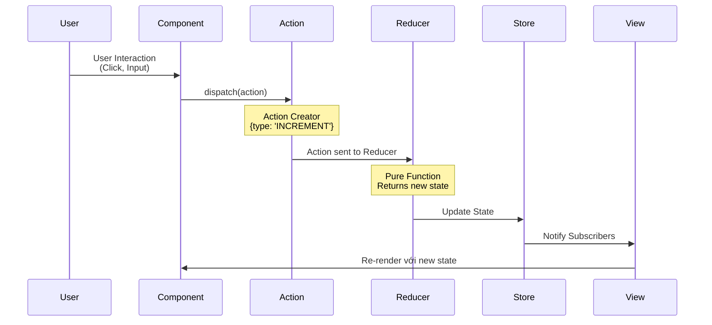
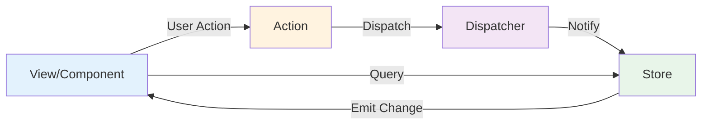
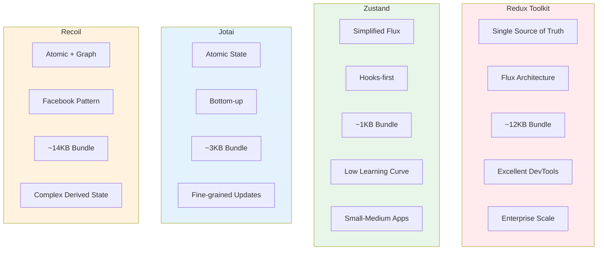
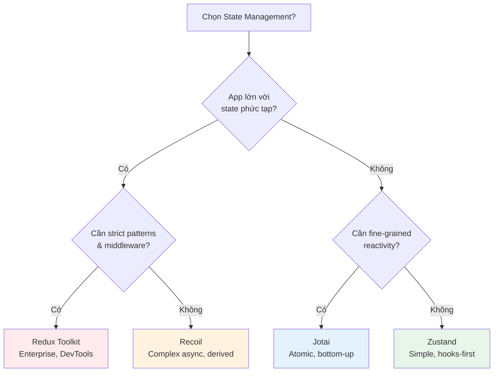

# 3. State Management

[← Quay lại README](./README.md)

---

## Redux/Flux Architecture - Tổng Quan

### Redux Flow Diagram (Unidirectional Data Flow):



### Flux Architecture Pattern:



### Redux vs Flux:

| Feature | Flux | Redux |
|---------|------|-------|
| Stores | Multiple stores | Single store |
| Dispatcher | Explicit dispatcher | Built-in dispatch |
| State | Mutable (with restrictions) | Immutable |
| Boilerplate | More | Less (with RTK) |
| DevTools | Limited | Excellent |

---

## Q3.1: So sánh Redux Toolkit, Zustand, Jotai, Recoil?

**Độ khó:** Senior

### Câu trả lời:

### Comparison Overview:

#### State Management Solutions Comparison:



#### Text Comparison:

```
┌─────────────────────────────────────────────────────────────┐
│              STATE MANAGEMENT COMPARISON                     │
├─────────────────────────────────────────────────────────────┤
│                                                              │
│   REDUX TOOLKIT                                              │
│   ┌─────────────────────────────────────────────────────┐   │
│   │  Philosophy: Single source of truth                  │   │
│   │  Pattern: Flux architecture                          │   │
│   │  Bundle: ~12KB (with RTK)                           │   │
│   │  Learning Curve: Medium-High                         │   │
│   │  DevTools: Excellent (time-travel debugging)         │   │
│   │  Best for: Large teams, complex state, enterprise    │   │
│   └─────────────────────────────────────────────────────┘   │
│                                                              │
│   ZUSTAND                                                    │
│   ┌─────────────────────────────────────────────────────┐   │
│   │  Philosophy: Simplified flux                         │   │
│   │  Pattern: Hooks-first                                │   │
│   │  Bundle: ~1KB                                        │   │
│   │  Learning Curve: Low                                 │   │
│   │  DevTools: Good (Redux DevTools compatible)          │   │
│   │  Best for: Small-medium apps, quick prototypes       │   │
│   └─────────────────────────────────────────────────────┘   │
│                                                              │
│   JOTAI                                                      │
│   ┌─────────────────────────────────────────────────────┐   │
│   │  Philosophy: Atomic state                            │   │
│   │  Pattern: Bottom-up                                  │   │
│   │  Bundle: ~3KB                                        │   │
│   │  Learning Curve: Low-Medium                          │   │
│   │  DevTools: Good                                      │   │
│   │  Best for: Fine-grained updates, derived state       │   │
│   └─────────────────────────────────────────────────────┘   │
│                                                              │
│   RECOIL                                                     │
│   ┌─────────────────────────────────────────────────────┐   │
│   │  Philosophy: Atomic + graph-based                    │   │
│   │  Pattern: Facebook's internal pattern                │   │
│   │  Bundle: ~14KB                                       │   │
│   │  Learning Curve: Medium                              │   │
│   │  DevTools: Good (Recoil DevTools)                    │   │
│   │  Best for: Complex derived state, async selectors    │   │
│   └─────────────────────────────────────────────────────┘   │
│                                                              │
└─────────────────────────────────────────────────────────────┘
```

### Detailed Comparison:

| Feature | Redux Toolkit | Zustand | Jotai | Recoil |
|---------|--------------|---------|-------|--------|
| Bundle Size | ~12KB | ~1KB | ~3KB | ~14KB |
| Boilerplate | Low (with RTK) | Very Low | Very Low | Low |
| TypeScript | Excellent | Excellent | Excellent | Good |
| SSR Support | Good | Excellent | Good | Limited |
| React Native | Yes | Yes | Yes | Yes |
| Middleware | Yes (built-in) | Yes (simple) | Limited | Limited |
| Persistence | redux-persist | built-in | jotai-utils | Limited |
| Async | RTK Query | Built-in | Suspense | Built-in |
| Devtools | Excellent | Good | Good | Good |

### Redux Toolkit Example:

```javascript
// store/slices/userSlice.ts
import { createSlice, createAsyncThunk } from '@reduxjs/toolkit';

interface UserState {
  user: User | null;
  status: 'idle' | 'loading' | 'succeeded' | 'failed';
  error: string | null;
}

const initialState: UserState = {
  user: null,
  status: 'idle',
  error: null,
};

// Async thunk
export const fetchUser = createAsyncThunk(
  'user/fetchUser',
  async (userId: string, { rejectWithValue }) => {
    try {
      const response = await api.getUser(userId);
      return response.data;
    } catch (error) {
      return rejectWithValue(error.message);
    }
  }
);

const userSlice = createSlice({
  name: 'user',
  initialState,
  reducers: {
    setUser: (state, action: PayloadAction<User>) => {
      state.user = action.payload;
    },
    clearUser: (state) => {
      state.user = null;
    },
    updateProfile: (state, action: PayloadAction<Partial<User>>) => {
      if (state.user) {
        state.user = { ...state.user, ...action.payload };
      }
    },
  },
  extraReducers: (builder) => {
    builder
      .addCase(fetchUser.pending, (state) => {
        state.status = 'loading';
      })
      .addCase(fetchUser.fulfilled, (state, action) => {
        state.status = 'succeeded';
        state.user = action.payload;
      })
      .addCase(fetchUser.rejected, (state, action) => {
        state.status = 'failed';
        state.error = action.payload as string;
      });
  },
});

export const { setUser, clearUser, updateProfile } = userSlice.actions;
export default userSlice.reducer;

// store/index.ts
import { configureStore } from '@reduxjs/toolkit';
import userReducer from './slices/userSlice';
import productReducer from './slices/productSlice';

export const store = configureStore({
  reducer: {
    user: userReducer,
    products: productReducer,
  },
  middleware: (getDefaultMiddleware) =>
    getDefaultMiddleware({
      serializableCheck: {
        ignoredActions: ['persist/PERSIST'],
      },
    }),
});

export type RootState = ReturnType<typeof store.getState>;
export type AppDispatch = typeof store.dispatch;

// hooks/useAppStore.ts
import { useDispatch, useSelector, TypedUseSelectorHook } from 'react-redux';
import type { RootState, AppDispatch } from '../store';

export const useAppDispatch = () => useDispatch<AppDispatch>();
export const useAppSelector: TypedUseSelectorHook<RootState> = useSelector;

// Usage in component
function UserProfile() {
  const dispatch = useAppDispatch();
  const { user, status, error } = useAppSelector((state) => state.user);

  useEffect(() => {
    dispatch(fetchUser('123'));
  }, [dispatch]);

  if (status === 'loading') return <Spinner />;
  if (status === 'failed') return <Error message={error} />;

  return <div>{user?.name}</div>;
}
```

### Zustand Example:

```javascript
// store/useStore.ts
import { create } from 'zustand';
import { devtools, persist, subscribeWithSelector } from 'zustand/middleware';
import { immer } from 'zustand/middleware/immer';

interface User {
  id: string;
  name: string;
  email: string;
}

interface UserStore {
  // State
  user: User | null;
  isLoading: boolean;
  error: string | null;

  // Actions
  setUser: (user: User) => void;
  clearUser: () => void;
  fetchUser: (id: string) => Promise<void>;
  updateProfile: (updates: Partial<User>) => void;
}

export const useUserStore = create<UserStore>()(
  devtools(
    persist(
      subscribeWithSelector(
        immer((set, get) => ({
          // Initial state
          user: null,
          isLoading: false,
          error: null,

          // Actions
          setUser: (user) =>
            set((state) => {
              state.user = user;
            }),

          clearUser: () =>
            set((state) => {
              state.user = null;
            }),

          fetchUser: async (id) => {
            set((state) => {
              state.isLoading = true;
              state.error = null;
            });

            try {
              const user = await api.getUser(id);
              set((state) => {
                state.user = user;
                state.isLoading = false;
              });
            } catch (error) {
              set((state) => {
                state.error = error.message;
                state.isLoading = false;
              });
            }
          },

          updateProfile: (updates) =>
            set((state) => {
              if (state.user) {
                Object.assign(state.user, updates);
              }
            }),
        }))
      ),
      {
        name: 'user-storage',
        partialize: (state) => ({ user: state.user }),
      }
    ),
    { name: 'UserStore' }
  )
);

// Selectors (for performance)
export const useUser = () => useUserStore((state) => state.user);
export const useUserLoading = () => useUserStore((state) => state.isLoading);
export const useUserActions = () =>
  useUserStore((state) => ({
    setUser: state.setUser,
    clearUser: state.clearUser,
    fetchUser: state.fetchUser,
    updateProfile: state.updateProfile,
  }));

// Subscribe to changes outside React
useUserStore.subscribe(
  (state) => state.user,
  (user) => {
    console.log('User changed:', user);
  }
);

// Usage in component
function UserProfile() {
  const user = useUser();
  const isLoading = useUserLoading();
  const { fetchUser } = useUserActions();

  useEffect(() => {
    fetchUser('123');
  }, [fetchUser]);

  if (isLoading) return <Spinner />;
  return <div>{user?.name}</div>;
}
```

### Jotai Example:

```javascript
// atoms/userAtoms.ts
import { atom } from 'jotai';
import { atomWithStorage, atomWithQuery } from 'jotai/utils';
import { atomWithImmer } from 'jotai-immer';

// Primitive atoms
export const userAtom = atom<User | null>(null);
export const userIdAtom = atom<string | null>(null);

// Persisted atom
export const themeAtom = atomWithStorage<'light' | 'dark'>('theme', 'light');

// Derived atoms (computed)
export const isAuthenticatedAtom = atom((get) => get(userAtom) !== null);

export const userDisplayNameAtom = atom((get) => {
  const user = get(userAtom);
  return user ? `${user.firstName} ${user.lastName}` : 'Guest';
});

// Writable derived atom
export const userWithDefaultsAtom = atom(
  (get) => get(userAtom),
  (get, set, update: Partial<User>) => {
    const current = get(userAtom);
    if (current) {
      set(userAtom, { ...current, ...update });
    }
  }
);

// Async atom
export const userQueryAtom = atom(async (get) => {
  const userId = get(userIdAtom);
  if (!userId) return null;

  const response = await fetch(`/api/users/${userId}`);
  return response.json();
});

// Atom with immer for complex updates
export const cartAtom = atomWithImmer<CartItem[]>([]);

export const addToCartAtom = atom(
  null,
  (get, set, item: CartItem) => {
    set(cartAtom, (draft) => {
      const existing = draft.find((i) => i.id === item.id);
      if (existing) {
        existing.quantity += item.quantity;
      } else {
        draft.push(item);
      }
    });
  }
);

// Atom family (parameterized atoms)
import { atomFamily } from 'jotai/utils';

export const userByIdAtom = atomFamily((id: string) =>
  atom(async () => {
    const response = await fetch(`/api/users/${id}`);
    return response.json();
  })
);

// Usage in component
function UserProfile() {
  const [userId, setUserId] = useAtom(userIdAtom);
  const user = useAtomValue(userQueryAtom);
  const displayName = useAtomValue(userDisplayNameAtom);
  const setUser = useSetAtom(userAtom);

  return (
    <Suspense fallback={<Spinner />}>
      <div>{displayName}</div>
    </Suspense>
  );
}

function Cart() {
  const [cart, setCart] = useAtom(cartAtom);
  const addToCart = useSetAtom(addToCartAtom);

  return (
    <div>
      {cart.map((item) => (
        <CartItem key={item.id} item={item} />
      ))}
      <button onClick={() => addToCart({ id: '1', quantity: 1 })}>
        Add Item
      </button>
    </div>
  );
}
```

### Recoil Example:

```javascript
// atoms/userAtoms.ts
import {
  atom,
  selector,
  selectorFamily,
  atomFamily,
  useRecoilState,
  useRecoilValue,
  useSetRecoilState,
} from 'recoil';

// Atoms
export const userState = atom<User | null>({
  key: 'userState',
  default: null,
});

export const userIdState = atom<string | null>({
  key: 'userIdState',
  default: null,
});

// Selectors (derived state)
export const isAuthenticatedState = selector({
  key: 'isAuthenticatedState',
  get: ({ get }) => get(userState) !== null,
});

export const userDisplayNameState = selector({
  key: 'userDisplayNameState',
  get: ({ get }) => {
    const user = get(userState);
    return user ? `${user.firstName} ${user.lastName}` : 'Guest';
  },
});

// Async selector
export const userDataQuery = selector({
  key: 'userDataQuery',
  get: async ({ get }) => {
    const userId = get(userIdState);
    if (!userId) return null;

    const response = await fetch(`/api/users/${userId}`);
    if (!response.ok) {
      throw new Error('Failed to fetch user');
    }
    return response.json();
  },
});

// Selector family (parameterized selectors)
export const userByIdQuery = selectorFamily({
  key: 'userByIdQuery',
  get: (userId: string) => async () => {
    const response = await fetch(`/api/users/${userId}`);
    return response.json();
  },
});

// Atom family
export const todoItemState = atomFamily<Todo, string>({
  key: 'todoItemState',
  default: (id) => ({
    id,
    text: '',
    completed: false,
  }),
});

export const todoIdsState = atom<string[]>({
  key: 'todoIdsState',
  default: [],
});

// Derived state from atom family
export const completedTodosState = selector({
  key: 'completedTodosState',
  get: ({ get }) => {
    const ids = get(todoIdsState);
    return ids
      .map((id) => get(todoItemState(id)))
      .filter((todo) => todo.completed);
  },
});

// Usage in component
function UserProfile() {
  const [userId, setUserId] = useRecoilState(userIdState);
  const user = useRecoilValue(userDataQuery);
  const displayName = useRecoilValue(userDisplayNameState);
  const setUser = useSetRecoilState(userState);

  return (
    <Suspense fallback={<Spinner />}>
      <div>{displayName}</div>
    </Suspense>
  );
}
```

### When to Use Which:

#### Decision Flowchart - Chọn State Management:



#### Text Decision Flowchart:

```
┌─────────────────────────────────────────────────────────────┐
│                 DECISION FLOWCHART                           │
├─────────────────────────────────────────────────────────────┤
│                                                              │
│   START                                                      │
│     │                                                        │
│     ▼                                                        │
│   ┌─────────────────────────────────────────────────────┐   │
│   │ Is the app large with complex state requirements?   │   │
│   └───────────────────────┬─────────────────────────────┘   │
│                           │                                  │
│           ┌───────────────┴───────────────┐                 │
│           │                               │                  │
│         YES                              NO                  │
│           │                               │                  │
│           ▼                               ▼                  │
│   ┌───────────────┐               ┌───────────────┐         │
│   │ Need strict   │               │ Need fine-    │         │
│   │ patterns &    │               │ grained       │         │
│   │ middleware?   │               │ reactivity?   │         │
│   └───────┬───────┘               └───────┬───────┘         │
│           │                               │                  │
│     ┌─────┴─────┐                   ┌─────┴─────┐           │
│     │           │                   │           │            │
│    YES         NO                  YES         NO            │
│     │           │                   │           │            │
│     ▼           ▼                   ▼           ▼            │
│   ┌─────┐   ┌─────────┐         ┌─────┐   ┌─────────┐       │
│   │REDUX│   │ RECOIL  │         │JOTAI│   │ ZUSTAND │       │
│   │ RTK │   │(complex │         │     │   │         │       │
│   │     │   │ async)  │         │     │   │         │       │
│   └─────┘   └─────────┘         └─────┘   └─────────┘       │
│                                                              │
└─────────────────────────────────────────────────────────────┘
```

---

## Q3.2: Làm sao normalize state trong Redux?

**Độ khó:** Senior

### Câu trả lời:

### Why Normalize?

```
┌─────────────────────────────────────────────────────────────┐
│                 NESTED vs NORMALIZED STATE                   │
├─────────────────────────────────────────────────────────────┤
│                                                              │
│   ❌ NESTED (Denormalized)                                  │
│   ┌─────────────────────────────────────────────────────┐   │
│   │ {                                                    │   │
│   │   posts: [                                           │   │
│   │     {                                                │   │
│   │       id: 1,                                         │   │
│   │       title: 'Post 1',                               │   │
│   │       author: { id: 1, name: 'John' },  // Duplicate │   │
│   │       comments: [                                    │   │
│   │         { id: 1, author: { id: 1, name: 'John' } }   │   │
│   │       ]                                              │   │
│   │     },                                               │   │
│   │     {                                                │   │
│   │       id: 2,                                         │   │
│   │       author: { id: 1, name: 'John' },  // Duplicate │   │
│   │     }                                                │   │
│   │   ]                                                  │   │
│   │ }                                                    │   │
│   └─────────────────────────────────────────────────────┘   │
│                                                              │
│   Problems:                                                  │
│   • Data duplication → inconsistency                        │
│   • Deep updates are complex                                 │
│   • Harder to find items by ID                               │
│   • Larger state size                                        │
│                                                              │
│   ✅ NORMALIZED                                             │
│   ┌─────────────────────────────────────────────────────┐   │
│   │ {                                                    │   │
│   │   entities: {                                        │   │
│   │     users: {                                         │   │
│   │       1: { id: 1, name: 'John' }                     │   │
│   │     },                                               │   │
│   │     posts: {                                         │   │
│   │       1: { id: 1, title: 'Post 1', authorId: 1 },    │   │
│   │       2: { id: 2, title: 'Post 2', authorId: 1 }     │   │
│   │     },                                               │   │
│   │     comments: {                                      │   │
│   │       1: { id: 1, postId: 1, authorId: 1 }           │   │
│   │     }                                                │   │
│   │   },                                                 │   │
│   │   ids: {                                             │   │
│   │     posts: [1, 2],                                   │   │
│   │     comments: [1]                                    │   │
│   │   }                                                  │   │
│   │ }                                                    │   │
│   └─────────────────────────────────────────────────────┘   │
│                                                              │
│   Benefits:                                                  │
│   • Single source of truth                                   │
│   • Easy updates (O(1) lookup)                               │
│   • Consistent data                                          │
│   • Smaller state size                                       │
│                                                              │
└─────────────────────────────────────────────────────────────┘
```

### Using createEntityAdapter:

```javascript
import {
  createSlice,
  createEntityAdapter,
  createAsyncThunk,
  EntityState,
} from '@reduxjs/toolkit';

// Entity types
interface User {
  id: string;
  name: string;
  email: string;
}

interface Post {
  id: string;
  title: string;
  content: string;
  authorId: string;
  createdAt: string;
}

// Create adapters
const usersAdapter = createEntityAdapter<User>({
  selectId: (user) => user.id,
  sortComparer: (a, b) => a.name.localeCompare(b.name),
});

const postsAdapter = createEntityAdapter<Post>({
  selectId: (post) => post.id,
  sortComparer: (a, b) => b.createdAt.localeCompare(a.createdAt),
});

// State types
interface UsersState extends EntityState<User> {
  status: 'idle' | 'loading' | 'succeeded' | 'failed';
  error: string | null;
}

interface PostsState extends EntityState<Post> {
  status: 'idle' | 'loading' | 'succeeded' | 'failed';
  error: string | null;
  currentPostId: string | null;
}

// Initial states
const usersInitialState: UsersState = usersAdapter.getInitialState({
  status: 'idle',
  error: null,
});

const postsInitialState: PostsState = postsAdapter.getInitialState({
  status: 'idle',
  error: null,
  currentPostId: null,
});

// Async thunks
export const fetchUsers = createAsyncThunk('users/fetchAll', async () => {
  const response = await api.getUsers();
  return response.data;
});

export const fetchPosts = createAsyncThunk('posts/fetchAll', async () => {
  const response = await api.getPosts();
  return response.data;
});

// Users slice
const usersSlice = createSlice({
  name: 'users',
  initialState: usersInitialState,
  reducers: {
    userAdded: usersAdapter.addOne,
    userUpdated: usersAdapter.updateOne,
    userRemoved: usersAdapter.removeOne,
    usersReceived: usersAdapter.setAll,
  },
  extraReducers: (builder) => {
    builder
      .addCase(fetchUsers.pending, (state) => {
        state.status = 'loading';
      })
      .addCase(fetchUsers.fulfilled, (state, action) => {
        state.status = 'succeeded';
        usersAdapter.setAll(state, action.payload);
      })
      .addCase(fetchUsers.rejected, (state, action) => {
        state.status = 'failed';
        state.error = action.error.message ?? 'Failed to fetch users';
      });
  },
});

// Posts slice
const postsSlice = createSlice({
  name: 'posts',
  initialState: postsInitialState,
  reducers: {
    postAdded: postsAdapter.addOne,
    postUpdated: postsAdapter.updateOne,
    postRemoved: postsAdapter.removeOne,
    setCurrentPost: (state, action: PayloadAction<string>) => {
      state.currentPostId = action.payload;
    },
  },
  extraReducers: (builder) => {
    builder
      .addCase(fetchPosts.fulfilled, (state, action) => {
        state.status = 'succeeded';
        postsAdapter.setAll(state, action.payload);
      });
  },
});

// Selectors
export const {
  selectAll: selectAllUsers,
  selectById: selectUserById,
  selectIds: selectUserIds,
  selectEntities: selectUserEntities,
  selectTotal: selectTotalUsers,
} = usersAdapter.getSelectors((state: RootState) => state.users);

export const {
  selectAll: selectAllPosts,
  selectById: selectPostById,
  selectIds: selectPostIds,
} = postsAdapter.getSelectors((state: RootState) => state.posts);

// Custom selectors with relationships
export const selectPostWithAuthor = createSelector(
  [selectPostById, selectUserEntities],
  (post, users) => {
    if (!post) return null;
    return {
      ...post,
      author: users[post.authorId],
    };
  }
);

export const selectPostsByAuthor = createSelector(
  [selectAllPosts, (_, authorId: string) => authorId],
  (posts, authorId) => posts.filter((post) => post.authorId === authorId)
);

// Usage
function PostList() {
  const posts = useAppSelector(selectAllPosts);
  const users = useAppSelector(selectUserEntities);

  return (
    <ul>
      {posts.map((post) => (
        <li key={post.id}>
          <h3>{post.title}</h3>
          <span>By: {users[post.authorId]?.name}</span>
        </li>
      ))}
    </ul>
  );
}

function PostDetail({ postId }: { postId: string }) {
  const postWithAuthor = useAppSelector((state) =>
    selectPostWithAuthor(state, postId)
  );

  if (!postWithAuthor) return <div>Post not found</div>;

  return (
    <article>
      <h1>{postWithAuthor.title}</h1>
      <p>By {postWithAuthor.author?.name}</p>
      <div>{postWithAuthor.content}</div>
    </article>
  );
}
```

---

## Q3.3: Server State vs Client State - React Query/SWR?

**Độ khó:** Senior

### Câu trả lời:

### State Categories:

```
┌─────────────────────────────────────────────────────────────┐
│                    STATE CATEGORIES                          │
├─────────────────────────────────────────────────────────────┤
│                                                              │
│   SERVER STATE                     CLIENT STATE              │
│   ────────────                     ────────────              │
│   • Persisted on server            • Only exists in browser  │
│   • Shared across users            • Unique to session       │
│   • Async (fetching/updating)      • Sync (immediate)        │
│   • Can become stale               • Always fresh            │
│   • Needs caching strategy         • No caching needed       │
│                                                              │
│   Examples:                        Examples:                 │
│   • User profiles                  • UI state (modals)       │
│   • Products list                  • Form inputs             │
│   • Comments                       • Selected items          │
│   • Orders                         • Theme preference        │
│   • Notifications                  • Sidebar open/closed     │
│                                                              │
│   Tools:                           Tools:                    │
│   • React Query                    • useState                │
│   • SWR                            • useReducer              │
│   • Apollo Client                  • Zustand                 │
│   • RTK Query                      • Jotai                   │
│                                                              │
└─────────────────────────────────────────────────────────────┘
```

### React Query Architecture:

```
┌─────────────────────────────────────────────────────────────┐
│                 REACT QUERY ARCHITECTURE                     │
├─────────────────────────────────────────────────────────────┤
│                                                              │
│   ┌─────────────────────────────────────────────────────┐   │
│   │                   QUERY CLIENT                       │   │
│   │   ┌─────────────────────────────────────────────┐   │   │
│   │   │               QUERY CACHE                    │   │   │
│   │   │                                              │   │   │
│   │   │  ['users']────────┐                         │   │   │
│   │   │  ['users', 1]─────┤                         │   │   │
│   │   │  ['posts']────────┼───▶ Query Instance      │   │   │
│   │   │  ['posts', { page: 1 }]──┤                  │   │   │
│   │   │                          │                   │   │   │
│   │   │   Query Instance:        │                   │   │   │
│   │   │   • data                 │                   │   │   │
│   │   │   • error                │                   │   │   │
│   │   │   • status               │                   │   │   │
│   │   │   • fetchStatus          │                   │   │   │
│   │   │   • observers[]          │                   │   │   │
│   │   │                          │                   │   │   │
│   │   └──────────────────────────┘                   │   │   │
│   └─────────────────────────────────────────────────────┘   │
│                           │                                  │
│                           │ subscribe                        │
│                           ▼                                  │
│   ┌─────────────────────────────────────────────────────┐   │
│   │                  COMPONENTS                          │   │
│   │                                                      │   │
│   │   useQuery(['users'])    useQuery(['users', 1])     │   │
│   │        │                        │                    │   │
│   │        └────────────────────────┘                    │   │
│   │                    │                                 │   │
│   │                    ▼                                 │   │
│   │         Re-render on cache update                    │   │
│   │                                                      │   │
│   └─────────────────────────────────────────────────────┘   │
│                                                              │
└─────────────────────────────────────────────────────────────┘
```

### React Query Advanced Patterns:

```javascript
// Query configuration
const queryClient = new QueryClient({
  defaultOptions: {
    queries: {
      staleTime: 5 * 60 * 1000, // 5 minutes
      gcTime: 30 * 60 * 1000, // 30 minutes (previously cacheTime)
      retry: 3,
      retryDelay: (attemptIndex) => Math.min(1000 * 2 ** attemptIndex, 30000),
      refetchOnWindowFocus: true,
      refetchOnReconnect: true,
    },
    mutations: {
      retry: 1,
    },
  },
});

// Query keys factory
const queryKeys = {
  users: {
    all: ['users'] as const,
    lists: () => [...queryKeys.users.all, 'list'] as const,
    list: (filters: UserFilters) =>
      [...queryKeys.users.lists(), filters] as const,
    details: () => [...queryKeys.users.all, 'detail'] as const,
    detail: (id: string) => [...queryKeys.users.details(), id] as const,
  },
  posts: {
    all: ['posts'] as const,
    list: (filters: PostFilters) => [...queryKeys.posts.all, 'list', filters],
    detail: (id: string) => [...queryKeys.posts.all, 'detail', id],
    comments: (postId: string) => [...queryKeys.posts.detail(postId), 'comments'],
  },
};

// Custom hooks with proper typing
function useUsers(filters: UserFilters) {
  return useQuery({
    queryKey: queryKeys.users.list(filters),
    queryFn: () => api.getUsers(filters),
    placeholderData: keepPreviousData, // Smooth pagination
    select: (data) => data.users, // Transform response
  });
}

function useUser(id: string) {
  return useQuery({
    queryKey: queryKeys.users.detail(id),
    queryFn: () => api.getUser(id),
    enabled: !!id, // Only fetch when id exists
    staleTime: Infinity, // Never automatically refetch
  });
}

// Prefetching
function UserList() {
  const queryClient = useQueryClient();
  const { data: users } = useUsers({});

  // Prefetch user details on hover
  const prefetchUser = (id: string) => {
    queryClient.prefetchQuery({
      queryKey: queryKeys.users.detail(id),
      queryFn: () => api.getUser(id),
      staleTime: 5 * 60 * 1000,
    });
  };

  return (
    <ul>
      {users?.map((user) => (
        <li key={user.id} onMouseEnter={() => prefetchUser(user.id)}>
          <Link to={`/users/${user.id}`}>{user.name}</Link>
        </li>
      ))}
    </ul>
  );
}

// Infinite queries
function useInfiniteProducts(filters: ProductFilters) {
  return useInfiniteQuery({
    queryKey: ['products', 'infinite', filters],
    queryFn: ({ pageParam = 1 }) =>
      api.getProducts({ ...filters, page: pageParam }),
    getNextPageParam: (lastPage) =>
      lastPage.hasMore ? lastPage.nextPage : undefined,
    getPreviousPageParam: (firstPage) => firstPage.prevPage,
  });
}

function ProductList() {
  const {
    data,
    fetchNextPage,
    hasNextPage,
    isFetchingNextPage,
  } = useInfiniteProducts({});

  return (
    <>
      {data?.pages.map((page, i) => (
        <React.Fragment key={i}>
          {page.products.map((product) => (
            <ProductCard key={product.id} product={product} />
          ))}
        </React.Fragment>
      ))}
      <button
        onClick={() => fetchNextPage()}
        disabled={!hasNextPage || isFetchingNextPage}
      >
        {isFetchingNextPage
          ? 'Loading more...'
          : hasNextPage
          ? 'Load More'
          : 'Nothing more to load'}
      </button>
    </>
  );
}

// Optimistic updates
function useUpdateUser() {
  const queryClient = useQueryClient();

  return useMutation({
    mutationFn: api.updateUser,
    onMutate: async (newUser) => {
      // Cancel outgoing refetches
      await queryClient.cancelQueries({
        queryKey: queryKeys.users.detail(newUser.id)
      });

      // Snapshot previous value
      const previousUser = queryClient.getQueryData(
        queryKeys.users.detail(newUser.id)
      );

      // Optimistically update
      queryClient.setQueryData(
        queryKeys.users.detail(newUser.id),
        (old: User) => ({ ...old, ...newUser })
      );

      // Return context with snapshot
      return { previousUser };
    },
    onError: (err, newUser, context) => {
      // Rollback on error
      if (context?.previousUser) {
        queryClient.setQueryData(
          queryKeys.users.detail(newUser.id),
          context.previousUser
        );
      }
    },
    onSettled: (data, error, variables) => {
      // Always refetch after error or success
      queryClient.invalidateQueries({
        queryKey: queryKeys.users.detail(variables.id)
      });
    },
  });
}

// Parallel queries
function Dashboard() {
  const results = useQueries({
    queries: [
      { queryKey: ['users'], queryFn: api.getUsers },
      { queryKey: ['posts'], queryFn: api.getPosts },
      { queryKey: ['comments'], queryFn: api.getComments },
    ],
  });

  const isLoading = results.some((r) => r.isLoading);
  const [users, posts, comments] = results.map((r) => r.data);

  if (isLoading) return <Spinner />;

  return (
    <div>
      <UserStats users={users} />
      <PostStats posts={posts} />
      <CommentStats comments={comments} />
    </div>
  );
}

// Dependent queries
function PostWithComments({ postId }: { postId: string }) {
  // First query
  const { data: post } = useQuery({
    queryKey: queryKeys.posts.detail(postId),
    queryFn: () => api.getPost(postId),
  });

  // Dependent query - only runs when post is loaded
  const { data: comments } = useQuery({
    queryKey: queryKeys.posts.comments(postId),
    queryFn: () => api.getComments(post!.commentIds),
    enabled: !!post?.commentIds?.length, // Only run when we have comment IDs
  });

  return (
    <article>
      <h1>{post?.title}</h1>
      <CommentsList comments={comments} />
    </article>
  );
}
```

---

## Q3.4: Context API Optimization Patterns?

**Độ khó:** Senior

### Câu trả lời:

### Problem: Context Re-renders

```
┌─────────────────────────────────────────────────────────────┐
│                 CONTEXT RE-RENDER PROBLEM                    │
├─────────────────────────────────────────────────────────────┤
│                                                              │
│   <AppContext.Provider value={{ user, theme, cart }}>       │
│   │                                                          │
│   ├── <Header />        ← Uses theme    → RE-RENDERS         │
│   ├── <UserMenu />      ← Uses user     → RE-RENDERS         │
│   ├── <ProductList />   ← Uses nothing  → RE-RENDERS! ❌     │
│   │   └── 100 items...                  → ALL RE-RENDER! ❌  │
│   ├── <CartIcon />      ← Uses cart     → RE-RENDERS         │
│   └── <Footer />        ← Uses nothing  → RE-RENDERS! ❌     │
│                                                              │
│   Problem: ANY change to context → ALL consumers re-render   │
│                                                              │
└─────────────────────────────────────────────────────────────┘
```

### Solution 1: Split Contexts

```javascript
// ❌ BAD: Single context with everything
const AppContext = createContext({
  user: null,
  theme: 'light',
  cart: [],
  setUser: () => {},
  setTheme: () => {},
  addToCart: () => {},
});

// ✅ GOOD: Split into separate contexts
const UserContext = createContext<UserContextValue | null>(null);
const ThemeContext = createContext<ThemeContextValue | null>(null);
const CartContext = createContext<CartContextValue | null>(null);

// Each provider manages its own state
function UserProvider({ children }: { children: React.ReactNode }) {
  const [user, setUser] = useState<User | null>(null);

  const value = useMemo(() => ({
    user,
    setUser,
    isAuthenticated: user !== null,
  }), [user]);

  return (
    <UserContext.Provider value={value}>
      {children}
    </UserContext.Provider>
  );
}

function ThemeProvider({ children }: { children: React.ReactNode }) {
  const [theme, setTheme] = useState<'light' | 'dark'>('light');

  const value = useMemo(() => ({
    theme,
    setTheme,
    toggleTheme: () => setTheme(t => t === 'light' ? 'dark' : 'light'),
  }), [theme]);

  return (
    <ThemeContext.Provider value={value}>
      {children}
    </ThemeContext.Provider>
  );
}

// Combine providers
function AppProviders({ children }: { children: React.ReactNode }) {
  return (
    <UserProvider>
      <ThemeProvider>
        <CartProvider>
          {children}
        </CartProvider>
      </ThemeProvider>
    </UserProvider>
  );
}

// Now components only re-render when their specific context changes
function Header() {
  const { theme } = useTheme();  // Only re-renders on theme change
  return <header className={theme}>...</header>;
}

function UserMenu() {
  const { user } = useUser();  // Only re-renders on user change
  return <div>{user?.name}</div>;
}
```

### Solution 2: Separate State and Dispatch

```javascript
// Separate contexts for state and dispatch
const TodoStateContext = createContext<TodoState | null>(null);
const TodoDispatchContext = createContext<React.Dispatch<TodoAction> | null>(null);

function TodoProvider({ children }: { children: React.ReactNode }) {
  const [state, dispatch] = useReducer(todoReducer, initialState);

  return (
    <TodoStateContext.Provider value={state}>
      <TodoDispatchContext.Provider value={dispatch}>
        {children}
      </TodoDispatchContext.Provider>
    </TodoStateContext.Provider>
  );
}

// Hooks for accessing context
function useTodoState() {
  const context = useContext(TodoStateContext);
  if (context === null) {
    throw new Error('useTodoState must be used within TodoProvider');
  }
  return context;
}

function useTodoDispatch() {
  const context = useContext(TodoDispatchContext);
  if (context === null) {
    throw new Error('useTodoDispatch must be used within TodoProvider');
  }
  return context;
}

// Components that only dispatch don't re-render on state changes
function AddTodoButton() {
  const dispatch = useTodoDispatch(); // Never re-renders on state changes!

  const handleAdd = () => {
    dispatch({ type: 'ADD_TODO', payload: { text: 'New todo' } });
  };

  return <button onClick={handleAdd}>Add Todo</button>;
}

// Components that read state re-render appropriately
function TodoList() {
  const { todos } = useTodoState(); // Re-renders when todos change

  return (
    <ul>
      {todos.map(todo => (
        <TodoItem key={todo.id} todo={todo} />
      ))}
    </ul>
  );
}
```

### Solution 3: Context Selectors

```javascript
// Using use-context-selector library
import { createContext, useContextSelector } from 'use-context-selector';

interface AppState {
  user: User | null;
  theme: 'light' | 'dark';
  cart: CartItem[];
  notifications: Notification[];
}

const AppContext = createContext<AppState | null>(null);

// Custom hook with selector
function useAppSelector<T>(selector: (state: AppState) => T): T {
  return useContextSelector(AppContext, (ctx) => {
    if (ctx === null) {
      throw new Error('useAppSelector must be used within AppProvider');
    }
    return selector(ctx);
  });
}

// Only re-renders when selected value changes
function UserName() {
  const userName = useAppSelector(state => state.user?.name);
  // Only re-renders when user.name changes, not theme or cart
  return <span>{userName}</span>;
}

function CartCount() {
  const count = useAppSelector(state => state.cart.length);
  // Only re-renders when cart length changes
  return <span>{count}</span>;
}

function ThemeToggle() {
  const theme = useAppSelector(state => state.theme);
  // Only re-renders when theme changes
  return <button>{theme}</button>;
}
```

### Solution 4: Memoize Consumer Components

```javascript
// Memoize components that consume context
const Header = memo(function Header() {
  const { theme, toggleTheme } = useTheme();

  return (
    <header className={theme}>
      <button onClick={toggleTheme}>Toggle Theme</button>
    </header>
  );
});

const UserMenu = memo(function UserMenu() {
  const { user } = useUser();

  return (
    <div>
      {user ? <span>{user.name}</span> : <LoginButton />}
    </div>
  );
});

// Even better: Memoize parts that don't need context
function ProductList() {
  const { user } = useUser(); // Causes re-render on user change

  return (
    <div>
      <h2>Products for {user?.name}</h2>
      <MemoizedProductGrid /> {/* Doesn't re-render */}
    </div>
  );
}

const MemoizedProductGrid = memo(function ProductGrid() {
  // This component doesn't use any context
  // So it won't re-render when parent re-renders
  return (
    <div className="grid">
      {/* ... */}
    </div>
  );
});
```

### Context Optimization Summary:

```
┌─────────────────────────────────────────────────────────────┐
│              CONTEXT OPTIMIZATION STRATEGIES                 │
├─────────────────────────────────────────────────────────────┤
│                                                              │
│   1. SPLIT CONTEXTS                                          │
│      ├── Separate by domain (user, theme, cart)             │
│      ├── Each context updates independently                  │
│      └── Only affected consumers re-render                   │
│                                                              │
│   2. SEPARATE STATE/DISPATCH                                 │
│      ├── State context for readers                           │
│      ├── Dispatch context for writers                        │
│      └── Writers never re-render on state changes            │
│                                                              │
│   3. CONTEXT SELECTORS                                       │
│      ├── use-context-selector library                        │
│      ├── Fine-grained subscriptions                          │
│      └── Only selected data triggers re-render               │
│                                                              │
│   4. MEMOIZATION                                             │
│      ├── useMemo for context value                           │
│      ├── React.memo for consumer components                  │
│      └── useCallback for actions                             │
│                                                              │
│   5. COMPONENT COMPOSITION                                   │
│      ├── Move context usage up the tree                      │
│      ├── Pass data as props to memoized children             │
│      └── Use render props for flexibility                    │
│                                                              │
└─────────────────────────────────────────────────────────────┘
```

---

## Q3.5: Global State vs Local State - Khi nào dùng cái nào?

**Độ khó:** Mid-Senior

### Câu trả lời:

### State Location Decision:

```
┌─────────────────────────────────────────────────────────────┐
│                  STATE LOCATION DECISION                     │
├─────────────────────────────────────────────────────────────┤
│                                                              │
│   Question: Where should this state live?                    │
│                                                              │
│   ┌─────────────────────────────────────────────────────┐   │
│   │ Is it needed by multiple components?                 │   │
│   └───────────────────────┬─────────────────────────────┘   │
│                           │                                  │
│               ┌───────────┴───────────┐                     │
│              NO                      YES                     │
│               │                       │                      │
│               ▼                       ▼                      │
│   ┌───────────────────┐   ┌───────────────────────────┐     │
│   │   LOCAL STATE     │   │ Are they in same subtree? │     │
│   │   (useState)      │   └───────────────┬───────────┘     │
│   └───────────────────┘                   │                  │
│                               ┌───────────┴───────────┐     │
│                              YES                     NO      │
│                               │                       │      │
│                               ▼                       ▼      │
│   ┌───────────────────────────────┐   ┌─────────────────┐   │
│   │ LIFT STATE UP                 │   │ Is it server    │   │
│   │ (Closest common ancestor)     │   │ data?           │   │
│   └───────────────────────────────┘   └────────┬────────┘   │
│                                                │             │
│                                    ┌───────────┴──────────┐ │
│                                   YES                    NO  │
│                                    │                      │  │
│                                    ▼                      ▼  │
│                       ┌────────────────────┐  ┌───────────┐ │
│                       │ SERVER STATE       │  │ GLOBAL    │ │
│                       │ (React Query/SWR)  │  │ STATE     │ │
│                       └────────────────────┘  │(Redux/    │ │
│                                               │Zustand)   │ │
│                                               └───────────┘ │
│                                                              │
└─────────────────────────────────────────────────────────────┘
```

### Examples by State Type:

```javascript
// 1. LOCAL STATE - Component-specific
function SearchInput() {
  const [query, setQuery] = useState(''); // Only this component needs it

  return (
    <input
      value={query}
      onChange={(e) => setQuery(e.target.value)}
    />
  );
}

// 2. LIFTED STATE - Shared between siblings
function ProductFilter() {
  const [filters, setFilters] = useState<Filters>({});

  return (
    <div>
      <FilterPanel filters={filters} onChange={setFilters} />
      <ProductList filters={filters} />
    </div>
  );
}

// 3. CONTEXT - Deeply nested, infrequent updates
// Theme, user auth, language
const ThemeContext = createContext<Theme>('light');

function App() {
  const [theme, setTheme] = useState<Theme>('light');

  return (
    <ThemeContext.Provider value={theme}>
      <DeepNestedComponent />
    </ThemeContext.Provider>
  );
}

// 4. SERVER STATE - Remote data
function ProductList() {
  const { data, isLoading } = useQuery({
    queryKey: ['products'],
    queryFn: fetchProducts,
  });

  if (isLoading) return <Spinner />;
  return <Grid products={data} />;
}

// 5. GLOBAL STATE - App-wide client state
// Using Zustand
const useCartStore = create<CartStore>((set) => ({
  items: [],
  addItem: (item) => set((state) => ({
    items: [...state.items, item],
  })),
  removeItem: (id) => set((state) => ({
    items: state.items.filter((i) => i.id !== id),
  })),
  clearCart: () => set({ items: [] }),
}));
```

### State Classification:

| State Type | Location | Example | Tool |
|------------|----------|---------|------|
| Form Input | Local | Input value | useState |
| UI Toggle | Local | Modal open | useState |
| Selected Item | Lifted | Accordion | useState (parent) |
| Theme | Context | Dark mode | Context API |
| Auth | Context/Global | User session | Context/Zustand |
| Server Data | Server Cache | Products | React Query |
| Cart | Global | Shopping cart | Zustand/Redux |
| Notifications | Global | Toast messages | Zustand |

---

## Q3.6: Immutability và Immer trong State Management?

**Độ khó:** Mid-Senior

### Câu trả lời:

### Why Immutability Matters:

```javascript
// ❌ MUTATION - Breaks React's change detection
const [user, setUser] = useState({ name: 'John', age: 30 });

function updateAge() {
  user.age = 31;  // Direct mutation
  setUser(user);  // Same reference, React won't re-render!
}

// ✅ IMMUTABLE UPDATE - Creates new reference
function updateAge() {
  setUser({ ...user, age: 31 });  // New object, React will re-render
}

// Complex nested updates become verbose
const [state, setState] = useState({
  user: {
    profile: {
      settings: {
        theme: 'light',
        notifications: {
          email: true,
          push: false
        }
      }
    }
  }
});

// ❌ Mutating nested object
state.user.profile.settings.notifications.email = false;

// ✅ Immutable nested update (verbose!)
setState({
  ...state,
  user: {
    ...state.user,
    profile: {
      ...state.user.profile,
      settings: {
        ...state.user.profile.settings,
        notifications: {
          ...state.user.profile.settings.notifications,
          email: false
        }
      }
    }
  }
});
```

### Using Immer:

```javascript
import { produce } from 'immer';
import { useImmer } from 'use-immer';

// With produce function
const nextState = produce(state, (draft) => {
  // Write "mutations" - Immer handles immutability
  draft.user.profile.settings.notifications.email = false;
});

// With useImmer hook
function Settings() {
  const [state, updateState] = useImmer({
    user: {
      profile: {
        settings: {
          theme: 'light',
          notifications: {
            email: true,
            push: false
          }
        }
      }
    }
  });

  const toggleEmailNotifications = () => {
    updateState((draft) => {
      draft.user.profile.settings.notifications.email =
        !draft.user.profile.settings.notifications.email;
    });
  };

  return <button onClick={toggleEmailNotifications}>Toggle Email</button>;
}

// With useImmerReducer
import { useImmerReducer } from 'use-immer';

type Action =
  | { type: 'ADD_TODO'; text: string }
  | { type: 'TOGGLE_TODO'; id: number }
  | { type: 'DELETE_TODO'; id: number };

function todoReducer(draft: Todo[], action: Action) {
  switch (action.type) {
    case 'ADD_TODO':
      draft.push({
        id: Date.now(),
        text: action.text,
        completed: false
      });
      break;

    case 'TOGGLE_TODO':
      const todo = draft.find(t => t.id === action.id);
      if (todo) {
        todo.completed = !todo.completed;
      }
      break;

    case 'DELETE_TODO':
      const index = draft.findIndex(t => t.id === action.id);
      if (index !== -1) {
        draft.splice(index, 1);
      }
      break;
  }
}

function TodoApp() {
  const [todos, dispatch] = useImmerReducer(todoReducer, []);

  return (
    <div>
      <button onClick={() => dispatch({ type: 'ADD_TODO', text: 'New' })}>
        Add
      </button>
      {todos.map(todo => (
        <TodoItem
          key={todo.id}
          todo={todo}
          onToggle={() => dispatch({ type: 'TOGGLE_TODO', id: todo.id })}
          onDelete={() => dispatch({ type: 'DELETE_TODO', id: todo.id })}
        />
      ))}
    </div>
  );
}
```

### Immer with Zustand:

```javascript
import { create } from 'zustand';
import { immer } from 'zustand/middleware/immer';

interface CartStore {
  items: CartItem[];
  addItem: (item: CartItem) => void;
  updateQuantity: (id: string, quantity: number) => void;
  removeItem: (id: string) => void;
}

const useCartStore = create<CartStore>()(
  immer((set) => ({
    items: [],

    addItem: (item) => set((state) => {
      const existing = state.items.find(i => i.id === item.id);
      if (existing) {
        existing.quantity += item.quantity;
      } else {
        state.items.push(item);
      }
    }),

    updateQuantity: (id, quantity) => set((state) => {
      const item = state.items.find(i => i.id === id);
      if (item) {
        item.quantity = quantity;
      }
    }),

    removeItem: (id) => set((state) => {
      const index = state.items.findIndex(i => i.id === id);
      if (index !== -1) {
        state.items.splice(index, 1);
      }
    }),
  }))
);
```

---

## Q3.7: Persist State - Local Storage, Session Storage, IndexedDB?

**Độ khó:** Mid-Senior

### Câu trả lời:

### Storage Comparison:

```
┌─────────────────────────────────────────────────────────────┐
│                  STORAGE COMPARISON                          │
├─────────────────────────────────────────────────────────────┤
│                                                              │
│   LOCAL STORAGE                                              │
│   ├── Capacity: ~5-10MB                                      │
│   ├── Persistence: Permanent (until cleared)                 │
│   ├── Scope: Origin (domain + protocol + port)               │
│   ├── Access: Synchronous                                    │
│   └── Use case: User preferences, theme, cart                │
│                                                              │
│   SESSION STORAGE                                            │
│   ├── Capacity: ~5-10MB                                      │
│   ├── Persistence: Tab/Window session                        │
│   ├── Scope: Origin + Tab                                    │
│   ├── Access: Synchronous                                    │
│   └── Use case: Form data, wizard state                      │
│                                                              │
│   INDEXEDDB                                                  │
│   ├── Capacity: Large (browser-dependent, ~50MB-unlimited)   │
│   ├── Persistence: Permanent                                 │
│   ├── Scope: Origin                                          │
│   ├── Access: Asynchronous                                   │
│   └── Use case: Large datasets, offline data, files          │
│                                                              │
└─────────────────────────────────────────────────────────────┘
```

### Zustand Persist Middleware:

```javascript
import { create } from 'zustand';
import { persist, createJSONStorage } from 'zustand/middleware';

interface UserPreferences {
  theme: 'light' | 'dark';
  language: string;
  fontSize: number;
  sidebarCollapsed: boolean;
}

interface PreferencesStore {
  preferences: UserPreferences;
  setTheme: (theme: 'light' | 'dark') => void;
  setLanguage: (language: string) => void;
  setFontSize: (size: number) => void;
  toggleSidebar: () => void;
  resetPreferences: () => void;
}

const defaultPreferences: UserPreferences = {
  theme: 'light',
  language: 'en',
  fontSize: 14,
  sidebarCollapsed: false,
};

export const usePreferencesStore = create<PreferencesStore>()(
  persist(
    (set) => ({
      preferences: defaultPreferences,

      setTheme: (theme) =>
        set((state) => ({
          preferences: { ...state.preferences, theme },
        })),

      setLanguage: (language) =>
        set((state) => ({
          preferences: { ...state.preferences, language },
        })),

      setFontSize: (fontSize) =>
        set((state) => ({
          preferences: { ...state.preferences, fontSize },
        })),

      toggleSidebar: () =>
        set((state) => ({
          preferences: {
            ...state.preferences,
            sidebarCollapsed: !state.preferences.sidebarCollapsed,
          },
        })),

      resetPreferences: () =>
        set({ preferences: defaultPreferences }),
    }),
    {
      name: 'user-preferences', // Storage key
      storage: createJSONStorage(() => localStorage),
      partialize: (state) => ({ preferences: state.preferences }), // What to persist
      version: 1, // Schema version
      migrate: (persistedState, version) => {
        // Handle migrations when version changes
        if (version === 0) {
          // Migrate from v0 to v1
          return {
            ...persistedState,
            preferences: {
              ...persistedState.preferences,
              fontSize: 14, // Add new field
            },
          };
        }
        return persistedState;
      },
    }
  )
);

// Session storage
export const useSessionStore = create<SessionStore>()(
  persist(
    (set) => ({
      wizardStep: 0,
      formData: {},
      setStep: (step) => set({ wizardStep: step }),
      updateFormData: (data) =>
        set((state) => ({
          formData: { ...state.formData, ...data },
        })),
    }),
    {
      name: 'wizard-session',
      storage: createJSONStorage(() => sessionStorage),
    }
  )
);

// IndexedDB with idb-keyval
import { get, set, del } from 'idb-keyval';

const indexedDBStorage = {
  getItem: async (name: string) => {
    const value = await get(name);
    return value ?? null;
  },
  setItem: async (name: string, value: string) => {
    await set(name, value);
  },
  removeItem: async (name: string) => {
    await del(name);
  },
};

export const useLargeDataStore = create<LargeDataStore>()(
  persist(
    (set) => ({
      data: [],
      setData: (data) => set({ data }),
    }),
    {
      name: 'large-data',
      storage: createJSONStorage(() => indexedDBStorage),
    }
  )
);
```

### Custom useLocalStorage Hook:

```javascript
function useLocalStorage<T>(key: string, initialValue: T) {
  // Lazy initialization
  const [storedValue, setStoredValue] = useState<T>(() => {
    if (typeof window === 'undefined') {
      return initialValue;
    }
    try {
      const item = window.localStorage.getItem(key);
      return item ? JSON.parse(item) : initialValue;
    } catch (error) {
      console.warn(`Error reading localStorage key "${key}":`, error);
      return initialValue;
    }
  });

  // Update localStorage when state changes
  const setValue = useCallback(
    (value: T | ((val: T) => T)) => {
      try {
        const valueToStore =
          value instanceof Function ? value(storedValue) : value;
        setStoredValue(valueToStore);
        if (typeof window !== 'undefined') {
          window.localStorage.setItem(key, JSON.stringify(valueToStore));
        }
      } catch (error) {
        console.warn(`Error setting localStorage key "${key}":`, error);
      }
    },
    [key, storedValue]
  );

  // Listen for changes from other tabs
  useEffect(() => {
    const handleStorageChange = (e: StorageEvent) => {
      if (e.key === key && e.newValue !== null) {
        try {
          setStoredValue(JSON.parse(e.newValue));
        } catch {
          setStoredValue(e.newValue as T);
        }
      }
    };

    window.addEventListener('storage', handleStorageChange);
    return () => window.removeEventListener('storage', handleStorageChange);
  }, [key]);

  const remove = useCallback(() => {
    setStoredValue(initialValue);
    window.localStorage.removeItem(key);
  }, [key, initialValue]);

  return [storedValue, setValue, remove] as const;
}

// Usage
function App() {
  const [user, setUser, removeUser] = useLocalStorage<User | null>('user', null);
  const [theme, setTheme] = useLocalStorage<'light' | 'dark'>('theme', 'light');

  return (
    <div className={theme}>
      {user ? (
        <>
          <span>Welcome, {user.name}</span>
          <button onClick={removeUser}>Logout</button>
        </>
      ) : (
        <LoginForm onLogin={setUser} />
      )}
    </div>
  );
}
```

---

## Q3.8: State Synchronization giữa Tabs/Windows?

**Độ khó:** Senior

### Câu trả lời:

### Methods for Cross-Tab Communication:

```
┌─────────────────────────────────────────────────────────────┐
│              CROSS-TAB COMMUNICATION METHODS                 │
├─────────────────────────────────────────────────────────────┤
│                                                              │
│   1. STORAGE EVENT                                           │
│      ├── Triggers when localStorage changes in OTHER tabs   │
│      ├── Same origin only                                    │
│      └── Simple but limited (string only)                    │
│                                                              │
│   2. BROADCAST CHANNEL API                                   │
│      ├── Direct message passing between tabs                 │
│      ├── Same origin only                                    │
│      └── More flexible than storage events                   │
│                                                              │
│   3. SERVICE WORKER                                          │
│      ├── Can coordinate between all tabs                     │
│      ├── Works offline                                       │
│      └── More complex setup                                  │
│                                                              │
│   4. SHARED WORKER                                           │
│      ├── Single worker shared across tabs                    │
│      ├── Can maintain state                                  │
│      └── Limited browser support                             │
│                                                              │
└─────────────────────────────────────────────────────────────┘
```

### Broadcast Channel Implementation:

```javascript
// useBroadcastChannel.ts
function useBroadcastChannel<T>(channelName: string) {
  const channelRef = useRef<BroadcastChannel | null>(null);
  const [lastMessage, setLastMessage] = useState<T | null>(null);

  useEffect(() => {
    const channel = new BroadcastChannel(channelName);
    channelRef.current = channel;

    channel.onmessage = (event: MessageEvent<T>) => {
      setLastMessage(event.data);
    };

    return () => {
      channel.close();
    };
  }, [channelName]);

  const postMessage = useCallback((message: T) => {
    channelRef.current?.postMessage(message);
  }, []);

  return { lastMessage, postMessage };
}

// State sync with Broadcast Channel
function useSyncedState<T>(key: string, initialValue: T) {
  const [state, setState] = useState<T>(() => {
    const stored = localStorage.getItem(key);
    return stored ? JSON.parse(stored) : initialValue;
  });

  const channel = useRef<BroadcastChannel | null>(null);

  useEffect(() => {
    channel.current = new BroadcastChannel(`sync-${key}`);

    channel.current.onmessage = (event) => {
      setState(event.data);
    };

    return () => {
      channel.current?.close();
    };
  }, [key]);

  const setSyncedState = useCallback((value: T | ((prev: T) => T)) => {
    setState((prev) => {
      const newValue = typeof value === 'function'
        ? (value as (prev: T) => T)(prev)
        : value;

      // Persist to localStorage
      localStorage.setItem(key, JSON.stringify(newValue));

      // Broadcast to other tabs
      channel.current?.postMessage(newValue);

      return newValue;
    });
  }, [key]);

  return [state, setSyncedState] as const;
}

// Usage
function App() {
  const [user, setUser] = useSyncedState<User | null>('user', null);

  const handleLogout = () => {
    setUser(null);
    // All other tabs will also log out!
  };

  return (
    <div>
      {user ? (
        <>
          <span>Logged in as {user.name}</span>
          <button onClick={handleLogout}>Logout</button>
        </>
      ) : (
        <LoginForm onLogin={setUser} />
      )}
    </div>
  );
}
```

### Zustand with Cross-Tab Sync:

```javascript
import { create } from 'zustand';
import { persist, createJSONStorage } from 'zustand/middleware';

interface AuthStore {
  user: User | null;
  token: string | null;
  login: (user: User, token: string) => void;
  logout: () => void;
}

// Create broadcast channel for sync
const authChannel = new BroadcastChannel('auth-sync');

export const useAuthStore = create<AuthStore>()(
  persist(
    (set, get) => ({
      user: null,
      token: null,

      login: (user, token) => {
        set({ user, token });
        // Broadcast to other tabs
        authChannel.postMessage({ type: 'LOGIN', user, token });
      },

      logout: () => {
        set({ user: null, token: null });
        // Broadcast to other tabs
        authChannel.postMessage({ type: 'LOGOUT' });
      },
    }),
    {
      name: 'auth-storage',
      storage: createJSONStorage(() => localStorage),
    }
  )
);

// Listen for messages from other tabs
authChannel.onmessage = (event) => {
  const { type, user, token } = event.data;

  switch (type) {
    case 'LOGIN':
      useAuthStore.setState({ user, token });
      break;
    case 'LOGOUT':
      useAuthStore.setState({ user: null, token: null });
      break;
  }
};

// Also listen for storage events (backup)
if (typeof window !== 'undefined') {
  window.addEventListener('storage', (e) => {
    if (e.key === 'auth-storage' && e.newValue) {
      try {
        const { state } = JSON.parse(e.newValue);
        useAuthStore.setState(state);
      } catch (error) {
        console.error('Failed to sync auth state:', error);
      }
    }
  });
}
```

---

## Q3.9: Form State Management - React Hook Form vs Formik?

**Độ khó:** Mid-Senior

### Câu trả lời:

### Comparison:

| Feature | React Hook Form | Formik |
|---------|----------------|--------|
| Bundle Size | ~9KB | ~15KB |
| Re-renders | Minimal (uncontrolled) | More (controlled) |
| Validation | Built-in + Yup/Zod | Yup |
| TypeScript | Excellent | Good |
| Performance | Excellent | Good |
| Learning Curve | Medium | Medium |

### React Hook Form Example:

```javascript
import { useForm, useFieldArray, Controller } from 'react-hook-form';
import { zodResolver } from '@hookform/resolvers/zod';
import { z } from 'zod';

// Schema
const userSchema = z.object({
  name: z.string().min(2, 'Name must be at least 2 characters'),
  email: z.string().email('Invalid email address'),
  age: z.number().min(18, 'Must be at least 18'),
  role: z.enum(['admin', 'user', 'guest']),
  address: z.object({
    street: z.string().min(1, 'Street is required'),
    city: z.string().min(1, 'City is required'),
    zipCode: z.string().regex(/^\d{5}$/, 'Invalid zip code'),
  }),
  phones: z.array(z.object({
    type: z.enum(['home', 'work', 'mobile']),
    number: z.string().regex(/^\d{10}$/, 'Invalid phone number'),
  })).min(1, 'At least one phone required'),
});

type UserFormData = z.infer<typeof userSchema>;

function UserForm() {
  const {
    register,
    control,
    handleSubmit,
    watch,
    reset,
    formState: { errors, isSubmitting, isDirty, isValid },
  } = useForm<UserFormData>({
    resolver: zodResolver(userSchema),
    defaultValues: {
      name: '',
      email: '',
      age: 18,
      role: 'user',
      address: { street: '', city: '', zipCode: '' },
      phones: [{ type: 'mobile', number: '' }],
    },
    mode: 'onChange', // Validate on change
  });

  const { fields, append, remove } = useFieldArray({
    control,
    name: 'phones',
  });

  // Watch specific fields
  const watchRole = watch('role');
  const watchAll = watch(); // Watch all fields

  const onSubmit = async (data: UserFormData) => {
    try {
      await api.createUser(data);
      reset(); // Reset form after successful submit
    } catch (error) {
      console.error(error);
    }
  };

  return (
    <form onSubmit={handleSubmit(onSubmit)}>
      {/* Basic field */}
      <div>
        <label>Name</label>
        <input {...register('name')} />
        {errors.name && <span>{errors.name.message}</span>}
      </div>

      {/* Number field */}
      <div>
        <label>Age</label>
        <input
          type="number"
          {...register('age', { valueAsNumber: true })}
        />
        {errors.age && <span>{errors.age.message}</span>}
      </div>

      {/* Controlled component (e.g., custom select) */}
      <Controller
        name="role"
        control={control}
        render={({ field }) => (
          <CustomSelect
            value={field.value}
            onChange={field.onChange}
            options={[
              { value: 'admin', label: 'Admin' },
              { value: 'user', label: 'User' },
              { value: 'guest', label: 'Guest' },
            ]}
          />
        )}
      />

      {/* Nested fields */}
      <fieldset>
        <legend>Address</legend>
        <input {...register('address.street')} placeholder="Street" />
        <input {...register('address.city')} placeholder="City" />
        <input {...register('address.zipCode')} placeholder="Zip Code" />
      </fieldset>

      {/* Dynamic fields */}
      <fieldset>
        <legend>Phone Numbers</legend>
        {fields.map((field, index) => (
          <div key={field.id}>
            <select {...register(`phones.${index}.type`)}>
              <option value="mobile">Mobile</option>
              <option value="home">Home</option>
              <option value="work">Work</option>
            </select>
            <input {...register(`phones.${index}.number`)} />
            {fields.length > 1 && (
              <button type="button" onClick={() => remove(index)}>
                Remove
              </button>
            )}
          </div>
        ))}
        <button
          type="button"
          onClick={() => append({ type: 'mobile', number: '' })}
        >
          Add Phone
        </button>
      </fieldset>

      <button type="submit" disabled={isSubmitting || !isValid}>
        {isSubmitting ? 'Submitting...' : 'Submit'}
      </button>
    </form>
  );
}
```

### Custom Form Hook Pattern:

```javascript
// useUserForm.ts
function useUserForm(initialData?: Partial<UserFormData>) {
  const form = useForm<UserFormData>({
    resolver: zodResolver(userSchema),
    defaultValues: {
      name: '',
      email: '',
      ...initialData,
    },
  });

  const createUser = useMutation({
    mutationFn: api.createUser,
    onSuccess: () => {
      form.reset();
      toast.success('User created!');
    },
    onError: (error) => {
      if (error.response?.data?.errors) {
        // Set server-side errors
        Object.entries(error.response.data.errors).forEach(([field, message]) => {
          form.setError(field as keyof UserFormData, {
            type: 'server',
            message: message as string,
          });
        });
      }
    },
  });

  const onSubmit = form.handleSubmit((data) => {
    createUser.mutate(data);
  });

  return {
    ...form,
    onSubmit,
    isLoading: createUser.isPending,
  };
}

// Usage
function CreateUserPage() {
  const { register, errors, onSubmit, isLoading } = useUserForm();

  return (
    <form onSubmit={onSubmit}>
      <input {...register('name')} />
      {errors.name && <span>{errors.name.message}</span>}
      <button disabled={isLoading}>Create</button>
    </form>
  );
}
```

---

## Q3.10: Real-time State với WebSockets?

**Độ khó:** Senior

### Câu trả lời:

### WebSocket State Management:

```javascript
// useWebSocket.ts
import { create } from 'zustand';
import { subscribeWithSelector } from 'zustand/middleware';

type ConnectionStatus = 'connecting' | 'connected' | 'disconnected' | 'error';

interface WebSocketStore {
  socket: WebSocket | null;
  status: ConnectionStatus;
  messages: Message[];
  connect: (url: string) => void;
  disconnect: () => void;
  send: (message: any) => void;
  addMessage: (message: Message) => void;
  clearMessages: () => void;
}

export const useWebSocketStore = create<WebSocketStore>()(
  subscribeWithSelector((set, get) => ({
    socket: null,
    status: 'disconnected',
    messages: [],

    connect: (url) => {
      // Close existing connection
      const currentSocket = get().socket;
      if (currentSocket) {
        currentSocket.close();
      }

      set({ status: 'connecting' });

      const socket = new WebSocket(url);

      socket.onopen = () => {
        set({ socket, status: 'connected' });
      };

      socket.onmessage = (event) => {
        const message = JSON.parse(event.data);
        get().addMessage(message);
      };

      socket.onclose = () => {
        set({ socket: null, status: 'disconnected' });
      };

      socket.onerror = () => {
        set({ status: 'error' });
      };
    },

    disconnect: () => {
      const socket = get().socket;
      if (socket) {
        socket.close();
        set({ socket: null, status: 'disconnected' });
      }
    },

    send: (message) => {
      const socket = get().socket;
      if (socket && socket.readyState === WebSocket.OPEN) {
        socket.send(JSON.stringify(message));
      }
    },

    addMessage: (message) => {
      set((state) => ({
        messages: [...state.messages, message],
      }));
    },

    clearMessages: () => {
      set({ messages: [] });
    },
  }))
);

// Custom hook with auto-reconnect
function useWebSocket(url: string) {
  const { connect, disconnect, status, messages, send } = useWebSocketStore();
  const reconnectAttempts = useRef(0);
  const maxReconnectAttempts = 5;

  useEffect(() => {
    connect(url);

    return () => {
      disconnect();
    };
  }, [url, connect, disconnect]);

  // Auto-reconnect
  useEffect(() => {
    if (status === 'disconnected' && reconnectAttempts.current < maxReconnectAttempts) {
      const timeout = setTimeout(() => {
        reconnectAttempts.current += 1;
        connect(url);
      }, Math.min(1000 * 2 ** reconnectAttempts.current, 30000));

      return () => clearTimeout(timeout);
    }

    if (status === 'connected') {
      reconnectAttempts.current = 0;
    }
  }, [status, url, connect]);

  return { status, messages, send };
}

// React Query integration with WebSocket
function useLiveData<T>(queryKey: string[], initialFetch: () => Promise<T>) {
  const queryClient = useQueryClient();
  const { messages } = useWebSocketStore();

  // Initial fetch
  const query = useQuery({
    queryKey,
    queryFn: initialFetch,
  });

  // Update cache when WebSocket message arrives
  useEffect(() => {
    const lastMessage = messages[messages.length - 1];

    if (lastMessage?.type === queryKey[0]) {
      queryClient.setQueryData(queryKey, (old: T) => ({
        ...old,
        ...lastMessage.data,
      }));
    }
  }, [messages, queryKey, queryClient]);

  return query;
}

// Usage
function ChatRoom({ roomId }: { roomId: string }) {
  const { status, messages, send } = useWebSocket(`wss://api.example.com/rooms/${roomId}`);
  const [input, setInput] = useState('');

  const handleSend = () => {
    if (input.trim()) {
      send({ type: 'message', content: input });
      setInput('');
    }
  };

  return (
    <div>
      <div className="status">
        Status: {status}
        {status === 'connecting' && <Spinner />}
      </div>

      <div className="messages">
        {messages.map((msg, i) => (
          <div key={i}>{msg.content}</div>
        ))}
      </div>

      <div className="input">
        <input
          value={input}
          onChange={(e) => setInput(e.target.value)}
          onKeyPress={(e) => e.key === 'Enter' && handleSend()}
        />
        <button onClick={handleSend} disabled={status !== 'connected'}>
          Send
        </button>
      </div>
    </div>
  );
}
```

---

[Tiếp tục với phần 4: Performance & Optimization →](./04-performance-optimization.md)
