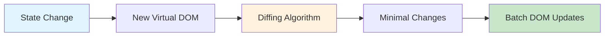
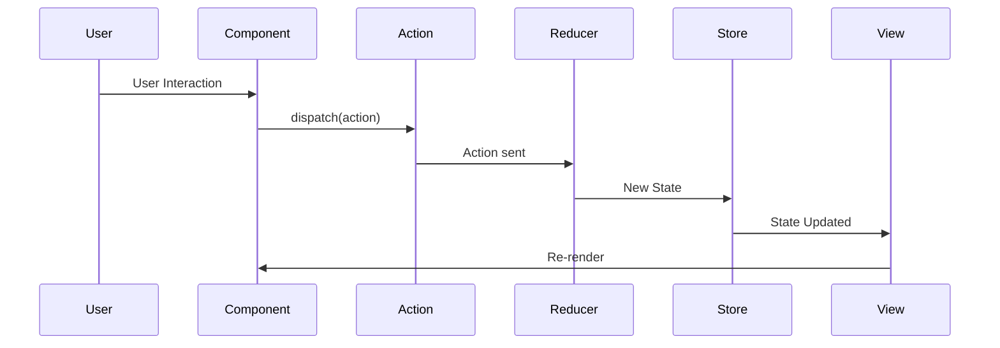
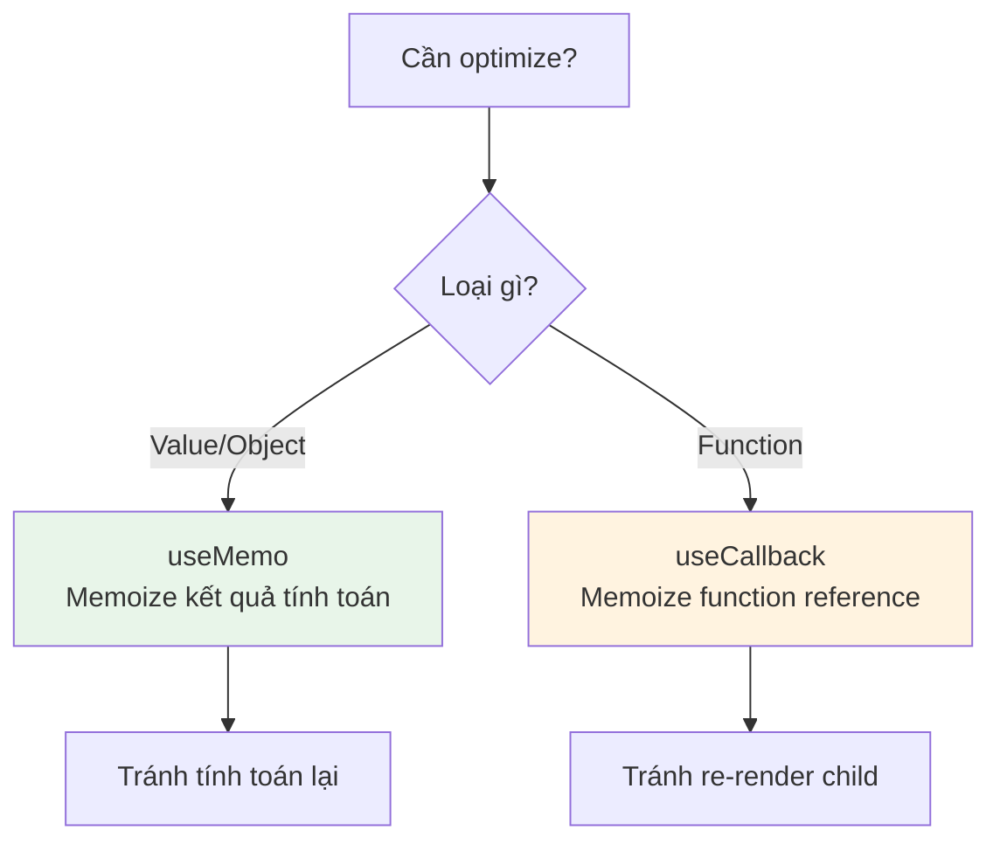
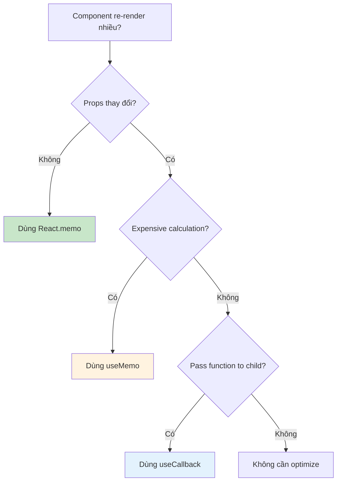
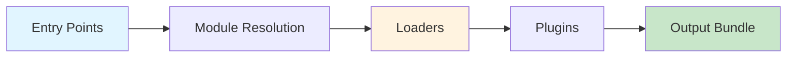
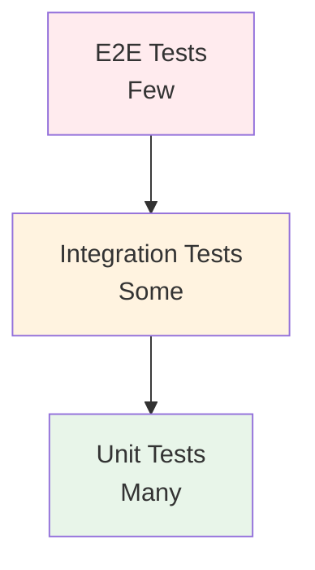
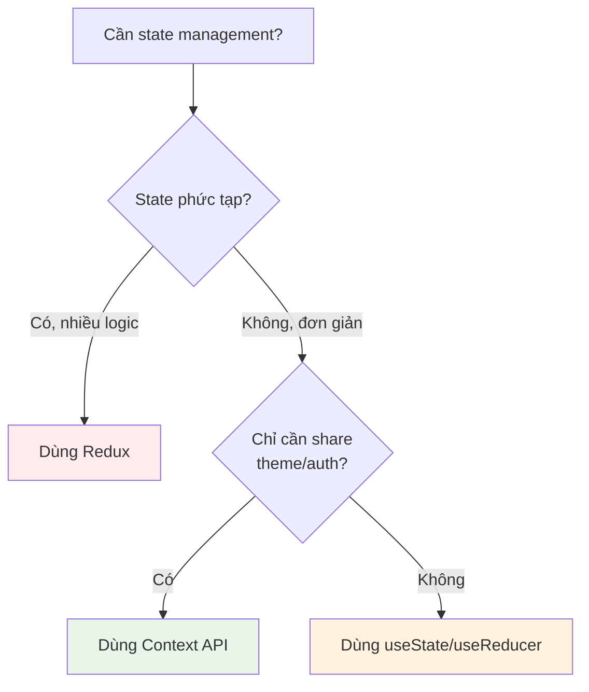

# Tóm Tắt Nhanh - Phỏng Vấn React Lead/Senior FPT

> **Tài liệu ôn tập nhanh cho phỏng vấn ngày mai**
> Tập trung vào các điểm quan trọng nhất từ JD

---

## 🎯 Các Điểm Quan Trọng Từ JD

### 1. ReactJS Core Principles ⭐⭐⭐
- **Virtual DOM & Reconciliation**
- **Component Lifecycle**
- **Props vs State**
- **React Fiber Architecture**

### 2. ReactJS Workflows (Flux/Redux) ⭐⭐⭐
- **Redux Architecture**
- **Redux Toolkit**
- **State Management Patterns**
- **Middleware & Async Actions**

### 3. ES6+ Specifications ⭐⭐
- **Arrow Functions, Destructuring**
- **Promises, Async/Await**
- **Modules (ES6)**
- **Classes, Inheritance**

### 4. Build Tools ⭐⭐
- **Webpack Configuration**
- **Babel Setup**
- **NPM Scripts**
- **Code Splitting**

### 5. Testing Tools ⭐
- **Jest, React Testing Library**
- **Unit Testing**
- **Integration Testing**

---

## 📚 Quick Reference - Câu Hỏi Thường Gặp

### Câu 1: Giải thích Virtual DOM và Reconciliation?

**Trả lời ngắn gọn:**
- Virtual DOM là JavaScript representation của Real DOM
- Reconciliation là quá trình so sánh 2 Virtual DOM trees để tìm minimal changes
- React sử dụng diffing algorithm để optimize updates

**Flow Diagram:**



**Chi tiết:**
1. Khi state thay đổi → React tạo Virtual DOM tree mới
2. So sánh với Virtual DOM tree cũ (diffing)
3. Tính toán minimal set of changes
4. Batch updates vào Real DOM (hiệu quả hơn)

---

### Câu 2: Redux Architecture và Flow?

**Trả lời ngắn gọn:**
- **Store**: Single source of truth
- **Actions**: Plain objects mô tả "what happened"
- **Reducers**: Pure functions xử lý actions
- **Unidirectional data flow**

**Redux Flow Diagram:**



**Code Example:**

```javascript
// 1. Action
const increment = () => ({
  type: 'INCREMENT'
});

// 2. Reducer
const counterReducer = (state = { count: 0 }, action) => {
  switch (action.type) {
    case 'INCREMENT':
      return { count: state.count + 1 };
    default:
      return state;
  }
};

// 3. Store
const store = createStore(counterReducer);

// 4. Component
function Counter() {
  const count = useSelector(state => state.count);
  const dispatch = useDispatch();
  
  return (
    <div>
      <p>{count}</p>
      <button onClick={() => dispatch(increment())}>
        Increment
      </button>
    </div>
  );
}
```

---

### Câu 3: React Hooks - useState, useEffect, useMemo, useCallback?

**useState:**
```javascript
const [state, setState] = useState(initialValue);
// Functional update: setState(prev => prev + 1)
```

**useEffect:**
```javascript
useEffect(() => {
  // Side effect
  return () => {
    // Cleanup
  };
}, [dependencies]);
```

**useMemo vs useCallback:**



**Khi nào dùng:**
- **useMemo**: Expensive calculations, object/array props cho memoized children
- **useCallback**: Callback props cho memoized children, dependencies của hooks khác

---

### Câu 4: Performance Optimization trong React?

**Các kỹ thuật:**

1. **React.memo** - Memoize component
2. **useMemo** - Memoize values
3. **useCallback** - Memoize functions
4. **Code Splitting** - Lazy loading
5. **Virtual Scrolling** - Render only visible items

**Decision Tree:**



---

### Câu 5: Webpack và Build Process?

**Webpack Flow:**



**Key Concepts:**
- **Entry**: Điểm bắt đầu
- **Output**: File bundle output
- **Loaders**: Transform files (Babel, CSS, etc.)
- **Plugins**: Optimize, minify, code splitting

**Code Splitting:**
```javascript
// Dynamic import
const LazyComponent = React.lazy(() => import('./LazyComponent'));

// Route-based splitting
const routes = [
  {
    path: '/dashboard',
    component: React.lazy(() => import('./Dashboard'))
  }
];
```

---

### Câu 6: Testing trong React?

**Testing Pyramid:**



**Jest + React Testing Library:**

```javascript
// Unit test
test('increments counter', () => {
  render(<Counter />);
  const button = screen.getByText('Increment');
  fireEvent.click(button);
  expect(screen.getByText('1')).toBeInTheDocument();
});

// Integration test
test('user login flow', async () => {
  render(<LoginForm />);
  // Fill form, submit, verify redirect
});
```

---

### Câu 7: ES6+ Features Quan Trọng?

**1. Arrow Functions:**
```javascript
const add = (a, b) => a + b;
```

**2. Destructuring:**
```javascript
const { name, age } = user;
const [first, second] = array;
```

**3. Spread Operator:**
```javascript
const newObj = { ...oldObj, newProp: 'value' };
const newArr = [...oldArr, newItem];
```

**4. Async/Await:**
```javascript
async function fetchData() {
  try {
    const response = await fetch('/api/data');
    const data = await response.json();
    return data;
  } catch (error) {
    console.error(error);
  }
}
```

**5. Modules:**
```javascript
// Export
export const function1 = () => {};
export default Component;

// Import
import Component, { function1 } from './module';
```

---

### Câu 8: State Management - Redux vs Context API?

**So sánh:**

| Feature | Redux | Context API |
|---------|-------|-------------|
| Use case | Global state, complex logic | Simple state, theme, auth |
| Performance | Optimized với selectors | Re-render all consumers |
| DevTools | Excellent | Limited |
| Middleware | Yes | No |
| Learning curve | Steep | Easy |

**Khi nào dùng gì:**



---

### Câu 9: React Fiber Architecture?

**Key Points:**
- **Interruptible rendering**: Có thể pause và resume
- **Priority scheduling**: Ưu tiên updates quan trọng
- **Time slicing**: Chia nhỏ work thành chunks
- **Concurrent features**: Suspense, transitions

**Fiber Node Structure:**
```javascript
{
  type: Component/Element,
  key: unique identifier,
  child: First child fiber,
  sibling: Next sibling,
  return: Parent fiber,
  alternate: Work-in-progress,
  effectTag: UPDATE | PLACEMENT | DELETION
}
```

---

### Câu 10: Code Review và Best Practices?

**Code Review Checklist:**
- ✅ Component reusability
- ✅ Performance optimization
- ✅ Error handling
- ✅ Accessibility
- ✅ Security (XSS, CSRF)
- ✅ Code organization
- ✅ Testing coverage

**Best Practices:**
1. **Component Design**: Single responsibility, small và focused
2. **State Management**: Lift state up khi cần
3. **Performance**: Memoize khi cần, không over-optimize
4. **Error Handling**: Error boundaries, try-catch
5. **Code Organization**: Feature-based structure

---

## 🎤 Tips Trả Lời Phỏng Vấn

### DO's ✅
1. **Giải thích thought process**: "Tôi sẽ làm như sau..."
2. **Đưa ra examples**: "Trong project trước, tôi đã..."
3. **Acknowledge trade-offs**: "Có ưu và nhược điểm..."
4. **Vẽ diagrams**: Giải thích bằng flow charts
5. **Ask questions**: "Bạn muốn tôi focus vào phần nào?"

### DON'Ts ❌
1. Không bluff nếu không biết
2. Không chỉ đọc documentation
3. Không skip edge cases
4. Không ignore performance
5. Không quên security

---

## 📖 Files Chi Tiết

Để đọc chi tiết hơn, xem các file:
- [React Fundamentals](../detailed-questions/interview-questions-react-lead/00-react-fundamentals.md)
- [React Core Hooks](../detailed-questions/interview-questions-react-lead/01-react-core-hooks.md)
- [State Management](../detailed-questions/interview-questions-react-lead/03-state-management.md)
- [Performance](../detailed-questions/interview-questions-react-lead/04-performance-optimization.md)
- [JavaScript Core](../detailed-questions/interview-questions-react-lead/11-javascript-core.md)

---

**Chúc bạn phỏng vấn thành công! 🚀**

