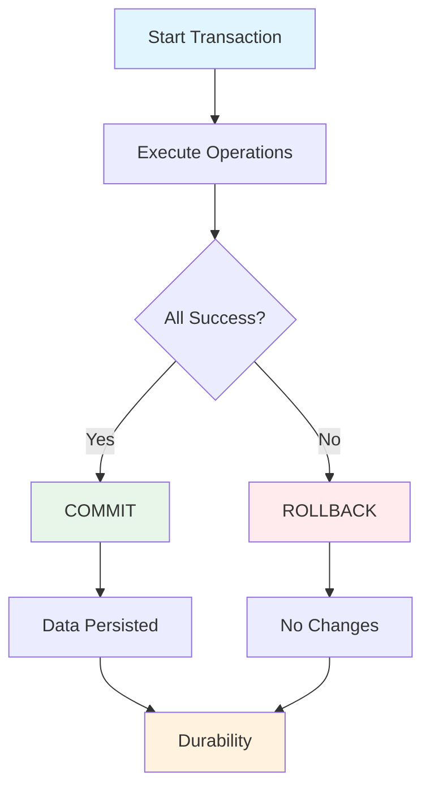
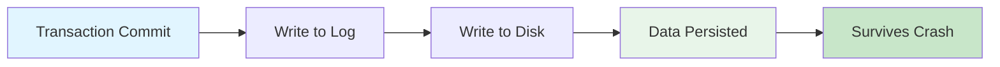
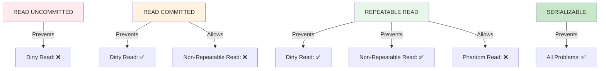
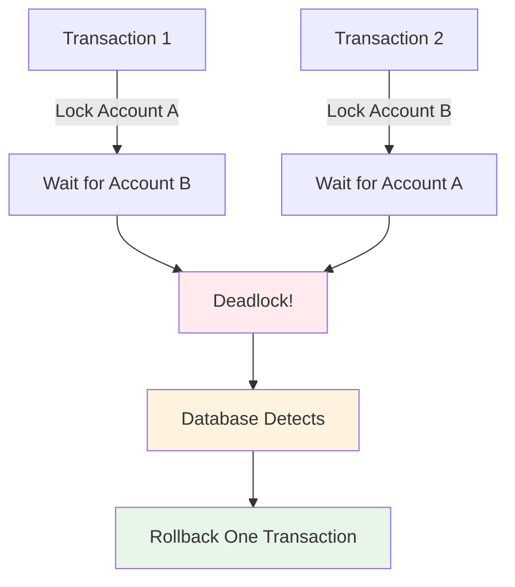
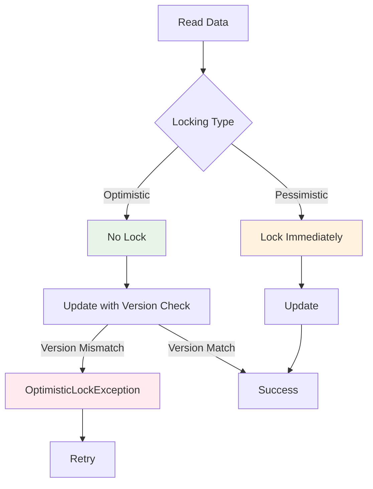

# ACID & Transactions - Interview Questions

## Mục lục

- [Phần 1: Cơ bản (Câu 1-10)](#phần-1-cơ-bản-câu-1-10)
- [Phần 2: Trung cấp (Câu 11-20)](#phần-2-trung-cấp-câu-11-20)
- [Phần 3: Nâng cao (Câu 21-30)](#phần-3-nâng-cao-câu-21-30)

---

# Phần 1: Cơ bản (Câu 1-10)

## Câu 1: ACID là gì? Giải thích từng thuộc tính và tại sao chúng quan trọng?

### Trả lời:

**ACID** là tập hợp 4 thuộc tính đảm bảo tính đáng tin cậy của transactions trong database.

### ACID Properties:

```
┌─────────────────────────────────────────────────────────────┐
│                    ACID PROPERTIES                          │
├─────────────────────────────────────────────────────────────┤
│                                                             │
│  A - Atomicity                                              │
│     Tất cả hoặc không có gì - All or Nothing               │
│                                                             │
│  C - Consistency                                           │
│     Database luôn ở trạng thái hợp lệ                      │
│                                                             │
│  I - Isolation                                             │
│     Transactions độc lập với nhau                          │
│                                                             │
│  D - Durability                                            │
│     Dữ liệu đã commit sẽ tồn tại vĩnh viễn                 │
│                                                             │
└─────────────────────────────────────────────────────────────┘
```

### Flow Diagram - ACID Transaction:



### 1. Atomicity (Tính nguyên tử):

**Định nghĩa**: Transaction phải được thực hiện hoàn toàn hoặc không thực hiện gì cả.

**Ví dụ**:

```java
// ✅ Atomicity đảm bảo
@Transactional
public void transferMoney(Long fromAccountId, Long toAccountId, double amount) {
    // Tất cả các operations này phải thành công hoặc tất cả rollback

    // 1. Trừ tiền từ account A
    accountRepository.debit(fromAccountId, amount);

    // 2. Cộng tiền vào account B
    accountRepository.credit(toAccountId, amount);

    // 3. Ghi log transaction
    transactionRepository.save(new Transaction(fromAccountId, toAccountId, amount));

    // Nếu bất kỳ operation nào fail → tất cả rollback
}
```

**Flow khi có lỗi**:

```
┌─────────────────────────────────────────────────────────────┐
│              Atomicity - All or Nothing                      │
├─────────────────────────────────────────────────────────────┤
│                                                             │
│  Step 1: Debit Account A        ✅ Success                 │
│  Step 2: Credit Account B        ✅ Success                 │
│  Step 3: Save Transaction        ❌ FAIL                    │
│                                                             │
│  Result: ALL operations ROLLBACK                            │
│  Account A: Không bị trừ tiền                               │
│  Account B: Không được cộng tiền                            │
│                                                             │
└─────────────────────────────────────────────────────────────┘
```

### 2. Consistency (Tính nhất quán):

**Định nghĩa**: Database phải luôn ở trạng thái hợp lệ, tuân thủ các ràng buộc (constraints).

**Ví dụ**:

```java
// ✅ Consistency đảm bảo
@Transactional
public void createOrder(Order order) {
    // Ràng buộc: Total phải bằng sum của items
    double calculatedTotal = order.getItems().stream()
        .mapToDouble(item -> item.getPrice() * item.getQuantity())
        .sum();

    if (Math.abs(order.getTotal() - calculatedTotal) > 0.01) {
        throw new ConsistencyException("Order total mismatch");
    }

    // Ràng buộc: Customer phải tồn tại
    if (!customerRepository.exists(order.getCustomerId())) {
        throw new ConsistencyException("Customer not found");
    }

    orderRepository.save(order);
}
```

**Consistency Rules**:

```sql
-- Database constraints đảm bảo consistency
CREATE TABLE orders (
    id BIGINT PRIMARY KEY,
    customer_id BIGINT NOT NULL,
    total DECIMAL(10,2) NOT NULL CHECK (total > 0),
    FOREIGN KEY (customer_id) REFERENCES customers(id)
);

-- Consistency: Foreign key constraint
-- Không thể tạo order với customer_id không tồn tại
```

### 3. Isolation (Tính cô lập):

**Định nghĩa**: Các transactions đồng thời không ảnh hưởng lẫn nhau.

**Ví dụ - Isolation Levels**:

```java
// ✅ Isolation đảm bảo
@Transactional(isolation = Isolation.READ_COMMITTED)
public void updateBalance(Long accountId, double amount) {
    // Transaction này không thấy uncommitted changes của transaction khác
    Account account = accountRepository.findById(accountId);
    account.setBalance(account.getBalance() + amount);
    accountRepository.save(account);
}
```

**Isolation Problems**:

```
┌─────────────────────────────────────────────────────────────┐
│              Isolation Problems                            │
├─────────────────────────────────────────────────────────────┤
│                                                             │
│  1. Dirty Read:                                             │
│     Đọc dữ liệu chưa commit                                │
│                                                             │
│  2. Non-Repeatable Read:                                     │
│     Đọc lại cùng một row có giá trị khác                   │
│                                                             │
│  3. Phantom Read:                                            │
│     Đọc lại có thêm rows mới                                │
│                                                             │
│  4. Lost Update:                                             │
│     Ghi đè lên update của transaction khác                  │
│                                                             │
└─────────────────────────────────────────────────────────────┘
```

### 4. Durability (Tính bền vững):

**Định nghĩa**: Dữ liệu đã commit sẽ tồn tại vĩnh viễn, ngay cả khi hệ thống crash.

**Ví dụ**:

```java
// ✅ Durability đảm bảo
@Transactional
public void saveOrder(Order order) {
    orderRepository.save(order);
    // Sau khi commit, dữ liệu được ghi vào disk
    // Ngay cả khi server crash, dữ liệu vẫn tồn tại
}
```

**Durability Mechanism**:



---

## Câu 2: Transaction Isolation Levels là gì? Giải thích từng level và khi nào dùng?

### Trả lời:

**Isolation Levels** xác định mức độ cô lập giữa các transactions đồng thời. Có 4 levels từ thấp đến cao.

### Isolation Levels:

```
┌─────────────────────────────────────────────────────────────┐
│              ISOLATION LEVELS (Từ thấp đến cao)             │
├─────────────────────────────────────────────────────────────┤
│                                                             │
│  1. READ UNCOMMITTED (Thấp nhất)                            │
│     - Cho phép Dirty Read                                   │
│     - Performance cao nhất                                  │
│                                                             │
│  2. READ COMMITTED                                         │
│     - Ngăn Dirty Read                                       │
│     - Vẫn có Non-Repeatable Read                           │
│     - Default của hầu hết databases                        │
│                                                             │
│  3. REPEATABLE READ                                         │
│     - Ngăn Dirty Read và Non-Repeatable Read               │
│     - Vẫn có Phantom Read                                  │
│     - MySQL InnoDB default                                 │
│                                                             │
│  4. SERIALIZABLE (Cao nhất)                                 │
│     - Ngăn tất cả problems                                 │
│     - Performance thấp nhất                                 │
│                                                             │
└─────────────────────────────────────────────────────────────┘
```

### Flow Diagram - Isolation Levels:



### 1. READ UNCOMMITTED:

**Đặc điểm**: Cho phép đọc dữ liệu chưa commit (Dirty Read).

**Ví dụ**:

```java
// Transaction 1
@Transactional(isolation = Isolation.READ_UNCOMMITTED)
public void transaction1() {
    // Update nhưng chưa commit
    accountRepository.updateBalance(1L, 1000);
    // Chưa commit...
}

// Transaction 2 - Có thể đọc được uncommitted data
@Transactional(isolation = Isolation.READ_UNCOMMITTED)
public void transaction2() {
    // Đọc được balance = 1000 mặc dù transaction1 chưa commit
    Account account = accountRepository.findById(1L);
    // Nếu transaction1 rollback → dữ liệu sai!
}
```

**Khi nào dùng**: Hiếm khi dùng, chỉ khi performance cực kỳ quan trọng và không quan tâm data accuracy.

### 2. READ COMMITTED:

**Đặc điểm**: Chỉ đọc dữ liệu đã commit, ngăn Dirty Read.

**Ví dụ**:

```java
// ✅ READ COMMITTED - Default của PostgreSQL, Oracle
@Transactional(isolation = Isolation.READ_COMMITTED)
public void updateAccount(Long accountId) {
    // Chỉ đọc committed data
    Account account = accountRepository.findById(accountId);
    account.setBalance(account.getBalance() + 100);
    accountRepository.save(account);
}
```

**Vấn đề - Non-Repeatable Read**:

```java
// Transaction 1
@Transactional(isolation = Isolation.READ_COMMITTED)
public void transaction1() {
    Account account = accountRepository.findById(1L); // Read: balance = 1000
    // ... do something ...
    Account account2 = accountRepository.findById(1L); // Read again: balance = 1500
    // ❌ Non-Repeatable Read: Cùng một row nhưng giá trị khác
}

// Transaction 2 (concurrent)
@Transactional
public void transaction2() {
    // Update balance giữa 2 reads của transaction1
    accountRepository.updateBalance(1L, 1500);
    // Commit
}
```

**Khi nào dùng**: Default cho hầu hết applications, cân bằng giữa consistency và performance.

### 3. REPEATABLE READ:

**Đặc điểm**: Đảm bảo đọc lại cùng một row có cùng giá trị, ngăn Non-Repeatable Read.

**Ví dụ**:

```java
// ✅ REPEATABLE READ - Default của MySQL InnoDB
@Transactional(isolation = Isolation.REPEATABLE_READ)
public void processOrder(Long orderId) {
    Order order = orderRepository.findById(orderId); // Read: total = 1000
    // ... do something ...
    Order order2 = orderRepository.findById(orderId); // Read again: total = 1000 (same)
    // ✅ Repeatable: Cùng giá trị
}
```

**Vấn đề - Phantom Read**:

```java
// Transaction 1
@Transactional(isolation = Isolation.REPEATABLE_READ)
public void transaction1() {
    List<Order> orders = orderRepository.findByCustomerId(1L); // 5 orders
    // ... do something ...
    List<Order> orders2 = orderRepository.findByCustomerId(1L); // 6 orders
    // ❌ Phantom Read: Có thêm rows mới
}

// Transaction 2 (concurrent)
@Transactional
public void transaction2() {
    // Insert order mới
    orderRepository.save(new Order(1L, ...));
    // Commit
}
```

**Khi nào dùng**: Khi cần đảm bảo đọc lại cùng giá trị, nhưng vẫn chấp nhận phantom reads.

### 4. SERIALIZABLE:

**Đặc điểm**: Đảm bảo transactions chạy tuần tự, ngăn tất cả problems.

**Ví dụ**:

```java
// ✅ SERIALIZABLE - Highest isolation
@Transactional(isolation = Isolation.SERIALIZABLE)
public void criticalOperation(Long accountId) {
    // Transactions chạy tuần tự, không có concurrency issues
    Account account = accountRepository.findById(accountId);
    // Process...
}
```

**Trade-off**: Performance thấp vì phải lock nhiều.

**Khi nào dùng**: Khi data accuracy cực kỳ quan trọng, chấp nhận performance thấp.

### So sánh Isolation Levels:

| Level            | Dirty Read | Non-Repeatable Read | Phantom Read | Performance |
| ---------------- | ---------- | ------------------- | ------------ | ----------- |
| READ UNCOMMITTED | ❌         | ❌                  | ❌           | ⭐⭐⭐⭐⭐  |
| READ COMMITTED   | ✅         | ❌                  | ❌           | ⭐⭐⭐⭐    |
| REPEATABLE READ  | ✅         | ✅                  | ❌           | ⭐⭐⭐      |
| SERIALIZABLE     | ✅         | ✅                  | ✅           | ⭐⭐        |

---

## Câu 3: Deadlock là gì? Làm thế nào phát hiện và giải quyết?

### Trả lời:

**Deadlock** xảy ra khi 2+ transactions chờ nhau giải phóng locks, dẫn đến cả hai đều không thể tiếp tục.

### Flow Diagram - Deadlock:



### Ví dụ Deadlock:

```java
// ❌ Deadlock Scenario

// Transaction 1
@Transactional
public void transfer1() {
    // Lock Account 1
    Account account1 = accountRepository.findById(1L);
    account1.setBalance(account1.getBalance() - 100);
    accountRepository.save(account1);

    // Wait for Account 2 (locked by Transaction 2)
    Account account2 = accountRepository.findById(2L); // ⏳ Waiting...
    account2.setBalance(account2.getBalance() + 100);
    accountRepository.save(account2);
}

// Transaction 2 (concurrent)
@Transactional
public void transfer2() {
    // Lock Account 2
    Account account2 = accountRepository.findById(2L);
    account2.setBalance(account2.getBalance() - 200);
    accountRepository.save(account2);

    // Wait for Account 1 (locked by Transaction 1)
    Account account1 = accountRepository.findById(1L); // ⏳ Waiting...
    account1.setBalance(account1.getBalance() + 200);
    accountRepository.save(account1);
}

// Result: DEADLOCK!
// Transaction 1 chờ Transaction 2
// Transaction 2 chờ Transaction 1
// → Cả hai đều không thể tiếp tục
```

### Deadlock Detection:

```java
// ✅ Database tự động detect deadlock
// MySQL: InnoDB detect và rollback một transaction
// PostgreSQL: detect và rollback transaction có lock ít hơn

// Log deadlock
@Transactional
public void transferMoney(Long fromId, Long toId, double amount) {
    try {
        // Lock accounts theo thứ tự để tránh deadlock
        Long firstId = Math.min(fromId, toId);
        Long secondId = Math.max(fromId, toId);

        Account account1 = accountRepository.findById(firstId);
        Account account2 = accountRepository.findById(secondId);

        account1.debit(amount);
        account2.credit(amount);

        accountRepository.save(account1);
        accountRepository.save(account2);
    } catch (DeadlockLoserDataAccessException e) {
        // Retry logic
        log.warn("Deadlock detected, retrying...", e);
        transferMoney(fromId, toId, amount); // Retry
    }
}
```

### Giải pháp tránh Deadlock:

#### 1. **Lock Ordering** (Quan trọng nhất):

```java
// ✅ Luôn lock theo cùng một thứ tự
public void transfer(Long fromId, Long toId, double amount) {
    // Luôn lock account có ID nhỏ hơn trước
    Long firstId = Math.min(fromId, toId);
    Long secondId = Math.max(fromId, toId);

    // Lock theo thứ tự
    Account account1 = accountRepository.findByIdForUpdate(firstId);
    Account account2 = accountRepository.findByIdForUpdate(secondId);

    // Process...
}
```

#### 2. **Timeout**:

```java
// ✅ Set timeout cho transaction
@Transactional(timeout = 5) // 5 seconds
public void longRunningOperation() {
    // Nếu quá 5s → rollback
}
```

#### 3. **Retry Logic**:

```java
// ✅ Retry khi deadlock
@Retryable(value = DeadlockLoserDataAccessException.class, maxAttempts = 3)
@Transactional
public void transferWithRetry(Long fromId, Long toId, double amount) {
    transferMoney(fromId, toId, amount);
}
```

#### 4. **Pessimistic Locking**:

```java
// ✅ Sử dụng pessimistic lock
@Lock(LockModeType.PESSIMISTIC_WRITE)
@Query("SELECT a FROM Account a WHERE a.id = :id")
Account findByIdForUpdate(@Param("id") Long id);
```

---

## Câu 4: Optimistic Locking vs Pessimistic Locking? Khi nào dùng mỗi loại?

### Trả lời:

**Optimistic Locking** và **Pessimistic Locking** là hai cách quản lý concurrent access khác nhau.

### So sánh:

```
┌─────────────────────────────────────────────────────────────┐
│        Optimistic vs Pessimistic Locking                     │
├─────────────────────────────────────────────────────────────┤
│                                                             │
│  Optimistic Locking:                                         │
│  - Giả định conflicts hiếm                                  │
│  - Không lock khi đọc                                        │
│  - Check version khi update                                  │
│  - Performance cao                                           │
│  - Phù hợp: Read-heavy, ít conflicts                         │
│                                                             │
│  Pessimistic Locking:                                        │
│  - Giả định conflicts thường xuyên                           │
│  - Lock ngay khi đọc                                         │
│  - Block concurrent access                                  │
│  - Performance thấp hơn                                     │
│  - Phù hợp: Write-heavy, nhiều conflicts                    │
│                                                             │
└─────────────────────────────────────────────────────────────┘
```

### Flow Diagram:



### 1. Optimistic Locking:

**Cơ chế**: Sử dụng version field để detect conflicts.

**Ví dụ**:

```java
// ✅ Entity với version field
@Entity
public class Account {
    @Id
    private Long id;

    private double balance;

    @Version // Optimistic locking
    private Long version;

    // Getters, setters
}

// ✅ Update với version check
@Transactional
public void updateBalance(Long accountId, double amount) {
    Account account = accountRepository.findById(accountId);
    // Version = 1

    // ... do something ...

    account.setBalance(account.getBalance() + amount);
    accountRepository.save(account);
    // JPA check: version phải = 1
    // Nếu version khác → OptimisticLockException
}

// Concurrent update
@Transactional
public void concurrentUpdate(Long accountId) {
    Account account = accountRepository.findById(accountId); // Version = 1
    account.setBalance(account.getBalance() - 100);
    accountRepository.save(account); // Version = 2

    // Transaction đầu tiên sẽ fail khi save
    // vì version đã thay đổi từ 1 → 2
}
```

**Xử lý OptimisticLockException**:

```java
@Transactional
public void updateWithRetry(Long accountId, double amount) {
    int maxRetries = 3;
    int retry = 0;

    while (retry < maxRetries) {
        try {
            Account account = accountRepository.findById(accountId);
            account.setBalance(account.getBalance() + amount);
            accountRepository.save(account);
            return; // Success
        } catch (OptimisticLockException e) {
            retry++;
            if (retry >= maxRetries) {
                throw new UpdateFailedException("Max retries exceeded");
            }
            // Retry với data mới
        }
    }
}
```

**Khi nào dùng**:

- Read-heavy applications
- Ít conflicts
- Cần performance cao
- Có thể retry khi conflict

### 2. Pessimistic Locking:

**Cơ chế**: Lock ngay khi đọc, block concurrent access.

**Ví dụ**:

```java
// ✅ Pessimistic Locking
@Lock(LockModeType.PESSIMISTIC_WRITE)
@Query("SELECT a FROM Account a WHERE a.id = :id")
Account findByIdForUpdate(@Param("id") Long id);

// Usage
@Transactional
public void updateBalance(Long accountId, double amount) {
    // Lock ngay khi đọc
    Account account = accountRepository.findByIdForUpdate(accountId);
    // Other transactions phải chờ

    account.setBalance(account.getBalance() + amount);
    accountRepository.save(account);
    // Lock released khi commit
}

// Concurrent transaction sẽ bị block
@Transactional
public void concurrentUpdate(Long accountId) {
    // ⏳ Waiting for lock...
    Account account = accountRepository.findByIdForUpdate(accountId);
    // Chỉ được execute sau khi transaction trên commit
}
```

**Lock Modes**:

```java
// PESSIMISTIC_READ: Shared lock, nhiều transactions có thể đọc
@Lock(LockModeType.PESSIMISTIC_READ)
Account findByIdForRead(Long id);

// PESSIMISTIC_WRITE: Exclusive lock, chỉ một transaction
@Lock(LockModeType.PESSIMISTIC_WRITE)
Account findByIdForUpdate(Long id);
```

**Khi nào dùng**:

- Write-heavy applications
- Nhiều conflicts
- Cần đảm bảo data consistency tuyệt đối
- Chấp nhận performance thấp hơn

### So sánh Performance:

```java
// Optimistic: Không block
// Time: Read(10ms) + Process(50ms) + Update(10ms) = 70ms
// Concurrent: Cả 2 transactions chạy song song

// Pessimistic: Block
// Transaction 1: Read(10ms) + Lock + Process(50ms) + Update(10ms) = 70ms
// Transaction 2: Wait(70ms) + Read(10ms) + Process(50ms) + Update(10ms) = 140ms
// Total: 210ms (chậm hơn)
```

---

_[Tiếp tục với các câu hỏi còn lại...]_
