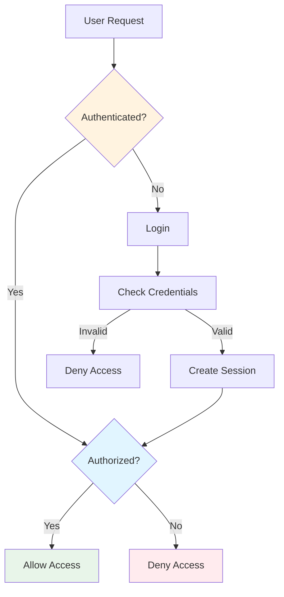

# Spring Security - Interview Questions

## Mục lục
- [Phần 1: Cơ bản (Câu 1-10)](#phần-1-cơ-bản-câu-1-10)
- [Phần 2: Trung cấp (Câu 11-20)](#phần-2-trung-cấp-câu-11-20)
- [Phần 3: Nâng cao (Câu 21-30)](#phần-3-nâng-cao-câu-21-30)

---

# Phần 1: Cơ bản (Câu 1-10)

## Câu 1: Spring Security là gì? Tại sao cần Spring Security?

### Trả lời:

**Spring Security** là framework bảo mật cho Spring applications, cung cấp authentication và authorization.

### Spring Security Features:

```
┌─────────────────────────────────────────────────────────────┐
│              SPRING SECURITY FEATURES                       │
├─────────────────────────────────────────────────────────────┤
│                                                             │
│  - Authentication (Xác thực)                                │
│    + Username/Password                                      │
│    + OAuth2                                                 │
│    + JWT                                                    │
│                                                             │
│  - Authorization (Phân quyền)                               │
│    + Role-based access control                             │
│    + Method-level security                                  │
│                                                             │
│  - Protection against attacks                               │
│    + CSRF protection                                        │
│    + XSS protection                                         │
│    + SQL Injection protection                               │
│                                                             │
└─────────────────────────────────────────────────────────────┘
```

### Basic Configuration:

```java
// ✅ Spring Security Configuration
@Configuration
@EnableWebSecurity
public class SecurityConfig {
    
    @Bean
    public SecurityFilterChain filterChain(HttpSecurity http) throws Exception {
        http
            .authorizeHttpRequests(auth -> auth
                .requestMatchers("/public/**").permitAll()
                .requestMatchers("/admin/**").hasRole("ADMIN")
                .anyRequest().authenticated()
            )
            .formLogin(form -> form
                .loginPage("/login")
                .permitAll()
            )
            .logout(logout -> logout
                .logoutSuccessUrl("/login?logout")
                .permitAll()
            );
        
        return http.build();
    }
    
    @Bean
    public PasswordEncoder passwordEncoder() {
        return new BCryptPasswordEncoder();
    }
}
```

---

## Câu 2: Authentication vs Authorization? Giải thích và ví dụ.

### Trả lời:

**Authentication** là xác định ai đó là ai, **Authorization** là xác định ai đó được phép làm gì.

### Flow Diagram:



### Authentication:

```java
// ✅ Authentication - Who are you?
@Service
public class UserDetailsService implements org.springframework.security.core.userdetails.UserDetailsService {
    
    @Autowired
    private UserRepository userRepository;
    
    @Override
    public UserDetails loadUserByUsername(String username) throws UsernameNotFoundException {
        User user = userRepository.findByUsername(username)
            .orElseThrow(() -> new UsernameNotFoundException("User not found"));
        
        return org.springframework.security.core.userdetails.User.builder()
            .username(user.getUsername())
            .password(user.getPassword())
            .roles(user.getRole())
            .build();
    }
}
```

### Authorization:

```java
// ✅ Authorization - What can you do?
@Configuration
@EnableMethodSecurity
public class SecurityConfig {
    
    @Bean
    public SecurityFilterChain filterChain(HttpSecurity http) throws Exception {
        http
            .authorizeHttpRequests(auth -> auth
                .requestMatchers("/admin/**").hasRole("ADMIN") // Authorization
                .requestMatchers("/user/**").hasAnyRole("USER", "ADMIN")
                .anyRequest().authenticated()
            );
        return http.build();
    }
}

// Method-level authorization
@PreAuthorize("hasRole('ADMIN')")
public void deleteUser(Long id) {
    // Chỉ ADMIN mới được gọi method này
}
```

---

## Câu 3: Password Encoding? BCrypt, PasswordEncoder?

### Trả lời:

**Password Encoding** là cách mã hóa password để lưu trữ an toàn.

### BCrypt:

```java
// ✅ BCrypt Password Encoder
@Configuration
public class SecurityConfig {
    
    @Bean
    public PasswordEncoder passwordEncoder() {
        return new BCryptPasswordEncoder(12); // Strength = 12
    }
}

// Usage
@Service
public class UserService {
    
    @Autowired
    private PasswordEncoder passwordEncoder;
    
    public void createUser(String username, String rawPassword) {
        // Encode password
        String encodedPassword = passwordEncoder.encode(rawPassword);
        
        User user = new User();
        user.setUsername(username);
        user.setPassword(encodedPassword); // Store encoded password
        
        userRepository.save(user);
    }
    
    public boolean authenticate(String username, String rawPassword) {
        User user = userRepository.findByUsername(username)
            .orElseThrow();
        
        // Verify password
        return passwordEncoder.matches(rawPassword, user.getPassword());
    }
}
```

### Password Encoding Flow:

```
┌─────────────────────────────────────────────────────────────┐
│              Password Encoding Flow                          │
├─────────────────────────────────────────────────────────────┤
│                                                             │
│  1. User Registration:                                       │
│     Raw Password: "mypassword123"                            │
│     ↓ BCrypt.encode()                                       │
│     Encoded: "$2a$12$LQv3c1yqBWVHxkd0LHAkCOYz6TtxMQJqhN8/LewY5..."│
│     ↓ Store in Database                                     │
│                                                             │
│  2. User Login:                                             │
│     Input: "mypassword123"                                  │
│     ↓ BCrypt.matches()                                      │
│     Compare with stored hash                                │
│     ↓                                                       │
│     Result: true/false                                      │
│                                                             │
└─────────────────────────────────────────────────────────────┘
```

---

## Câu 4: JWT (JSON Web Token) là gì? Cách implement với Spring Security?

### Trả lời:

**JWT** là token-based authentication, stateless và scalable.

### JWT Structure:

```
┌─────────────────────────────────────────────────────────────┐
│              JWT Structure                                  │
├─────────────────────────────────────────────────────────────┤
│                                                             │
│  Header.Payload.Signature                                   │
│                                                             │
│  Header:                                                    │
│  {                                                          │
│    "alg": "HS256",                                          │
│    "typ": "JWT"                                             │
│  }                                                          │
│                                                             │
│  Payload:                                                   │
│  {                                                          │
│    "sub": "1234567890",                                     │
│    "name": "John Doe",                                      │
│    "iat": 1516239022                                        │
│  }                                                          │
│                                                             │
│  Signature:                                                 │
│  HMACSHA256(                                                │
│    base64UrlEncode(header) + "." +                         │
│    base64UrlEncode(payload),                               │
│    secret                                                   │
│  )                                                          │
│                                                             │
└─────────────────────────────────────────────────────────────┘
```

### JWT Implementation:

```java
// ✅ JWT Service
@Service
public class JwtService {
    
    private String secret = "mySecretKey";
    private long expiration = 86400000; // 24 hours
    
    public String generateToken(UserDetails userDetails) {
        Map<String, Object> claims = new HashMap<>();
        claims.put("sub", userDetails.getUsername());
        claims.put("roles", userDetails.getAuthorities());
        
        return Jwts.builder()
            .setClaims(claims)
            .setSubject(userDetails.getUsername())
            .setIssuedAt(new Date())
            .setExpiration(new Date(System.currentTimeMillis() + expiration))
            .signWith(SignatureAlgorithm.HS256, secret)
            .compact();
    }
    
    public String getUsernameFromToken(String token) {
        return Jwts.parser()
            .setSigningKey(secret)
            .parseClaimsJws(token)
            .getBody()
            .getSubject();
    }
    
    public boolean validateToken(String token, UserDetails userDetails) {
        String username = getUsernameFromToken(token);
        return username.equals(userDetails.getUsername()) && !isTokenExpired(token);
    }
    
    private boolean isTokenExpired(String token) {
        Date expiration = Jwts.parser()
            .setSigningKey(secret)
            .parseClaimsJws(token)
            .getBody()
            .getExpiration();
        return expiration.before(new Date());
    }
}

// ✅ JWT Filter
public class JwtAuthenticationFilter extends OncePerRequestFilter {
    
    @Autowired
    private JwtService jwtService;
    
    @Autowired
    private UserDetailsService userDetailsService;
    
    @Override
    protected void doFilterInternal(HttpServletRequest request,
                                   HttpServletResponse response,
                                   FilterChain filterChain) throws ServletException, IOException {
        String token = extractToken(request);
        
        if (token != null && jwtService.validateToken(token)) {
            String username = jwtService.getUsernameFromToken(token);
            UserDetails userDetails = userDetailsService.loadUserByUsername(username);
            
            UsernamePasswordAuthenticationToken authentication =
                new UsernamePasswordAuthenticationToken(userDetails, null, userDetails.getAuthorities());
            
            SecurityContextHolder.getContext().setAuthentication(authentication);
        }
        
        filterChain.doFilter(request, response);
    }
    
    private String extractToken(HttpServletRequest request) {
        String bearerToken = request.getHeader("Authorization");
        if (bearerToken != null && bearerToken.startsWith("Bearer ")) {
            return bearerToken.substring(7);
        }
        return null;
    }
}
```

---

## Câu 5: CSRF Protection trong Spring Security?

### Trả lời:

**CSRF (Cross-Site Request Forgery)** là attack khiến user thực hiện actions không mong muốn.

### CSRF Protection:

```java
// ✅ CSRF Protection (Enabled by default)
@Configuration
@EnableWebSecurity
public class SecurityConfig {
    
    @Bean
    public SecurityFilterChain filterChain(HttpSecurity http) throws Exception {
        http
            .csrf(csrf -> csrf
                .csrfTokenRepository(CookieCsrfTokenRepository.withHttpOnlyFalse())
                // Disable cho stateless APIs
                // .csrf(csrf -> csrf.disable())
            );
        return http.build();
    }
}

// ✅ JWT-based APIs thường disable CSRF
@Configuration
@EnableWebSecurity
public class SecurityConfig {
    
    @Bean
    public SecurityFilterChain filterChain(HttpSecurity http) throws Exception {
        http
            .csrf(csrf -> csrf.disable()) // Disable cho REST APIs
            .sessionManagement(session -> session
                .sessionCreationPolicy(SessionCreationPolicy.STATELESS) // Stateless
            );
        return http.build();
    }
}
```

---

*[File này sẽ tiếp tục với các câu hỏi còn lại về Spring Security...]*

