# Interview Questions - Lead Senior React Developer (FPT)

## 📋 Mục lục

1. [React Core & Advanced Concepts](#1-react-core--advanced-concepts)
2. [Architecture & Design Patterns](#2-architecture--design-patterns)
3. [Performance Optimization](#3-performance-optimization)
4. [State Management](#4-state-management)
5. [Testing & Quality Assurance](#5-testing--quality-assurance)
6. [Team Leadership & Code Review](#6-team-leadership--code-review)
7. [Technical Decision Making](#7-technical-decision-making)
8. [DevOps & CI/CD](#8-devops--cicd)
9. [Security & Best Practices](#9-security--best-practices)
10. [System Design & Scalability](#10-system-design--scalability)

---

## 1. React Core & Advanced Concepts

### Q1.1: Giải thích React Fiber Architecture và cách nó cải thiện performance?

**Câu trả lời:**

React Fiber là một reimplementation của React's reconciliation algorithm, được thiết kế để hỗ trợ incremental rendering và priority scheduling.

#### Kiến trúc cũ (Stack Reconciler):

```
┌─────────────────────────────────┐
│   Render Phase (Synchronous)    │
│   - Traverse tree               │
│   - Calculate changes            │
│   - Blocking                     │
└─────────────────────────────────┘
         ↓
┌─────────────────────────────────┐
│   Commit Phase                  │
│   - Apply changes to DOM         │
└─────────────────────────────────┘
```

**Vấn đề:**

- Blocking: Một lần render phải hoàn thành trước khi browser có thể xử lý user input
- Không thể pause/resume
- Không có priority

#### Kiến trúc mới (Fiber):

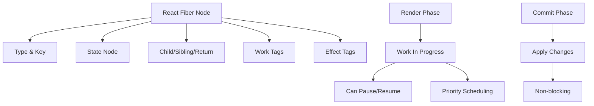

**Đặc điểm chính:**

1. **Fiber Node Structure:**

```javascript
// Simplified Fiber Node
{
  type: 'div' | Component | null,
  key: 'unique-key',
  child: Fiber | null,      // First child
  sibling: Fiber | null,    // Next sibling
  return: Fiber | null,     // Parent
  alternate: Fiber | null,  // Previous version
  effectTag: 'PLACEMENT' | 'UPDATE' | 'DELETION',
  updateQueue: UpdateQueue,
  memoizedState: any,
  memoizedProps: any
}
```

2. **Incremental Rendering:**

```javascript
// Fiber có thể pause và resume
function workLoop(deadline) {
  while (nextUnitOfWork && deadline.timeRemaining() > 1) {
    nextUnitOfWork = performUnitOfWork(nextUnitOfWork);
  }

  if (nextUnitOfWork) {
    // Còn work, schedule tiếp
    requestIdleCallback(workLoop);
  } else {
    // Hoàn thành, commit
    commitRoot();
  }
}
```

3. **Priority Scheduling:**

```javascript
// Priority levels
const ImmediatePriority = 1; // User input
const UserBlockingPriority = 2; // Hover, click
const NormalPriority = 3; // Default
const LowPriority = 4; // Data fetching
const IdlePriority = 5; // Background work
```

**Lợi ích:**

- ✅ Non-blocking rendering
- ✅ Priority-based updates
- ✅ Time slicing (chia nhỏ work)
- ✅ Concurrent features (Suspense, Concurrent Mode)
- ✅ Better UX với large lists

**Ví dụ thực tế:**

```javascript
// Với Fiber, React có thể interrupt low-priority work
// để xử lý high-priority user input

// User typing → High priority
// Rendering large list → Low priority
// React sẽ pause list rendering để handle input
```

---

### Q1.2: Giải thích chi tiết React's Reconciliation Algorithm?

**Câu trả lời:**

Reconciliation là quá trình React so sánh Virtual DOM tree cũ và mới để xác định changes cần apply.

#### Quy trình Reconciliation:

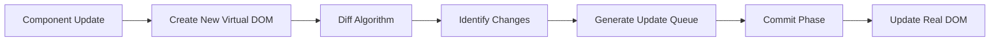

#### Diffing Algorithm Rules:

1. **Elements of Different Types:**

```javascript
// OLD
<div>
  <Counter />
</div>

// NEW
<span>
  <Counter />
</span>

// React sẽ:
// 1. Destroy old tree (div + Counter)
// 2. Build new tree (span + Counter)
// 3. Counter component unmounts và remounts
```

2. **DOM Elements of Same Type:**

```javascript
// OLD
<div className="old" title="old title">
  <h1>Hello</h1>
</div>

// NEW
<div className="new" title="new title">
  <h1>Hello</h1>
</div>

// React sẽ:
// 1. Keep same DOM node
// 2. Update only changed attributes
// 3. className: "old" → "new"
// 4. title: "old title" → "new title"
// 5. Children được diff recursively
```

3. **Component Elements of Same Type:**

```javascript
// OLD
<Welcome name="Sara" />

// NEW
<Welcome name="Cahal" />

// React sẽ:
// 1. Keep same component instance
// 2. Update props
// 3. Call component lifecycle/effects
// 4. Re-render với new props
```

4. **Keys trong Lists:**

```javascript
// ❌ Without keys - Inefficient
<ul>
  <li>Duke</li>
  <li>Villanova</li>
</ul>
// Add "Connecticut" at beginning
<ul>
  <li>Connecticut</li>  // React thinks this is Duke (changed)
  <li>Duke</li>          // React thinks this is Villanova (changed)
  <li>Villanova</li>     // React thinks this is new
</ul>
// Result: 2 updates + 1 insert

// ✅ With keys - Efficient
<ul>
  <li key="2015">Duke</li>
  <li key="2016">Villanova</li>
</ul>
<ul>
  <li key="2014">Connecticut</li>  // New, insert
  <li key="2015">Duke</li>          // Same, no change
  <li key="2016">Villanova</li>     // Same, no change
</ul>
// Result: 1 insert only
```

#### Reconciliation với Fiber:

```javascript
// Fiber reconciliation process
function reconcileChildren(current, workInProgress, nextChildren) {
  if (current === null) {
    // Mount phase
    workInProgress.child = mountChildFibers(workInProgress, null, nextChildren);
  } else {
    // Update phase
    workInProgress.child = reconcileChildFibers(
      workInProgress,
      current.child,
      nextChildren
    );
  }
}

// Diffing với keys
function reconcileChildFibers(returnFiber, currentFirstChild, newChild) {
  // 1. First pass: Match by key
  // 2. Mark nodes for update/placement/deletion
  // 3. Create work-in-progress tree
}
```

**Optimization Strategies:**

1. **Batching Updates:**

```javascript
// React batches multiple setState calls
function handleClick() {
  setCount((c) => c + 1); // Not applied immediately
  setFlag((f) => !f); // Not applied immediately
  // React batches và apply together
}
```

2. **Memoization:**

```javascript
// React.memo prevents unnecessary re-renders
const ExpensiveComponent = React.memo(
  ({ data }) => {
    // Only re-render if data changes
    return <div>{/* expensive render */}</div>;
  },
  (prevProps, nextProps) => {
    // Custom comparison
    return prevProps.data.id === nextProps.data.id;
  }
);
```

---

### Q1.3: Giải thích React Hooks - Closure, Dependencies, và Stale Closures?

**Câu trả lời:**

#### Closure trong Hooks:

```javascript
function Counter() {
  const [count, setCount] = useState(0);

  useEffect(() => {
    const timer = setInterval(() => {
      // Closure captures 'count' value
      console.log(count); // Always logs initial value (0)
    }, 1000);

    return () => clearInterval(timer);
  }, []); // Empty deps = closure captures initial count

  return <div>{count}</div>;
}
```

**Vấn đề Stale Closure:**

```javascript
// ❌ Stale closure
function Counter() {
  const [count, setCount] = useState(0);

  useEffect(() => {
    const timer = setInterval(() => {
      setCount(count + 1); // count is stale (always 0)
    }, 1000);

    return () => clearInterval(timer);
  }, []); // Missing count in deps

  // Result: count stays at 1
}

// ✅ Fix 1: Functional update
function Counter() {
  const [count, setCount] = useState(0);

  useEffect(() => {
    const timer = setInterval(() => {
      setCount((c) => c + 1); // Use functional update
    }, 1000);

    return () => clearInterval(timer);
  }, []); // No deps needed

  return <div>{count}</div>;
}

// ✅ Fix 2: Include in deps
function Counter() {
  const [count, setCount] = useState(0);

  useEffect(() => {
    const timer = setInterval(() => {
      setCount(count + 1);
    }, 1000);

    return () => clearInterval(timer);
  }, [count]); // Re-create timer when count changes

  return <div>{count}</div>;
}
```

#### useCallback và useMemo - Closure Issues:

```javascript
// ❌ Problem: New function every render
function Parent() {
  const [count, setCount] = useState(0);
  const [name, setName] = useState("");

  const handleClick = () => {
    console.log(count); // Stale if used in child
  };

  return <Child onClick={handleClick} />;
  // Child re-renders every time (new function reference)
}

// ✅ Solution: useCallback
function Parent() {
  const [count, setCount] = useState(0);

  const handleClick = useCallback(() => {
    console.log(count);
  }, [count]); // Re-create when count changes

  return <Child onClick={handleClick} />;
}

// ⚠️ But careful with dependencies
function Parent() {
  const [count, setCount] = useState(0);
  const [items, setItems] = useState([]);

  const handleClick = useCallback(() => {
    // Uses items but not in deps
    items.forEach((item) => console.log(item));
  }, []); // Missing items → stale closure

  // ✅ Correct
  const handleClick = useCallback(() => {
    items.forEach((item) => console.log(item));
  }, [items]); // Include all dependencies
}
```

#### Custom Hooks và Closure:

```javascript
// Custom hook với closure
function useCounter(initialValue = 0) {
  const [count, setCount] = useState(initialValue);

  const increment = useCallback(() => {
    setCount((c) => c + 1);
  }, []);

  const decrement = useCallback(() => {
    setCount((c) => c - 1);
  }, []);

  return { count, increment, decrement };
}

// Usage
function Counter() {
  const { count, increment, decrement } = useCounter(0);

  return (
    <div>
      <button onClick={increment}>+</button>
      <span>{count}</span>
      <button onClick={decrement}>-</button>
    </div>
  );
}
```

---

### Q1.4: Giải thích React's Concurrent Features (Suspense, Concurrent Mode, Transitions)?

**Câu trả li:**

#### Suspense:

```javascript
// Basic Suspense
function App() {
  return (
    <Suspense fallback={<Loading />}>
      <ProfilePage />
    </Suspense>
  );
}

// Multiple Suspense boundaries
function App() {
  return (
    <Suspense fallback={<HeaderSkeleton />}>
      <Header />
      <Suspense fallback={<ContentSkeleton />}>
        <Content />
      </Suspense>
    </Suspense>
  );
}
```

**Suspense với Data Fetching:**

```javascript
// React 18 - Suspense for Data Fetching
function ProfilePage() {
  return (
    <Suspense fallback={<ProfileSkeleton />}>
      <ProfileDetails />
      <Suspense fallback={<PostsSkeleton />}>
        <ProfilePosts />
      </Suspense>
    </Suspense>
  );
}

// Custom hook với Suspense
function useProfile(userId) {
  const profile = use(fetchProfile(userId)); // use() hook
  return profile;
}

function ProfileDetails() {
  const profile = useProfile(123); // Suspends if not ready
  return <div>{profile.name}</div>;
}
```

#### Concurrent Mode:

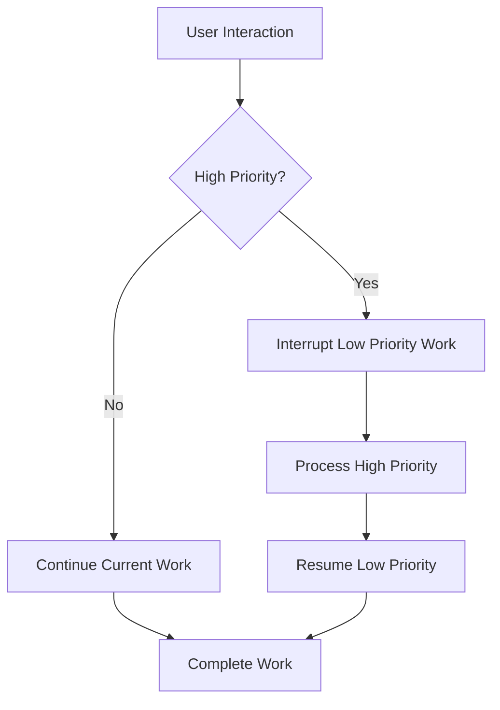

**Concurrent Rendering:**

```javascript
// Concurrent features
import { startTransition, useTransition } from "react";

function App() {
  const [isPending, startTransition] = useTransition();
  const [tab, setTab] = useState("home");

  function selectTab(nextTab) {
    startTransition(() => {
      setTab(nextTab); // Low priority update
    });
  }

  return (
    <>
      {isPending && <Spinner />}
      <TabButton onClick={() => selectTab("home")}>Home</TabButton>
      <TabButton onClick={() => selectTab("about")}>About</TabButton>
      <TabContent tab={tab} />
    </>
  );
}
```

#### Transitions:

```javascript
// Mark updates as transitions
function SearchResults({ query }) {
  const [isPending, startTransition] = useTransition();
  const [results, setResults] = useState([]);

  useEffect(() => {
    startTransition(() => {
      // This update is a transition (low priority)
      setResults(computeExpensiveResults(query));
    });
  }, [query]);

  return (
    <div>
      {isPending && <Spinner />}
      <ResultsList results={results} />
    </div>
  );
}
```

**useDeferredValue:**

```javascript
function App() {
  const [query, setQuery] = useState("");
  const deferredQuery = useDeferredValue(query);

  // query updates immediately (high priority)
  // deferredQuery updates later (low priority)

  return (
    <>
      <input value={query} onChange={(e) => setQuery(e.target.value)} />
      <ExpensiveList query={deferredQuery} />
    </>
  );
}
```

---

### Q1.5: Giải thích React Server Components và khi nào dùng?

**Câu trả lời:**

React Server Components (RSC) cho phép render components trên server, giảm bundle size và cải thiện performance.

#### Architecture:

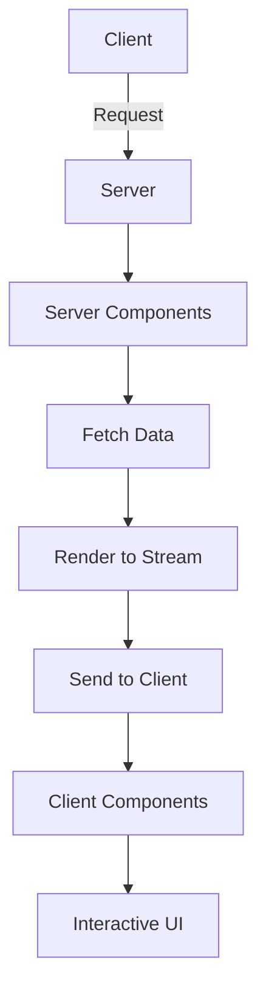

#### Server Components vs Client Components:

```javascript
// ✅ Server Component (default)
// - Runs on server
// - Can access database, file system
// - No JavaScript sent to client
// - Cannot use hooks, event handlers

async function ServerComponent() {
  // Direct database access
  const data = await db.query("SELECT * FROM users");

  return (
    <div>
      {data.map((user) => (
        <UserCard key={user.id} user={user} />
      ))}
    </div>
  );
}

// ❌ Client Component (with 'use client')
("use client");

import { useState } from "react";

function ClientComponent() {
  const [count, setCount] = useState(0);

  return <button onClick={() => setCount((c) => c + 1)}>Count: {count}</button>;
}
```

#### Hybrid Approach:

```javascript
// Server Component
async function ProductPage({ id }) {
  const product = await fetchProduct(id);

  return (
    <div>
      <ProductDetails product={product} />
      <AddToCartButton productId={id} /> {/* Client Component */}
    </div>
  );
}

// Client Component
("use client");

function AddToCartButton({ productId }) {
  const [adding, setAdding] = useState(false);

  const handleAdd = async () => {
    setAdding(true);
    await addToCart(productId);
    setAdding(false);
  };

  return (
    <button onClick={handleAdd} disabled={adding}>
      {adding ? "Adding..." : "Add to Cart"}
    </button>
  );
}
```

**Benefits:**

- ✅ Smaller bundle size (server components không gửi JS)
- ✅ Direct database access
- ✅ Better security (API keys on server)
- ✅ Faster initial load

**When to use:**

- Static content → Server Component
- Interactive UI → Client Component
- Data fetching → Server Component
- Forms, buttons → Client Component

---

## 2. Architecture & Design Patterns

### Q2.1: Thiết kế architecture cho một React application lớn (100+ components)?

**Câu trả lời:**

#### Folder Structure:

```
src/
├── app/                    # Next.js app directory (if using)
├── features/              # Feature-based organization
│   ├── auth/
│   │   ├── components/
│   │   ├── hooks/
│   │   ├── services/
│   │   ├── types/
│   │   └── index.ts
│   ├── products/
│   │   ├── components/
│   │   ├── hooks/
│   │   ├── services/
│   │   └── index.ts
│   └── orders/
├── shared/                # Shared code
│   ├── components/
│   │   ├── ui/           # Basic UI components
│   │   └── layout/       # Layout components
│   ├── hooks/
│   ├── utils/
│   ├── constants/
│   └── types/
├── core/                  # Core functionality
│   ├── api/
│   ├── store/            # State management
│   └── router/
└── assets/
```

#### Feature-Based Architecture:

```javascript
// features/products/index.ts
export { ProductsList } from "./components/ProductsList";
export { ProductCard } from "./components/ProductCard";
export { useProducts } from "./hooks/useProducts";
export { productService } from "./services/productService";
export type { Product } from "./types";

// features/products/components/ProductsList.tsx
import { useProducts } from "../hooks/useProducts";
import { ProductCard } from "./ProductCard";

export function ProductsList() {
  const { products, loading } = useProducts();

  if (loading) return <Loading />;

  return (
    <div>
      {products.map((product) => (
        <ProductCard key={product.id} product={product} />
      ))}
    </div>
  );
}
```

#### Layered Architecture:

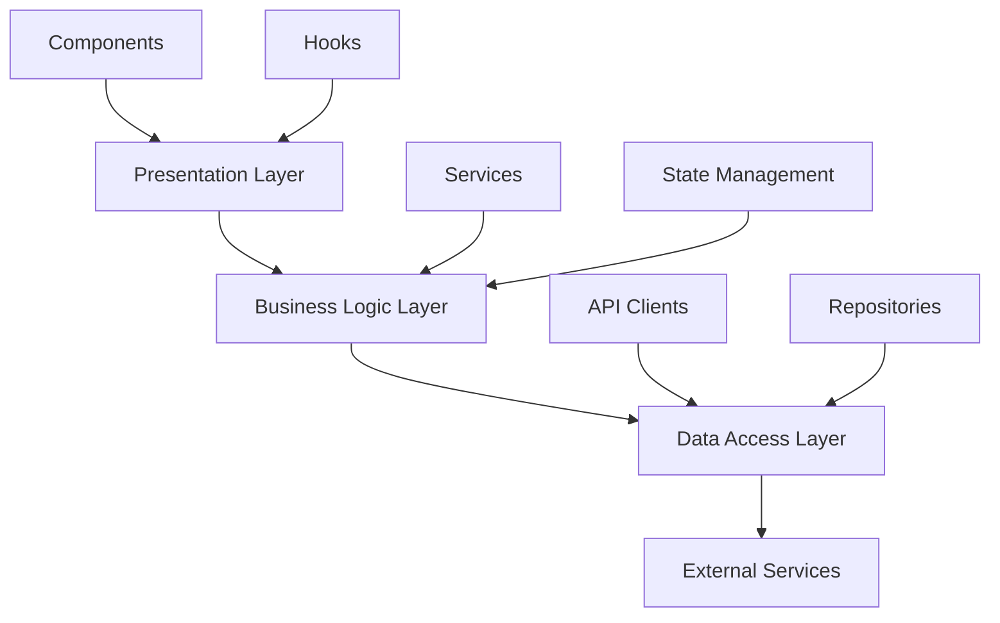

**Implementation:**

```javascript
// Presentation Layer
function ProductList() {
  const { products, loading, error } = useProducts();
  // UI logic only
}

// Business Logic Layer
function useProducts() {
  const { data, loading, error } = useQuery({
    queryKey: ["products"],
    queryFn: productService.getAll,
  });

  return { products: data, loading, error };
}

// Data Access Layer
class ProductService {
  async getAll() {
    return apiClient.get("/products");
  }

  async getById(id: string) {
    return apiClient.get(`/products/${id}`);
  }
}
```

#### Component Composition Pattern:

```javascript
// Compound Components
function Accordion({ children }) {
  const [openIndex, setOpenIndex] = useState(null);

  return (
    <AccordionContext.Provider value={{ openIndex, setOpenIndex }}>
      {children}
    </AccordionContext.Provider>
  );
}

Accordion.Item = function AccordionItem({ children, index }) {
  const { openIndex, setOpenIndex } = useAccordionContext();
  const isOpen = openIndex === index;

  return (
    <div>
      {React.Children.map(children, (child) =>
        React.cloneElement(child, {
          isOpen,
          onToggle: () => setOpenIndex(index),
        })
      )}
    </div>
  );
};

// Usage
<Accordion>
  <Accordion.Item index={0}>
    <Accordion.Header>Section 1</Accordion.Header>
    <Accordion.Content>Content 1</Accordion.Content>
  </Accordion.Item>
</Accordion>;
```

#### Render Props Pattern:

```javascript
function DataFetcher({ url, children }) {
  const [data, setData] = useState(null);
  const [loading, setLoading] = useState(true);
  const [error, setError] = useState(null);

  useEffect(() => {
    fetch(url)
      .then((res) => res.json())
      .then(setData)
      .catch(setError)
      .finally(() => setLoading(false));
  }, [url]);

  return children({ data, loading, error });
}

// Usage
<DataFetcher url="/api/products">
  {({ data, loading, error }) => {
    if (loading) return <Loading />;
    if (error) return <Error message={error} />;
    return <ProductsList products={data} />;
  }}
</DataFetcher>;
```

---

### Q2.2: Giải thích các Design Patterns trong React và khi nào dùng?

**Câu trả lời:**

#### 1. Container/Presentational Pattern:

```javascript
// Container Component (Smart)
function ProductsContainer() {
  const { products, loading, error } = useProducts();
  const { addToCart } = useCart();

  if (loading) return <Loading />;
  if (error) return <Error message={error} />;

  return <ProductsList products={products} onAddToCart={addToCart} />;
}

// Presentational Component (Dumb)
function ProductsList({ products, onAddToCart }) {
  return (
    <div>
      {products.map((product) => (
        <ProductCard
          key={product.id}
          product={product}
          onAddToCart={onAddToCart}
        />
      ))}
    </div>
  );
}
```

#### 2. Higher-Order Component (HOC):

```javascript
function withAuth(Component) {
  return function AuthenticatedComponent(props) {
    const { user, loading } = useAuth();

    if (loading) return <Loading />;
    if (!user) return <Redirect to="/login" />;

    return <Component {...props} user={user} />;
  };
}

// Usage
const ProtectedProfile = withAuth(Profile);
```

#### 3. Render Props:

```javascript
function MouseTracker({ render }) {
  const [position, setPosition] = useState({ x: 0, y: 0 });

  useEffect(() => {
    const handleMouseMove = (e) => {
      setPosition({ x: e.clientX, y: e.clientY });
    };

    window.addEventListener("mousemove", handleMouseMove);
    return () => window.removeEventListener("mousemove", handleMouseMove);
  }, []);

  return render(position);
}

// Usage
<MouseTracker
  render={({ x, y }) => (
    <div>
      Mouse at ({x}, {y})
    </div>
  )}
/>;
```

#### 4. Custom Hooks Pattern:

```javascript
// Custom hook encapsulates logic
function useLocalStorage(key, initialValue) {
  const [storedValue, setStoredValue] = useState(() => {
    try {
      const item = window.localStorage.getItem(key);
      return item ? JSON.parse(item) : initialValue;
    } catch (error) {
      return initialValue;
    }
  });

  const setValue = useCallback(
    (value) => {
      try {
        setStoredValue(value);
        window.localStorage.setItem(key, JSON.stringify(value));
      } catch (error) {
        console.error(error);
      }
    },
    [key]
  );

  return [storedValue, setValue];
}

// Usage
function App() {
  const [name, setName] = useLocalStorage("name", "");
  return <input value={name} onChange={(e) => setName(e.target.value)} />;
}
```

#### 5. Provider Pattern:

```javascript
// Context Provider
const ThemeContext = createContext();

function ThemeProvider({ children }) {
  const [theme, setTheme] = useState("light");

  const toggleTheme = useCallback(() => {
    setTheme((t) => (t === "light" ? "dark" : "light"));
  }, []);

  const value = useMemo(
    () => ({
      theme,
      toggleTheme,
    }),
    [theme, toggleTheme]
  );

  return (
    <ThemeContext.Provider value={value}>{children}</ThemeContext.Provider>
  );
}

// Custom hook
function useTheme() {
  const context = useContext(ThemeContext);
  if (!context) {
    throw new Error("useTheme must be used within ThemeProvider");
  }
  return context;
}
```

#### 6. Compound Components:

```javascript
// Đã có ở Q2.1
```

**Khi nào dùng pattern nào:**

| Pattern                  | Use Case                        | Pros                | Cons                        |
| ------------------------ | ------------------------------- | ------------------- | --------------------------- |
| Container/Presentational | Separate logic và UI            | Clear separation    | More files                  |
| HOC                      | Add functionality to components | Reusable            | Prop drilling, wrapper hell |
| Render Props             | Share logic between components  | Flexible            | Verbose syntax              |
| Custom Hooks             | Reusable logic                  | Clean, composable   | None significant            |
| Provider                 | Global state/context            | Avoid prop drilling | Can cause re-renders        |
| Compound Components      | Related components              | Flexible API        | More complex                |

---

### Q2.3: Làm sao handle code splitting và lazy loading trong React app lớn?

**Câu trả lời:**

#### Route-Based Code Splitting:

```javascript
import { lazy, Suspense } from "react";
import { BrowserRouter, Routes, Route } from "react-router-dom";

// Lazy load routes
const Home = lazy(() => import("./pages/Home"));
const Products = lazy(() => import("./pages/Products"));
const About = lazy(() => import("./pages/About"));

function App() {
  return (
    <BrowserRouter>
      <Suspense fallback={<PageLoader />}>
        <Routes>
          <Route path="/" element={<Home />} />
          <Route path="/products" element={<Products />} />
          <Route path="/about" element={<About />} />
        </Routes>
      </Suspense>
    </BrowserRouter>
  );
}
```

#### Component-Based Code Splitting:

```javascript
// Lazy load heavy components
const HeavyChart = lazy(() => import("./components/HeavyChart"));
const DataTable = lazy(() => import("./components/DataTable"));

function Dashboard() {
  const [showChart, setShowChart] = useState(false);

  return (
    <div>
      <button onClick={() => setShowChart(true)}>Show Chart</button>
      {showChart && (
        <Suspense fallback={<ChartSkeleton />}>
          <HeavyChart />
        </Suspense>
      )}
    </div>
  );
}
```

#### Library Splitting:

```javascript
// Split large libraries
const Moment = lazy(() => import("moment"));
const Chart = lazy(() => import("react-chartjs-2"));

// Or use dynamic imports
async function loadChart() {
  const { default: Chart } = await import("react-chartjs-2");
  return Chart;
}
```

#### Webpack Configuration:

```javascript
// webpack.config.js
module.exports = {
  optimization: {
    splitChunks: {
      chunks: "all",
      cacheGroups: {
        vendor: {
          test: /[\\/]node_modules[\\/]/,
          name: "vendors",
          chunks: "all",
        },
        common: {
          minChunks: 2,
          chunks: "all",
          enforce: true,
        },
      },
    },
  },
};
```

#### Preloading Strategy:

```javascript
// Preload on hover
function NavigationLink({ to, children }) {
  const handleMouseEnter = () => {
    // Preload route
    import(`./pages/${to}`);
  };

  return (
    <Link to={to} onMouseEnter={handleMouseEnter}>
      {children}
    </Link>
  );
}

// Preload on visibility
function LazyComponent() {
  const [isVisible, setIsVisible] = useState(false);
  const ref = useRef();

  useEffect(() => {
    const observer = new IntersectionObserver(
      ([entry]) => {
        if (entry.isIntersecting) {
          setIsVisible(true);
          observer.disconnect();
        }
      },
      { rootMargin: "100px" } // Start loading 100px before visible
    );

    if (ref.current) {
      observer.observe(ref.current);
    }

    return () => observer.disconnect();
  }, []);

  return (
    <div ref={ref}>
      {isVisible && (
        <Suspense fallback={<Skeleton />}>
          <HeavyComponent />
        </Suspense>
      )}
    </div>
  );
}
```

---

## 3. Performance Optimization

### Q3.1: Các kỹ thuật optimize React app performance?

**Câu trả lời:**

#### 1. React.memo:

```javascript
// Prevent unnecessary re-renders
const ExpensiveComponent = React.memo(
  ({ data, onUpdate }) => {
    // Only re-render if props change
    return <div>{/* expensive render */}</div>;
  },
  (prevProps, nextProps) => {
    // Custom comparison
    return prevProps.data.id === nextProps.data.id;
  }
);
```

#### 2. useMemo:

```javascript
function ProductList({ products, filter }) {
  // Memoize expensive calculation
  const filteredProducts = useMemo(() => {
    return products.filter((p) =>
      p.name.toLowerCase().includes(filter.toLowerCase())
    );
  }, [products, filter]);

  // Memoize expensive object
  const config = useMemo(
    () => ({
      sortBy: "name",
      order: "asc",
      pageSize: 20,
    }),
    []
  );

  return <List items={filteredProducts} config={config} />;
}
```

#### 3. useCallback:

```javascript
function Parent({ items }) {
  const [count, setCount] = useState(0);

  // Memoize callback
  const handleClick = useCallback((id) => {
    console.log("Clicked:", id);
  }, []); // Stable reference

  // Memoize callback with dependencies
  const handleUpdate = useCallback(
    (item) => {
      updateItem(item);
    },
    [items]
  ); // Re-create when items change

  return (
    <div>
      <Child onClick={handleClick} />
      <ExpensiveList items={items} onUpdate={handleUpdate} />
    </div>
  );
}
```

#### 4. Virtual Scrolling:

```javascript
import { useVirtualizer } from "@tanstack/react-virtual";

function VirtualList({ items }) {
  const parentRef = useRef();

  const virtualizer = useVirtualizer({
    count: items.length,
    getScrollElement: () => parentRef.current,
    estimateSize: () => 50,
    overscan: 5,
  });

  return (
    <div ref={parentRef} style={{ height: "400px", overflow: "auto" }}>
      <div
        style={{
          height: `${virtualizer.getTotalSize()}px`,
          position: "relative",
        }}
      >
        {virtualizer.getVirtualItems().map((virtualRow) => (
          <div
            key={virtualRow.key}
            style={{
              position: "absolute",
              top: 0,
              left: 0,
              width: "100%",
              height: `${virtualRow.size}px`,
              transform: `translateY(${virtualRow.start}px)`,
            }}
          >
            {items[virtualRow.index].name}
          </div>
        ))}
      </div>
    </div>
  );
}
```

#### 5. Image Optimization:

```javascript
// Lazy load images
function LazyImage({ src, alt }) {
  const [isLoaded, setIsLoaded] = useState(false);
  const [isInView, setIsInView] = useState(false);
  const imgRef = useRef();

  useEffect(() => {
    const observer = new IntersectionObserver(
      ([entry]) => {
        if (entry.isIntersecting) {
          setIsInView(true);
          observer.disconnect();
        }
      },
      { rootMargin: "50px" }
    );

    if (imgRef.current) {
      observer.observe(imgRef.current);
    }

    return () => observer.disconnect();
  }, []);

  return (
     setIsLoaded(true)}
      style={{ opacity: isLoaded ? 1 : 0 }}
    />
  );
}
```

#### 6. Debounce và Throttle:

```javascript
// Debounce search
function SearchInput() {
  const [query, setQuery] = useState("");
  const debouncedQuery = useDebounce(query, 300);

  useEffect(() => {
    if (debouncedQuery) {
      search(debouncedQuery);
    }
  }, [debouncedQuery]);

  return <input value={query} onChange={(e) => setQuery(e.target.value)} />;
}

// Custom debounce hook
function useDebounce(value, delay) {
  const [debouncedValue, setDebouncedValue] = useState(value);

  useEffect(() => {
    const handler = setTimeout(() => {
      setDebouncedValue(value);
    }, delay);

    return () => clearTimeout(handler);
  }, [value, delay]);

  return debouncedValue;
}
```

#### 7. Bundle Analysis:

```javascript
// Analyze bundle size
// webpack-bundle-analyzer
const BundleAnalyzerPlugin =
  require("webpack-bundle-analyzer").BundleAnalyzerPlugin;

module.exports = {
  plugins: [
    new BundleAnalyzerPlugin({
      analyzerMode: "static",
      openAnalyzer: false,
    }),
  ],
};
```

---

### Q3.2: Làm sao identify và fix performance bottlenecks?

**Câu trả lời:**

#### 1. React DevTools Profiler:

```javascript
// Profile component renders
import { Profiler } from "react";

function onRenderCallback(id, phase, actualDuration) {
  console.log("Component:", id);
  console.log("Phase:", phase); // mount or update
  console.log("Duration:", actualDuration);
}

function App() {
  return (
    <Profiler id="App" onRender={onRenderCallback}>
      <YourApp />
    </Profiler>
  );
}
```

#### 2. Performance Monitoring:

```javascript
// Measure render time
function useRenderTime(componentName) {
  useEffect(() => {
    const start = performance.now();

    return () => {
      const end = performance.now();
      console.log(`${componentName} render time:`, end - start);

      // Send to analytics
      if (end - start > 16) {
        // > 1 frame
        reportSlowRender(componentName, end - start);
      }
    };
  });
}

// Usage
function ExpensiveComponent() {
  useRenderTime("ExpensiveComponent");
  // ...
}
```

#### 3. Why Did You Render:

```javascript
// Identify unnecessary re-renders
import whyDidYouRender from "@welldone-software/why-did-you-render";

whyDidYouRender(React, {
  trackAllPureComponents: true,
  trackHooks: true,
  logOnDifferentValues: true,
});

// Mark component to track
const MyComponent = () => {
  // ...
};
MyComponent.whyDidYouRender = true;
```

#### 4. Common Bottlenecks và Fixes:

```javascript
// ❌ Problem: Creating objects in render
function Component({ items }) {
  const config = { sort: "name" }; // New object every render
  return <List items={items} config={config} />;
}

// ✅ Fix: useMemo
function Component({ items }) {
  const config = useMemo(() => ({ sort: "name" }), []);
  return <List items={items} config={config} />;
}

// ❌ Problem: Inline functions
function Component({ items }) {
  return (
    <List
      items={items}
      onItemClick={(item) => handleClick(item)} // New function every render
    />
  );
}

// ✅ Fix: useCallback
function Component({ items }) {
  const handleClick = useCallback((item) => {
    // handle click
  }, []);

  return <List items={items} onItemClick={handleClick} />;
}

// ❌ Problem: Expensive calculations
function Component({ items }) {
  const sorted = items.sort((a, b) => a.name.localeCompare(b.name)); // Every render
  return <List items={sorted} />;
}

// ✅ Fix: useMemo
function Component({ items }) {
  const sorted = useMemo(() => {
    return [...items].sort((a, b) => a.name.localeCompare(b.name));
  }, [items]);
  return <List items={sorted} />;
}
```

---

## 4. State Management

### Q4.1: So sánh Redux, Zustand, Jotai, và Recoil - khi nào dùng cái nào?

**Câu trả lời:**

#### Comparison Table:

| Feature        | Redux      | Zustand   | Jotai     | Recoil    |
| -------------- | ---------- | --------- | --------- | --------- |
| Bundle Size    | ~12KB      | ~1KB      | ~3KB      | ~14KB     |
| Boilerplate    | High       | Low       | Low       | Medium    |
| Learning Curve | Steep      | Easy      | Easy      | Medium    |
| DevTools       | Excellent  | Good      | Good      | Good      |
| TypeScript     | Good       | Excellent | Excellent | Good      |
| Performance    | Good       | Excellent | Excellent | Excellent |
| Async          | Middleware | Built-in  | Built-in  | Built-in  |

#### Redux Toolkit:

```javascript
// Redux Toolkit - Modern Redux
import { createSlice, configureStore } from "@reduxjs/toolkit";

const counterSlice = createSlice({
  name: "counter",
  initialState: { value: 0 },
  reducers: {
    increment: (state) => {
      state.value += 1; // Immer handles immutability
    },
    decrement: (state) => {
      state.value -= 1;
    },
  },
});

export const { increment, decrement } = counterSlice.actions;

const store = configureStore({
  reducer: {
    counter: counterSlice.reducer,
  },
});

// Usage
function Counter() {
  const count = useSelector((state) => state.counter.value);
  const dispatch = useDispatch();

  return (
    <div>
      <span>{count}</span>
      <button onClick={() => dispatch(increment())}>+</button>
    </div>
  );
}
```

**Khi dùng Redux:**

- ✅ Large team, cần strict patterns
- ✅ Complex state với nhiều middleware
- ✅ Cần time-travel debugging
- ✅ Enterprise applications

#### Zustand:

```javascript
// Zustand - Minimal state management
import create from "zustand";

const useStore = create((set) => ({
  count: 0,
  increment: () => set((state) => ({ count: state.count + 1 })),
  decrement: () => set((state) => ({ count: state.count - 1 })),
}));

// Usage
function Counter() {
  const { count, increment, decrement } = useStore();

  return (
    <div>
      <span>{count}</span>
      <button onClick={increment}>+</button>
      <button onClick={decrement}>-</button>
    </div>
  );
}
```

**Khi dùng Zustand:**

- ✅ Small to medium apps
- ✅ Cần minimal boilerplate
- ✅ Simple state management
- ✅ Quick prototyping

#### Jotai:

```javascript
// Jotai - Atomic state management
import { atom, useAtom } from "jotai";

const countAtom = atom(0);
const doubleCountAtom = atom((get) => get(countAtom) * 2);

function Counter() {
  const [count, setCount] = useAtom(countAtom);
  const [doubleCount] = useAtom(doubleCountAtom);

  return (
    <div>
      <span>{count}</span>
      <span>Double: {doubleCount}</span>
      <button onClick={() => setCount((c) => c + 1)}>+</button>
    </div>
  );
}
```

**Khi dùng Jotai:**

- ✅ Fine-grained reactivity
- ✅ Derived state
- ✅ Component-level state sharing
- ✅ Performance-critical apps

#### Recoil:

```javascript
// Recoil - Facebook's state management
import { atom, selector, useRecoilState, useRecoilValue } from "recoil";

const countState = atom({
  key: "countState",
  default: 0,
});

const doubleCountState = selector({
  key: "doubleCountState",
  get: ({ get }) => get(countState) * 2,
});

function Counter() {
  const [count, setCount] = useRecoilState(countState);
  const doubleCount = useRecoilValue(doubleCountState);

  return (
    <div>
      <span>{count}</span>
      <span>Double: {doubleCount}</span>
      <button onClick={() => setCount((c) => c + 1)}>+</button>
    </div>
  );
}
```

**Khi dùng Recoil:**

- ✅ Facebook ecosystem
- ✅ Complex derived state
- ✅ Async state management
- ✅ Large applications

---

### Q4.2: Thiết kế state management cho ứng dụng lớn?

**Câu trả lời:**

#### State Architecture:

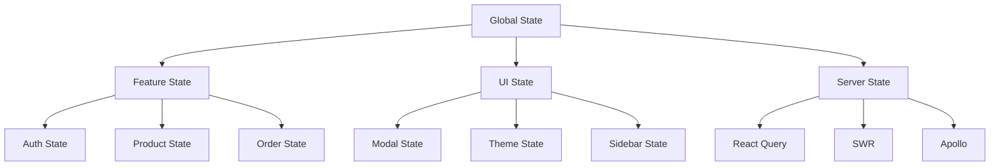

#### State Classification:

```javascript
// 1. Server State - Use React Query
function useProducts() {
  return useQuery({
    queryKey: ["products"],
    queryFn: fetchProducts,
    staleTime: 5 * 60 * 1000, // 5 minutes
  });
}

// 2. Global UI State - Use Context or Zustand
const useUIStore = create((set) => ({
  sidebarOpen: false,
  toggleSidebar: () => set((state) => ({ sidebarOpen: !state.sidebarOpen })),
}));

// 3. Feature State - Use Redux/Zustand slices
const productSlice = createSlice({
  name: "products",
  initialState: { selectedProduct: null },
  reducers: {
    selectProduct: (state, action) => {
      state.selectedProduct = action.payload;
    },
  },
});

// 4. Local State - Use useState
function ProductCard({ product }) {
  const [isExpanded, setIsExpanded] = useState(false);
  // ...
}
```

#### State Normalization:

```javascript
// ❌ Nested state
const state = {
  products: [
    { id: 1, name: "Product 1", category: { id: 1, name: "Category 1" } },
    { id: 2, name: "Product 2", category: { id: 1, name: "Category 1" } },
  ],
};

// ✅ Normalized state
const state = {
  products: {
    byId: {
      1: { id: 1, name: "Product 1", categoryId: 1 },
      2: { id: 2, name: "Product 2", categoryId: 1 },
    },
    allIds: [1, 2],
  },
  categories: {
    byId: {
      1: { id: 1, name: "Category 1" },
    },
    allIds: [1],
  },
};
```

---

## 5. Testing & Quality Assurance

### Q5.1: Testing strategy cho React application?

**Câu trả lời:**

#### Testing Pyramid:

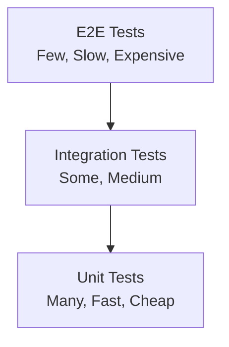

#### Unit Tests:

```javascript
// Component unit test
import { render, screen, fireEvent } from "@testing-library/react";
import { Counter } from "./Counter";

describe("Counter", () => {
  it("increments count on button click", () => {
    render(<Counter />);

    const button = screen.getByRole("button", { name: /increment/i });
    const count = screen.getByText(/count: 0/i);

    fireEvent.click(button);

    expect(screen.getByText(/count: 1/i)).toBeInTheDocument();
  });

  it("handles multiple clicks", () => {
    render(<Counter />);
    const button = screen.getByRole("button", { name: /increment/i });

    fireEvent.click(button);
    fireEvent.click(button);
    fireEvent.click(button);

    expect(screen.getByText(/count: 3/i)).toBeInTheDocument();
  });
});
```

#### Integration Tests:

```javascript
// Integration test
import { render, screen, waitFor } from "@testing-library/react";
import { QueryClient, QueryClientProvider } from "@tanstack/react-query";
import { ProductList } from "./ProductList";

describe("ProductList Integration", () => {
  it("fetches and displays products", async () => {
    const queryClient = new QueryClient({
      defaultOptions: { queries: { retry: false } },
    });

    render(
      <QueryClientProvider client={queryClient}>
        <ProductList />
      </QueryClientProvider>
    );

    expect(screen.getByText(/loading/i)).toBeInTheDocument();

    await waitFor(() => {
      expect(screen.getByText(/product 1/i)).toBeInTheDocument();
    });
  });
});
```

#### E2E Tests:

```javascript
// Cypress E2E test
describe("Product Purchase Flow", () => {
  it("allows user to add product to cart", () => {
    cy.visit("/products");
    cy.get('[data-testid="product-card"]').first().click();
    cy.get('[data-testid="add-to-cart"]').click();
    cy.get('[data-testid="cart-count"]').should("contain", "1");
    cy.get('[data-testid="cart-icon"]').click();
    cy.get('[data-testid="cart-item"]').should("have.length", 1);
  });
});
```

#### Testing Hooks:

```javascript
// Custom hook test
import { renderHook, act } from "@testing-library/react";
import { useCounter } from "./useCounter";

describe("useCounter", () => {
  it("increments count", () => {
    const { result } = renderHook(() => useCounter(0));

    act(() => {
      result.current.increment();
    });

    expect(result.current.count).toBe(1);
  });
});
```

---

### Q5.2: Code quality và best practices?

**Câu trả lời:**

#### ESLint Configuration:

```javascript
// .eslintrc.js
module.exports = {
  extends: [
    "react-app",
    "plugin:react/recommended",
    "plugin:@typescript-eslint/recommended",
  ],
  rules: {
    "react-hooks/exhaustive-deps": "warn",
    "no-console": ["warn", { allow: ["warn", "error"] }],
    "prefer-const": "error",
    "no-unused-vars": "error",
  },
};
```

#### Prettier Configuration:

```json
{
  "semi": true,
  "trailingComma": "es5",
  "singleQuote": true,
  "printWidth": 80,
  "tabWidth": 2
}
```

#### Pre-commit Hooks:

```javascript
// husky + lint-staged
module.exports = {
  "*.{js,jsx,ts,tsx}": ["eslint --fix", "prettier --write"],
  "*.{json,md}": ["prettier --write"],
};
```

---

## 6. Team Leadership & Code Review

### Q6.1: Làm sao conduct effective code reviews?

**Câu trả lời:**

#### Code Review Checklist:

```markdown
## Code Review Checklist

### Functionality

- [ ] Code works as intended
- [ ] Edge cases handled
- [ ] Error handling present
- [ ] No breaking changes

### Code Quality

- [ ] Follows coding standards
- [ ] No code duplication
- [ ] Proper naming conventions
- [ ] Comments where needed

### Performance

- [ ] No unnecessary re-renders
- [ ] Proper memoization
- [ ] Efficient algorithms
- [ ] Bundle size considered

### Security

- [ ] No security vulnerabilities
- [ ] Input validation
- [ ] XSS prevention
- [ ] Sensitive data handling

### Testing

- [ ] Tests written
- [ ] Tests pass
- [ ] Coverage adequate
- [ ] Edge cases tested
```

#### Review Comments Best Practices:

```javascript
// ❌ Bad review comment
// "This is wrong"

// ✅ Good review comment
// "Consider using useMemo here since this calculation runs on every render.
// The dependency array should include [items, filter] to ensure it updates
// when either changes. Here's an example:
// const filtered = useMemo(() => items.filter(...), [items, filter]);"

// ❌ Bad review comment
// "Why did you do this?"

// ✅ Good review comment
// "I see you're using a for loop here. Could we use Array.map() instead
// for better readability? Also, consider extracting this logic into a
// separate function for reusability."
```

#### Code Review Process:

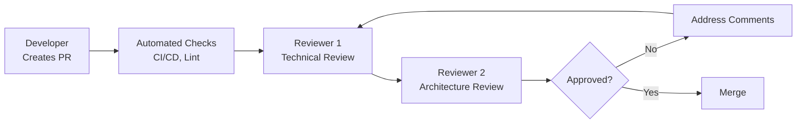

---

### Q6.2: Làm sao mentor junior developers?

**Câu trả lời:**

#### Mentoring Strategies:

1. **Pair Programming:**

```javascript
// Work together on features
// - Explain decisions
// - Show best practices
// - Let them drive, you guide
```

2. **Code Review as Teaching:**

```javascript
// Don't just fix, explain why
// "I suggest using useCallback here because..."
// "This pattern is better because..."
```

3. **Technical Documentation:**

```markdown
# Component Guidelines

## When to create a new component

- Reusability > 2 places
- Complex logic separation
- Testing isolation

## Component structure

1. Imports
2. Types/Interfaces
3. Component
4. Exports
```

4. **Regular 1-on-1s:**

- Discuss challenges
- Set learning goals
- Provide resources
- Career guidance

---

## 7. Technical Decision Making

### Q7.1: Làm sao evaluate và choose technologies?

**Câu trả lời:**

#### Decision Framework:

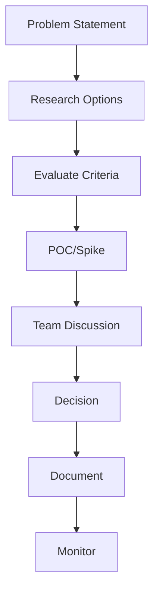

#### Evaluation Criteria:

1. **Technical:**

   - Performance
   - Scalability
   - Maintainability
   - Ecosystem

2. **Team:**

   - Learning curve
   - Team expertise
   - Hiring availability

3. **Business:**
   - Cost
   - Time to market
   - Long-term support
   - Vendor lock-in

#### Example: Choosing State Management:

```markdown
## Decision: State Management Library

### Problem

Need state management for large application with complex state.

### Options

1. Redux Toolkit
2. Zustand
3. Jotai
4. Recoil

### Evaluation

| Criteria        | Redux     | Zustand | Jotai  | Recoil |
| --------------- | --------- | ------- | ------ | ------ |
| Team Experience | High      | Medium  | Low    | Low    |
| Bundle Size     | Medium    | Low     | Low    | High   |
| Learning Curve  | High      | Low     | Medium | Medium |
| DevTools        | Excellent | Good    | Good   | Good   |

### Decision

Choose Redux Toolkit because:

- Team has experience
- Need strict patterns for large team
- Excellent DevTools for debugging
- Strong ecosystem

### Risks

- Higher boilerplate
- Steeper learning curve for new members
- Mitigation: Training sessions, documentation
```

---

## 8. DevOps & CI/CD

### Q8.1: Setup CI/CD pipeline cho React app?

**Câu trả lời:**

#### GitHub Actions Example:

```yaml
# .github/workflows/ci.yml
name: CI/CD Pipeline

on:
  push:
    branches: [main, develop]
  pull_request:
    branches: [main]

jobs:
  test:
    runs-on: ubuntu-latest
    steps:
      - uses: actions/checkout@v3
      - uses: actions/setup-node@v3
        with:
          node-version: "18"
      - run: npm ci
      - run: npm run lint
      - run: npm run test:coverage
      - run: npm run build
      - uses: codecov/codecov-action@v3

  deploy:
    needs: test
    runs-on: ubuntu-latest
    if: github.ref == 'refs/heads/main'
    steps:
      - uses: actions/checkout@v3
      - uses: actions/setup-node@v3
      - run: npm ci
      - run: npm run build
      - name: Deploy to S3
        uses: aws-actions/configure-aws-credentials@v2
        with:
          aws-access-key-id: ${{ secrets.AWS_ACCESS_KEY_ID }}
          aws-secret-access-key: ${{ secrets.AWS_SECRET_ACCESS_KEY }}
      - run: aws s3 sync build/ s3://my-bucket --delete
```

#### Pipeline Stages:

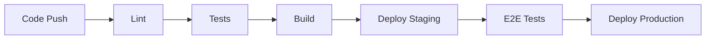

---

## 9. Security & Best Practices

### Q9.1: Security best practices trong React?

**Câu trả lời:**

#### XSS Prevention:

```javascript
// ❌ Dangerous
function UserContent({ content }) {
  return <div dangerouslySetInnerHTML={{ __html: content }} />;
}

// ✅ Safe
import DOMPurify from "dompurify";

function UserContent({ content }) {
  const sanitized = DOMPurify.sanitize(content);
  return <div dangerouslySetInnerHTML={{ __html: sanitized }} />;
}

// ✅ Better: Use textContent
function UserContent({ content }) {
  return <div>{content}</div>; // React escapes automatically
}
```

#### Authentication:

```javascript
// Secure token storage
// ❌ localStorage (XSS vulnerable)
localStorage.setItem("token", token);

// ✅ httpOnly cookies (recommended)
// Set by server, not accessible via JavaScript

// ✅ Memory storage (for sensitive data)
const [token, setToken] = useState(null);
// Token cleared on page refresh
```

#### Input Validation:

```javascript
// Client-side validation
function LoginForm() {
  const [email, setEmail] = useState("");
  const [error, setError] = useState("");

  const validateEmail = (email) => {
    const re = /^[^\s@]+@[^\s@]+\.[^\s@]+$/;
    return re.test(email);
  };

  const handleSubmit = (e) => {
    e.preventDefault();
    if (!validateEmail(email)) {
      setError("Invalid email");
      return;
    }
    // Submit...
  };

  return (
    <form onSubmit={handleSubmit}>
      <input
        type="email"
        value={email}
        onChange={(e) => setEmail(e.target.value)}
      />
      {error && <div>{error}</div>}
    </form>
  );
}
```

---

## 10. System Design & Scalability

### Q10.1: Thiết kế scalable React application?

**Câu trả lời:**

#### Architecture Diagram:

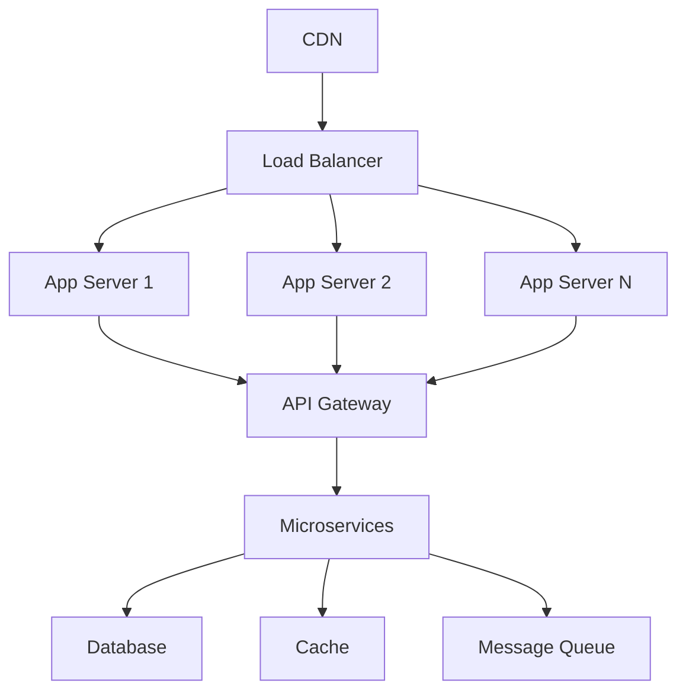

#### Scalability Strategies:

1. **Code Splitting:**

```javascript
// Route-based splitting
const Home = lazy(() => import("./pages/Home"));
const Products = lazy(() => import("./pages/Products"));
```

2. **Caching:**

```javascript
// Service Worker caching
// React Query caching
// CDN caching
```

3. **Lazy Loading:**

```javascript
// Images
// Components
// Routes
// Libraries
```

4. **Optimization:**

```javascript
// Bundle optimization
// Tree shaking
// Minification
// Compression
```

---

## 📝 Tổng kết

File này bao gồm:

- ✅ 30+ câu hỏi chi tiết
- ✅ Code examples thực tế
- ✅ Diagrams (Mermaid)
- ✅ Best practices
- ✅ Real-world scenarios

**Tips cho interview:**

1. Đọc kỹ từng câu hỏi
2. Practice code examples
3. Hiểu concepts, không chỉ memorize
4. Chuẩn bị examples từ experience
5. Sẵn sàng discuss trade-offs

**Good luck! 🚀**
