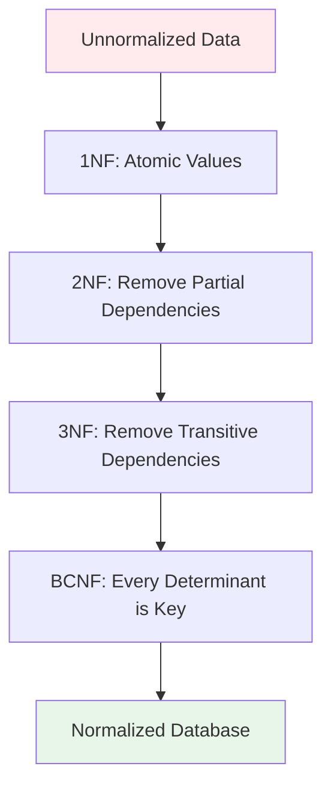

# Database & SQL - Interview Questions

## Mục lục
- [Phần 1: Cơ bản (Câu 1-10)](#phần-1-cơ-bản-câu-1-10)
- [Phần 2: Trung cấp (Câu 11-20)](#phần-2-trung-cấp-câu-11-20)
- [Phần 3: Nâng cao (Câu 21-30)](#phần-3-nâng-cao-câu-21-30)

---

# Phần 1: Cơ bản (Câu 1-10)

## Câu 1: Normalization là gì? Các dạng chuẩn hóa (1NF, 2NF, 3NF, BCNF)?

### Trả lời:

**Normalization** là quá trình tổ chức dữ liệu trong database để giảm redundancy và dependency.

### Normal Forms:

```
┌─────────────────────────────────────────────────────────────┐
│                    NORMAL FORMS                             │
├─────────────────────────────────────────────────────────────┤
│                                                             │
│  1NF - First Normal Form                                    │
│     - Mỗi cell chỉ chứa một giá trị atomic                 │
│     - Không có duplicate rows                              │
│                                                             │
│  2NF - Second Normal Form                                   │
│     - Phải đạt 1NF                                          │
│     - Không có partial dependency                           │
│                                                             │
│  3NF - Third Normal Form                                    │
│     - Phải đạt 2NF                                          │
│     - Không có transitive dependency                        │
│                                                             │
│  BCNF - Boyce-Codd Normal Form                              │
│     - Phải đạt 3NF                                          │
│     - Mọi determinant phải là candidate key                │
│                                                             │
└─────────────────────────────────────────────────────────────┘
```

### Ví dụ từng bước:

#### ❌ Unnormalized Table:

```sql
-- ❌ Table chưa normalize
CREATE TABLE orders (
    order_id INT,
    customer_name VARCHAR(100),
    customer_email VARCHAR(100),
    customer_phone VARCHAR(20),
    product1 VARCHAR(100),
    product2 VARCHAR(100),
    product3 VARCHAR(100),
    price1 DECIMAL(10,2),
    price2 DECIMAL(10,2),
    price3 DECIMAL(10,2)
);

-- Problems:
-- - Multiple values in columns (product1, product2, product3)
-- - Redundant customer data
-- - Hard to query
```

#### ✅ 1NF - First Normal Form:

```sql
-- ✅ 1NF: Mỗi cell một giá trị atomic
CREATE TABLE orders (
    order_id INT,
    customer_id INT,
    product_name VARCHAR(100),
    price DECIMAL(10,2),
    quantity INT
);

-- Mỗi row một product trong order
-- Không còn multiple values trong một cell
```

#### ✅ 2NF - Second Normal Form:

```sql
-- ✅ 2NF: Tách partial dependencies
-- Orders table
CREATE TABLE orders (
    order_id INT PRIMARY KEY,
    customer_id INT,
    order_date DATE,
    total DECIMAL(10,2)
);

-- Order Items table
CREATE TABLE order_items (
    order_id INT,
    product_id INT,
    quantity INT,
    price DECIMAL(10,2),
    PRIMARY KEY (order_id, product_id),
    FOREIGN KEY (order_id) REFERENCES orders(order_id),
    FOREIGN KEY (product_id) REFERENCES products(product_id)
);

-- Customers table
CREATE TABLE customers (
    customer_id INT PRIMARY KEY,
    customer_name VARCHAR(100),
    customer_email VARCHAR(100),
    customer_phone VARCHAR(20)
);
```

#### ✅ 3NF - Third Normal Form:

```sql
-- ✅ 3NF: Loại bỏ transitive dependencies
-- Products table
CREATE TABLE products (
    product_id INT PRIMARY KEY,
    product_name VARCHAR(100),
    category_id INT,
    price DECIMAL(10,2),
    FOREIGN KEY (category_id) REFERENCES categories(category_id)
);

-- Categories table (tách ra để tránh transitive dependency)
CREATE TABLE categories (
    category_id INT PRIMARY KEY,
    category_name VARCHAR(100),
    category_description TEXT
);

-- Nếu để category_name trong products → transitive dependency
-- products → category_id → categories → category_name
```

### Flow Diagram - Normalization Process:



---

## Câu 2: Index là gì? Các loại index và khi nào dùng?

### Trả lời:

**Index** là cấu trúc dữ liệu giúp tăng tốc độ truy vấn database.

### Types of Indexes:

```sql
-- ✅ B-Tree Index (Default)
CREATE INDEX idx_customer_email ON customers(email);

-- ✅ Unique Index
CREATE UNIQUE INDEX idx_customer_email_unique ON customers(email);

-- ✅ Composite Index
CREATE INDEX idx_order_customer_date ON orders(customer_id, order_date);

-- ✅ Partial Index (PostgreSQL)
CREATE INDEX idx_active_customers ON customers(email) WHERE active = true;

-- ✅ Full-Text Index (MySQL)
CREATE FULLTEXT INDEX idx_product_description ON products(description);
```

### Index Structure:

```
┌─────────────────────────────────────────────────────────────┐
│              B-Tree Index Structure                           │
├─────────────────────────────────────────────────────────────┤
│                                                             │
│                    [Root Node]                              │
│                  /     |     \                              │
│            [Node1]  [Node2]  [Node3]                        │
│            /  |  \   /  |  \   /  |  \                       │
│        [Leaf] [Leaf] [Leaf] [Leaf] [Leaf] [Leaf]            │
│                                                             │
│  Leaf nodes chứa pointers đến actual data rows              │
│                                                             │
└─────────────────────────────────────────────────────────────┘
```

### Khi nào dùng Index:

```sql
-- ✅ Nên index:
-- 1. Foreign keys
CREATE INDEX idx_order_customer ON orders(customer_id);

-- 2. Columns thường xuyên trong WHERE clause
CREATE INDEX idx_customer_email ON customers(email);

-- 3. Columns trong JOIN
CREATE INDEX idx_order_product ON order_items(product_id);

-- 4. Columns trong ORDER BY
CREATE INDEX idx_order_date ON orders(order_date);

-- ❌ Không nên index:
-- 1. Tables nhỏ (< 1000 rows)
-- 2. Columns ít được query
-- 3. Columns thường xuyên update (trade-off)
-- 4. Columns có cardinality thấp (gender, status)
```

### Index Performance:

```sql
-- ✅ Index giúp query nhanh hơn
-- Without index: Full table scan - O(n)
SELECT * FROM customers WHERE email = 'john@example.com';
-- Time: 1000ms (scan 1M rows)

-- With index: Index lookup - O(log n)
CREATE INDEX idx_email ON customers(email);
SELECT * FROM customers WHERE email = 'john@example.com';
-- Time: 1ms (index lookup)
```

---

## Câu 3: JOIN types là gì? Khi nào dùng mỗi loại?

### Trả lời:

**JOIN** kết hợp rows từ 2+ tables dựa trên relationship.

### JOIN Types:

```sql
-- ✅ INNER JOIN: Chỉ rows match ở cả 2 tables
SELECT o.order_id, c.customer_name
FROM orders o
INNER JOIN customers c ON o.customer_id = c.customer_id;

-- ✅ LEFT JOIN: Tất cả rows từ table bên trái
SELECT c.customer_name, o.order_id
FROM customers c
LEFT JOIN orders o ON c.customer_id = o.customer_id;
-- Customers không có order vẫn hiển thị (order_id = NULL)

-- ✅ RIGHT JOIN: Tất cả rows từ table bên phải
SELECT o.order_id, c.customer_name
FROM orders o
RIGHT JOIN customers c ON o.customer_id = c.customer_id;

-- ✅ FULL OUTER JOIN: Tất cả rows từ cả 2 tables
SELECT c.customer_name, o.order_id
FROM customers c
FULL OUTER JOIN orders o ON c.customer_id = o.customer_id;

-- ✅ CROSS JOIN: Cartesian product
SELECT c.customer_name, p.product_name
FROM customers c
CROSS JOIN products p;
```

### Visual Diagram:

```
┌─────────────────────────────────────────────────────────────┐
│                    JOIN Types                                │
├─────────────────────────────────────────────────────────────┤
│                                                             │
│  Table A:        Table B:                                   │
│  ┌───┬─────┐     ┌───┬─────┐                                │
│  │id │name │     │id │order│                                │
│  ├───┼─────┤     ├───┼─────┤                                │
│  │1  │A    │     │1  │X    │                                │
│  │2  │B    │     │3  │Y    │                                │
│  │3  │C    │     │4  │Z    │                                │
│  └───┴─────┘     └───┴─────┘                                │
│                                                             │
│  INNER JOIN:      LEFT JOIN:                                │
│  ┌───┬─────┬─────┐ ┌───┬─────┬─────┐                       │
│  │id │name │order│ │id │name │order│                       │
│  ├───┼─────┼─────┤ ├───┼─────┼─────┤                       │
│  │1  │A    │X    │ │1  │A    │X    │                       │
│  │3  │C    │Y    │ │2  │B    │NULL │                       │
│  └───┴─────┴─────┘ │3  │C    │Y    │                       │
│                    └───┴─────┴─────┘                       │
│                                                             │
└─────────────────────────────────────────────────────────────┘
```

---

## Câu 4: Subquery vs JOIN? Khi nào dùng mỗi loại?

### Trả lời:

**Subquery** và **JOIN** đều có thể dùng để kết hợp data, nhưng có use cases khác nhau.

### So sánh:

```sql
-- ✅ Subquery: Khi cần filter hoặc aggregate
-- Tìm customers có nhiều hơn 5 orders
SELECT customer_name
FROM customers
WHERE customer_id IN (
    SELECT customer_id
    FROM orders
    GROUP BY customer_id
    HAVING COUNT(*) > 5
);

-- ✅ JOIN: Khi cần data từ nhiều tables
-- Lấy order details với customer info
SELECT o.order_id, c.customer_name, o.total
FROM orders o
INNER JOIN customers c ON o.customer_id = c.customer_id;

-- ✅ EXISTS: Hiệu quả hơn IN cho subquery
SELECT customer_name
FROM customers c
WHERE EXISTS (
    SELECT 1
    FROM orders o
    WHERE o.customer_id = c.customer_id
    AND o.total > 1000
);
```

---

## Câu 5: SQL Injection là gì? Làm thế nào phòng chống?

### Trả lời:

**SQL Injection** là lỗ hổng bảo mật cho phép attacker inject SQL code vào queries.

### Ví dụ SQL Injection:

```java
// ❌ Vulnerable to SQL Injection
String query = "SELECT * FROM users WHERE username = '" + username + "'";
// Nếu username = "admin' OR '1'='1"
// Query becomes: SELECT * FROM users WHERE username = 'admin' OR '1'='1'
// → Returns all users!

// ✅ Prevention: Use PreparedStatement
String query = "SELECT * FROM users WHERE username = ?";
PreparedStatement stmt = connection.prepareStatement(query);
stmt.setString(1, username); // Safe - parameters escaped
ResultSet rs = stmt.executeQuery();

// ✅ JPA/Hibernate: Parameter binding
@Query("SELECT u FROM User u WHERE u.username = :username")
User findByUsername(@Param("username") String username);
```

---

*[File này sẽ tiếp tục với các câu hỏi còn lại về Database & SQL...]*

