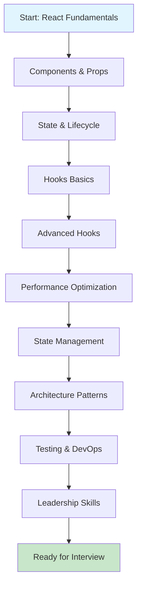

# Hướng Dẫn Ôn Tập React Lead/Senior - FPT

> Tài liệu ôn tập chi tiết từ cơ bản đến nâng cao với flow diagrams

## 📋 Mục Lục

1. [Cấu Trúc Ôn Tập](#cấu-trúc-ôn-tập)
2. [Learning Path](#learning-path)
3. [Flow Diagrams Guide](#flow-diagrams-guide)
4. [Checklist Ôn Tập](#checklist-ôn-tập)

---

## 🎯 Cấu Trúc Ôn Tập

### Level 1: Fundamentals (Tuần 1-2)
- [x] React Core Concepts
- [x] JSX & Virtual DOM
- [x] Components & Props
- [x] State & Lifecycle
- [x] Event Handling
- [x] Forms & Controlled Components

### Level 2: Intermediate (Tuần 3-4)
- [x] Hooks (useState, useEffect, useContext)
- [x] Custom Hooks
- [x] Performance Basics (React.memo)
- [x] Context API
- [x] Error Boundaries
- [x] Code Splitting

### Level 3: Advanced (Tuần 5-6)
- [x] Advanced Hooks (useMemo, useCallback, useReducer)
- [x] React Fiber Architecture
- [x] Reconciliation Algorithm
- [x] Concurrent Features (React 18+)
- [x] Suspense & Streaming SSR
- [x] Performance Optimization

### Level 4: Expert (Tuần 7-8)
- [x] State Management (Redux, Zustand, Jotai)
- [x] Architecture Patterns
- [x] Testing Strategies
- [x] Build Tools & DevOps
- [x] Security Best Practices
- [x] System Design

### Level 5: Leadership (Tuần 9-10)
- [x] Code Review Process
- [x] Mentoring Strategies
- [x] Technical Decision Making
- [x] Team Collaboration
- [x] Project Management

---

## 🗺️ Learning Path



---

## 📊 Flow Diagrams Guide

Tất cả các file markdown đều có flow diagrams sử dụng Mermaid syntax. Để xem diagrams:

### Cách xem Mermaid Diagrams:

1. **VS Code**: Cài extension "Markdown Preview Mermaid Support"
2. **GitHub**: Tự động render Mermaid
3. **Online**: Copy code vào [Mermaid Live Editor](https://mermaid.live)

### Các loại Diagrams trong tài liệu:

- **Flowcharts**: Quy trình, decision trees
- **Sequence Diagrams**: Luồng tương tác, lifecycle
- **State Diagrams**: State transitions
- **Class Diagrams**: Component relationships
- **Gantt Charts**: Timeline learning

---

## ✅ Checklist Ôn Tập

### Week 1-2: Fundamentals
- [ ] Đọc và hiểu JSX transformation
- [ ] Nắm vững Component lifecycle
- [ ] Practice với useState, useEffect
- [ ] Hiểu Virtual DOM và Reconciliation cơ bản
- [ ] Làm bài tập: Build Todo App

### Week 3-4: Intermediate
- [ ] Master tất cả React Hooks
- [ ] Tạo custom hooks
- [ ] Hiểu Context API patterns
- [ ] Practice code splitting
- [ ] Làm bài tập: Build Dashboard với multiple features

### Week 5-6: Advanced
- [ ] Deep dive React Fiber
- [ ] Hiểu Reconciliation algorithm chi tiết
- [ ] Master performance optimization
- [ ] Practice với React 18 features
- [ ] Làm bài tập: Optimize large list rendering

### Week 7-8: Expert
- [ ] So sánh và implement các state management solutions
- [ ] Design architecture cho large-scale app
- [ ] Setup testing infrastructure
- [ ] Configure build tools (Webpack, Vite)
- [ ] Làm bài tập: Build enterprise-level app structure

### Week 9-10: Leadership
- [ ] Review code examples và đưa ra feedback
- [ ] Chuẩn bị examples từ kinh nghiệm
- [ ] Practice giải thích technical decisions
- [ ] Chuẩn bị questions để hỏi interviewer
- [ ] Mock interview với bạn bè/đồng nghiệp

---

## 📚 File Structure

```
interview-questions-react-lead/
├── 00-react-fundamentals.md      # Cơ bản → Nâng cao
├── 01-react-core-hooks.md         # Hooks chi tiết với diagrams
├── 02-typescript-react.md         # TypeScript patterns
├── 03-state-management.md         # Redux, Zustand, Jotai, Recoil
├── 04-performance-optimization.md # Performance với flowcharts
├── 05-architecture-patterns.md    # Architecture với diagrams
├── 06-testing-strategies.md       # Testing approaches
├── 07-build-tools-devops.md       # Build tools & CI/CD
├── 08-security-best-practices.md  # Security patterns
├── 09-leadership-management.md    # Leadership skills
├── 10-system-design.md            # System design
└── 11-javascript-core.md          # JavaScript fundamentals
```

---

## 🎓 Tips Học Hiệu Quả

1. **Đọc kỹ diagrams**: Diagrams giúp visualize concepts
2. **Code along**: Đừng chỉ đọc, hãy code thử
3. **Explain out loud**: Giải thích lại như đang phỏng vấn
4. **Take notes**: Ghi chú những điểm quan trọng
5. **Practice daily**: Ôn tập đều đặn mỗi ngày

---

## 🔗 Quick Links

- [React Fundamentals](./interview-questions-react-lead/00-react-fundamentals.md)
- [Core Hooks](./interview-questions-react-lead/01-react-core-hooks.md)
- [State Management](./interview-questions-react-lead/03-state-management.md)
- [Performance](./interview-questions-react-lead/04-performance-optimization.md)
- [Architecture](./interview-questions-react-lead/05-architecture-patterns.md)

---

**Chúc bạn ôn tập tốt và đạt kết quả cao trong phỏng vấn! 🚀**

